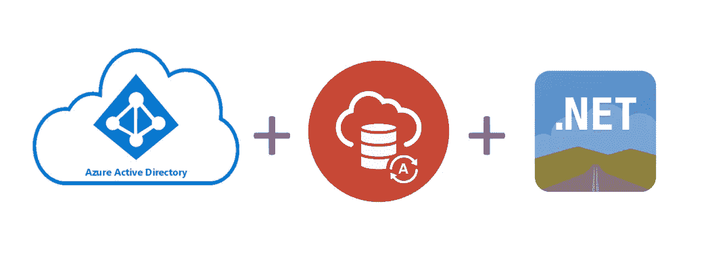

# 使用 Azure Active Directory 启用单点登录的 ODP.NET 身份验证

> 原文：<https://medium.com/oracledevs/odp-net-authentication-using-azure-active-directory-to-enable-single-sign-on-730f57e0a9b1?source=collection_archive---------0----------------------->

Azure Active Directory, Oracle Autonomous Database, and ODP.NET

Oracle 数据提供程序。从服务器版本 19.16 开始，NET(ODP.NET)现在支持针对 Oracle 自治数据库和本地数据库的 Azure Active Directory 身份验证。从版本 19.15.1 开始，[ODP.NET 核心](https://www.nuget.org/packages/Oracle.ManagedDataAccess.Core/2.19.151)、[托管 ODP.NET](https://www.nuget.org/packages/Oracle.ManagedDataAccess/19.15.1)和[非托管 ODP.NET](https://www.oracle.com/database/technologies/net-downloads.html)均可免费使用该功能。

ODP。NET 和 Oracle 数据库应用程序现在可以使用 Azure Active Directory 支持一系列基于 Azure 和微软 365 的云服务的单点登录。

随着越来越多的应用程序跨内部和多云系统集成，对于管理员和使用联合身份解决方案的用户来说，管理身份变得越来越具有挑战性。管理员可能必须为每个用户维护一组不同的凭证，以访问**每个**资源。终端用户还必须为每个资源管理他们自己的唯一凭证。用户凭证越多，就越难确保安全实践得到完全和准确的应用。

为了解决这一挑战，Azure Active Directory 等集中式身份存储被用来管理用户身份和资源访问。最终用户可以维护一套凭证，对所有应用进行单点登录。通过统一的身份管理，管理员可以更轻松地监督用户对云中和内部应用的访问。考虑到这些优势，Oracle 支持其内部数据库和 Oracle 自治数据库使用来自 Azure Active Directory 的 OAuth 2.0 访问令牌。所有类型的应用程序都可以使用这些令牌，包括。NET、Java 和即时客户端。ODP.NET 使用访问令牌而不是用户名和密码向数据库进行身份验证。

Azure Active Directory 应用程序角色集中了用户模式映射和数据库授权。Oracle 数据库模式映射到 Azure Active Directory 用户或应用程序角色。应用程序角色可以分配给 Azure Active Directory 用户或组。

具有相同应用程序角色分配的数据库用户被授予相同的访问权限，这简化了对具有相同权限的多个用户的管理。

你可以在文档中阅读更多关于通过 ODP.NET 使用 Azure Active Directory 访问令牌的信息。该链接包括一个演示如何使用 Azure Active Directory 访问令牌的 ODP.NET 代码示例。

这种新的 Azure Active Directory 集成是 Oracle 数据库和 ODP.NET 如何在多云中增强开发人员和管理员能力的又一个例子。

如果你想讨论，请加入我们的[公共休闲](https://bit.ly/devrel_slack)！

或者，试试我们的[免费层](https://signup.cloud.oracle.com/?language=en&sourceType=:ex:tb:::::&SC=:ex:tb:::::&pcode=)来体验一下。