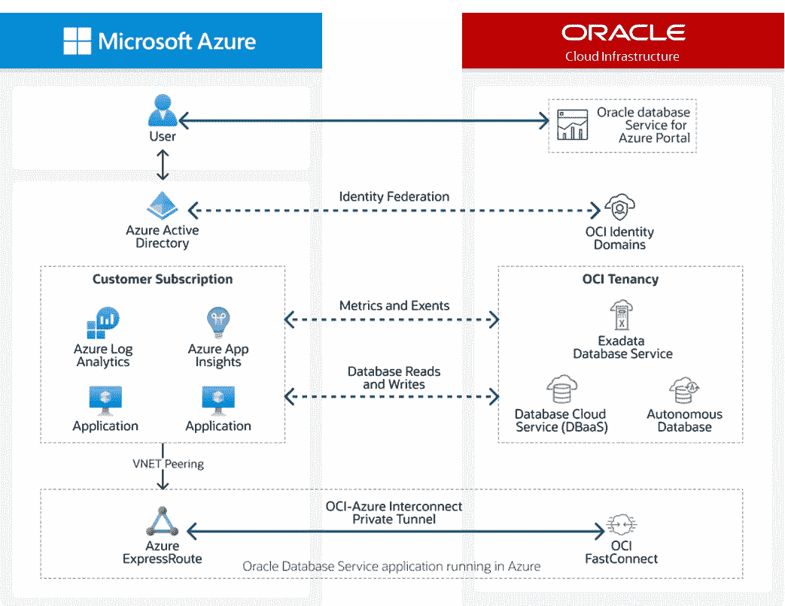

# 面向 Java 开发人员的 ODSA(第 1 部分)——面向 Azure 的 Oracle 数据库服务简介

> 原文：<https://medium.com/oracledevs/odsa-for-java-developers-introduction-to-oracle-database-service-for-azure-part-1-bff24c787055?source=collection_archive---------0----------------------->

[Oracle Database Service for Microsoft Azure (ODSA)](https://www.oracle.com/ie/cloud/azure/oracle-database-for-azure/)

华雷斯少年

## 介绍

随着基于技术的解决方案的发展，云应用程序的开发、部署和管理变得越来越复杂，也越来越具有挑战性。

当前的趋势是，组织经常必须解决业务需求，这导致…