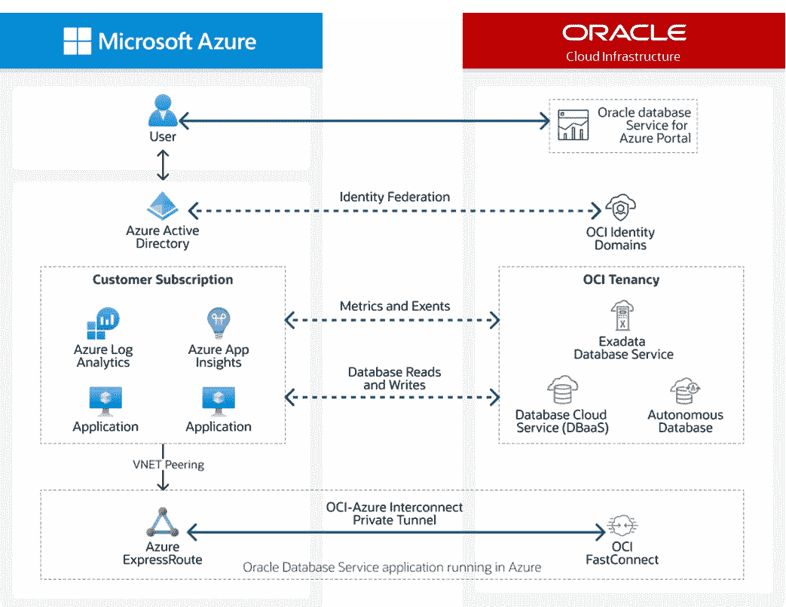

# 面向 Java 开发人员的 ODSA(第 3 部分)——通过 Azure Spring Apps 上的 Spring Data JPA 从 Spring Boot 3.0 应用程序连接到 Oracle ADB

> 原文：<https://medium.com/oracledevs/odsa-for-java-developers-part-3-connecting-to-oracle-adb-from-a-spring-boot-3-0-1ea0006f1a0d?source=collection_archive---------0----------------------->

[Oracle Database Service for Microsoft Azure (ODSA)](https://www.oracle.com/ie/cloud/azure/oracle-database-for-azure/)

华雷斯少年

## 介绍

[本系列的第 1 部分](https://juarezjunior.medium.com/odsa-for-java-developers-introduction-to-oracle-database-service-for-azure-part-1-bff24c787055)介绍了用于微软 Azure (ODSA)的 [Oracle 数据库服务](https://www.oracle.com/ie/cloud/azure/oracle-database-for-azure/)，它在多云策略方面的优势，以及一个从 [Java](https://dev.java/) 访问它的示例……