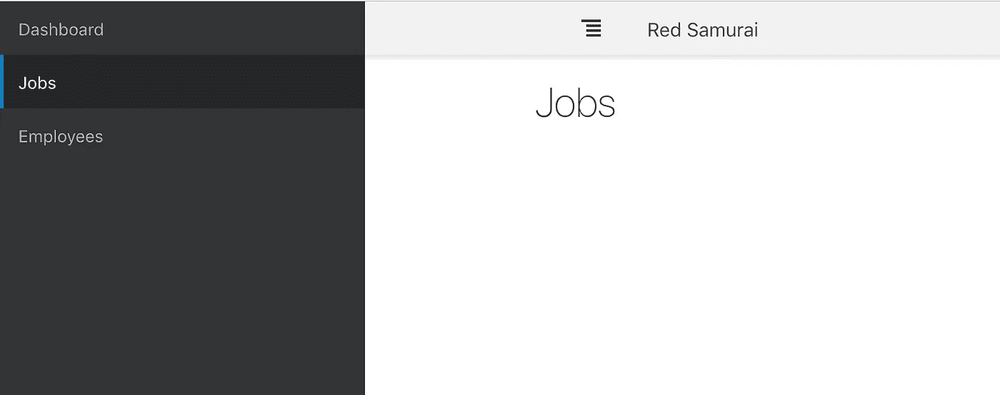
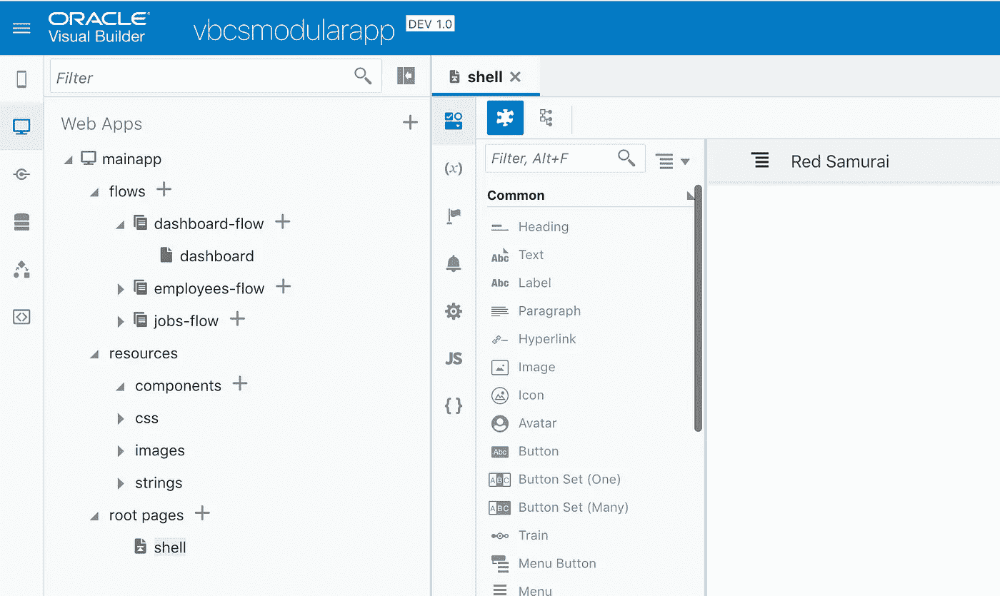
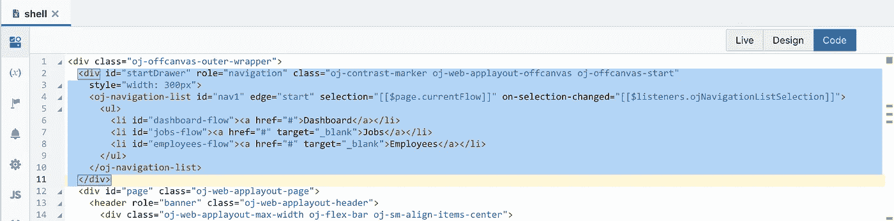

# Oracle VBCS/JET Cloud 中的画布外菜单

> 原文：<https://medium.com/oracledevs/off-canvas-menu-in-oracle-vbcs-jet-cloud-1fdd48dcf676?source=collection_archive---------0----------------------->

这些天来，我一直在积极使用 Oracle 的 VBCS/JET 云产品。和 VBCS 合作越多，我就越喜欢它。VBCS 遵循与 Oracle ADF 相似的声明式开发概念，这使得它很容易跟上 VBCS 开发的速度。VBCS 采用声明式 JavaScript 开发方法，为企业的 JavaScript 系统实现带来了独特的解决方案。

我将分享 VBCS 应用程序的画布外菜单实现样本。示例基于 Shay Shmeltzer 分享的分步指南。我没有描述如何在 VBCS 从零开始构建画布的步骤，你应该观看 Shay 的视频以获得指导。

VBCS 应用程序中呈现的画布外菜单:

你应该在我之前的帖子中查看如何在 VBCS 应用程序中构建多个流——Oracle VBCS 中的[流导航菜单控制。我在我的示例中定义了三个流，这意味着将有三个菜单项:](http://andrejusb.blogspot.com/2018/08/flow-navigation-menu-control-in-oracle.html)

为了在非画布块中呈现菜单，我使用了 JET 导航列表组件:

在 [GitHub](https://github.com/abaranovskis-redsamurai/vbcsmodularapp) 上有可以导入到您的 VBCS 实例中的示例应用程序代码。

*原载于 2018 年 12 月 15 日*[*andrejusb.blogspot.com*](https://andrejusb.blogspot.com/2018/12/off-canvas-menu-in-oracle-vbcsjet-cloud.html)*。*