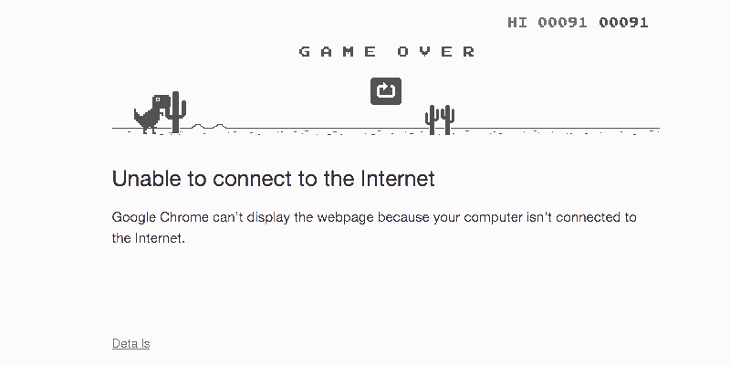
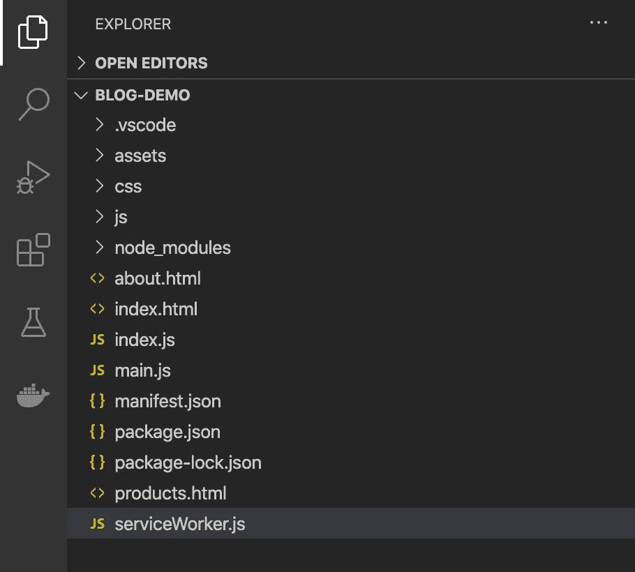

# 服务人员的线下拥挤

> 原文：<https://medium.com/walmartglobaltech/offline-hustle-with-service-worker-ebf64d0add35?source=collection_archive---------0----------------------->



THE OFFLINE GAME (Source: [https://gifer.com/](https://gifer.com/))

当我们面临网络连接问题时，我们都喜欢玩 Dino 游戏来打发时间。但是作为一个 MNC/创业公司的软件工程师，我们不希望我们的客户花时间玩这个游戏。相反，我们希望我们的客户在这种情况下也能连接到我们的 web 应用程序。

如果我们未能在所有这些情况下为客户提供服务，可能会导致客户不满，公司可能会失去客户。因此，作为开发人员，我们应该结合现代技术解决方案，在各种情况下为客户提供更好的体验。

服务人员可以帮助我们克服这个问题。

在开始演示之前，我建议您浏览一下本系列的上一篇博客[服务人员生命周期](/walmartglobaltech/service-worker-lifecycle-20333ccd570a)，以便对本博客将要讨论的概念有一个基本的了解。

在这篇博客中，我们将看到如何让我们的 web 应用程序利用服务人员的特性，并使其更加可靠。我们开始吧！

# 项目概述



这是项目的目录结构。注意服务工作者脚本( ***serviceWorker.js*** )在根目录下，让 HTML 页面、资产、JS/CSS 文件归入其范围。我们的 JS 脚本( ***main.js*** )注册我们的服务工作者，生命周期事件在我们的服务工作者脚本中处理。

## 快速视频演示

这里有一个简短的视频，将向您展示具有有效服务人员脚本的 web 应用程序如何拦截网络请求并提供更好的离线体验，如何安装 web 应用程序，以及我们如何向客户发送通知。

## 线下体验

通过使用服务人员，我们可以让我们的客户使用我们的 web 应用程序(浏览静态页面，阅读文本内容),即使他们处于离线状态。Web 开发人员可以使用 Service Worker 并缓存静态网页、图片、视频、gif 等资产。这些文件需要缓存在 Install 事件中。这些文件将存储在浏览器缓存中，并用于拦截获取请求。

在上面的代码中，通过 ***caches.open(cacheName)使用给定的***cacheName****创建了一个新的缓存。**** *缓存对象创建后，我们可以添加需要缓存的文件，用***cache . addall(filesToCache)*。***

*当服务工作者获得 fetch 事件时，它将通过***caches . match(e . request)***在缓存中检查请求的内容，如果内容在缓存中可用，它将作为响应返回。因此，客户现在可以离线访问某些资源，并与我们的 web 应用程序保持连接:)*

## *添加到主屏幕/安装应用程序*

*使用服务工作者，我们可以让我们的 web 应用程序像本地应用程序一样运行，使其成为一个[渐进式 Web 应用程序(PWA)](https://developers.google.com/web/updates/2015/12/getting-started-pwa) 。让我们的 web 应用程序成为 PWA 可以提供类似本机的体验，并帮助开发人员使用推送通知等其他功能。
为了让用户能够选择安装/添加到主屏幕，我们需要一个 Web 应用清单(manifest.json)文件，它必须链接到我们的应用程序。*

```
*<link rel="manifest" href="manifest.json" />*
```

*除了拥有有效的清单文件，我们还需要我们的应用程序:*

*   *注册一名有效的服务人员*
*   *接受 HTTPS 服务(TLS 加密)*

*清单文件是一个 JSON 文件，其中包含关于应用程序必须如何加载到用户设备上的元数据。作为开发人员，我们可以修改这些属性来控制应用程序如何显示给用户。*

*例如， ***name*** 属性表示应用程序在设备上安装时必须使用的名称。 ***start_url*** 属性用于指定用户每次打开 app 时要打开的登陆页面。 ***display*** 属性让我们决定应用程序必须如何显示(是否有地址栏、全屏还是像标准浏览器一样)。这里， ***单机*** 告诉应用程序将在自己的窗口中打开，没有地址栏和导航控件。 ***图标*** 属性定义了在主屏幕上安装或添加我们的 web 应用程序时要使用的徽标/图标。你可以在这里阅读更多关于这些属性的信息。*

## *推送通知*

*通知是与用户交互的一种很好的方式。我们可以使用通知功能通知用户最近的更新、新文章和添加的功能。[推送通知](https://developers.google.com/web/ilt/pwa/introduction-to-push-notifications)是在服务人员的帮助下可用的功能。*

> *我已经在我们的 NodeJS 项目中使用了 [web-push](https://github.com/web-push-libs/web-push) npm 包来实现推送通知。*

*在上面的代码中，我创建了一个 Express 服务器，并创建了一个路由( ***/subscribe*** )，通过***web push . send notification()***发送通知。我们需要客户端脚本(main.js)发送的 ***订阅*** 对象。 ***有效载荷*** 是可选参数，必须是字符串。在这里，我使用***JSON . stringify()***方法将一个 javascript 对象转换成一个字符串，然后将它作为有效载荷发送出去。*

*在客户端，我们为推送服务注册我们的客户端，并获得订阅对象。这是由***register . pushmanager . subscribe()完成的。*** 推送通知通过向 ***/subscribe 发送请求来发送。*** 订阅对象作为请求体发送，在服务器端访问。*

> *这里的 **regObject** 是在我们的服务工作者脚本注册之后获得的服务工作者注册对象。*

*最后，我们的服务人员会监听推送事件。这里，我们使用[通知 API](https://developer.mozilla.org/en-US/docs/Web/API/Notifications_API) 的***show Notification()***方法向我们的用户显示通知。showNotification 方法有两个参数 ***title*** 和一个 ***options*** 对象(具有 body、icon 等属性)。*

## *后台同步*

*我们可以使用 Service Worker 来保持用户活动的同步，即使用户在脱机状态下执行了一些操作，如发送消息、加载网页。[后台同步 API](https://developers.google.com/web/updates/2015/12/background-sync) 可用于在后台处理同步操作。*

# *结论*

*通过例子学习一个主题有助于更好地理解。在这篇博客中，我用一些代码片段讨论了 web 开发人员如何使用 Service Worker 为我们的客户提供更好的体验。开发人员可以添加 PWA 功能，如安装应用程序、推送通知，以使他们的 web 应用程序更具交互性，并让它像本机应用程序一样运行。*

*这个博客的完整代码可以在这个 [GitHub](https://github.com/swapnil8424/Service-Worker-Demo/tree/main) repo 获得。*

# *下一步是什么？*

*如果您的公司有跨来源的网站/网络应用程序(如 google.co.in 和谷歌公司)，我们想使用服务工作者，使我们的网络应用程序的 PWA。下一篇博客将帮助你理解如何跨跨源网站/web 应用实现服务工人。*