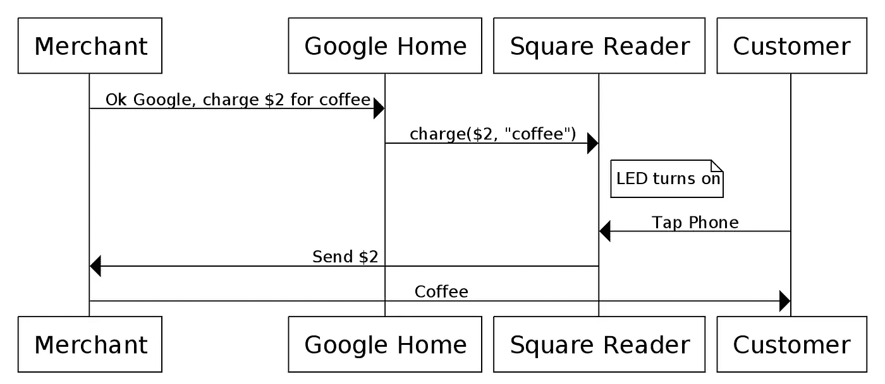
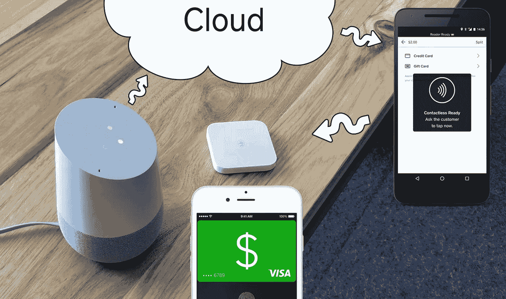
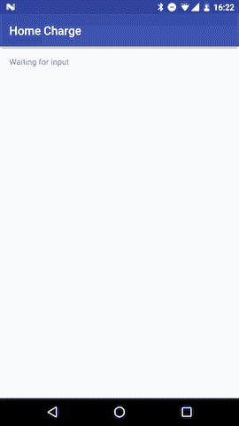
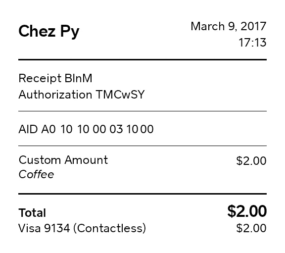
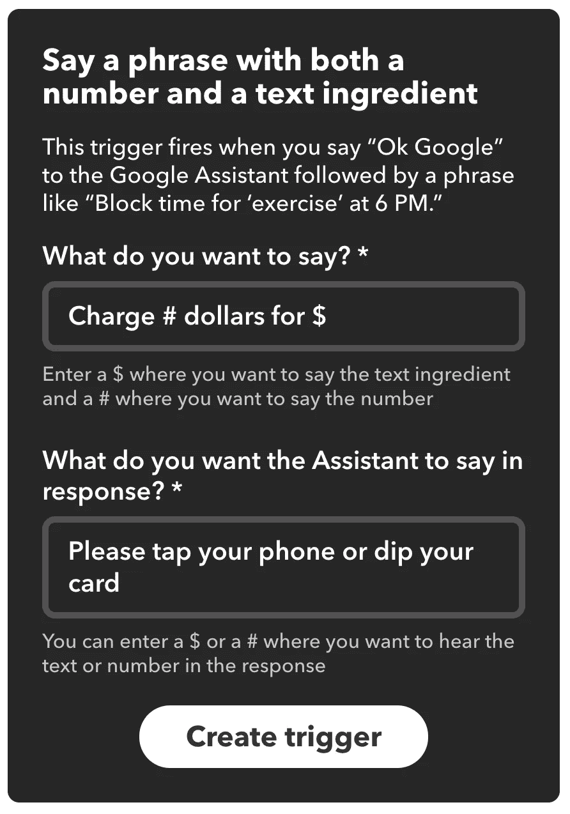
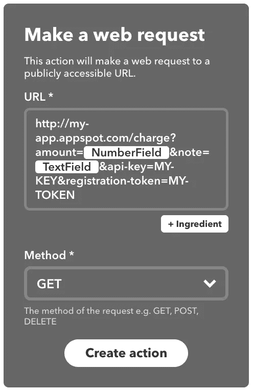
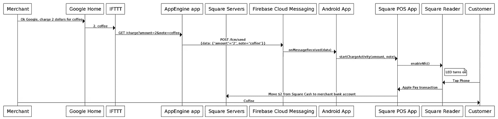

# 好吧，谷歌，咖啡收费 2 美元

> 原文：<https://medium.com/square-corner-blog/ok-google-charge-2-dollars-for-coffee-4d7fdbacd6ef?source=collection_archive---------2----------------------->

> 注意，我们已经行动了！如果您想继续了解 Square 的最新技术内容，请访问我们的新家[https://developer.squareup.com/blog](https://developer.squareup.com/blog)

当我收到我的 Google Home 时，我立刻感到想用它做点什么的冲动。睡了一夜好觉后，我有了一个想法:咖啡师和企业主通常会在柜台后忙得不可开交。如果他们不用在销售点点击按钮就能完成交易会怎么样？如果一个商家可以**只使用他们的声音**接受 Apple Pay 交易会怎么样？

在视频中，我们使用 [Google Home](https://madeby.google.com/home) 激活 [Square 非接触式读卡器](https://squareup.com/contactless-chip-reader)并进行一次由 [Square 现金虚拟卡](https://techcrunch.com/2016/09/09/square-cash-users-can-now-spend-their-balance-with-a-virtual-debit-card/)支持的真实 Apple Pay 交易。

这是只用公共 API 在几个小时内完成的。让我们来看看它是如何工作的！

# 把声音变成咖啡

这似乎是正在发生的事情:



虽然咖啡师让它看起来很简单，但制作浓缩咖啡实际上取决于许多活动部件。同样，上面的图表确实是一个很大的过度简化。在实现这个看似简单的交易的过程中，涉及了更多的组件。

# 烘焙爪哇咖啡豆

我们先来看一下 Square 非接触式读卡器的连接。Square 目前不提供直接连接它的 API。然而，我们的[销售点](https://squareup.com/app)应用程序公开了一个 [API](https://docs.connect.squareup.com/articles/register-api-overview/) ，让其他应用程序将销售点应用程序移动到前台来处理当面支付。

这意味着我们可以构建一个调用销售点 API 的定制商户应用程序。一旦进入前台，销售点应用程序就会通过蓝牙激活读卡器中的 NFC 芯片:



让我们创建一个新的 Android 应用程序， *Home Charge* ，它会触发销售点 API！根据[文档](https://docs.connect.squareup.com/articles/register-api-android/)，我们只需要注册我们的新应用，然后添加一个依赖项和几行代码:

```
public class ChargeActivity extends Activity {
  // ... public void **startTransaction(int dollarAmount, String note)** {
    ChargeRequest request =
      new ChargeRequest.Builder(**dollarAmount** * 1_00, USD)
        .note(**note**)
        .autoReturn(3_200, MILLISECONDS)
        .restrictTendersTo(CARD)
        .build();
    Intent intent = posClient.createChargeIntent(request);
    startActivityForResult(intent, CHARGE_REQUEST_CODE);
  }
}
```

## 向下推动夯锤

在*家庭充电*中调用`startTransaction()`将销售点应用程序移动到前台并激活非接触式读卡器。我们想在没有任何用户触摸输入的情况下触发它。这意味着我们需要一个服务器向我们的应用程序发送消息，然后应用程序将调用`startTransaction()`。

让我们使用 [Firebase Cloud Messaging](https://firebase.google.com/docs/cloud-messaging/) 将服务器消息推送到我们的应用程序。设置很简单，我们只需要添加几行定制代码:

```
public class ChargeService extends FirebaseMessagingService {

  final Handler handler = new Handler(Looper.*getMainLooper*());

  @Override public void onMessageReceived(RemoteMessage msg) {
    Map<String, String> data = remoteMessage.getData();
    final int **dollarAmount** = Integer.*parseInt*(data.get("**amount**"));
    final String **note** = data.get("**note**");

    handler.post(new Runnable() {
      @Override public void run() {
        startTransaction(dollarAmount, note);
      }
    });
  }

  private void startTransaction(int dollarAmount, String note) {
    App app = (App) getApplicationContext();
    ChargeActivity chargeActivity = app.getResumedChargeActivity();
    if (chargeActivity != null) {
      chargeActivity.**startTransaction(dollarAmount, note)**;
    }
  }
}
```

我们可以用`FirebaseInstanceId.*getInstance*().getToken()`检索*注册令牌*，用`curl`手动测试 app 工作情况:

```
curl \
--header "Authorization: key=API_KEY" \
--header Content-Type:"application/json" \
[https://fcm.googleapis.com/fcm/send](https://fcm.googleapis.com/fcm/send) \
-d \
"
{
  \"data\": {
    \"amount\": \"2\",
    \"note\":\"coffee\"
  },
  \"to\":\"REGISTRATION_TOKEN\"
}"
```



有用！



Receipt printing works as well!

现在我们来关注一下 Google Home。

# 如果累了，那么三倍(拍摄)

Google Home 提供了[API](https://developers.google.com/actions/develop/conversation)与用户进行双向对话。还有一个简单得多的解决方案: [IFTTT](http://ifttt.com) (如果*这个*，那么*那个*)支持 Google Assistant 触发器。它可以匹配任何带有数字和文本参数的文本模式。这对我们来说是完美的，因为我们想要解析一个简单的句子:`“Charge {amount} dollars for {note}”`。



我们还需要定义一个动作来响应这个触发器。IFTTT 有一个提供 Web 请求动作的 [Maker](https://ifttt.com/maker) 通道。不幸的是，我们不能用它来直接调用 Firebase 云消息服务器，因为它不支持授权头。

# 引导咖啡流

让我们创建一个端点，它将接收 IFTTT HTTP 请求，并将这些请求代理给 Firebase 云消息传递。一个快速的方法是建立一个[应用引擎](https://cloud.google.com/appengine/)项目并编写一个优秀的 Java servlet:

```
public class MessageServlet extends HttpServlet { @Override public void doGet(
      HttpServletRequest request,
      HttpServletResponse response) throws IOException {Map<String, String> queryParams = parseQueryParams(request);
    String **amount** = queryParams.get("amount");
    String **note** = queryParams.get("note");
    String **apiKey** = queryParams.get("api-key");
    String **token** = queryParams.get("registration-token"); String json = String.format(
      "{\"data\":{\"amount\":\"%s\",\"note\":\"%s\"},"
        + "\"to\":\"%s\"}", 
      **amount**,
      **note**,
      **token**); URL url = new URL("**https://fcm.googleapis.com/fcm/send**");
    HttpURLConnection conn =
      (HttpURLConnection) url.openConnection();
    conn.setDoOutput(true);
    conn.setRequestMethod("POST");
    conn.setRequestProperty("Content-Type", "application/json");
    conn.setRequestProperty("Authorization", "key=" + **apiKey**); OutputStreamWriter writer =
      new OutputStreamWriter(conn.getOutputStream());
    writer.write(json);
    writer.close();

    response.setStatus(conn.getResponseCode());
    response.setContentType("text/plain");
    response.getWriter().println("Over Extracted?");
  }
}
```

然后我们只需要定义相应的 IFTTT Web 请求动作:



# 完整的画面

现在我们知道了将语音转换成咖啡所需的步骤，我们可以更新我们的初始序列图，以包括所有发生的交互:



我希望你喜欢这篇博文！GitHub 上的[提供了该项目的源代码。你打算在我们的公共 API 基础上开发哪些很酷的东西？](https://github.com/square/register-android-sdk#home-charge)