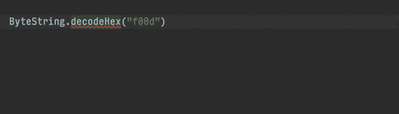

# 宣布 Okio 2:我们的 fast + simple I/O 库 Okio 有一个支持 Kotlin 的新版本。

> 原文：<https://medium.com/square-corner-blog/okio-2-6f6c35149525?source=collection_archive---------0----------------------->


> 注意，我们已经行动了！如果您想继续了解 Square 的最新技术内容，请访问我们的新家[https://developer.squareup.com/blog](https://developer.squareup.com/blog)

在广场，我们为科特林感到兴奋。它是一种能够用来构建 Java 库和应用程序的语言。我们喜欢写既紧凑又高效的代码。

我们也渴望采用 Kotlin 强大的新功能。 [Kotlin/Native](https://kotlinlang.org/docs/reference/native-overview.html) 将允许我们在 iOS 和 Android 之间共享代码。协同程序使并发程序更容易创建和维护。

**今天我们发布了 Okio 2.0。**在这个版本中，我们将项目的源代码从`.java`转换为`.kt`。这种转换让我们可以在库中使用 Kotlin，并在调用代码在 Kotlin 中时提供感觉良好的 API。这也让我们有机会在未来支持多平台和协程。

# 和睦相处

新版本与 Okio 1.15.0 二进制兼容。你可以用新的文件替换旧的`.jar`文件，你的应用程序和库应该可以正常工作了。

这次更新也是与 Java 源代码兼容的。当你配置你的`pom.xml`或`build.gradle`来使用新版本时，你不需要改变任何`.java`代码来获得一个干净的版本。(我们的[变更日志](https://github.com/square/okio/blob/master/CHANGELOG.md)提到了一个小例外，与科特林跃迁无关。)

但是更新**不是 Kotlin 源码兼容**；它在适用的地方采用了科特林的习语。例如，如果你正在使用`ByteString.decodeHex("f00d")`，你现在需要`"f00d".decodeHex()`。我们使用 Kotlin 的`@Deprecated`注释来实现平稳的升级过程。



IntelliJ makes fixing deprecations easy

# 属国

Okio 是 Square 许多开源项目的核心。我们在 [OkHttp](https://github.com/square/okhttp) 、[改装](https://github.com/square/retrofit)、 [Moshi](https://github.com/square/moshi) 和 [Wire](https://github.com/square/wire) 中使用它进行快速 I/O。当这些项目升级到 Okio 2 时，它们将获得对 Kotlin 标准库的可传递依赖。

Kotlin 是 Android 应用程序开发的最佳语言。我们预计许多 Android 团队已经在使用 Kotlin 了。对于他们的项目，Kotlin 已经是应用程序的依赖项之一。那些不知道的人可以使用 R8 或 ProGuard 来减少对 Kotlin 库的依赖。当我们测量时，净增长是微不足道的:只有 7 KiB。

对于服务器应用程序，我们期望依赖大小是无关紧要的。但是我们担心潜在的钻石依赖版本问题。为了将这种问题的可能性降到最低，我们将避免实验性的和不推荐的 API。

对于使用 Okio 或其兄弟库的库和 SDK，我们假设最终的部署目标是 Android 或服务器。无论是哪种情况，我们都认为这种依赖性是可以接受的。

# 好东西

Kotlin 是一种有着广泛应用的美丽语言。我们希望 Okio 2 有助于进一步扩展 Kotlin 的功能。

获得 Gradle 的新 Okio:

```
compile ‘com.squareup.okio:okio:2.0.0’
```

或者 Maven:

```
<dependency>
  <groupId>com.squareup.okio</groupId>
  <artifactId>okio</artifactId>
  <version>2.0.0</version>
</dependency>
```

完整的发布细节在[变更日志](https://github.com/square/okio/blob/master/CHANGELOG.md)中。[自述文件](https://github.com/square/okio/blob/master/README.md)有一个 API 指南。