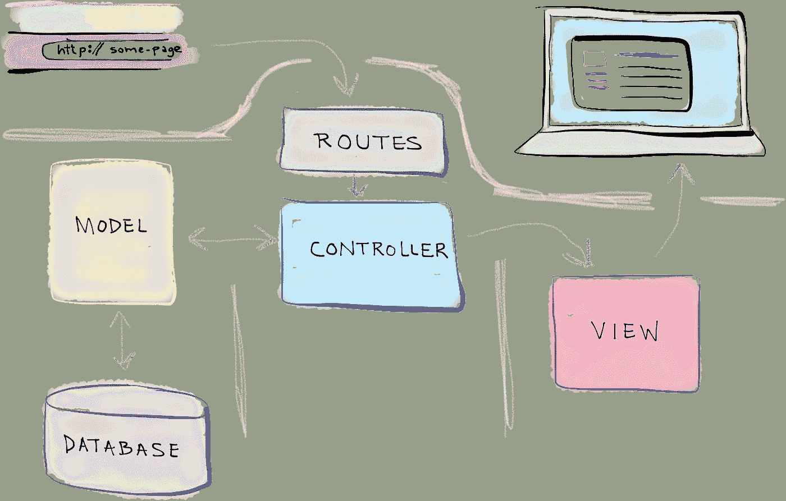

# Olah Request dengan Controller pada Laravel

> 原文：<https://medium.easyread.co/olah-request-dengan-controller-pada-laravel-a77b52235a4b?source=collection_archive---------1----------------------->

## Part 8 — Controller


Photo by [EJ Yao](https://unsplash.com/@hojipago?utm_source=medium&utm_medium=referral) on [Unsplash](https://unsplash.com?utm_source=medium&utm_medium=referral)

# Laravel Series List

[**0\. Laravel Series — Belajar Laravel dari Awal yok!**](https://medium.com/easyread/laravel-series-belajar-laravel-dari-awal-yok-c21dc47863da)[**1\. Persiapan untuk Pengerjaan Proyek dengan Laravel**](https://medium.com/easyread/persiapan-untuk-pengerjaan-proyek-dengan-laravel-2f9a99146313)[**2\. Pengenalan Laravel Framework**](https://medium.com/easyread/pengenalan-laravel-framework-1c829b8164af)[**3\. Instalasi Laravel Framework**](https://medium.com/easyread/instalasi-laravel-framework-41eeec1551ef)[**4\. Struktur Folder Laravel Framework**](https://medium.com/easyread/struktur-folder-laravel-framework-299f0225cd55)[**5\. Apa itu Artisan CLI pada Laravel?**](https://medium.com/easyread/apa-itu-artisan-cli-pada-laravel-62a94232a29a)[**6\. Rancang Database-mu dengan Migration Pada Laravel**](https://medium.com/easyread/rancang-database-mu-dengan-migration-pada-laravel-28d419d0089e)[**7\. Mengarahkan Request dengan Router pada Laravel**](https://medium.com/easyread/mengarahkan-request-dengan-router-pada-laravel-a0df91142f51) **8\. Olah Request dengan Controller pada Laravel — (You’re here)** [**9\. Mudahnya Mengolah Data Menggunakan Model dan Eloquent pada Laravel**](https://medium.com/easyread/mudahnya-mengolah-data-menggunakan-model-dan-eloquent-pada-laravel-80af915c80b5)[**10\. Membuat Tampilan Web dengan Blade pada aplikasi Laravel — Part I**](https://medium.com/easyread/membuat-tampilan-web-dengan-blade-pada-aplikasi-laravel-part-i-c9f5ceee65e6)[**11\. Membuat Tampilan Web dengan Blade pada aplikasi Laravel — Part II**](https://medium.com/easyread/membuat-tampilan-web-dengan-blade-pada-aplikasi-laravel-part-ii-9e233233972a)

Setelah mempelajari bagaimana penggunaan *router* , sekarang saya akan membahas penggunaan *controller.* Pada *part* sebelumnya saya sudah membahas mengenai pendefinisian *router* , *HTTP Verbs* , penggunaan *path* parameter, dan penggunaan *query* parameter. Sebelum kita lanjutkan ke materi, mari kita lihat kembali gambar dibawah ini.



Taken from selftaughtcoders.com

Jika kita perhatikan dari gambar diatas, maka *request* yang kita dapat pada *router* akan diteruskan ke *controller* . Lalu bagaimana cara kita mengimplementasikannya pada kode program kita?

Pertama kali kita perlu untuk membuat file *controller* kita menggunakan Artisan CLI. Untuk membuat file *controller* menggunakan Artisan CLI, jalankan perintah berikut

```
**$ php artisan make:controller BookController -r**
```

Dengan menjalan perintah diatas, file controller kita akan tergenerate secara otomatis. Sebelumnya kita lanjut, mari kita bedah perintah diatas.

*   `**BookController**` adalah parameter yang kita berikan sebagai nama dari file *controller* kita.
*   `**-r**` adalah *flag* yang kita berikan untuk memberitahukan kepada Artisan CLI untuk men- *generate* template fungsi yang standar pada file *controller.* Bingung? Mari kita coba membuat file controller baru menggunakan Artisan CLI tanpa *flag* -r dan menggunakan *flag* -r.

Berikut adalah file *controller* yang tergenerate tanpa menggunakan *flag* -r.

Berikut ada file *controller* yang tergenerate dengan menggunakan *flag* -r.

Bisa kita lihat perbedaannya, dimana pada file *controller* yang tergenerate menggunakan *flag* -r terdapat template fungsi. Template fungsi inilah yang nantinya kita isi sesuai dengan implementasi kita. Template fungsi yang tergenerate adalah standar untuk operasi CRUD.

Kemudian kita akan melengkapi template fungsi yang sudah ada. Kita juga akan mengubah kode program pada router kita sehingga router tidak akan mengembalikan data secara langsung melainkan akan mengarahkan request ke controller. Pengolahan request nantinya akan dilakukan oleh controller. Berikut adalah file controller and router seteleh dilengkapi.

Pada kedua potongan kode diatas, bisa kita perhatikan bagaimana cara mengarahkan request dari router ke controller. Pada router akan terdapat kode program seperti berikut.

```
**Route::*get*('/books/{id}', 'BookController@show');**
```

Mari kita bedah kode program diatas.

*   `**/books/{id}**` adalah *path* yang akan menampung satu parameter yaitu `**id**` . Kode program ini sama dengan kode program yang ada pada artikel sebelumnya.
*   `**BookController@show**` adalah action yang akan dilakukan ketika terdapat request yang mengarah ke path `**/books/{id}**` . Pengertian dari action ini adalah kita akan memanggil method `**show**` yang terdapat pada `**BookContoller**` .

Dengan perubahan kode program seperti diatas, kita telah memindahkan bisnis logic yang ada pada router ke controller. Hal ini akan membuat setiap komponen mengerjakan tugasnya masing-masing. Dengan memindahkan bisnis logic dari router, kita juga akan mengurangi banyaknya kode program pada file `**web.php**` dan *separation of concert* akan tercapai.


Taken from me.me

Sampai jumpa di- *part* berikutnya!

Cappy Hoding! ❤️ = ☕️ + 💻