# OMC:发现 Oracle 基础架构监控的实体—第二部分

> 原文：<https://medium.com/oracledevs/omc-discovering-entities-for-oracle-infrastructure-monitoring-part-ii-d3231a06fade?source=collection_archive---------1----------------------->

## **作者:**[**mono war Mukul**](https://medium.com/u/3757393c69bd?source=post_page-----d3231a06fade--------------------------------)**【OCM】**[**NASS yam Basha**](https://medium.com/u/ba3f0a72ff81?source=post_page-----d3231a06fade--------------------------------)**(甲骨文王牌总监，OCM)**

## **简介**

本文是文章“ [**发现 Oracle 基础架构监控的实体—第一部分**](/@nassyambasha/discovering-target-entities-for-oracle-infrastructure-monitoring-omc-6163b5dc201c) ”的后续文章，这里我们将重点介绍如何创建用户以从 OMC 监控 Oracle 数据库，具体来说，我们现在将回顾如何启用许可，最后我们将对目标组件执行交叉检查操作。

我们将讨论以下副主题

*   Oracle 数据库的先决条件
*   添加数据库实体
*   为实体启用许可证
*   实体的验证
*   Oracle CRS/DB 配置的交叉检查

## **先决条件:添加 Oracle RAC 数据库实体**

在此阶段，我们将执行 Oracle 管理云的 RAC 数据库实体的先决条件。在 Enterprise Manager 中，我们同样使用监视身份证明 DBSNP 来添加和监视我们可能在数据库中专门为另一个监视用户创建的实体。

**为 Oracle 数据库创建监控凭证**

我们将创建用户“OCMMON”，该用户的任务是**仅监控** Oracle 数据库。最初，使用 oracle 用户或 Oracle RDBMS 的所有者登录数据库主机，然后执行脚本来设置 MONCS 用户。该脚本将创建一个用户，并授予基础架构监控所需的角色和权限

访问位置 CD/u01/app/OMC/OMC agent/plugins/Oracle . em . sgfm . zip/1 . 35 . 0/scripts，然后运行。/grantPrivilegesMonSvc.sh shell 脚本如下。对于 RAC 数据库，我们可以运行任何一个节点。

*   数据库主页
*   数据库 SID
*   SYSDBA 用户
*   SYSDBA 口令
*   监控用户
*   监控用户密码
*   输出/日志文件位置

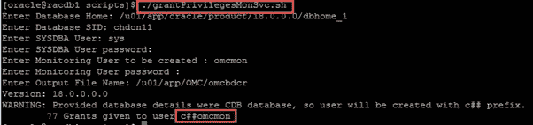

Creating OCMON User

在用户创建过程中，它会自动检测 CDB/PDB，并在需要时添加 c##前缀。

上面我们已经为 Oracle 数据库监控创建了凭据，现在我们将授予监控和数据收集/分析所需的少量权限。

> 注意:如果 DBSNMP 用户已经可用，则不需要这些角色。DBSNMP 用户拥有数据库监控和 Oracle IT 分析数据的所有角色和权限。

授予作为操作系统软件所有者(如 Oracle)登录数据库主机的角色/权限，并执行脚本以设置 MONCS 用户。

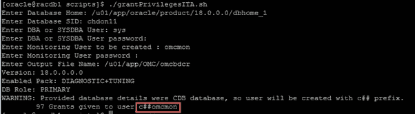

Granting roles/privs for IT Analytics

**添加 Oracle RAC 数据库实体**

我们已经完成了 Oracle 数据库实体的所有先决条件，现在我们将实体添加到 OMC。导航到“OMC 控制台 URL à管理à发现à添加实体”

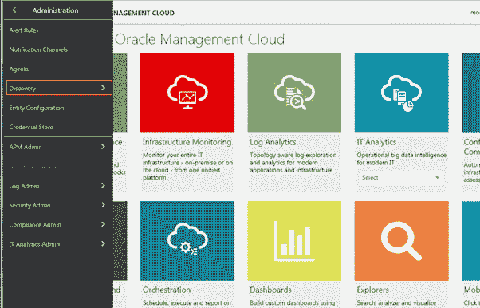

Add entity from OMC console

在“添加实体”表单中填写以下字段，以处理要添加到 OMC 的实体。

*   实体类型
*   实体名称
*   主机名
*   通道数
*   服务名称
*   云代理
*   作业名
*   数据库凭据
*   许可证版本

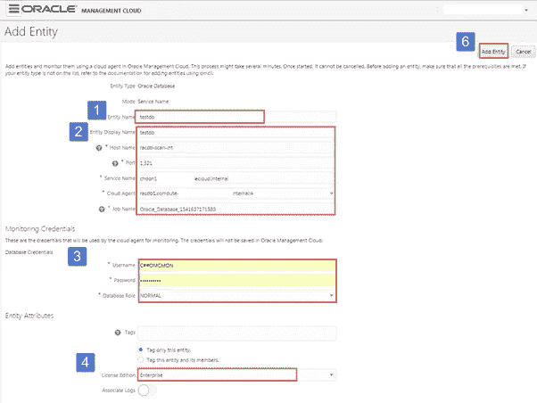

Add Entity form for Oracle RAC Database

在提交将数据库添加到 OMC 进行监控的请求后，我们可以看到数据库的状态以及各种选项，如配置、性能监控和故障排除。

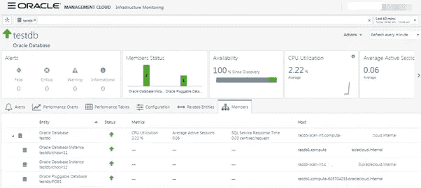

Oracle RAC Database Members

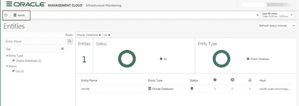

Entities Information

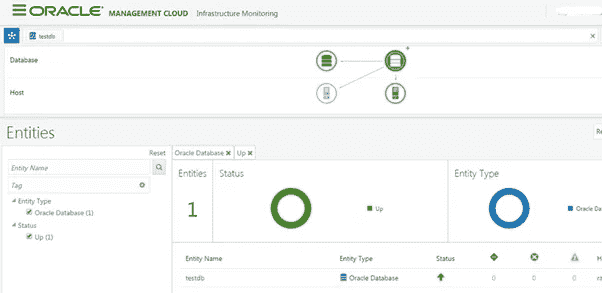

Cluster Database Infra diagram

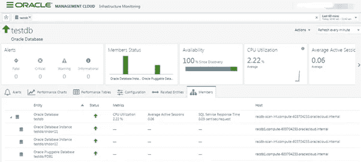

Members of the Oracle RAC Database

## **为实体启用许可**

添加实体后，现在我们将启用监控，或者我们将为添加的实体启用 OMC 许可。除非我们承认实体的许可，否则目标不会收集数据，或者我们无法监控目标。导航到实体的配置，如“从汉堡菜单，转到管理→深入实体配置→选择许可→选择实体”

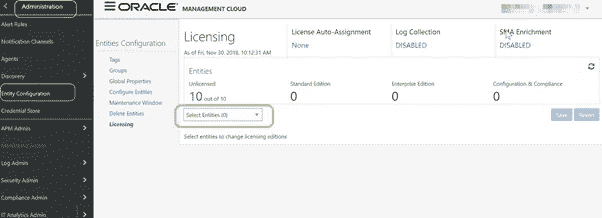

Click on the Entities Number (ex: 10)

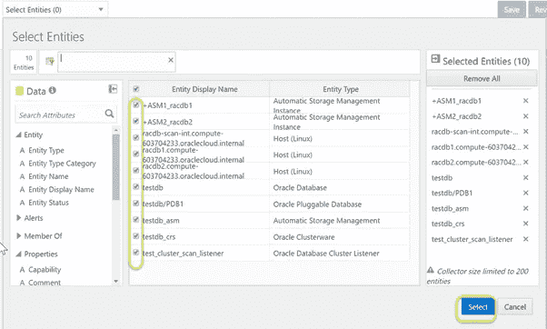

Select the entities to be enabled

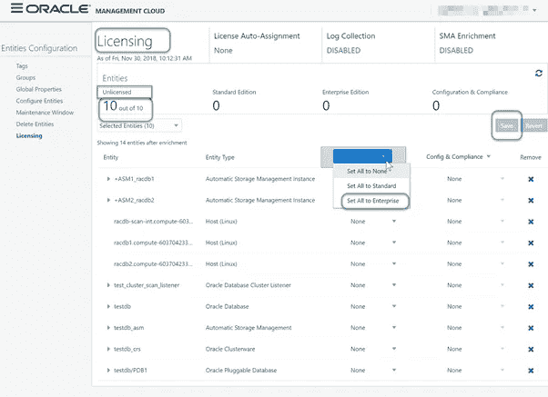

Mark entities to “Set All to Enterprise”

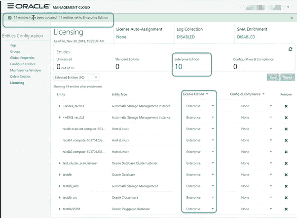

License Status of Entities

## **数据库属性的基本回顾**

从数据库实体中，我们可以看到与数据库相关联的各种选项卡。每个页面都将提供丰富的信息，如“配置”——它将获取所有与数据库相关的信息，并且只需一次操作就可以在一个页面中完成。

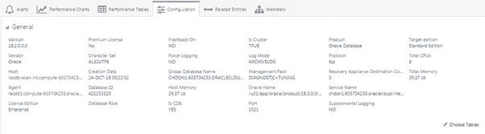

Oracle RAC Database Entity Configuration

在 performance table 选项卡中，我们可以查看 DBA 的大部分日常活动，包括各种其他性能指标，如顶级等待事件、延迟等。

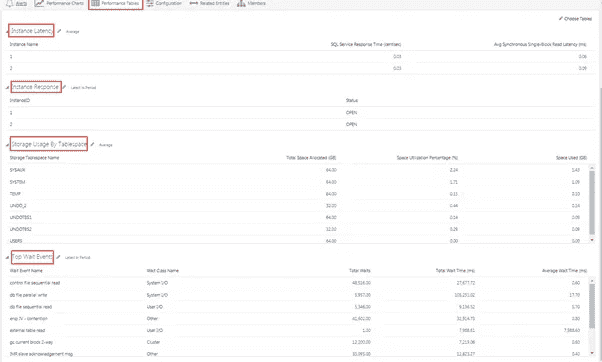

Performance Table of Oracle RAC Database

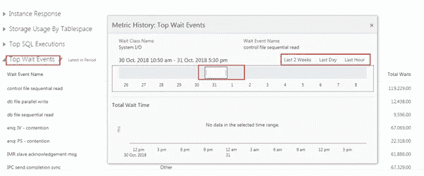

Performance analysis for Oracle RAC Database

## **验证实体**

现在，我们已经为所有实体启用了许可，方法是选择“Licence Edition”以“Set All to Enterprise”并单击“Save”按钮。一旦完成此步骤，我们将能够轻松地进行监控、故障排除和配置审查。我们将进入监控页面，查看实体的状态。“汉堡菜单à监控”确认实体现已在监控页面启用。

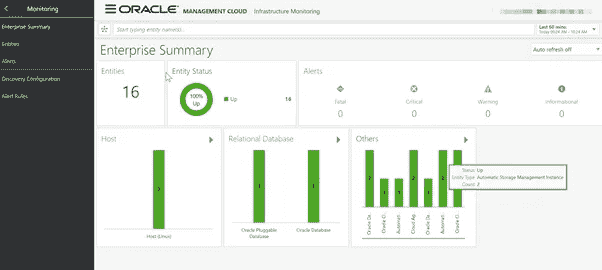

Enterprise Summary

通过代理收集数据后，现在它应该会从我们启用许可的所有实体推送警报

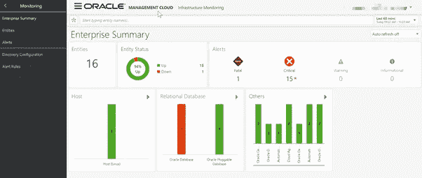

Status’s, Alerts and Metrics.

要查看所有实体状态，我们可以从“entities”选项查看，它将显示所有目标的状态。

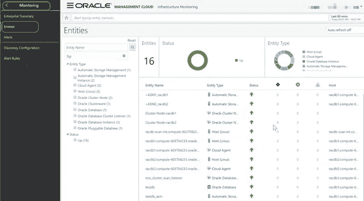

Status of all the Entities

**验证集群件配置**

在本节中，我们将验证 Oracle Clusterware 的配置，以及为 Oracle RAC 数据库添加实体后的整体代理状态。

```
[oracle@racdb1 ~]$ cat /etc/oraInst.loc
inventory_loc=/u01/app/oraInventory
inst_group=oinstall[oracle@racdb1 ~]$ cat /u01/app/oraInventory/ContentsXML/inventory.xml |grep -i CRS=\”true\”
<HOME NAME=”OraGrid18000" LOC=”/u01/app/18.0.0.0/grid” TYPE=”O” IDX=”1" CRS=”true”/>[oracle@racdb1 ~]$ cat /etc/init.d/init.ohasd |grep “^ORA_CRS_HOME”
ORA_CRS_HOME=/u01/app/18.0.0.0/grid[oracle@racdb1 ~]$ /u01/app/18.0.0.0/grid/bin/olsnodes -cRacdb
```

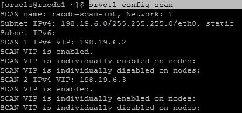

Configuration of Scan

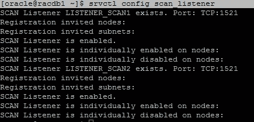

Verify the SCAN (Listener) Port

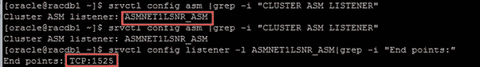

Verify ASM Cluster Listener and Port

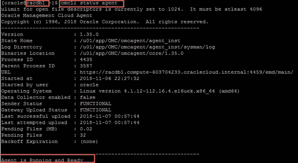

Agent Status

**总结**

简而言之，我们已经通过创建用户和授予 IT 分析所需的角色/权限，完成了 Oracle RAC 数据库实体的所有先决条件，之后，我们将 Oracle RAC 数据库实体添加到 OMC，并启用了 Oracle RAC 数据库监视的许可证，最后，我们通过逐步说明验证了所有集群件配置，包括代理状态。

## **作者简介**

***Nassyam Basha*** 是数据库管理员。他有大约十年的 Oracle 数据库管理员工作经验，目前是 eprosed KSA 公司的数据库专家。他拥有马德拉斯大学的计算机应用硕士学位。他是 Oracle 11g 认证大师和 Oracle ACE 总监。他以超级英雄的身份积极参与甲骨文相关论坛，如 OTN，甲骨文支持被授予“大师”称号，并担任 OTN 版主，与 OTN 一起撰写了大量关于 Toad World 的文章。他维护着一个与甲骨文技术相关的博客，[www.oracle-ckpt.com](http://www.oracle-ckpt.com/)，可以通过[https://www.linkedin.com/in/nassyambasha/](https://www.linkedin.com/in/nassyambasha/)找到他

***Monowar Mukul*** 目前担任首席 Oracle 数据库专家。我是 Oracle 认证大师(Oracle 12c 认证大师管理、Oracle 12c 认证大师 MAA 和 Oracle 11g 认证大师管理)。他在 Oracle MAA 空间担任了 17 年的 Oracle 数据库管理员顾问，负责数据库云服务器和非数据库云服务器系统、Oracle 云空间和 SOA 中间件。他曾在澳大利亚的多个商业领域工作，包括高等教育、能源、政府、采矿和运输。作为一名首席 Oracle 数据库专家，他展示了高度发展的批判性思维和分析技能。你可以在[https://www.linkedin.com/in/monowarmukul/](https://www.linkedin.com/in/monowarmukul/)找到关于他和他的工作成就的更多细节