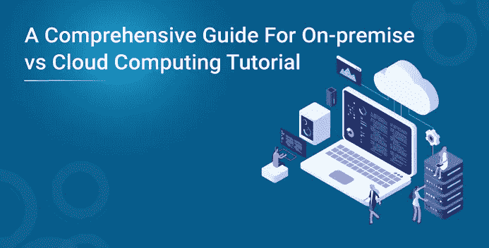
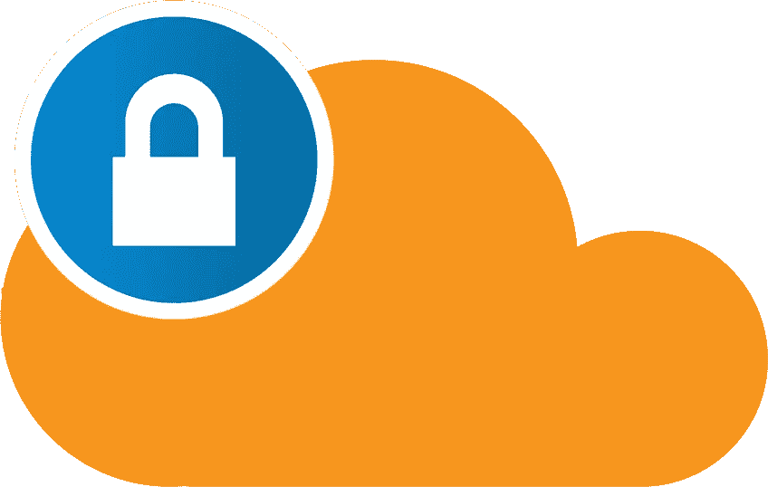
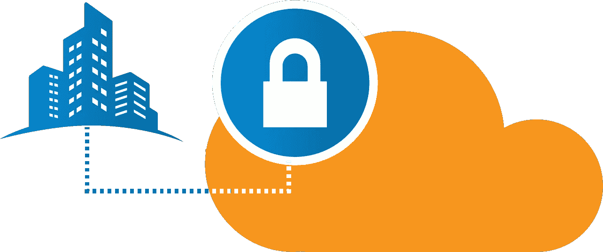
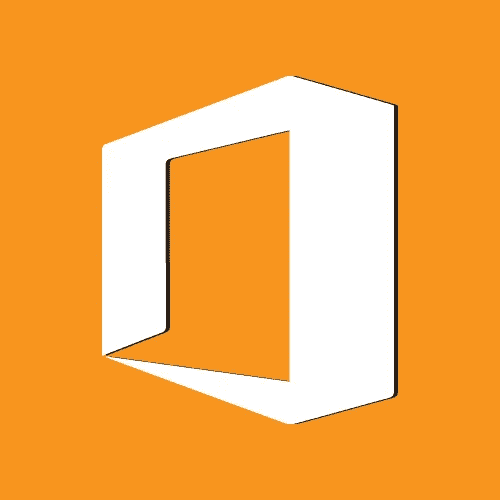
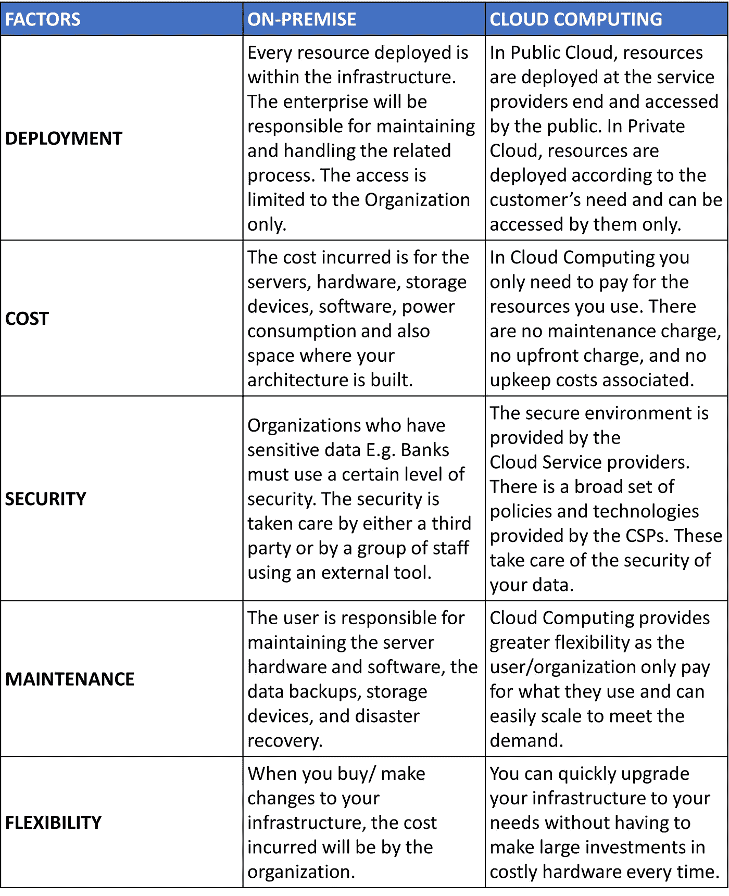

# 内部部署与云计算教程的综合指南

> 原文：<https://medium.com/edureka/on-premise-vs-cloud-computing-410e8131af14?source=collection_archive---------2----------------------->

关于内部部署和云计算以及两者孰优孰劣的争论从未停止过。在这篇文章中，我将解释关于这个话题你应该知道的一切。

在当前 IT 企业不断扩张的时代，人们必须考虑是本地架构还是云计算更适合这一目的。在这篇关于内部部署与云计算的文章中，我将讨论以下主题

*   什么是内部部署？
*   什么是云计算？
*   内部部署与云计算

在构建您的架构之前，必须决定您是希望在本地(自己)管理您的基础架构，还是让第三方为您管理它。为了顺利运营，必须考虑与您的环境相关的这些因素。现在，您已经知道了我们为什么在这里，以及我们将要学习什么，让我们深入研究一下这篇关于内部部署与云计算的文章。

# 什么是内部部署？

先说一个大多数人感兴趣的话题:钱。一般来说，你的钱包里和银行账户里都有你的钱。在这里，钱包是您的本地环境。内部部署意味着公司将所有数据、服务器和 IT 环境中的一切都保留在内部。公司始终负责运行、支持和维护数据。这是托管架构的传统方式。

由于内部环境指的是将整个基础架构保留在内部，因此也称为“收缩包装”。另一种选择是云计算(存在你银行账户里的钱)。我们再进一步，详细了解一下云计算。

# 什么是云计算？

在谈论“什么是云计算”之前，我们先简单了解一下“什么是云”及其类型。

云计算是从远程服务器(数据中心)存储和访问数据的实践。云计算有多种类型，要完全理解它，您应该首先了解云的不同类别

1.  **公有云:**

1.  这是最常见的云类型。在这里，服务器(数据中心)在多个客户端之间共享。亚马逊，谷歌，微软，更多的公司可能会在他们之间共享服务器。
2.  **私有云:**

1.  私有云由单个用户(客户端)、封闭的用户组或单个组织运营。服务和安全协议也经常更新。例如:内部网、VMware。
2.  **混合云:**混合云顾名思义，是公共云和私有云的混合。

你也可以这样想，拥有一个公共云来存储公众可以访问的数据，拥有一个私有云来运行你的生产线和遗留应用。

云计算通常被称为“云”，基本上是通过云(互联网)提供计算服务。云计算由服务器、网络、存储、数据库、分析工具、软件和编程平台组成。云计算服务可以分为三种模式，通常称为:-

1.  **SaaS(软件即服务):**

你不需要安装应用程序，你得到的是“按需软件”。一切将由云服务提供商负责。比如 YouTube，Office 360。

**2。PaaS(平台即服务):**

在这里，您可以获得一个平台来执行您的计算请求，如操作系统、编程环境和数据库。例如 AWS 弹性豆茎。

**3。IaaS(基础设施即服务):**

您将获得拥有基础架构、用于存储的物理机或虚拟机、创建虚拟网络和防火墙的优势。例如亚马逊 VPC。

如果您对云模型的类型有任何疑问，请在此提出您的问题:- *“什么是 Iaas、PaaS 和 SaaS？”。*你可以在这个博客里阅读更多关于云计算的内容:*什么是云计算？*。

现在您已经了解了内部部署和云计算，让我们看看它们之间有什么不同。

**内部部署与云计算的差异**

如果你想查看更多关于 Python、DevOps、Ethical Hacking 等市场最热门技术的文章，那么你可以参考 [Edureka 的官方网站。](https://www.edureka.co/blog/?utm_source=medium&utm_medium=content-link&utm_campaign=on-premise-vs-cloud-computing/)

请留意本系列中解释 Azure 其他方面的其他文章。

> *1。* [*蔚蓝教程*](/edureka/azure-tutorial-5a97e30ee9a7)
> 
> *2。* [*蔚蓝门户*](/edureka/azure-portal-all-you-need-to-know-about-the-azure-console-8ade1effa474)
> 
> *3。* [*Azure 存储教程*](/edureka/azure-storage-tutorial-an-introduction-to-azure-storage-dae8fd8f555c)
> 
> *4。* [*蔚蓝专用网*](/edureka/azure-virtual-network-securing-your-applications-using-vpc-744eba3aa5b1)
> 
> *5。* [*Azure DevOps 教程*](/edureka/azure-devops-cf755fb334ae)
> 
> *6。* [*天青板*](/edureka/azure-boards-ce093b2688bb)

*原载于 2019 年 3 月 4 日*[*【https://www.edureka.co】*](https://www.edureka.co/blog/on-premise-vs-cloud-computing/)*。*