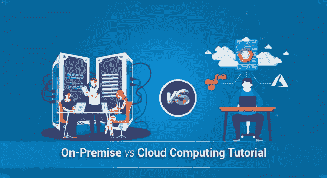
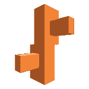
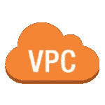
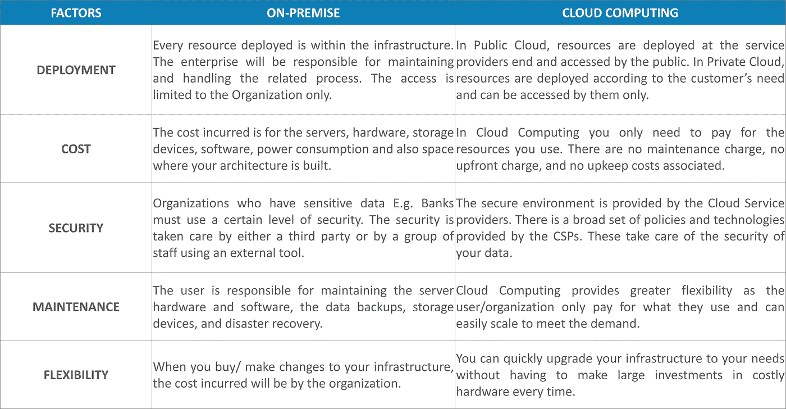

# 内部部署与云计算

> 原文：<https://medium.com/edureka/on-premise-vs-cloud-computing-f9aee3b05f50?source=collection_archive---------0----------------------->

关于内部部署和云计算以及两者孰优孰劣的争论从未停止过。在这篇文章中，我将解释关于这个话题你应该知道的一切。

在当前 IT 企业不断扩张的时代，人们必须考虑是本地架构还是云计算更适合这一目的。在这篇关于内部部署与云计算的文章中，我将讨论以下主题

*   什么是内部部署？
*   什么是云计算？
*   内部部署与云计算

在构建您的架构之前，必须决定您是希望在本地(自己)管理您的基础架构，还是让第三方为您管理它。为了顺利运营，必须考虑与您的环境相关的这些因素。现在你知道我们为什么在这里，我们要学习什么，让我们深入研究这篇文章。

# 什么是内部部署？

先说一个大多数人感兴趣的话题:钱。一般来说，你的钱包里和银行账户里都有你的钱。在这里，钱包是您的本地环境。内部部署意味着公司将所有数据、服务器和 IT 环境中的一切都保留在内部。公司始终负责运行、支持和维护数据。这是托管架构的传统方式。

由于内部环境指的是将整个基础架构保留在内部，因此也称为“收缩包装”。另一种选择是云计算(存在你银行账户里的钱)。让我们更进一步，详细了解一下云计算。

# 什么是云计算？

在谈论“什么是云计算”之前，我们先简单了解一下“什么是云”及其类型。

云计算是从远程服务器(数据中心)存储和访问数据的实践。云计算有多种类型，要完全理解它，您应该首先了解云的不同类别

## **公有云:**

这是最常见的云类型。这里，服务器(数据中心)在多个客户端之间共享。亚马逊，谷歌，微软，更多的公司可能会在他们之间共享服务器。

## **私有云:**

私有云由单个用户(客户端)、封闭的用户组或单个组织运营。服务和安全协议也经常更新。例如:内部网、VMware。

## **混合云:**

顾名思义，混合云是公共云和私有云的混合体。您也可以这样想，拥有一个公共云来存储公众可访问的数据，拥有一个私有云来运行您的生产线和遗留应用程序。

云计算通常被称为“云”，基本上是通过云(互联网)交付计算服务。云计算由服务器、网络、存储、数据库、分析工具、软件和编程平台组成。云计算服务可以分为三种模式，通常称为:-

## **SaaS(软件即服务):**

你不需要安装应用程序，你得到的是“按需软件”。一切将由云服务提供商负责。例如 YouTube，Office 360。

## **平台即服务(PaaS):**

在这里，您可以获得一个平台来执行您的计算请求，如操作系统、编程环境和数据库。例如 AWS 弹性豆茎。

## **IaaS(基础设施即服务):**

您将获得拥有基础架构、用于存储的物理机或虚拟机、创建虚拟网络和防火墙的优势。例如亚马逊 VPC。

现在您已经了解了内部部署和云计算，让我们看看它们之间有什么不同。

# 内部部署与云计算的区别

如果你想查看更多关于人工智能、DevOps、道德黑客等市场最热门技术的文章，你可以参考 Edureka 的官方网站。

请留意本系列中的其他文章，它们将解释 AWS 的各个方面。

> *1。* [*AWS 教程*](/edureka/amazon-aws-tutorial-4af6fefa9941)
> 
> *2。* [*AWS EC2*](/edureka/aws-ec2-tutorial-16583cc7798e)
> 
> *3。*[*AWSλ*](/edureka/aws-lambda-tutorial-cadd47fbd39b)
> 
> *4。* [*AWS 弹性豆茎*](/edureka/aws-elastic-beanstalk-647ae1d35e2)
> 
> *5。* [*AWS S3*](/edureka/s3-aws-amazon-simple-storage-service-aa71c664b465)
> 
> *6。* [*AWS 控制台*](/edureka/aws-console-fd768626c7d4)
> 
> *7。* [*AWS RDS*](/edureka/rds-aws-tutorial-for-aws-solution-architects-eec7217774dd)
> 
> *8。* [*AWS 迁移*](/edureka/aws-migration-e701057f48fe)
> 
> *9。*[*AWS Fargate*](/edureka/aws-fargate-85a0e256cb03)
> 
> 10。 [*亚马逊 Lex*](/edureka/how-to-develop-a-chat-bot-using-amazon-lex-a570beac969e)
> 
> 11。 [*亚马逊光帆*](/edureka/amazon-lightsail-tutorial-c2ccc800c4b7)
> 
> *12。* [*AWS 定价*](/edureka/aws-pricing-91e1137280a9)
> 
> *13。* [*亚马逊*](/edureka/amazon-athena-tutorial-c7583053495f)
> 
> 14。[*AWS CLI*](/edureka/aws-cli-9614bf69292d)
> 
> 15。 [*亚马逊 VPC 教程*](/edureka/amazon-vpc-tutorial-45b7467bcf1d)
> 
> 15。T38*AWS vs Azure*
> 
> *17。* [*AWS 简历*](/edureka/aws-resume-7453d9477c74)
> 
> *18。* [*亚马逊迪纳摩 DB 教程*](/edureka/amazon-dynamodb-tutorial-74d032bde759)
> 
> *19。* [*如何从快照恢复 EC2？*](/edureka/restore-ec2-from-snapshot-ddf36f396a6e)
> 
> *20。* [*AWS 代码提交*](/edureka/aws-codecommit-31ef5a801fcf)
> 
> *21。* [*顶级 AWS 架构师面试问题*](/edureka/aws-architect-interview-questions-5bb705c6b660)
> 
> *22。* [*如何从快照恢复 EC2？*](/edureka/restore-ec2-from-snapshot-ddf36f396a6e)
> 
> *23。* [*使用 AWS 创建网站*](/edureka/create-websites-using-aws-1577a255ea36)
> 
> *24。* [*亚马逊路线 53*](/edureka/amazon-route-53-c22c470c22f1)
> 
> *25。* [*用 AWS WAF 保护 Web 应用*](/edureka/secure-web-applications-with-aws-waf-cf0a543fd0ab)

*原载于 2019 年 3 月 4 日*[*www.edureka.co*](https://www.edureka.co/blog/on-premise-vs-cloud-computing/)*。*