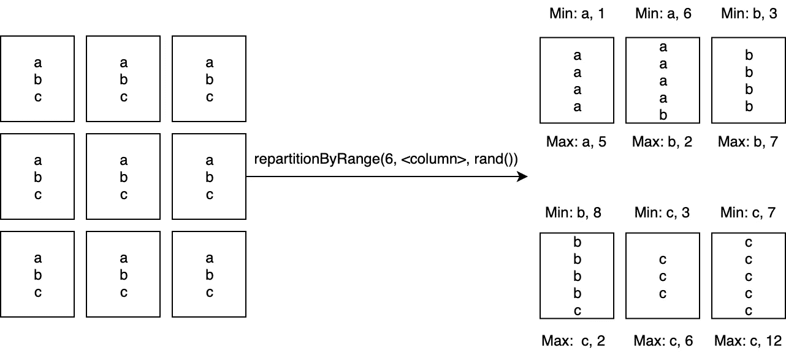

# 关于 Spark、Hive 和小文件:深入了解 Spark 分区策略

> 原文：<https://medium.com/airbnb-engineering/on-spark-hive-and-small-files-an-in-depth-look-at-spark-partitioning-strategies-a9a364f908?source=collection_archive---------0----------------------->

## 存储 Spark 作业结果的最常见方式之一是将结果写入存储在 HDFS 上的 Hive 表。虽然从理论上讲，管理作业的输出文件数量应该很简单，但实际上，它可能是管道中比较复杂的部分之一。

**作者**:扎卡里·恩南加


Airbnb’s new office building, 650 Townsend

# 背景

在 Airbnb，我们的离线数据处理生态系统包含许多任务关键、时间敏感的工作，这对我们最大限度地提高数据管道基础设施的稳定性和效率至关重要。

因此，几个月前，我们遇到了一个反复出现的问题，它导致了我们的数据仓库的重大停机，我们很快就必须了解并解决根本原因。我们追溯到一个单一的工作中断，以及它如何，无意和意想不到的，写了数百万个文件到 HDFS。

因此，我们开始研究可以用来管理我们的 Spark 文件数量的各种策略，以便最大限度地提高我们的数据工程生态系统的稳定性和效率。

## 词汇快速笔记

在这篇文章中，我会经常用到“分区”这个术语，Hive 和 Spark 都用它来表示不同的东西。出于这个原因，我将使用术语**分区**来指代 Spark 分区，使用**分区**来指代 Hive 分区。

我将使用术语**分区键**来指代构成任何给定 hPartition 的分区标识符的一组值。

# 这是怎么发生的？

正如术语“ETL”所暗示的，大多数 Spark 作业可以用 3 个操作来描述:读取输入数据，用 Spark 处理，保存输出数据。这意味着，虽然您的实际数据转换主要发生在内存中，但您的作业通常以大量 IO 开始和结束。

我们在 Airbnb 使用的 Spark 的常见堆栈是使用存储在 HDFS 上的 Hive 表作为输入和输出数据存储。配置单元分区被有效地表示为分布式文件系统上的文件目录。理论上，尝试编写尽可能多的文件可能是有意义的。但是，有一个*成本*。

*HDFS 不太支持大量的小文件。*每个文件在 NameNode 内存中都有 150 字节的开销，HDFS 的总 IOPS 数量有限。文件写入的峰值绝对会使您的 HDFS 基础架构的某些部分停止运行，或者变得异常缓慢。

看起来似乎很难意外地编写大量文件，但事实并非如此。如果您的用例只涉及一次编写一个 hPartition，那么这个问题有许多解决方案。但是在一个大型的数据工程组织中，这些情况并不是您会遇到的唯一情况。

在 Airbnb，我们有很多给多个部门写信的情况，最常见的是回填。回填是从某个历史日期到当前日期对表的重新计算，通常是为了修复 bug 或数据质量问题。

当处理包含 365 天数据的大型数据集(比如 500GB-1TB)时，您可能会将数据分成几千个部分来处理，例如 2000-3000 个部分。虽然从表面上看，这种天真的方法似乎是合理的，使用动态分区，并将结果写入按日期分区的 Hive 表将导致**多达 1.1M 的文件**。

为什么会这样？


Data distributed randomly into 3 sPartitions


Our goal — Data written neatly into 3 files

假设您有一个包含 3 个分区的作业，并且您想要写入 3 个分区。

在这种情况下，您希望将 3 个文件写入 HDFS，每个分区键的所有记录都在一个文件中。


Reality — Data written not-so-neatly to HDFS

实际发生的是**您将生成 9 个文件，每个文件有 1 条记录**。

写入动态分区的 Hive 表时，每个分区由你的执行器并行处理。当处理该分区时，每次执行器在给定的分区中遇到新的分区键时，都会打开一个新文件。

默认情况下，Spark 对您的数据使用散列或循环分区器。当应用于任意的数据帧时，这两种方法都可以被假定为在整个分区中相对均匀但随机地分布您的行。这意味着在不采取任何特定操作的情况下，您通常可以预期为每个分区、每个唯一的分区键编写大约 1 个文件，因此得到了上面 1.1M 的结果。

# 你如何决定你的目标文件数？

在我们深入研究说服 Spark 以一种服从高效 IO 的方式分发我们的数据的各种方法之前，我们必须讨论我们的目标是什么。

理想情况下，目标文件大小应该大约是 HDFS 块大小的倍数，默认情况下是 128MB。

在纯 Hive 管道中，提供了一些配置来自动将结果收集到大小合理的文件中，从开发人员的角度来看几乎是透明的，例如*Hive . merge . small files . avg size*或*Hive . merge . size . per . task*。

但是，Spark 中不存在这样的功能。相反，我们必须使用我们自己的试探法来尝试确定，给定一个数据集，应该写多少个文件。

## 基于大小的计算

理论上，这是最直接的方法—设置目标大小，估计数据帧的大小，然后进行划分。

然而，在许多情况下，文件是通过压缩写入磁盘的，并且其格式与存储在 Java 堆中的记录格式有很大不同。这意味着，当您将记录写入磁盘时，估计内存中的记录有多大是非常重要的。

虽然您可以使用 SizeEstimator 实用程序通过内存中的数据大小进行估计，然后应用某种估计的压缩/文件格式因子，但是除了数据大小之外，SizeEstimator 还会考虑数据帧/数据集的内部开销。总的来说，这种试探法不太可能准确达到这个目的。

## 基于行计数的计算

第二种方法是设置目标行数，计算数据集的大小，然后执行除法来估计目标。

可以通过多种方式确定目标行数，要么为所有数据集选择一个静态数，要么确定磁盘上单个记录的大小，然后执行必要的计算。哪种方式是最好的将取决于你的数据集的数量和它们的复杂性。

计数是相当便宜的，但是在计数之前需要缓存以避免重新计算数据集。我们稍后将讨论缓存的成本，因此*虽然这是可行的，但不一定是免费的*。

## 静态文件计数

最简单的解决方案是只要求工程师在每次插入的基础上，告诉 Spark 总共应该写多少个文件。这种“启发式”本身不会起作用，因为我们需要给开发人员一些其他的启发式方法来首先获得这个数字，但可以是一种优化，我们可以应用它来跳过昂贵的计算。

## 估价

混合动力车是你的最佳选择。未知数据集应该使用基于计数的启发式算法来确定文件计数，但允许开发人员采用计数启发式算法确定的结果，并对其进行静态编码。

# 我们如何让 Spark 以合理的方式分发我们的数据？

即使我们知道如何将文件写入磁盘，我们仍然需要使用 Spark 来构建我们的分区，以便能够实际生成这些文件。

Spark 为您提供了许多工具来确定数据在您的部门中是如何分布的。然而，在各种功能中有许多隐藏的复杂性，并且在某些情况下，它们具有不立即明显的含义。

我们将介绍 Spark 提供的许多选项，以及我们在 Airbnb 利用来控制 Spark 输出文件数量的各种其他技术。

## 联合

Coalesce 是重新分区的一个特殊版本，它只允许您减少总分区，但不要求完全洗牌，因此比重新分区要快得多*。它通过有效地合并分区来做到这一点。*

**

*Coalesce 在某些情况下听起来很有用，但是有一些问题。*

*首先，coalesce 的行为让我们很难使用。举一个非常基本的 Spark 应用程序:*

```
*load().map(…).filter(…).save()*
```

*假设您的并行度为 1000，但您最后只想写 10 个文件。你可能认为你可以做到:*

```
*load().map(…).filter(…).coalesce(10).save()*
```

*然而，Spark 将有效地将合并操作下推到尽可能早的时间点，因此它将按如下方式执行:*

```
*load().coalesce(10).map(…).filter(…).save()*
```

*唯一的解决方法是在转换和合并之间强制执行一个操作，比如:*

```
*val df = load().map(…).filter(…).cache()
df.count()
df.coalesce(10)*
```

*缓存是必需的，因为否则，您将不得不重新计算您的数据，这可能是非常昂贵的。但是，*缓存不是免费的*；如果您的数据集无法放入内存中，或者如果您无法腾出内存将数据有效地存储在内存中两次，那么您必须使用磁盘缓存，这有其自身的局限性，并且会显著降低性能。*

*此外，正如您将在后面看到的，执行 shuffle 对于实现我们想要的更复杂数据集的结果通常是必要的。*

***评价***

*联合仅适用于特定的案例子集:*

*1.你可以保证你只写给 1 个分区
2。目标文件数小于您用来处理数据的分区数
3。您可以缓存或重新计算您的数据*

## *简单再分配*

*简单的重新分区是这样一种重新分区，它的唯一参数是目标分区计数，即 df.repartition(100)。在这种情况下，使用循环划分器，这意味着唯一的保证是输出数据具有大致相等大小的划分。*

***评估***

*简单的重新分区可以修复倾斜的数据，其中分区的大小相差很大。*

*它仅适用于以下文件计数问题:*

1.  *您可以保证只写入 1 个分区*
2.  *您正在写入的文件数大于您的分区数，并且/或者由于某些其他原因您无法使用联合*

## *按列重新分区*

*按列重新分区接受目标分区计数，以及要重新分区的列序列，例如 df.repartition(100，$“date”)。这对于强制 Spark 将具有相同键的记录分发到相同的分区非常有用。一般来说，这对于很多 Spark 操作都是有用的，比如连接，但是理论上，它也可以让我们解决我们的问题。*

*按列重新分区使用 HashPartitioner，它会将键哈希值相同的记录分配给同一个分区。实际上，它将:*

**

*Beautiful!*

*理论上，这正是我们想要的！*

**

*Saying “in theory” is always inviting disaster.*

*然而，只有当每个分区键都可以安全地写入一个文件时，这种方法才有效*。这是因为不管有多少值有一个特定的哈希值，它们最终都会在同一个分区中。**

***评估***

*仅当写入一个或多个小型分区时，按列重新分区才有效。在任何其他情况下，这都是没有用的，因为最终每个 hPartition 都会有一个文件，这仅适用于最小的数据集。*

## *用随机因子按列重新分区*

*我们可以通过添加一个受约束的随机因子来修改按列重新分区:*

```
*df
.withColumn("rand", rand() % filesPerPartitionKey)
.repartition(100, $”key”, $"rand")*
```

*从理论上讲，只要您满足以下条件，这种方法应该可以产生排序良好的记录和大小相当均匀的文件:*

1.  *所有分区的大小大致相同*
2.  *您知道每个 hPartition 的目标文件数，并可以在运行时对其进行编码*

*正如我们前面所讨论的，确定正确的每分区文件数并不容易。然而，第一个条件也不是微不足道的满足:*

*在回填环境中，比如说，计算一年的数据，每天的数据量变化很小，而每月和每年的变化很大。假设数据源的月环比增长率为 5%，我们预计数据量将在一年内增长 80%。10%的环比增长率，313%。*

*考虑到这些因素，在超过一个月左右的时间内，我们似乎都会遇到性能问题和偏差，并且不能有意义地声称所有 hPartitions 都需要大致相同的文件数。*

*也就是说，即使我们能保证满足所有这些条件，还有一个问题:哈希冲突。*

***碰撞***

*假设您正在处理 1 年的数据(365 个唯一的日期)，日期是您唯一的分区键。*

*如果每个分区需要 5 个文件，您可以这样做:*

```
*df.withColumn(“rand”, rand() % 5).repartition(5*365, $”date”, $”rand”)*
```

*在幕后，Scala 将构造一个既包含你的日期，又包含你的随机因子的键，类似于(<date>，<0–4>)。然后，如果我们看看 HashPartitioner 代码，它会:</date>*

*(参考见 org . Apache . spark . partitioner . hash partitioner)*

```
*class HashPartitioner(partitions: Int) extends Partitioner {
 def getPartition(key: Any): Int = key match {
   case null => 0
   case _ => Utils.nonNegativeMod(key.hashCode, numPartitions)
 }
}*
```

*实际上，所做的就是获取你的键元组的散列，然后使用目标分割数获取它的(非负)模。*

*让我们分析一下在这种情况下我们的记录实际上将如何分布。我已经写了一些代码来执行对[这里](https://scastie.scala-lang.org/OBRRBRpJT6y7PGv9RajZoA)的分析，也可以作为要点[这里](https://gist.github.com/zsennenga/a6cb2267beeab45d26371346c65c6663)。*

*上面的脚本计算了 3 个数量:*

*   ***效率**:非空部分(以及正在使用的执行器)与输出文件数量的比率*
*   ***冲突率**:发生(date，rand)散列冲突的分区的百分比*
*   ***严重碰撞率**:同上，但该键上的碰撞次数大于等于 3*

*冲突是很重要的，因为它们意味着我们的分区包含多个唯一的分区键，而我们期望每个分区只有一个。*

*结果相当糟糕:我们使用了 63%的执行人，这很可能是严重的偏差；接近一半的执行者处理的数据是我们预期的 2 倍、3 倍，甚至 8 倍。*

*现在，有了一个解决方法— **分区扩展**。*

*在前面的例子中，我们的输出分区数等于我们预期的总文件数。这导致了哈希冲突，因为围绕着[生日问题](https://en.wikipedia.org/wiki/Birthday_problem)的原理是一样的——也就是说，如果你将 n 个对象随机分配给 n 个槽，你可以预期会有几个槽有不止一个对象，以及几个空槽。因此，要解决这个问题，您必须降低对象与插槽的比率。*

*我们通过缩放输出分区数，将输出分区数乘以一个大因子来实现这一点，类似于:*

```
*df
.withColumn(“rand”, rand() % 5)
.repartition(5*365*SCALING_FACTOR, $”date”, $”rand”)*
```

*参见[此处](https://scastie.scala-lang.org/LTi5k41ERT6wKWapYO0Q9w)的更新分析代码，不过，总结一下:*

**

*当我们的比例因子接近无穷大时，碰撞很快就接近 0，效率也接近 100%。*

*然而，这产生了另一个问题，大量的输出部分将是空的。虽然这些空分区不一定是交易的破坏者，但它们确实带来了一些开销，增加了驱动程序的内存需求，并使我们更容易受到一些问题的影响，其中，由于错误或意外的复杂性，我们的分区键空间意外地大了，我们最终又要编写数百万个文件。*

***默认并行度和缩放比例***

*这里一种常见的方法是在使用这种方法时不要显式设置分区计数，如果不提供分区计数，那么 Spark 默认为 spark.default.parallelism 值(以及类似的配置)。*

*虽然并行度通常自然高于总输出文件数(因此，隐含地提供了一个大于 1 的缩放因子)，但这并不总是正确的——我观察到许多开发人员没有正确调整并行度的情况，并导致所需的输出文件数实际上大于他们的默认并行度。对此的处罚很重:*

**

*Scale factors below 1 get bad, fast.*

***评估***

*如果你能满足一些保证，这是一个有效的方法:*

*   *hPartitions 将具有大致相等的文件数*
*   *我们可以确定平均分区文件数应该是多少*
*   *我们大致知道唯一分区键的总数，因此我们可以正确地缩放数据集。*

*在这些例子中，我们假设这些事情中的许多可以很容易地被知道；主要是输出 hPartition 的总数，以及每个 hPartition 所需的文件数。然而，我认为我们很少要求开发者能够提供这些数字，并保持更新。*

*这种方法无论如何都是不错的，并且可能适用于许多用例。也就是说，如果您没有意识到它的缺陷，您可能会遇到难以诊断的性能问题。因为这个原因，也因为维护文件计数相关常量的需求，我觉得这不是一个合适的默认设置。*

*对于真正的缺省，我们需要一种方法，它只需要开发人员提供最少的信息，并且可以处理任何类型的输入。*

## *按范围进行简单的重新划分*

*按范围重新划分是重新划分的特例。它没有使用循环或散列分区器，而是使用一种特殊的分区器，称为范围分区器。*

*范围分割器根据某个给定键的顺序跨分区分割行，但是它不执行全局排序。它作出的保证是:*

*   *具有相同散列的所有记录将在相同的分区中结束*
*   *所有分区都有一个与之关联的“最小”和“最大”值，所有介于“最小”和“最大”之间的值都在该分区中*
*   *“最小”和“最大”值将通过使用采样来检测关键频率和范围来确定，分区界限将基于这些估计值进行初始设置。*
*   *分区的大小不能保证完全相等，它们的相等取决于样本的准确性，因此也取决于预测的分区最小值和最大值。分区将根据需要增长或收缩，以保证前两个条件。*

*总的来说，范围分区将导致 Spark 创建与请求分区数量相等的“桶”。然后，它会将这些桶映射到指定分区键的“范围”。例如，如果您的分区键是 date，则范围可以是(最小值:“2018-01-01”，最大值:“2019–01–01”)。然后，对于每个记录，将记录的分区键值与存储桶的最小/最大值进行比较，并相应地分配它们。*

*尽管总体而言这是相当有效的，但确定界限所需的采样并不是免费的。为了采样，Spark 必须计算整个数据集，因此缓存数据集可能是必要的，或者至少是有益的。此外，样本结果存储在驱动程序中，因此必须增加驱动程序内存—在我们的测试中大约最多 4-6G—但这将取决于您的记录和数据集大小。*

***评估***

**

*This has the same problem as df.repartition(6, <column>)*

*理论上，按范围重新划分似乎能满足我们的需求。然而，第一个保证——具有相同散列的所有记录将在同一个分区中结束——是一个难点。就我们的目的而言，这与简单的重新分区相同，但更昂贵，因此无法使用。*

## *用附加列按范围重新分区*

*但是，我们不应该不战而屈人之兵。*

*我们将进行两项改进:*

*首先，我们将散列组成分区键的列。我们实际上并不关心我们的键的相对排序，或者我们的分区键的原始值，只关心分区键是不同的，而散列保证了这一点。这降低了采样成本(因为所有样本都收集在驱动程序内存中)以及将分区键与最小/最大分区界限进行比较的成本。*

*第二，除了散列之外，我们还将添加一个随机键。这意味着，由于分层的、基于键的排序，我们将有效地使给定分区键的所有记录出现在多个连续的分区中。*

**

*Partitions won’t be perfectly even because of the random factors, but you get pretty close.*

*这种方法的实现如下所示:*

```
*val randDataframe = dataFrame.withColumn(
     “hash”,
     hash(partitionColumns.map(new ColumnName(_)): _*)
 ).withColumn(
     “rand”,
     rand()
)
randDataframe.repartitionByRange(
   fileCount,
   $”hash”,
   $”rand”
).drop(“hash”, “rand”)*
```

*从表面上看，这类似于前面的按列重分区+ rand 方法，您可能会怀疑它有同样的冲突问题。*

*但是，前面方法中的哈希计算相当于:*

```
*(date, rand() % files per hPartition).hashCode % sPartitions*
```

*最终，惟一散列的总数等于您的分区计数。*

*在这里，哈希计算很简单:*

```
*(date, rand()).hashCode*
```

*它实际上有无限可能的散列。*

*这样做的原因是，这里所做的散列只是为了确定我们的键的唯一性，而前一个示例中使用的散列函数是一个双层系统，旨在将记录分配给特定的、有限的记录桶。*

***评估***

*此解决方案适用于我们有多个 hPartition 输出的所有情况，不管输出 hPartition/partition 的数量或相对大小如何。*

*前面，我们讨论了在数据集级别而不是键级别确定文件数是最便宜和最容易执行的方法，因此，这种方法不需要开发人员提供任何信息。*

*只要提供给该函数的总文件数合理，我们最多可以预期写入磁盘的文件数+文件数(非重复散列)。*

# *将这一切结合在一起*

*所以，总结一下，你应该做什么？*

***确定你理想的文件数量***

*我建议使用基于计数的试探法，并将它们应用于整个数据集，而不是基于每个键。如果您愿意，可以对这些进行静态编码，通过跳过计数来提高性能。*

***应用重新划分方案***

*基于我的上述评估，我建议使用以下内容来决定使用什么重新分区方案:*

*在以下情况下使用合并:*

*   *你写的文件比你的分区数还少*
*   *您可以在合并之前执行缓存和计数操作*
*   *你写的正好是 1 个分区*

*在以下情况下使用简单重新分区:*

*   *你写的正好是 1 个分区*
*   *你不能使用联合*

*在下列情况下，使用简单的按列重新分区:*

*   *您正在编写多个 hPartition，但是每个 hPartition 只需要一个文件*
*   *您的分区大小大致相同*

*在下列情况下，使用带有随机因子的按列重新分区:*

*   *您的分区大小大致相同*
*   *您可以放心地为该数据集维护每个分区的文件变量*
*   *您可以在运行时估计输出分区的数量，或者，您可以保证您的默认并行度总是比您正在编写的任何数据集的输出文件数大得多(~ 3 倍)。*

*在所有其他情况下，使用按范围(带有 hash/rand 列)重新分区。*

*对于许多用例来说，缓存是一个可以接受的成本，所以我怀疑这可以归结为:*

*   *如果要写入一个分区，请使用 coalesce。*
*   ***如果可以提供必要的文件常量，请使用带有随机因子的按列重新分区。***
*   ***每隔一种情况使用按范围重新分区。***

## *展望未来*

*按范围重新划分效果相当好。然而，对于这个用例，可以通过删除它提供的一些保证和约束来改进它。我们正在试验定制的、更高效的版本的重新分区策略，专门用于管理您的 Spark 文件数量。敬请期待！*

*有兴趣成为重新分配方案的专家吗？想要解决最大的大数据问题吗？Airbnb 在招人！查看我们的[空缺职位](https://www.airbnb.com/careers/departments/engineering)并申请！*