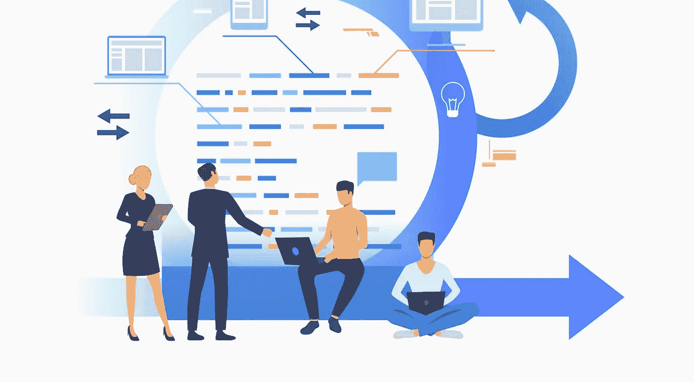
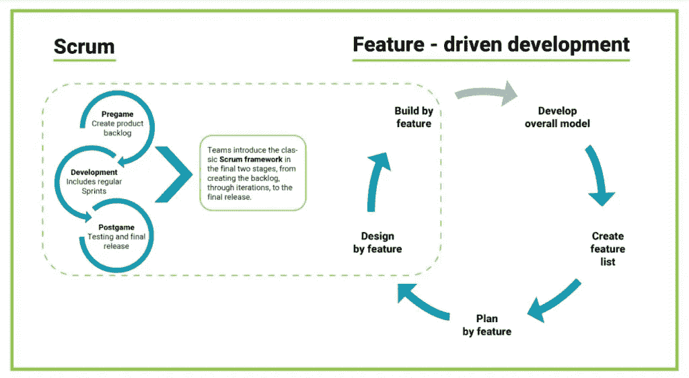

# 敏捷实践:让小团队产生大影响

> 原文：<https://medium.com/globant/on-the-ground-with-agile-enabling-small-teams-to-have-a-big-impact-5b891548a915?source=collection_archive---------2----------------------->

敏捷是一种"*"的心态，有五个关键方面:*

*   *在每次冲刺/迭代中向客户交付价值的心态。*
*   *虔诚地接受日常工作习惯改变的心态。*
*   *对利益相关者透明的心态。*
*   *作为一个团队找出改进方法的心态。*
*   *作为一个有凝聚力的单位为实现共同目标而工作的心态。*

*为了更好地理解“*小团队，大影响*”这句话，让我们考虑一个每次都必须准确无误的团队:军方。他们在小团队中执行操作，每个团队成员都有明确的角色和职责。如果团队中的任何人说，“我不会保护/支持另一个团队成员，因为我只被赋予了一个特定的职责”，整个团队都会失败。这不仅会影响任务，还可能影响团队成员的生活。*

*将此类比于软件开发，尽管我们不像我们的军队那样面临相同的威胁，但我们可能会从团队成员那里听到他们的责任只是编码或测试。这种态度增加了失败的机会，导致团队失败，并由此产生溢出效应和错过承诺。因此，组织需要开发具有敏捷思维的[跨职能团队](https://www.globant.com/our-services/agile-pods)，以获得更多成功，减少失败。他们可以通过确保每个团队成员在计划和执行期间相互支持来做到这一点，同时还可以监控和控制可能影响交付成果的偏差。*

*敏捷通过提供不同的方法和技术来帮助我们做到这一点，这些方法和技术帮助我们作为一个团队一起工作，并增量地交付产品。在本文的其余部分，我将介绍敏捷所规定的一些框架和方法，并提出一种方法来帮助我们在敏捷指导方针内创建自己的框架。从产品开发的角度来看，敏捷推荐*特性驱动开发(FDD)* 。特性驱动开发被定义为“适合长期复杂项目的实用敏捷方法”。对于寻求简单但结构化的敏捷方法的开发团队来说，这是一个合适的选择，这种方法是可伸缩的，并交付可预测的结果”。*

*FDD 遵循一个 5 步流程，该流程指导企业和团队创建强大的产品储备，为客户提供价值。*

**

# *1.开发一个整体的敏捷模型*

*在第一阶段，团队一起开发详细的领域模型，其中应该包括工件和研究的细节。这些细节将被合并成一个整体模型，作为系统的粗略轮廓。由于产品开发是增量式的，团队随着时间的推移不断学习，增加细节。为了将整个领域模型转化为软件开发生命周期，团队应该在“epics”下分离细节，epics 是一个在像吉拉和 VSTS 这样支持敏捷开发的工具中使用的术语。*

# *2.构建功能列表*

*使用第一步中收集的信息，业务团队确定将成为产品 backlog 一部分的特性列表。产品负责人在这里扮演着重要的角色，因为他们与业务部门的人一起工作，以确保每个利益相关者都在同一页上，并且所有的需求都被捕获。值得注意的是，特性列表可能很长——它可以捕获团队已经研究过的最小的细节，并且可能有助于计划发布。团队将这些特性归类到 epics 下，epics 带有特性标签/标记，这些标签/标记是在工具下创建的，然后用于软件开发。*

# *3.按功能规划*

*第三步定义了团队构建产品的方式。它转化为增量发布和将产品推向市场的时间表。这里有几个步骤:*

1.  *创建功能列表后，产品负责人要确保根据投资回报对功能进行优先排序。这是投资每项功能将获得的*值*。*
2.  *像 MoSCoW、Kano 这样的技术和像停车场图这样的人工制品帮助业务团队和产品所有者提出最小可销售特性(MMF)和最小可行产品(MVP)。*
3.  *一旦特性最终确定，它们将被放在不同的版本中。根据产品所有者和业务涉众给出的优先级，这些发布被贴上标签。*
4.  *随着团队参与在 FDD 的前三个步骤中的增加，特性被分解成多个用户故事。团队、产品负责人和所有必要的利益相关者在不同技术的帮助下，如斐波那契数列和 t 恤尺寸估计，这些故事的尺寸相对较大。这个练习提供了即将发布的版本的暂定大小。*
5.  *这有助于产品负责人在团队先前速度的帮助下，*如果已知，*或者在容量规划的帮助下提出发布结束日期(预测的/乐观的/悲观的)。*

*遵循这三个步骤，当开发团队准备好开始处理产品 backlog 时，我们可以继续介绍一个目前在软件开发中常用的框架: *Scrum。*Scrum 框架吸收了 FDD 剩下的 2 个步骤: ***按特性设计*** 和***按特性构建*** ，作为迭代开发的一部分来获得产品增量并发布到市场。*

*Scrum 分为 3 个步骤，如上图所示。*

# *1.赛前阶段*

*这个阶段主要与产品 backlog 相关，它来源于 FDD 的前 3 个步骤，并确保 backlog 总是被刷新和更新。团队在产品 backlog 梳理会议的帮助下完成这项工作，这些会议必须在每个 sprint 中至少计划一次(一个持续一到四周的迭代，通常是两周)。在我们开始任何 sprint 之前的计划会议期间，更新的产品 backlog 有助于为每个 sprint 计划和导出 sprint backlog。*

*在 sprint 规划会议期间，团队坐在一起完成 sprint backlog，它可以基于以前的速度或容量规划，帮助每个团队在即将到来的 sprint 中承担工作。一旦 sprint backlog 完成，团队就进入开发阶段，交付提交的 sprint backlog 项目。*

# *2.发展阶段*

*在开发阶段，团队处理计划好的用户故事/bug，并确保提交的每张票都在 sprint 期间的 QA 验证和签署后关闭。有几个关键步骤需要记住:*

*1.该团队每天开会 15 分钟，这被称为每日站立，为每个团队成员提供门票上的当前状态。每个团队成员回答 3 个简单的问题。*

*   *我昨天做了什么？*
*   *我今天计划做什么？*
*   *任何阻碍。*

*2.这里用来在 sprint 周期中跟踪进度的工件是带有所需泳道的 sprint 板(应该根据项目需要定制)和 burndown/burnup 图表，这些图表显示了迄今为止的 sprint 进度和剩余工作量。*

# *3.赛后阶段*

*在这一阶段，团队的重点是测试签收。团队接受 sprint 演示，并向项目涉众展示最近的工作。Sprint 回顾允许团队反思进展顺利的事情以及在下一次 sprint 中可以改进的事情。这有助于团队建立更多的信心。*

# *结论:用敏捷交付高质量的产品*

*软件开发团队可以用多种方式接近产品开发生命周期。这些年来，我在这里概述和详述的内容帮助我和我的同事交付了高质量的产品。这种方法帮助我们在地面上与团队一起工作，并指导他们成为每个组织都努力争取的敏捷团队。*