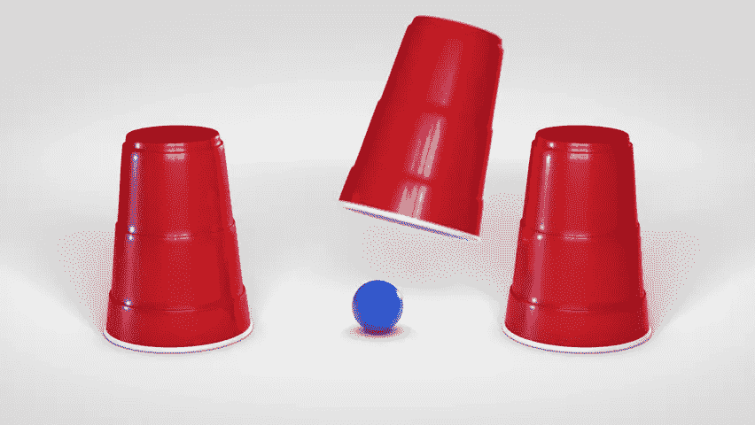

# 论复杂性守恒定律

> 原文：<https://medium.com/capital-one-tech/on-the-law-of-conservation-of-complexity-e757c33d2775?source=collection_archive---------5----------------------->

## 在软件中，复杂性从未被破坏，只是隐藏在抽象背后

Three red cups and a blue ball — a simple “shell game”

[维基百科](https://en.wikipedia.org/wiki/Law_of_conservation_of_complexity)对 ***复杂性守恒定律*** 有一个定义，因为它与人机交互有关，即每个应用程序都有一个固有的复杂性，不能被删除或隐藏，只能在产品开发或用户交互中处理。

*固有*的区别很重要。对于任何特定的架构设计，都存在相应的复杂程度。你可以*设计*一个新的架构，这将改变复杂性；但是在您的固定解决方案中，存在固有的复杂性，即*无法移除*。

维基百科的定义还指出，复杂性是无法隐藏的。虽然我看到了这部分定义的来源，但我认为法律的这一方面更加微妙。在我的职业生涯中，我学到了一个有价值的教训，这就是:*旁观者清*。

一个系统对一个人来说非常复杂，而对另一个人来说却微不足道。这种感知复杂性的差异源于无数的来源，包括参与交互的人的不同技能和经验水平以及该人可见的系统子集。如果你只是看到冰山一角，感知的复杂性可能非常小。如果你是一个专家，并且几十年来一直在处理特定类别的复杂性，那么你对琐碎的理解和其他人是不一样的。

Behind which door is the complexity hiding?

在这篇博文中，我想解决感知复杂性的概念，因为它与复杂性守恒定律有关，特别是对于开发人员的交互。

首先，让我们看看开发人员和运营人员经常处理的一些特定的人机交互模式:

*   使用库中的 API
*   与其他人的服务通信
*   安装、配置和维护(分布式系统)产品
*   对上述任何或所有问题进行故障排除
*   教其他人如何做上述任何或所有事情

最后两个要点是最重要的，但在我们的行业中，却是最容易被忽视的人际交往。

当我们创建一个 API 时，我们定义了人机交互的本质。人类——有情感、时间限制和容忍度的人——将会使用这个 API。如前所述，如果我们构建的系统非常复杂，我们仍然可以将大部分复杂性隐藏在我们的 API 后面。

我们经常最终构建类似于暴露一千个杠杆、开关和旋钮的 API，而不是“往那边走”、“加速”或“减速”的交互。我们很容易就把自己的复杂性负担推到墙外，强加给毫无防备的受害者(开发人员)，而不是额外保护他们。

What happens when you stop hiding complexity and peer behind the doors?

我们有机会创造人机交互的下一种方式是通过我们制造的产品。我将在这里用 [**Knative**](https://cloud.google.com/knative/) 来说明，因为我喜欢它，我认为它有巨大的潜力:但它也有一个由使用它的开发人员承担的巨大的认知负担。

Knative 项目在 Kubernetes 的基础上构建了一个层，提供事件源、事件通道、订阅、事件处理程序(服务)和路由之间的松散耦合。假设是，这种分离使 Kubernetes 能够将您的工作负载扩展到零，并按需提供，这将提高开发人员的工作效率，并有可能产生更具成本效益的架构。

Knative 的文档编写方式与喷气发动机维护手册的编写方式相同，都是为专家编写的。它假定了一定的先决条件的知识水平和对隐含语境的高度容忍。这里的复杂性暴露无遗，没有被隐藏或移动。

我不会详细说明完全理解 Knative 的所有活动部件对其特性的贡献需要什么，但应该提到的是，作为一名经过认证的 Kubernetes 管理员和以构建容器化工作负载为生的人，我仍然对这一切感到震惊。

为 knative 的*服务安装、配置、故障排除和开发应用程序降低*开发的复杂性通常会*增加*那些可能还不是 Knative 的目标专家的人的 it。

意识到原始 Knative 可能不是更多服务和功能开发人员的理想目标，Google 创建了 [***云运行***](https://cloud.google.com/run/) ，这是 Knative 之上的一个抽象层*，它提供了一种非常简单直接的方式来与底层 Knative 和 Kubernetes 基础设施进行交互。谷歌认识到了这种需求，并对其目标受众隐藏了这种复杂性。*

*A door forward*

并非所有的复杂性都需要隐藏。有些会随着时间而改变。久而久之，一些类型的复杂性缓解工具变得更加坚固和普遍。就像建立一个 4 层的俄罗斯方块堆栈一样，这种复杂性可能会崩溃为一个更易于管理的基础。集装箱化是这种现象的一个很好的例子。它最初是一个最终目标，现在它“仅仅”是一个用于组装更高级系统的构建块——它的复杂性已经被时间、曝光、文档和社区拥抱所处理，但还没有消除。

我想给你以下建议:接受这样一个观念，即我们建造的每样东西都有内在的复杂性。这让您可以花更多的时间来考虑有多少复杂性应该对您的用户可见，无论他们是安装您的软件、使用您的 API 和服务，还是开发在您的产品上运行的软件。

尽管我们有技术倾向，但我们对认知负担和导致摩擦的复杂性的容忍能力都是有限的。让我们试着帮社区一个忙，承认房间里巨大的复杂性，然后把它塞到属于它的壁橱里。

披露声明:2019 首创一。观点是作者个人的观点。除非本帖中另有说明，否则 Capital One 不隶属于所提及的任何公司，也不被这些公司认可。使用或展示的所有商标和其他知识产权是其各自所有者的财产。