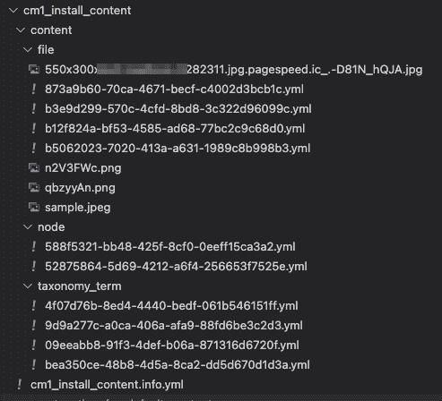
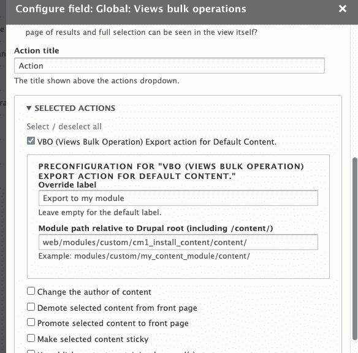
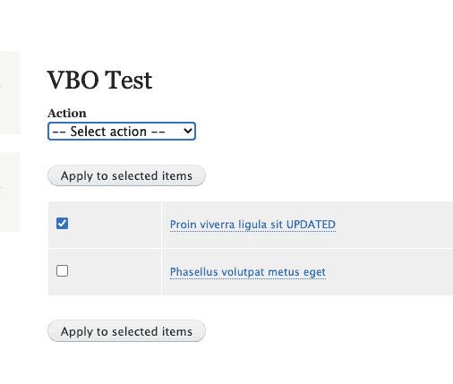
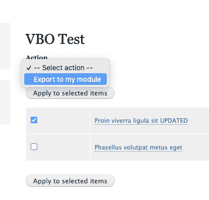

# Drupal 9 网站的一键式内容导出、暂存和部署策略(带有内容的版本控制！)

> 原文：<https://medium.com/globant/one-click-content-export-staging-and-deployment-strategy-for-drupal-9-websites-with-version-c-c2adc43dd4a4?source=collection_archive---------1----------------------->

Drupal 提供了一种通过代码管理配置的好方法。这样，您的配置是受版本控制的。然而，Drupal 中的内容却不是这样(至少，开箱即用)。

内容直接保存在 Drupal 的数据库中。这意味着，当您想用 Drupal 预览您的开发或登台环境时，您需要从您的生产环境中提取一个数据库副本，并将其加载到您的开发或登台环境中。

因此，内容不受版本控制。在将内容发布到生产环境之前，在较低的环境中预览内容是一项挑战。(您仍然可以在生产环境中将内容置于草稿状态，并在不发布的情况下进行预览。然而，由于多种原因，许多网站选择在将内容发送到生产环境之前(即使在未发布的状态下)，首先将内容放在暂存环境中。

促使一些网站先将内容放在较低的环境中，然后再将其投入生产的原因如下:

**在草稿模式下预览内容并不总是等同于“预览”已发布的内容。**

由于草稿内容只能作为具有所需权限的经过身份验证的用户进行预览，因此它可能不会与发布后作为匿名用户查看时的样子完全相同。这是因为，作为一个登录用户，您经常会在 Drupal 页面上有块、工具栏之类的管理工具，并且屏幕空间可能与发布时不一样。

Workspaces 是 Drupal 9 中的一个实验性核心模块，它可能会解决一些问题。

**意外出版的风险**

一些网站不希望在生产环境中有内容，即使是未发布的内容。当偶然出版的成本非常高时，尤其如此。(例如:在预定发布时间前几秒发布上市公司的季度业绩，可能等同于内幕交易！)

**复习容易**

当来自多个部门的许多涉众参与审查过程时，将草稿内容放在只能通过公司的 VPN 访问的 URL/域上更容易，而不需要所有涉众使用他们的 Drupal 凭证登录。

**还有更多..**

我们并没有深入探究为什么许多网站希望在将内容部署到生产环境之前，先在较低的环境中部署内容。但以上几个原因给你一个为什么的要领。

现在，出于上述原因之一，或者出于不同的原因，您选择了一个内容部署策略，该策略要求首先在较低的(开发或登台)环境中发布内容。这就给如何将这些内容从较低的环境部署到生产环境带来了挑战。

您不能将较低环境的数据库移至生产环境，因为这将覆盖生产环境中最近用户生成的任何内容。此外，在较低的环境中，您可能不希望将测试内容转移到生产环境中。

这就是内容分级需求的来源。

Drupal 没有通用的内容分段解决方案。下面，我们将涉及一些可用的选项。以及我对这些解决方案的想法，我们将详细讨论一个我们认为很有价值的解决方案。

下面是我们在研究一个项目时筛选的解决方案的一个小列表。所有可能解决方案的详细列表可在[此处](https://www.drupal.org/docs/comparison-of-contributed-modules/comparison-of-content-deployment-modules)获得。

**部署—内容暂存**

链接—【https://www.drupal.org/project/deploy 

这是我们寻找解决方案时出现的第一个问题。由于以下原因，我们没有进一步探讨本模块:

*   [Drupal 9 兼容性](https://www.drupal.org/project/deploy/issues/3221335)未解决。
*   过去两年没有发行。
*   内容不受版本控制。

**2。内容同步模块**
链接—[https://www.drupal.org/project/content_sync](https://www.drupal.org/project/content_sync)

这实际上可能是一个好的解决方案。和我们最后选的那个差不多。根据我对该模块的第一印象，我们没有进一步探讨这个问题

*   缺少最新版本和维护
*   每个项目页面似乎缺乏定义要选择的内容的能力。“仅选项”看起来要么是单个内容，要么是所有内容

**3。实体份额**

链接—[https://www.drupal.org/project/entity_share](https://www.drupal.org/project/entity_share)

这个模块看起来是真的！维护良好的项目页面和文档。最近的 8.x/9.x 版本。支持大多数[字段类型](https://www.drupal.org/docs/8/modules/entity-share/supported-field-types)。可能是适合大多数 Drupal 项目的解决方案。同样，我们跳过了它，因为我关注的标准之一是试图让内容也受到版本控制，而不仅仅是跨环境移动内容。另外，如果您对内容的版本控制不是很明确，这是一个很好的选择。

**4。其他选项**

其他几个引起我注意的选项包括 [CMS 内容同步](https://www.drupal.org/project/cms_content_sync)模块，需要付费的 SAAS 服务订阅、 [Acquia 内容中心](https://www.acquia.com/products/drupal-cloud/content-hub)(需要订阅)、[实体试点](https://www.drupal.org/project/entity_pilot)(需要订阅)。[内容同步器](https://www.drupal.org/project/content_synchronizer)是另一种选择。从文档来看，设置、导入和导出过程看起来相当复杂。此外，导出选项看起来仅限于 zip 文件，这可能对版本控制没有帮助。

**5。默认内容模块**

链接—[https://www.drupal.org/project/default_content](https://www.drupal.org/project/default_content)

这是我们碰巧为我们的实现选择的模块。该模块实际上旨在一次性推送可以打包到模块中的内容，以便在启用该模块时创建内容。在最新的稳定版本中，当您尝试重新启用模块以导入打包到模块中的更新内容时，模块会抛出异常。(因为具有相同 UUID 的内容在过去已经被导入)。

但是，该模块可以进一步调整，以便在以后的运行中更新现有内容。使用本期的[补丁#145。](https://www.drupal.org/project/default_content/issues/2698425#comment-14058752)

在具有大量不同类型字段的内容类型上测试了该模块，包括图像和文件附件、段落(嵌套，参考其他段落)，并且它无缝地处理了导入和导出。

# 工作流程

使用该模块的工作流程如下所示:

*   创建一个保存内容的自定义模块，并将其签入您的代码库。
*   内容可以在任何本地或云环境中更新
*   使用 drush 命令将内容打包到模块中。

> ***drush dcer 节点 2—folder = modules/custom/cm1 _ install _ content/content***
> 
> *2 是我们正在导出的节点的节点 id。
> path 表示模块的路径，直到里面的内容文件夹。*

*   这将在模块的文件夹中创建所需的 yml 文件。请注意，内容的文件夹应该准确地命名为“content ”,因为这是模块中的导入程序所期望的。
*   请注意，当只导出一个节点时，模块会捆绑该节点的所有依赖项，如术语、段落、引用的节点、文件附件等，

*   现在可以将该模块登记到您的存储库中。
*   在任何其他环境中，您可以执行 git pull，并使模块能够获取所有内容。
*   可以使用 Drush 命令在任何环境中更新和重新导出内容，以更新模块的 yml 文件。
*   在另一个需要导入更新内容的环境中，您可以启用该模块(如果是第一次)，或者运行下面的命令。

> ***drush dcim cm1 _ install _ content***

*   请注意，dcim 命令(以及更新现有内容的能力)不是稳定版本的一部分，您需要从问题分支@[https://git.drupalcode.org/issue/default_content-2698425](https://git.drupalcode.org/issue/default_content-2698425)派生模块，或者等待问题合并到模块的稳定版本中。

此解决方案检查我们在内容转移解决方案中寻找的所有盒子-

*   允许**将内容**从一个环境移动到另一个环境
*   允许内容的**版本控制**
*   支持**大多数(如果不是全部)字段类型**，包括开始的段落
*   支持**平移** ( [警告](https://www.drupal.org/project/default_content/issues/3176839))
*   支持**内容的更新**，而不仅仅是初始导入([工作正在进行中，将很快添加到稳定分支](https://www.drupal.org/project/default_content/issues/2698425))
*   递归选取所有需要的**依赖内容**

此外，按 node-id 逐个导出所有内容仍然是一项痛苦的任务。该模块允许在模块的 info 文件中定义一个 UUIDs 列表，因此它可以每次自动选择 id 并导出内容。但是，每次添加节点时都需要提交，这让我们不太舒服。

因此，我们构建了一个视图批量操作动作，允许您将导出按钮添加到任何 Drupal 视图，这样您就可以使用视图上的过滤器选择您想要的内容，并点击导出按钮。我们将此作为 contrib 模块发布给所有@[**https://www . Drupal . org/project/export _ action _ for _ default _ content**](https://www.drupal.org/project/export_action_for_default_content)**。**

配置视图:

显示自定义操作的视图:

# 更新了内容管理工作流程，只需点击一下即可导出内容

通过以上设置，工作流程现在变得简单如:

1.  使用视图创建/更新内容并将内容从任何环境导出到模块。
2.  将模块代码推送到回购
3.  一旦部署了代码，只需在环境上运行**drush dcim<content module name>**命令
4.  然后嘣！，你有你所有的内容！