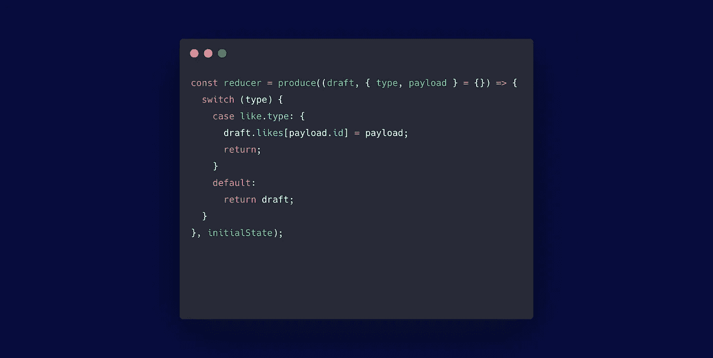

# 简化减速器功能的一个妙招

> 原文：<https://medium.com/javascript-scene/one-cool-trick-to-simplify-reducer-functions-bbbffe488bb6?source=collection_archive---------1----------------------->

如果你花时间去了解它，Redux 是一个令人惊奇的工具。Redux 的一个常见错误是，reducers 必须是纯函数。

纯函数是这样的函数:

1.  给定相同的参数，总是返回相同的结果，并且
2.  没有副作用(例如，它不会改变它的输入参数)。

问题是，有时候一个 reducer 需要对一些输入状态进行复杂的更改，但是你不能只是改变状态参数而不引起 bug。

解决方案是一个叫做 [Immer](https://github.com/immerjs/immer) 的便捷工具。在这个视频中，我将向您介绍 Immer，并向您展示如何使用它来降低 reducer 代码的复杂性。对于一个或两个小的 reducers，差别是非常微妙的，但是在一个大的项目中，它可以显著地简化您的应用程序代码。

这里有一个例子。假设您正在构建一个社交网络，您需要跟踪用户喜欢的帖子。当他们喜欢一个帖子时，您可以将一个 like 对象添加到用户的 likes 集合中。可能看起来像这样:

注意我们从`like.type`案例中返回的内容:使用 JavaScript object spread 语法将有效载荷的位混合到 state 对象的嵌套属性中:第 19–25 行的`...state`和`...state.likes`。

在 immer 之后，您可以将该部分简化为一行代码(第 21 行):

`produce`函数返回一个部分应用程序(一个已经部分应用到它的参数上的函数),然后它接受 reducer 函数的参数。您传递给它一个回调函数，它接受状态对象的一个`draft`,而不是真正的状态对象。您可以随意改变该对象，就好像它是 JavaScript 中任何其他可变对象一样。不再传播嵌套属性以避免改变输入参数。

在您的回调函数运行后，Immer 将草稿与原始状态进行比较，然后应用您的更改构建一个新对象，因此您的函数感觉像是在变异，但行为仍然像一个纯函数。你得到了两个世界的精华:突变的简单性和不变性的好处。

# 后续步骤

[EricElliottJS.com](https://ericelliottjs.com/)有关于纯函数、不变性、部分应用以及其他函数式和面向对象编程概念等主题的深入课程。

[订阅 YouTube](https://www.youtube.com/channel/UCAbA0FivNSBqTmyYrh6uymQ) 。

***埃里克·艾略特*** *是一位科技产品和平台顾问，《 [*【作曲软件】*](https://leanpub.com/composingsoftware)*[*【EricElliottJS.com】*](https://ericelliottjs.com)*[*devanywhere . io*](https://devanywhere.io)*的联合创始人，以及 dev 团队导师。他曾为 Adobe Systems、* ***、Zumba Fitness、*** ***【华尔街日报、*******【ESPN、*******【BBC】****等顶级录音艺人和包括* ***Usher、【Metallica】********

*他和世界上最美丽的女人享受着与世隔绝的生活方式。*