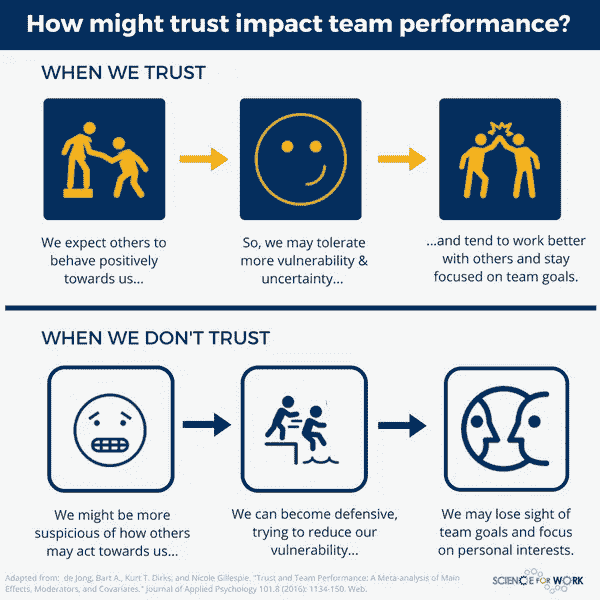
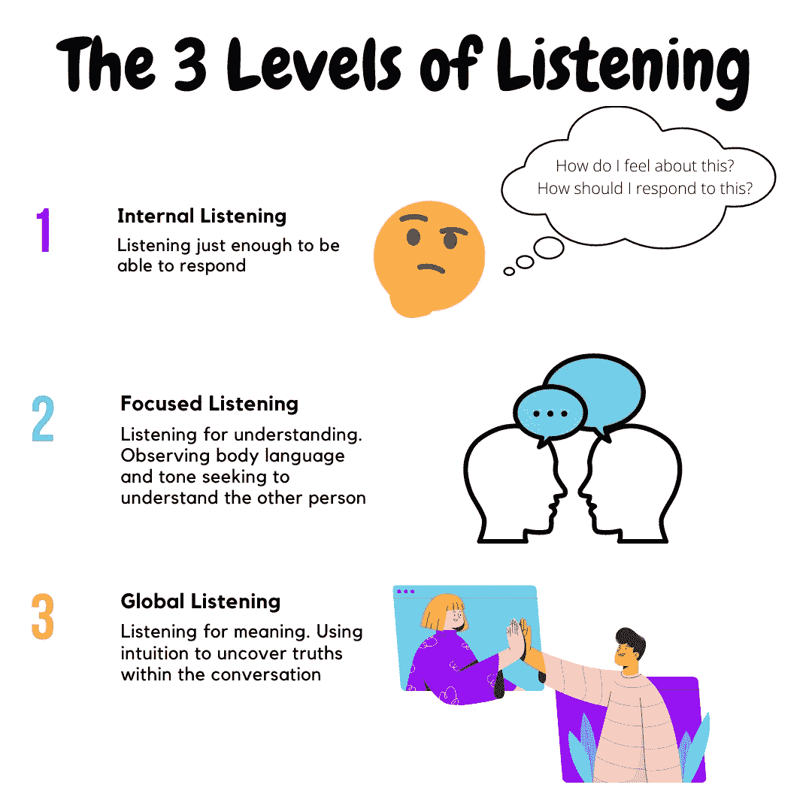

# 一对一会议是建立信任的驱动因素

> 原文：<https://medium.com/walmartglobaltech/one-on-one-meetings-as-drivers-for-building-trust-bbff8c77049c?source=collection_archive---------0----------------------->

Photo by [Thought Catalog](https://unsplash.com/@thoughtcatalog?utm_source=unsplash&utm_medium=referral&utm_content=creditCopyText) on [Unsplash](https://unsplash.com/s/photos/walking-meeting?utm_source=unsplash&utm_medium=referral&utm_content=creditCopyText)

作为一名工程经理，您的成功与团队中工程师的成功紧密相连。你工作的很大一部分是建立团队并最大化他们的成果和表现。你影响团队成功的能力与你能与团队成员建立的关系的质量和深度直接相关。通过这些关系，你和你的团队成员将能够变得脆弱并共同成长。然而，如果不首先建立信任，所有这些都是不可能的。

Infographic by [WENDY HIRSCH](https://scienceforwork.com/blog/author/wendyhirsch/) on [Science For Work](http://scienceforwork.com)

关于 [*“信任:它是否影响团队绩效……”*](https://scienceforwork.com/blog/trust-impact-team-performance/) 温迪·赫希指出信任的力量是团队绩效的预测因素。但是，我们如何构建它呢？建立相互信任并获得这些绩效收益的团队的关键因素是什么？好吧，你可能会惊讶地发现这一切都是从一对一的会面开始的。

一对一的会议是那些看起来简单易行的事情之一，但是很多人很难有效地进行。在这篇文章中，我将分享我认为一对一会谈应该是关于什么的，为了会谈成功需要牢记的注意事项，以及如何开始会谈的一些想法。

# 一对一有什么好的？

有两个主要原因可以解释你为什么想要定期进行一对一的会谈。首先，它帮助你与你的直接下属建立人际关系。请记住，我们的目标是建立信任，如果没有联系，就不可能有信任。这种联系和随之而来的个人关系是最神奇的地方。与其他以结果为导向的关系没有太大不同，例如心理治疗师和客户之间的关系，研究表明，关系越强，预期结果越有影响力和积极( [DeAngelis，2019](https://www.apa.org/monitor/2019/11/ce-corner-relationships) )。

定期举行一对一会议的第二个原因是，它为人们提供了一个定期的机会，让他们可以与经理私下谈论他们可能需要讨论的任何问题。在[“经理之路:引领技术领导者成长和变革的指南”](https://www.goodreads.com/book/show/33369254-the-manager-s-path)中，卡米尔·福涅尔强调了这种规律性的重要性。

# 好的。我喜欢一对一。现在怎么办？

既然我们一致认为一对一是重要的和必要的，那么让我们来谈谈围绕它们的一些基本规则，它们将帮助你最大限度地利用它们。

**什么时候开始？**

马上就去。尤其是如果你是人事经理。尽管现在开始还不算太晚，但是如果你现在没有做，也不用担心。尽快把它们放到日程表上！

**保密性**

没有誓言，没有客户提供者特权，没有法律或法规阻止你在一对一的会议中分享讨论的内容。也就是说，你应该对隐私保持敏感。毕竟，我们说的一对一会谈是:

> 人们与他们的经理私下谈论他们可能需要讨论的任何事情的常规机会

**所以**私下里**当你开始和其他人分享你在一对一的谈话中学到的东西的时候，这种感觉就基本消失了。一个对我有用的做法是请求允许分享。每当我听到一些事情，觉得与他人分享对我的直接下属很有价值时(例如，他们正在为孩子的教育问题而挣扎，需要找一所新学校，而我碰巧知道我的经理也经历过类似的事情，可能有有用的信息)，我会设置分享这些信息的背景，并请求他们同意这样做，或者鼓励他们联系我认为可以直接帮助他们的人。不过，作为一条通用规则，我建议你运用良好的判断力，保持那些应该是私人的、私密的对话。**

**谁设定议程？**

**这可能会引起争议。一些经理会告诉你，一对一是他们从团队成员那里获得状态报告、给他们反馈或要求他们做其他工作的机会。我喜欢从不同的角度来看待这个问题。我认为一对一的会议应该是针对直接下属的，因此，他们的议程应该由直接下属决定。许多工程过程框架提供了机会，经理可以利用这些机会来获得正在发生的工作的更新，而不需要使用一对一的时间。一个这样的机会可能是一个 scrum 或站立会议，为你想得到状态的项目。当不存在这样的过程时，一封简单的电子邮件或聊天信息就能让你得到你想要的信息。**

****调度礼仪****

**人类天生渴望可预测性。面对不确定性，我们会感到压力，而我们的日常生活中有很多不确定性。让我们不要让一对一的时间安排成为问题的一部分。找一个对你们双方都合适的时间，并坚持下去。我所说的*“坚持下去”*的意思是，尽你最大的努力把它保持在约定的时间内，永远准时，永远不要取消。**

**很容易想到“我还有很多其他的事情要做。也许我可以在本周摆脱这种一对一的会议，这样我就可以在任务 x、y 或 z 上取得进展。请记住，你的主要工作是确保你的团队和团队成员发挥出最大潜力，每天都在成长。您的一对一会议是完成这一任务的重要工具。假设你每周进行一次，那么每个季度只有 12 次。当你把病假和 PTO 计算在内时，这个数字可能会减少到个位数，因此取消一天的病假也会让你处于不利地位。**

# **那我们该谈些什么呢？**

**现在我们准备讨论会议从内部看起来是什么样子。应该聊些什么？你应该怎么做呢？以下是我们目前已经确定的内容:**

*   **我们希望建立信任，加强关系。**
*   **议程由直接下属推动。**
*   **这不是状况报告。**
*   **谈话是私人的。**

**考虑到这些，我对这些会议有一些想法:**

****话题****

**鼓励并授权您的直接下属提出话题并提前与您分享，以便您有所准备。一旦你开始做这件事，我保证你不太可能会无话可说。当你的直接下属没有他们想要讨论的东西时，你可以回顾一下目标(个人或职业)，做一个价值观定义练习，或者校准他们的成功是什么样子的。这些只是想法，请尽情发挥你的想象力。**

****要反馈还是不要反馈？****

**反馈是你能给任何人的最好礼物之一，尤其是你领导下的人。我绝对会利用一对一的时间来分享我的任何反馈(无论是形成性的还是表扬的)。也就是说，反馈就像鱼，吃新鲜的，否则会变坏。当你等待太久才提供反馈时，你就有失去情境背景的风险，使反馈变得不那么有效，或者在某些情况下适得其反。无论何时你有反馈要提供，都要及时提供，不要等到下一次一对一的会议。**

# **我的直接下属正在说话。我现在该怎么办？**

**嗯，没什么。只是在场并聆听。如果你记得关于这篇文章的任何事情，就让它是这样的。我们倾向于解决问题，偏向于行动。当你将其转化为与直接下属的对话时，它很容易变成，最好的情况是给出建议，或者更糟的情况是告诉他们该如何度过他们与你谈论的局面。但那不是你的工作。当你解决人们的问题时，他们没有自己解决问题时成长得多。作为经理，你的工作就是授权你团队中的人去做这件事。当你不这样做，而是为他们做的时候，你会产生其他问题，比如过度依赖，(你的)倦怠，或者与重要的工作脱节。在 [*《教练习惯:少说多问&永远改变你的领导方式】*](https://www.goodreads.com/book/show/29342515-the-coaching-habit) 迈克尔·班盖·斯坦尼尔将这些*称为“困扰我们职场的三大恶性循环”*并不无道理。相反，试着多听多问。**

****听力****

**你有没有在和别人谈话时感觉他们没有在听你说话？这是一个相当普遍的情况，因为人们甚至我们自己只参与了听力三个层次中的第一个。这些是:**

*   ****第一层次:内部倾听。我们专注于自己，我们的想法和感受。****
*   ****第二层次:专注倾听。我们专注于说话者，注意他们的话语、语气和肢体语言。****
*   ****第三级:全局倾听。我们把注意力集中在说话者身上，注意他说了什么，没说什么。****

****

**Levels of Listening Infographic by [Jose Arzuaga](/@josarzuaga)**

**成为第 2 级和第 3 级倾听者需要用心和练习，掌握这些将使你更好地理解你的直接下属的需求和愿望。现在，你在关注和倾听他们所说的话，并不意味着你真正理解了你的直接下属想要传达的信息，也不意味着他们试图传达的语气或感受。有无数的原因可以解释为什么有些东西会在翻译中丢失。但是，您可以使用一些技术来解决这种情况。其中一个技巧就是练习反思性倾听。反思性倾听包括听到和理解他人通过言语或肢体语言交流的内容，然后将这些反映回来。通过反思性倾听，你可以确保你对信息的理解是准确的。这种技巧还有一个额外的好处，那就是向说话者传递一个强有力的信息，告诉他“我在听你说话。我明白你在说什么。我在乎”。**

****问更多问题****

**多问几个问题就行了。听起来很简单，对吗？如果你知道该问什么的话，它可能是。当你想在一对一的会议中创造反思或深刻见解的时刻时，你可以转向有力的问题。强有力的问题是你可以提出来加深对话、引出新见解的问题。它们可以帮助消除精神障碍，鼓励人们尝试新的解决问题的技巧。众所周知，这类问题有助于人们从新的角度看待事物，消除困惑，并为人们解决自己的问题提供机会。强有力的问题具有开放性、中立性(不提供建议)、简单、简短和出乎意料的特点。**

**我想问的最有力的问题之一是“你在这里面临的真正挑战是什么？”。这个问题邀请人们关注并重新评估他们对问题是什么的假设，通常会引导他们发现他们应该解决的真正问题。**

**网上有大量的资源，可以为任何可以想象的情况提供强有力的问题。我最喜欢的一个是 Slack 的工程副总裁 [Rukmini Reddy 的一对一会议框架](https://www.linkedin.com/pulse/steal-my-proven-tested-framework-11-meetings-rukmini-reddy/)，它概述了不同类型互动的问题(例如，第一次对话、跟进等)。).**

# **结论**

**我一直记着[西蒙·西内克](http://www.simonsinek.com)的一句话。*“团队不是一群一起工作的人。团队是一群互相信任的人。”*这句话强调了与团队成员建立信任的重要性，与他们进行一对一的会谈是最好的方式之一。**

> ****“团队不是一群一起工作的人。团队是一群互相信任的人。”****
> 
> *****—西蒙·西内克*****

**我写这篇文章的目的是向你介绍我喜欢的那种一对一的方式，包括与我的直接下属和我的经理。你的风格可能看起来有点(或很多)不同，这没关系。我想让所有阅读这篇文章的人都明白的最重要的一点是，人与人之间的联系是有力量的，而相互交流是建立这种联系的好方法。我很想知道你还用什么方法与你的团队建立信任和联系。请在评论中告诉我，或者分享你对这篇文章的任何反馈或反应。**