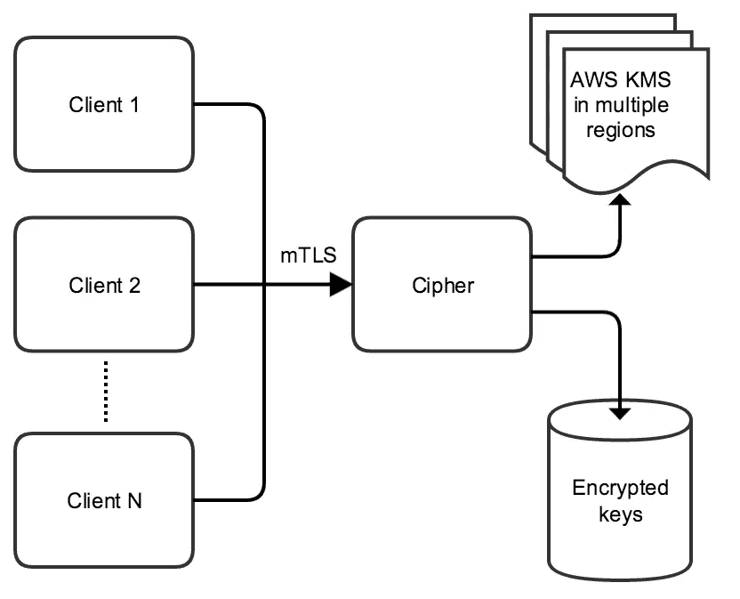

# 数据保护向前迈进了一步

> 原文：<https://medium.com/airbnb-engineering/one-step-forward-in-data-protection-8071e2258d16?source=collection_archive---------0----------------------->

由[莫砺锋演唱](https://www.linkedin.com/in/lifengsang)

加密敏感数据是一项重要的安全措施，有助于保护我们用户的数据，这给密钥存储和管理带来了独特的技术挑战。我们建立了一个名为 Cipher 的加密服务来解决这些技术挑战，并使 Airbnb 的工程师能够在我们的基础设施中轻松、一致地加密数据。我们使用 Cipher 的目标是为任何有加密需求的服务提供一个易于使用的、与语言无关的接口。

Cipher 抽象了加密带来的所有复杂性，如算法、密钥引导、密钥分发和轮换、访问控制、监控等。服务所有者可以专注于他们的服务，并依靠 Cipher 来处理加密。Cipher 只负责计算，不负责密文的存储。Cipher 中使用的加密密钥从不离开服务，这与许多其他加密解决方案(例如，直接使用本地加密库)有着根本的不同，在其他加密解决方案中，密钥材料通常与敏感数据共存。

设计安全的加密服务需要做出许多技术决策。在构建 Cipher 的过程中，我们做出了几个重要的设计选择，这些选择可能有利于其他希望构建类似东西的人。我们将在下面详细介绍这些内容:

*   计算和存储之间的分割
*   授权模型
*   加密密钥存储
*   监控和审计对加密数据的访问

# 1.密码拥有计算能力

将计算从存储中分离出来有几个好处。(1) *简单性*:密码服务可以优化以提供高可用性和低延迟，而无需额外跳至存储层来读写加密数据。因此，额外的复杂性和维护需求不会被引入到密码服务中。密码是为了做一件事而设计的，而且做得真的很好；(2) *安全风险更低:*由于 Cipher 没有自带存储，获取和解密大量数据变得更加困难。为了解密数据，攻击者必须同时损害拥有数据的服务和密码服务；(3) *灵活性*:将存储决策留给拥有数据的团队，确保数据处理能够个性化。加密数据和其他业务数据归不同的服务所有。有些业务数据有不同的保留策略，有些对事务完整性有很强的要求，等等。

# 2.Cipher 在最新的 TLS 1.2 上构建授权模型

Cipher 只向授权的客户端授予访问权限，因此它需要对每个客户端的每个请求进行身份验证。Cipher 利用使用 x509 证书的 [mutual TLS](https://en.wikipedia.org/wiki/Mutual_authentication) ,因为(1)它提供了传输安全性，因此数据是通过网络加密的；(2)它允许我们通过客户端证书来识别呼叫者是谁；(3) TLS 在业界被广泛采用，有很多 HTTP 客户端支持，使得集成、测试和维护更加容易；(4) TLS 在可靠性和延迟方面表现相当好。

我们在 Cipher over TLS 中构建了一个定制的授权模型，以强制授权哪个客户端对哪个数据执行哪个操作。所有被加密的数据都被归类为资源，例如“RESOURCE_FOO”、“RESOURCE_BAR”等。Cipher 对不同的资源应用不同的加密密钥，每个密钥定期轮换。当客户端想要加密新类型的数据时，它会使用适当的访问策略在密码中预注册一个新资源。资源名称与加密和解密 API 调用中的数据一起提供，因此 Cipher 知道使用哪些密钥，以及客户端是否被授权执行所请求的操作。授权模型遵循“不多不少”的原则，即访问权限仅由规范授予。例如，您可以将资源配置为仅由客户端“foo”加密，但解密只能在客户端“bar”上进行，使用以下 Cipher 中的代码片段:

```
{
*//…*
add(RESOURCE_FOO).allow(ENCRYPT).by(CLIENT_FOO);
add(RESOURCE_FOO).allow(DECRYPT).by(CLIENT_BAR);
*//…*
}
```

# 3.主密钥使用 [AWS KMS](https://aws.amazon.com/kms/) 加密

Airbnb 在亚马逊网络服务(AWS)上运行大部分服务，因此我们非常适合利用亚马逊的密钥管理服务(KMS)，而不是使用定制的[硬件安全模块](https://en.wikipedia.org/wiki/Hardware_security_module) (HSM)。如本[文档](https://aws.amazon.com/kms/)所述，AWS KMS 使用[硬件安全模块](https://en.wikipedia.org/wiki/Hardware_security_module) (HSMs)来保护密钥的安全性。在提供新资源时，Cipher 会创建一个随机密码，并以自动方式定期更新和循环。这些秘密用于加密和解密客户端资源，它们永远不会离开密码。这些秘密由版本化的主密钥加密，并存储在数据库中以便持久保存。为了可用性和灾难恢复，我们在多个区域使用 AWS KMS 加密主密钥，而不是依赖一些安全硬件来保护主密钥。自动气象站 KMS 使我们的系统更加简单，更易于操作和维护。

# 4.Cipher 提供集中监控、警报和审计

所有的加密和解密操作都要通过密码。因此，很容易锁定以最大限度地降低暴露风险。由于 Cipher 处理所有的加密和解密请求，我们可以轻松地审计密钥的使用情况，并记录每个被访问资源的用户/内容/位置/时间/原因。

# 架构概述

Cipher 的架构非常简单，如下图所示。Cipher 通过从专用数据库读取加密副本来引导资源加密密钥。然后，它使用 AWS 的 KMS 解密这些密钥，并将它们存储在易失性存储器中。



正如您在上面看到的，Cipher 通过 mutual TLS 接收来自不同客户端的流量，为每个单独的调用从客户端证书中提取身份，检查授权模型，并且仅当客户端被允许执行所请求的操作时才继续。

如前所述，Cipher 通过为 Airbnb 支持的语言提供简化的客户端库，隐藏了计算、访问控制、引导、算法/密钥演变和秘密轮换方面的所有复杂性。

# 结论

高效加密数据带来了独特的技术挑战。但是投资加密可以帮助抵御试图泄露大量用户数据的攻击者。Cipher 试图让 Airbnb 的所有工程团队都能普遍使用强化加密，以便我们可以更轻松地保护我们的敏感数据。

## 在 [airbnb.io](http://airbnb.io) 查看我们所有的开源项目，并在 Twitter 上关注我们:[@ Airbnb eng](https://twitter.com/AirbnbEng)+[@ Airbnb data](https://twitter.com/AirbnbData)