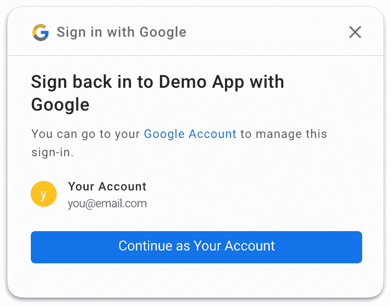

# 一键登录 Android 应用

> 原文：<https://medium.com/androiddevelopers/one-tap-sign-in-for-android-apps-2259ce15bc2c?source=collection_archive---------0----------------------->


新的[一键式登录和 Android 上的注册](https://developers.google.com/identity/one-tap/android/overview)帮助您优化应用程序中的用户认证流程。对于许多 Android 应用程序来说，用户帐户是转换漏斗的重要组成部分，也是用户流失的常见来源。用户(和开发人员一样！)经常忘记他们使用哪个帐户登录，或者他们使用什么密码来使用您的服务。通过优化流程，你可以提高转化率，减少掉线。


Showing One Tap for assisted sign in and sign up on Android

一次点击创建辅助登录和注册用户界面，这将增加您的现有流程与弹出窗口，让您的用户顺利认证。它不会取代您现有的登录或注册流程，但可以帮助您优化选择使用 One Tap overlay 的用户体验。

> 一次点击增加您现有的登录或注册流程

**一键支持**

*   **使用他们的 Google 帐户或保存的密码登录您服务的现有帐户**
*   **使用他们的谷歌账户注册一个新账户**

它配有`com.google.android.gms:play-services-auth`版本`18.0.0`。

## 一键和谷歌身份服务

One Tap 是目前正在开发的名为谷歌身份服务的新库套件的一部分。谷歌身份服务最终将整合[智能密码锁](https://developers.google.com/identity/smartlock-passwords/android)和[谷歌登录库](https://developers.google.com/identity/sign-in/android/start-integrating)的全部功能，并引入新功能。Google 登录库允许你使用 Google 帐户登录(就像一次点击一样),并提供额外的功能，如 Google 登录按钮和请求额外权限的能力。然而，这是一项正在进行的工作，第一个版本还没有实现这些库的全部特性。

> 谷歌身份服务最终将为安卓开发者统一谷歌登录和智能密码锁

One Tap 是我们即将推出的谷歌身份服务的第一个功能，现在已经可以在应用程序中使用，以优化登录和注册流程。我们将致力于增加谷歌登录和密码库智能锁提供的其他功能。这些功能包括保存密码、使用 Google 登录按钮登录、请求访问用户数据(如驱动器内容)的权限、使用 Google 登录执行自动和静默登录、保存 idp 凭据以及为自动填充流程查找电话号码。我们希望在今年晚些时候在谷歌身份服务中推出这些功能。

与现有的谷歌登录和智能密码锁用户界面相比，我们发现用户更有可能通过 One Tap 用户界面成功登录。此外，他们在重新登录时更有可能选择正确的帐户，这有助于他们进入你的应用程序，避免创建重复的帐户，并减少支持请求。之前发布的这个 UI 的[网页版已经让一些网站的转化率提高了 2 倍。](https://developers.google.com/identity/one-tap/web)

**对于现有的应用**，我们的建议是在对你的应用和团队有意义的时候，评估增加一个点击来增强你现有的登录和注册流程(你不需要马上这么做)。

需要谷歌登录或智能密码锁功能的应用程序目前还不可用，现在可以使用这两个库在现有流程的基础上添加一个 Tap，或者等待今年晚些时候添加支持。

**对于新应用**，我们建议使用一次点击来创建优化的登录和注册体验。

> *一键点击并不能取代* [*谷歌登录*](https://developers.google.com/identity/sign-in/android/start-integrating) *按钮，而是增加了你的应用程序现有的登录和注册流程。除了现有的按钮之外，你可以在一个有 Google 登录按钮的应用程序中点击一下来创建一个辅助登录或注册流程。*

# 一键辅助登录



一次点击辅助登录向用户显示一个覆盖图，提示他们使用之前授权的帐户重新登录。用户必须之前已经登录，才能显示为“登录”选项。

***警告:*** *当用户没有以前授权的帐户时，您必须实现一键注册。如果你只实现登录，你不会向以前没有使用过你的应用或服务的用户显示覆盖图。*

一次点击登录由您的代码触发。根据您的应用程序，这可能会在应用程序首次启动时触发，或者在用户尝试执行受保护的操作时触发。

一旦你决定开始登录过程，你可以通过调用`SignInClient`上的`beginSignIn`来查询是否有账户可以登录。对于登录流程，重要的是您要配置使用`setFilterByAuthorizedAccounts(true)`登录，以便只返回之前授权(或登录)的账户。您可以在[文档](https://developers.google.com/identity/one-tap/android/get-saved-credentials)中了解更多信息。

来自`beginSignIn`的回调将通过一个`PendingIntent`，当启动时显示覆盖图。然后用提供的 PendingIntent 调用`startIntentSenderForResult`，在当前活动的上显示模态登录弹出窗口*。*


*Use the PendingIntent provided by the* `*SignInClient*` *to overlay the current* `*Activity*` *with a One Tap login dialog.*

> 一次点击可以覆盖应用程序中的任何活动

单击对话框可以显示在应用程序的任何地方。因此，您可以让用户在要求他们登录之前开始使用您的应用程序。这允许您为应用程序构建优化的登录流。无论你在哪里调用`startIntentSenderForResult`，一个轻击将覆盖在那个`Activity`的顶部。


The result of the prompt is returned using onActivityResult

然后，用户只需点击一下就可以登录，或者取消提示。无论哪种方式，结果都发送到`onActivityResult`。您使用同一个客户机来解析结果，并获得一个联合登录(Google Sign-In)或一个密码。然后像平常一样继续登录你的后端。

# 只需轻轻一点，就能注册


如果一次点击找不到任何用于登录的授权帐户，`beginSignIn`将调用失败监听器，而不是向您的应用程序传递一个`PendingIntent`。当这种情况发生时，你应该重复查询，但这一次寻找可以用来注册的帐户。

这次用`setFilterByAuthorizedAccounts(false)`配置一个 Tap，它将查询任何可以用来注册的有效帐户，以及任何以前授权的帐户。如果找到了，您将获得一个`PendingIntent`，您可以用它来显示一个注册覆盖图。当系统提示用户注册时，会要求用户同意共享电子邮件和个人资料权限。

概括来说，这是一次点击覆盖的整体流程。


*Flow chart showing the one tap flow using setFilterByAuthorizedAccounts*

而且，真的就是这样。API 还支持密码，但是支持联邦身份验证登录就足够了。

# 我如何实现我的密码流？

您可以将使用一次点击的密码登录视为密码管理器—凭据将被存储并与您的应用程序共享，就像用户键入了它们一样。

One Tap 使用与[自动填充](https://developer.android.com/guide/topics/text/autofill)和[智能密码锁](https://developers.google.com/identity/smartlock-passwords/android)相同的密码存储。因此，如果用户曾经使用其中任何一个为您的应用程序保存密码，它将在 One Tap 提示上作为帐户选项显示给用户。

> 一次点击使用与自动填充和智能锁相同的密码存储

有三个基本的密码流:检索保存的凭据、输入新凭据和保存新凭据。

## 检索保存的密码凭据

在初始的 One Tap 注册流程中，配置`beginSignInRequest`以支持密码。然后，用户将在 One Tap UI 中看到任何保存的密码选项。

```
**.setPasswordRequestOptions(PasswordRequestOptions.builder()** **.setSupported(true)** **.build())**
```

## 用密码让用户登录

如果用户从 One Tap UI 中选择一个保存的密码，它将使用`onActivityResult`提供给你的应用程序。然后，您应该像平常一样登录到您的后端，就像用户输入了密码一样。

如果用户没有一键选择帐户，您可以显示常规的用户名/密码屏幕。One Tap 没有用于输入密码的 UI，所以您必须自己构建这个屏幕并实现登录。

> 一次点击不能提供输入密码的用户界面，你必须构建一个支持输入新密码的用户界面

## 登录后保存密码

用户输入密码后，使用[自动填充](https://developer.android.com/guide/topics/text/autofill)提示用户保存密码。下次用户返回到您的应用程序时，保存的密码将作为一个选项出现在 One Tap 登录提示中。

确保[已经为自动填充](https://developer.android.com/guide/topics/text/autofill-optimize)优化了你的应用，以确保自动填充能够成功保存你的用户凭证！要测试在设备上的自动填充中保存凭据，请安装从[文档](https://developer.android.com/guide/topics/text/autofill-optimize)链接的测试自动填充服务—这可让您确保您的自动填充实现将与所有自动填充服务一起工作。要了解更多关于优化你的应用程序自动填充的信息，请查看[代码实验室](https://codelabs.developers.google.com/codelabs/optimize-autofill/#0)。

在你为自动填充优化你的应用程序后，你也可以考虑为密码集成[智能锁，让你对密码保存有更多的控制。](https://developers.google.com/identity/smartlock-passwords/android)

# 了解更多信息

这篇博客文章旨在向你概述 One Tap 为你的应用程序提供了什么，以及你将如何集成它的想法。One Tap 提供了通过登录和注册 Android 来帮助用户的能力——提高转化率并避免掉线。使用一个相当小的 API，只需一次点击就可以轻松扩充现有的授权流。

查看 [One Tap 文档](https://developers.google.com/identity/one-tap/android/overview)以了解更多关于将其集成到您的应用中的信息！