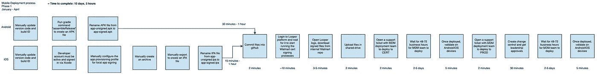
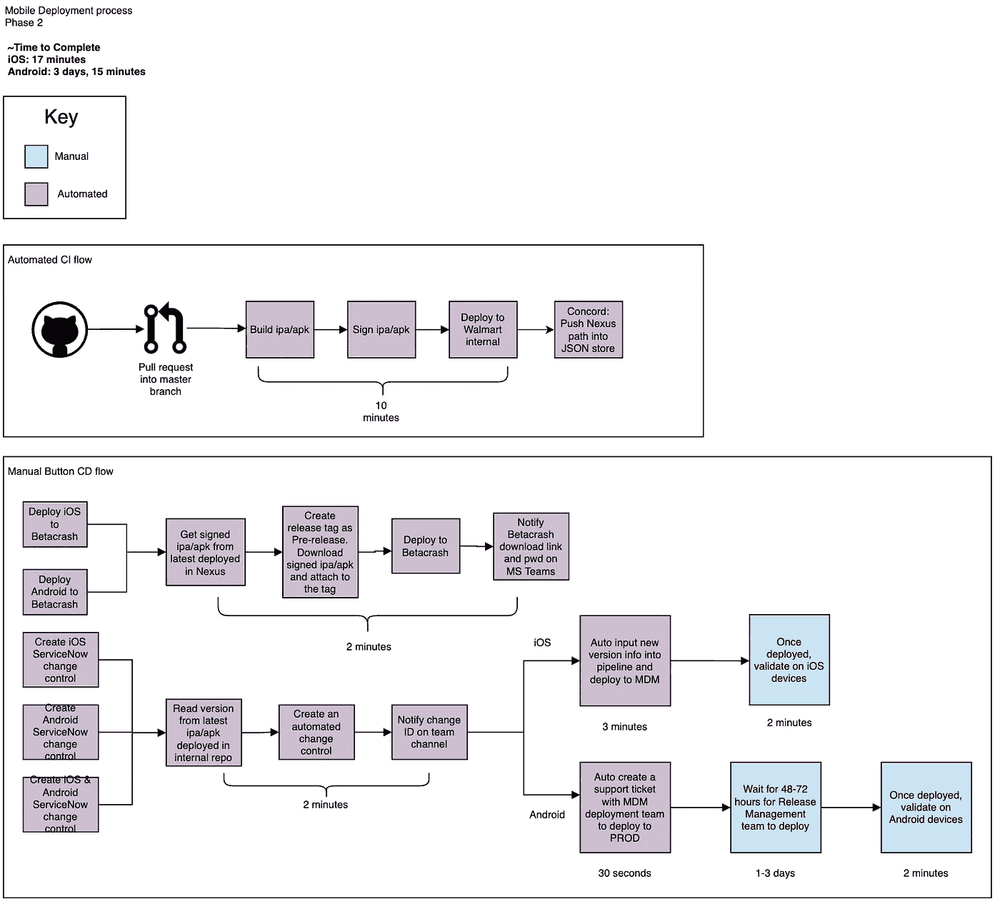

# 一个沃尔玛团队的快速送货之旅

> 原文：<https://medium.com/walmartglobaltech/one-walmart-teams-journey-to-faster-delivery-d7f3cbec1a18?source=collection_archive---------0----------------------->

Image by Gerd Altmann [https://pixabay.com/?utm_source=link-attribution&amp;utm_medium=referral&amp;utm_campaign=image&amp;utm_content=516277](https://pixabay.com/?utm_source=link-attribution&amp;utm_medium=referral&amp;utm_campaign=image&amp;utm_content=516277)

有兴趣了解一个应用程序开发团队如何将生产部署时间减少 350%，每个版本节省 10 天？我的团队为沃尔玛家庭办公室同事提供技术解决方案。2019 年 11 月，我们成立了一个小团队，开始开发新的沃尔玛内部应用程序。因为这是一个概念验证，所以我们有一种*‘让某些东西工作起来’*的心态来验证功能，并从更大的团队那里获得支持。我们非常关注功能开发，而不是自动化。我们手动将第一个应用版本推向生产，并在接下来的四个月中继续创建手动构建和部署。团队开始感受到将新版本的应用程序部署到产品中所花费的时间的痛苦。这花了好几天时间，但是我们并不清楚到底有多少天；为了改进流程，我们必须建立一个基线..对我们来说，价值流图是最有意义的，因为它可视化了整个流程，它突出了任何减慢流程的瓶颈。我们制定了构建和部署流程，这很快为我们提供了所涉及步骤的基线，以及每个步骤花费的时间(图 1)。所有构建和部署步骤都是手动的，将应用程序投入生产的总时间为 10 天零 3 个小时。我们有一个有形的数字，可以用来衡量我们的改进工作。

Figure 1

在开发的前几个月，我们在生产前将应用部署到 cert 环境中，但我们遇到了许多挑战。从价值流图中，我们可以看到我们的内部移动设备管理器(MDM)团队花了 2-5 天时间手动将更新部署到 cert。我们还有一个技术限制，它限制了我们的设备池和测试人员的多样性，这些测试人员使用移动测试设备进行测试。通常，开发团队是唯一拥有我们可以用来测试的设备的测试团队。出于这些原因，我们决定更换 cert 部署，转而使用一个允许我们与 Android 或 iOS 上的任何人共享 URL 链接的平台。测试人员将使用该链接并下载最新版本，它会立即下载到他们的设备上。这为我们扩展 UAT(用户接受度测试)和探索性测试打开了大门，因为我们可以将链接发送给任何设备上的任何人。这大大节省了时间，增加了我们测试设备的数量，并扩大了测试我们应用程序更新的人数。我们将预生产部署添加到 CICD 管道中，并有一个按钮，当我们有新的版本可供测试时，它会发送新的应用程序更新。由于平均每周发布两个版本，以及三天半的 cert 部署等待期，我们每个月节省了将近 28 天的时间来等待发布到 cert。相反，我们花了两分钟等待 CICD 测试版的部署，新版本已经准备好立即进行测试了(图 2)。将 28 天缩短到 16 分钟对我们团队的 beta 测试产生了巨大的影响。

Figure 2

在改进生产前测试时间表后，我们相信我们也可以缩短当前从部署到生产的时间表(2-5 天)。我们与内部移动设备管理器团队合作进行改进。他们的团队草拟了一份管道草图，大约完成了 iOS 的 80%。我们深入了解了他们的技术团队，并建立了一定程度的信任，使我们能够在短短 6 周内帮助他们构建、测试和验证 iOS 管道。

如今，iOS 部署完全自动化，在生产环境中进行手动部署后验证。iOS 版本在 20 分钟内被发送到生产环境，这与之前 10 天 3 小时的时间线相比是一个巨大的进步。我们的 MDM 团队正在努力开发一个自动化的 Android 发布管道，我们将合作测试和实施。

过去一年有哪些重要收获？我们不认为改善是需要几周或几个月的单独努力，这是随着时间推移看到积极变化的关键。我们比开始发展时做得更好，但我们还没有达到我们想要的水平。我们必须将持续改进放在首位，保持开发任务小，将改进融入每个开发周期，并不断学习新的方法来改进我们的应用程序和代码。增量变化累积起来会产生巨大的结果，自从我们在 CICD 投资以来，我们已经亲眼看到了好处。