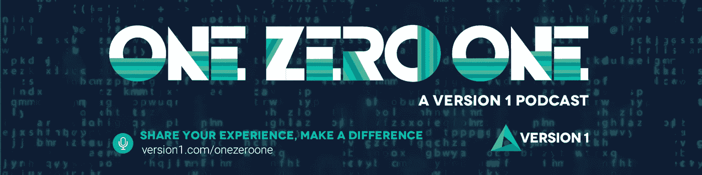
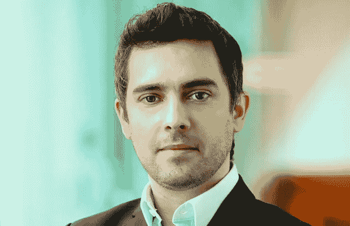

# 一零一，一个新的科技播客

> 原文：<https://medium.com/version-1/one-zero-one-a-new-tech-podcast-ce94b962fcf1?source=collection_archive---------7----------------------->

【2019 年 6 月推出的 [**一零一**](https://www.version1.com/one-zero-one/) **播客是一个科技播客，来自** [**版本 1**](https://www.version1.com/) **，旨在激发与英国和爱尔兰一些领先的技术专家和开拓者的一系列对话。**

该播客旨在鼓励听众加入第 1 版，向我们的技术同行学习，我们的嘉宾分享他们的想法、经验和他们在这一过程中学到的一些重要经验。截至 2019 年 11 月，我们在所有主要平台上为听众发布了 9 个播客，包括 [Audioboom](https://audioboom.com/channels/4997219) 、[苹果播客](https://podcasts.apple.com/us/podcast/one-zero-one/id1467766313?ign-mpt=uo%3D4)、 [Deezer](http://www.deezer.com/show/383092) 、[谷歌播客](https://podcasts.google.com/?feed=aHR0cHM6Ly9hdWRpb2Jvb20uY29tL2NoYW5uZWxzLzQ5OTcyMTkucnNz)和 [Spotify](https://open.spotify.com/show/6wuhFYKrB9OZZ0MNC1vXJb) 。

作为一个创新的公司，从一开始，第 1 版就包含了通过技术和创新来改变现状的能力。我们希望继续从其他人那里了解创新如何塑造技术行业，并发现我们的同行如何实施最新的新兴技术，因此创建了 101 播客。随着对技术和创新的高度关注，迄今为止 101 播客的主题包括无服务器、人工智能、数据伦理和黑仔机器人运动。

该播客由 ChannelSight 的首席执行官兼联合创始人约翰·贝克特主持。ChannelSight 是一家创新公司，旨在打造购物的未来，与品牌、出版商和广播公司合作，通过让所有数字内容“可购物”来创造增量收入。在本播客中，John 与 Version 1 的 Roisin Healy 分享了他的故事和见解，包括他对运营高增长风险投资支持的业务的想法以及创新对于 SaaS 电子商务平台的重要性。

> “我对任何试图用创新的想法或新的冒险获得成功的人的建议是，走出去和人们交谈。许多人保护他们的想法，不谈论它们，或者他们试图让人们签署保密协议。如果你的想法真的很好，那么保护这个想法对你来说非常重要，以至于你甚至不能谈论它，这是非常不可能的。”
> 
> 约翰·贝克特

我们最新的播客采访了劳拉·诺兰，她谈到了阻止黑仔机器人运动，这是一个由 60 个国家的 129 个国际、地区和国家非政府组织组成的不断壮大的联盟，致力于禁止全自主武器。我们就科技行业的道德含义与劳拉进行了交谈，并了解了她为什么认为人工智能驱动的机器不适合参与确定武力的适当使用。

我们的播客不仅限于单独的嘉宾——在第 6 集，我们采访了威廉·柯纳汉和利兹·林田，他们是成长型初创企业[变革捐赠](https://businessandfinance.com/ones-to-watch-change-donations-making-it-simple-to-give-to-charity/)的创始人。这是一个小额捐赠平台，其使命是将日常慈善家与公益事业联系起来。我们采访了威廉和利兹，了解了该平台的创业和发展过程，我们的嘉宾分享了一些非常坦诚和有趣的创业经验。

> **“千禧一代的可支配收入较少，但他们非常有社会意识，而且确实想回馈社会。我们的整个想法是，我们愿意以一种真正灵活、透明的方式，为捐助者提供一种力所能及的回报方式，因此我们瞄准了千禧一代，并试图将慈善机构带入数字时代。”**
> 
> 林田丽子

对于第 8 集，我们与分析研究所合作，汇集了来自学术界、媒体和行业的观点，讨论在算法时代负责任的数据科学面临的挑战。现场录制，咨询服务负责人 Ronan Laffan，Version 1 主持了这一特别节目，其中包括一个专家小组，他们围绕数据伦理进行了深入的讨论，以及他们认为企业、专业人士和个人在利用新兴技术时需要考虑的重要问题。

One Zero One Episode #8 Panellists

如果有你认识的人或者想为 101 播客推荐的人，请随时给我发消息或者在 LinkedIn 上联系。

**从我们的网站或任何您喜爱的流媒体平台流式播放并下载** [**版本 1 的 One 零一播客**](https://www.version1.com/one-zero-one/) **。**