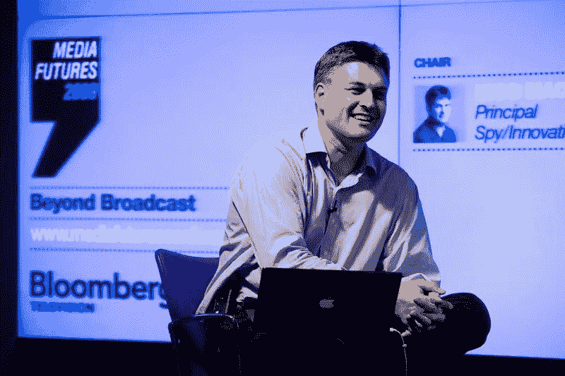

# 101:尼科·麦克唐纳，互联网项目 50 年

> 原文：<https://medium.com/version-1/one-zero-one-nico-macdonald-50-years-of-the-internet-project-ba26038f9f22?source=collection_archive---------6----------------------->

在我们最新一期的 101 播客中，我们与教育家、主持人兼顾问 Nico Macdonald 就他的“互联网项目 50 年”进行了一次有趣的讨论。

Nico Macdonald 目前是 CIEE 伦敦全球研究所的导师和伦敦南岸大学的导师/访问学者。他的目标是成为一名教育工作者，围绕创意产业和数字媒体教授课程，并围绕他认为重要的领域启动自己的项目。他正在关注的项目之一是互联网的下一个 50 年，这是本期播客的基础。

该项目首先将过去 50 年作为一个“活实验室”或大规模信息“数据池”,使我们能够了解大规模的社会技术变革是如何发生的，以及我们如何在未来加速这一变革。尼科强调，我们需要关注社会技术变革，因为这对人类的未来至关重要。

**研究**

在这个项目中，Nico 试图颠覆传统研究的模式，传统研究通常由长时间的大量一手和二手研究组成，然后试图分析所有的数据，找出主题、趋势和见解。Nico 邀请人们通过讲述他们如何使用 ICT 互联网技术以某种方式改变他们在个人、社会、工作或政治生活中所做的事情来做出贡献。人们不需要太多思考就能想到他们生活中的一个领域，如果他们回到 10-20 年前，由于技术的差异，你会以完全不同的方式去做。

**我们对互联网的体验还处于早期吗？**

Nico 认为我们是，虽然许多人认为互联网相对较新，但我们想象已经有了巨大的变化和“破坏”,因为在如此短的时间内发生了如此多的事情。然而，如果你观察 50 年的时间，事情的变化相对缓慢。如果你追溯得更远，这是一个非常缓慢的变化，同时，我们现在推出的想法的基础实际上已经有 70 年了。因此，我们需要确保下一个 70 年的思想基础现在就到位，即使很难看到它们可能是什么。

技术发明的目的有限，因为人类是一个实验物种，永不满足。我们看到了这些东西的新的可能性，并扩展了它的功能。虽然互联网最初是为了分享知识和工具来处理数据，但现在它正以基本的方式被使用。例如制造业，从新的制造形式、自动化装配线、新的实时库存、物流和供应链。

**将代码视为美好的事物**

在文化上，我们对事物如何运作缺乏兴趣，我们不应该这样，因为这是一个信号，表明我们不是在制造/实验文化中，而是在消费文化中。我们将建筑、时尚、字体设计视为美好的事物，但代码从来不会以同样的方式被看待。人们为 ICT 创造了有意义的和熟练的形式，这释放了技术的力量，但如果文化评论家没有一种方式来谈论和理解它们，那么这表明我们没有参与创造 ICT 作为未来的挑战。

**人们是如何参与进来的？**

进入 [spyco.uk](https://www.spy.co.uk/) ，项目被钉在主页上，项目宣言也在那里。Nico 希望让那些了解社会技术变革、历史、信息、可视化、讲故事和数据科学的人参与进来。这个项目是开放式的，Nico 有他想了解的东西，其他的一切都是可以争取的。

**你可以在这里收听完整的播客******，其中 Nico 给出了我们上面探索的每个领域的例子和更多细节。****

****您可以从我们的网站或任何您喜欢的流媒体平台了解更多信息，流式播放并下载第一版的任何** [**的一零一集播客**](https://www.version1.com/one-zero-one/) **集。****