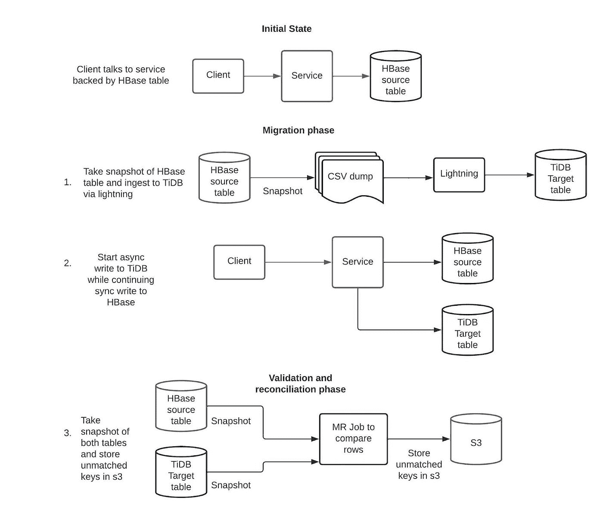
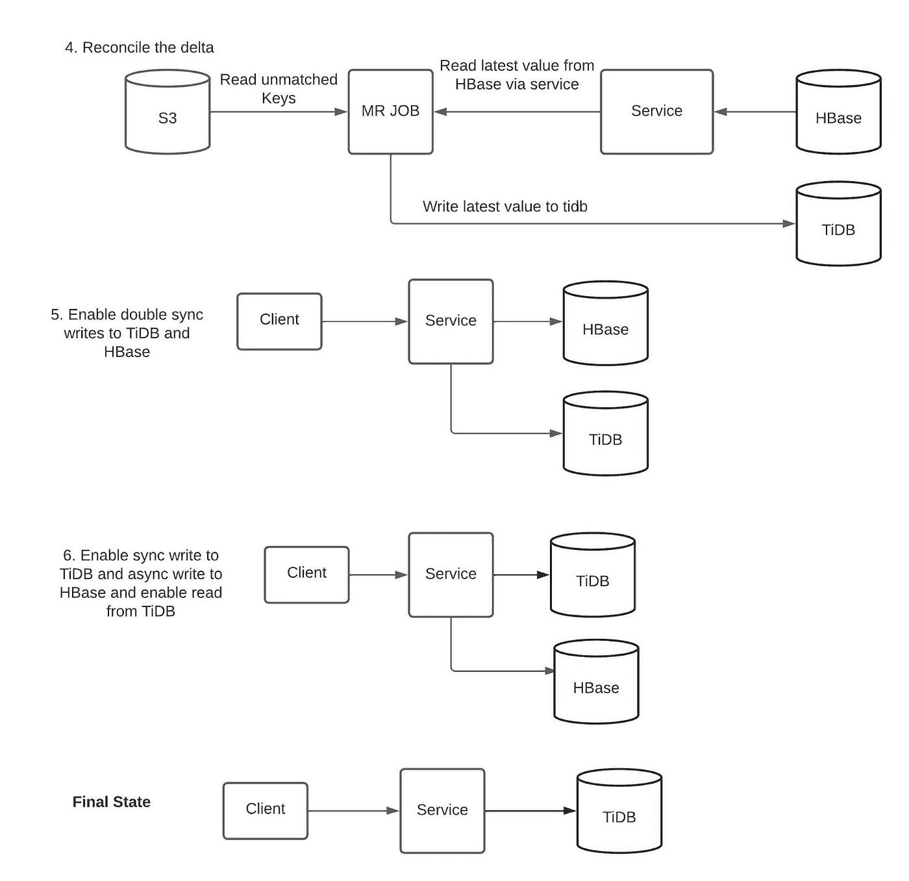

# 从 HBase 到 TiDB 的在线数据迁移，零宕机

> 原文：<https://medium.com/pinterest-engineering/online-data-migration-from-hbase-to-tidb-with-zero-downtime-43f0fb474b84?source=collection_archive---------0----------------------->

Ankita Girish Wagh |存储和缓存高级软件工程师

# 简介和动机

在 Pinterest，HBase 是最重要的存储后端之一，支持许多在线存储服务，如 Zen(图形数据库)、UMS(宽列数据存储)和 [Ixia](/pinterest-engineering/building-scalable-near-real-time-indexing-on-hbase-7b5eeb411888) (近实时二级索引服务)。HBase 生态系统虽然具有各种优势，如高容量请求中行级别的强一致性、灵活的模式、低延迟数据访问、Hadoop 集成等。无法满足我们客户未来 3-5 年的需求。这是因为运营成本高、过于复杂，以及缺少辅助索引、事务支持等功能。

在评估了 10 多个不同的存储后端，并对入围的三个后端进行了影子流量(将生产流量异步复制到非生产环境)基准测试和深入的性能评估后，我们决定使用 [TiDB](https://en.pingcap.com/) 作为统一存储服务的最终候选。

采用由 TiDB 支持的统一存储服务是一项跨越多个季度的重大挑战性项目。它涉及从 HBase 到 TiDB 的数据迁移，统一存储服务的设计和实施，从 Ixia/Zen/UMS 到统一存储服务的 API 迁移，以及从 HBase/Hadoop 生态系统到 TiSpark 生态系统的离线作业迁移，同时保持我们的可用性和延迟 SLA。

在这篇博文中，我们将首先了解数据迁移的各种方法及其利弊。然后，我们将深入探讨如何将数据从 HBase 迁移到 TiDB，这是首批用例之一，具有 4 TB 的表大小，可在零宕机的情况下服务 14k 读取 qp 和 400 写入 qp。最后，我们将了解如何进行验证以实现 99.999%的数据一致性，以及如何测量两个表之间的数据一致性。

# 数据迁移策略

一般来说，零停机时间数据迁移的简化策略包括以下内容:

1.  假设您有数据库 A，并且您想将数据迁移到数据库 B，您将首先开始对数据库 A 和数据库 B 进行双重写入。
2.  在数据库 B 中导入数据库 A 的转储，同时解决与实时写入的冲突。
3.  对两个数据集进行验证。
4.  停止写入数据库 a。

每种使用情形都是不同的，可能会带来一系列独特的挑战。

我们考虑了进行数据迁移的各种方法，并基于各种权衡最终确定了方法:

1.  从服务向两个表(HBase 和 TiDB)执行双重写入(以同步/异步方式写入 2 个真实源),并使用 [lightning](https://docs.pingcap.com/tidb/dev/tidb-lightning-overview) 中的 [TiDB 后端模式](https://docs.pingcap.com/tidb/dev/tidb-lightning-backends#tidb-backend)进行数据摄取。
    这个策略最简单，也最容易实施。然而，TiDB 后端模式提供的速度是 50GB/小时，因此它只对较小表的数据迁移有用。
2.  获取 HBase 表的快照转储，并将实时写入从 HBase cdc(更改数据捕获)传输到 kafka 主题，然后使用 lightning 工具中的[本地模式](https://docs.pingcap.com/tidb/dev/tidb-lightning-backends#local-backend)接收转储的数据。稍后，从服务层启动双重写入，并应用 kafka 主题的所有更新。
    在应用 cdc 更新时，由于复杂的冲突解决方案，该策略难以实施。此外，我们自己开发的用于捕获 HBase cdc 的工具只存储密钥。因此也需要一些开发工作。
3.  上述策略的一个替代方案是，我们从 cdc 读取密钥，并将它们存储在另一个数据存储中。稍后，在开始对两个表进行双重写入后，我们从真实数据源(HBase)读取它们的最新值，并写入 TiDB。这种策略已经实现，但是如果通过 cdc 存储密钥的异步路径存在可用性问题，就有丢失更新的风险。

在评估了所有策略的利弊后，我们决定采用本博客其余部分描述的方法。

# 迁移工作流

## 术语定义:

客户端:与节俭服务对话的下游服务/库

服务:提供在线流量的节俭服务；为了这次迁移的目的，它是 Ixia

MR Job:一个在 map reduce 框架上运行的应用程序

异步写入:服务向客户端返回 OK 响应，而不等待来自数据库的响应

同步写入:服务只有在收到来自数据库的响应后才会向客户端返回响应

双重写入:服务以同步或异步方式写入两个底层表

## 实施细节

由于 HBase 是无模式的，而 TiDB 使用严格的模式，因此在开始迁移之前，需要设计一个包含正确数据类型和索引的模式。对于这个 4 TB 的表，HBase 和 TiDB 模式之间有 1:1 的映射。这意味着 TiDB 模式是通过使用 map reduce 作业来分析 hbase 行中的所有列及其最大大小而设计的。然后对查询进行分析，以创建正确的索引。以下是步骤:

1.  我们使用 [hbasesnapshotmanager](https://hbase.apache.org/1.1/apidocs/org/apache/hadoop/hbase/master/snapshot/SnapshotManager.html) 获取 HBase 快照，并将其作为 csv 转储存储在 s3 中。我们将 CSV 行存储为 Base64 编码，以解决特殊字符限制。然后，我们在本地模式下使用 TiDB[lightning](https://docs.pingcap.com/tidb/stable/tidb-lightning-backends#local-backend)开始接收这个 csv 转储，同时在 TiDB 中存储该行之前进行 base64 解码。一旦接收完成并且 TiDB 表在线，就开始对 TiDB 进行异步双重写入。异步双重写入确保 TiDB SLA 不会影响服务 SLA。尽管我们为 TiDB 设置了一个监控/分页机制，但此时我们将 TiDB 保持在影子模式下。
2.  使用映射缩减作业执行 HBase 和 TiDB 表的快照。这些行首先被转换成一个公共对象，并作为序列文件存储在 S3。我们使用 MR 连接器开发了一个定制的 TiDB 快照管理器，并将 hbasesnapshotmanager 用于 HBase。
3.  使用 map reduce 作业读取这些序列文件，该作业将不匹配的行写回 s3。
4.  从 s3 中读取这些不匹配的行，从服务中读取其最新值(由 HBase 支持)，并将该值写入辅助数据库(TiDB)。
5.  启用双同步写入，以便写入 HBase 和 TiDB。运行步骤 3、4 和 5 中的协调作业，每天比较 TiDB 和 HBase 中的数据奇偶校验，以获得 TiDB 和 HBase 之间数据不匹配的统计信息，并协调它们。双同步写入机制没有回滚功能，以防写入 1 db 失败。因此，协调作业需要定期运行，以确保没有不一致。
6.  保持同步写入 TiDB，并启用异步写入 HBase。启用从 TiDB 读取。在这个阶段，服务 SLA 完全依赖于 TiDB 的可用性。我们保持对 HBase 的异步写入，以尽最大努力保持数据一致性，以防我们需要再次回滚。
7.  完全停止写入 HBase 并弃用 HBase 表。

# 处理不一致

1.  后端不可用导致的不一致场景
    在 Ixia 服务层构建的双重写入框架不会在由于任一数据库不可用导致写入部分失败的情况下回滚写入。通过定期运行协调作业来保持两个 HBase & TiDB 表同步，可以处理这种情况。当修复这种不一致时，主数据库 HBase 被认为是事实的来源。这实际上意味着，如果在 HBase 中写入失败，但在 TiDB 中成功，则在协调过程中，它将从 TiDB 中删除。
2.  由于双重写入和协调期间的竞争条件而导致的不一致情况。如果事件按以下顺序发生，则有可能将陈旧数据写入 TiDB:(1)协调作业从 HBase 读取；(2) live write 同步写入 HBase，异步写入 TiDB(3)协调作业将先前读取的值写入 TiDB。
    这类问题也可以通过多次运行协调作业来解决，因为每次运行后，此类不一致的数量都会显著减少。实际上，对于为 400 个写 QPS 提供服务的 4 TB 表，只需运行一次协调作业，即可实现 HBase 和 TiDB 之间 99.999%的一致性。这是通过第二次转储 HBase 和 TiDB 表并比较其值来验证的。在比较行的过程中，我们看到表有 99.999%的一致性。

# 视窗网际网路名称服务

1.  我们看到 p99 读取延迟降低了 3-5 倍。在这个用例中，p99 查询延迟从 500 毫秒降至 60 毫秒。
2.  实现了写后读的一致性，这是我们专门从 ixia 迁移用例的目标之一。
3.  迁移完成后，在涉及组件的[数量方面](/pinterest-engineering/building-scalable-near-real-time-indexing-on-hbase-7b5eeb411888)更简单的架构。这将大大有助于调试生产问题。

# 挑战和学习

## 内部 TiDB 部署

在 Pinterest 基础设施中部署 TiDB 对我们来说是一次很好的学习经历，因为我们没有使用 TiUP (TiDB 的一站式部署工具)。这是因为 TiUP 的许多职责与内部 pinterest 系统重叠(例如部署系统、操作工具自动化服务、度量管道、TLS 证书管理等。)而弥合两者差距的成本超过了它的收益。

因此，我们维护自己的 TiDB 版本的代码报告，并拥有构建、发布和部署管道。在安全集群管理上有很多细微差别，我们不得不艰难地学习，否则 TiUP 会处理它。

我们现在在 Pinterest 的 AWS 基础设施上构建了自己的 TiDB 平台，可以在不停机的情况下进行版本升级、实例类型升级和集群扩展操作。

## 数据摄取

在进行下面列出的数据接收和协调时，我们遇到了一些问题。请注意，我们的每一步都得到了 [Pingcap](https://en.pingcap.com/) 的全力支持。我们还为 TiDB 代码库贡献了一些补丁，这些补丁已经被上游合并。

1.  TiDB lightning 版本 5.3.0 不支持自动 TLS 证书刷新，由于缺乏相关日志，这是一个很难调试的问题。Pinterest 的内部证书管理服务每 12 小时刷新一次证书，因此我们不得不经历一些失败的摄取作业，并与 pingcap 合作来解决这个问题。该特性已经在 TiDB 5.4.0 版本中发布。
2.  lightning 的本地模式会消耗大量资源，并在数据接收阶段影响来自同一集群的单独表上的在线流量。Pingcap 与我们合作，提供放置规则的短期和长期补救，以便为在线流量提供服务的副本不会受到本地模式的影响。
3.  [TiDB MR Connector](https://github.com/tidb-incubator/TiBigData/tree/master/mapreduce) 需要一些可伸缩性修复，以便能够在合理的时间内拍摄 4 TB 表的快照。MR 连接器也需要一些 TLS 改进，这些改进已经被贡献和合并。

经过调整和修复后，我们能够在大约 8 小时内接收 4 TB 的数据，而运行一轮协调和验证需要大约 7 个小时。

## 鸢属科属植物

作为本练习的一部分，我们迁移的表是由 ixia 提供的。我们遇到了一些关于异步/同步双重写入和查询模式变化的可靠性问题。由于 ixia 本身复杂的分布式系统架构，节俭服务(ixia)的问题变得更加难以调试。请在我们的另一个[博客](/pinterest-engineering/building-scalable-near-real-time-indexing-on-hbase-7b5eeb411888)中了解更多。

# 承认

我们要感谢 Pinterest 存储和缓存团队所有过去和现在的成员，感谢他们帮助我们在 Pinterest 的存储堆栈中引入最新的 NewSQL 技术之一。

我们要感谢 Pingcap 团队对复杂问题的持续支持、联合调查和 RCA。

最后，我们要感谢我们的客户，在我们进行大规模迁移的过程中，他们表现出了极大的耐心和巨大的支持，一次一张桌子。

*要在 Pinterest 了解更多工程知识，请查看我们的* [*工程博客*](https://medium.com/pinterest-engineering) *，并访问我们的*[*Pinterest Labs*](https://www.pinterestlabs.com/?utm_source=medium&utm_medium=blog-article-link&utm_campaign=girish-wagh-aug-18-2022)*网站。要探索 Pinterest 的生活，请访问我们的* [*职业*](https://www.pinterestcareers.com/?utm_source=medium&utm_medium=blog-article-link&utm_campaign=girish-wagh-aug-18-2022) *页面。*