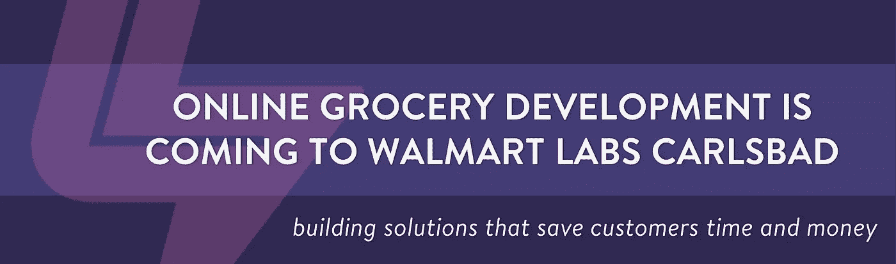

# 在线杂货店发展到卡尔斯巴德的 Bootstrap

> 原文：<https://medium.com/walmartglobaltech/online-grocery-development-to-bootstrap-in-carlsbad-b0a3d438de4d?source=collection_archive---------4----------------------->

# **客户连接**

杂货店购物。美国人最喜欢的消遣。列每周清单、上车、堵车、找停车位、在过道上走来走去、排队结账、给车装货，最后回家的乐趣。

听起来令人畏惧？的确如此。尤其是当普通人每周去杂货店 [1.6 次](https://www.statista.com/statistics/251728/weekly-number-of-us-grocery-shopping-trips-per-household/)，花 [43 分钟](http://www.timeuseinstitute.org/Grocery16paper.pdf)购物的时候。算一算，你一年要花 60 个小时去杂货店购物。

想象一下，如果时间可以收回，让你可以自由地专注于对你来说最重要的事情。这就是沃尔玛实验室的目标:建立一个解决方案来帮助节省客户的时间。

# **沃尔玛，美国最大的杂货店**

沃尔玛仅在美国就有超过 4，700 家门店，90%的美国人都可以进入他们家 10 英里半径范围内的门店。再加上 2000 多家提供路边杂货提货服务的商店，沃尔玛正在帮助全国 40%的消费者消除耗时的实体杂货店购物琐事。

# 改变世界购物的方式

沃尔玛已经决定扩大其在南加州地区的发展足迹，并雇佣一个完整的端到端团队，专注于建立一个全新的在线杂货体验。

该团队将由全栈工程师组成，专注于 web 和原生应用程序开发，使用 react 和 react native。一个由用户体验、产品经理、数据分析和项目经理组成的创新团队，致力于拓展创新领域，创造个性化的在线购物和提货体验。

如果您正在寻找在沃尔玛工作的机会，构建每周服务超过 2.7 亿客户的解决方案，请加入沃尔玛实验室-嘉士伯团队！

# 卡尔斯巴德的未结头寸

*在接下来的 6 个月里，我们将继续开设新的职位。详情请查看*[*careers.walmart.com*](https://careers.walmart.com)*了解更多信息。*

## **工程**

*   [工程总监](https://careers.walmart.com/us/jobs/1201051BR-director-engineering-carlsbad-ca)
*   高级软件工程经理
*   [软件工程经理](https://careers.walmart.com/us/jobs/1201034BR-senior-manager-i-software-engineering-carlsbad-ca)
*   [首席软件工程师](https://careers.walmart.com/us/jobs/1201013BR-principal-software-engineer-carlsbad-ca)
*   [参谋工程师](https://careers.walmart.com/us/jobs/1200400BR-staff-software-engineer-carlsbad-ca)
*   [高级工程](https://careers.walmart.com/us/jobs/1200382BR-senior-software-engineer-online-grocery-carlsbad-ca)
*   [软件工程](https://careers.walmart.com/us/jobs/1200375BR-software-engineer-iii-online-grocery-carlsbad-ca)

## 用户体验

*   [设计总监](https://careers.walmart.com/us/jobs/1199560BR-design-director-online-grocery-carlsbad-ca)
*   [设计领导，产品](https://careers.walmart.com/us/jobs/1200333BR-design-lead-product-online-grocery-carlsbad-ca)
*   [设计负责人，研究员](https://careers.walmart.com/us/jobs/1201082BR-design-lead-researcher-online-grocery-carlsbad-ca)
*   [高级产品设计师](https://careers.walmart.com/us/jobs/1202646BR-senior-product-designer-carlsbad-ca)
*   [高级内容策略师](https://careers.walmart.com/us/jobs/1202659BR-senior-content-strategist-carlsbad-ca)

## 生产部经理

*   [产品管理总监](https://careers.walmart.com/us/jobs/1201960BR-director-product-management-online-grocery-carlsbad-ca)
*   [高级产品经理](https://careers.walmart.com/us/jobs/1202016BR-senior-product-manager-online-grocery-carlsbad-ca)
*   [产品经理](https://careers.walmart.com/us/jobs/1203416BR-product-manager-online-grocery-carlsbad-ca)

## 产品分析

*   [高级产品经理分析](https://careers.walmart.com/us/jobs/1202091BR-senior-product-manager-analytics-carlsbad-ca)

## 程序管理

*   [员工技术项目经理](https://careers.walmart.com/us/jobs/1202113BR-staff-technical-program-manager-online-grocery-carlsbad-ca)