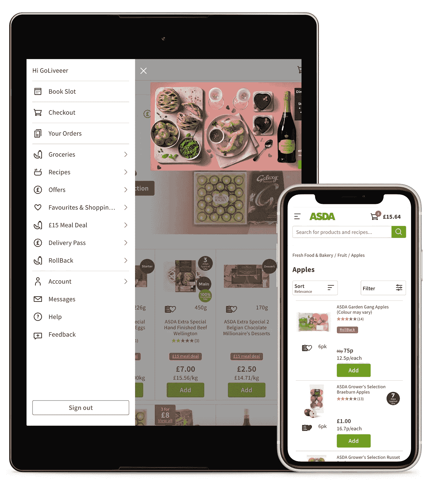
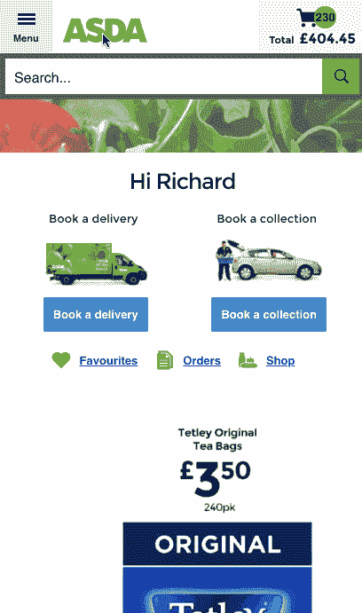
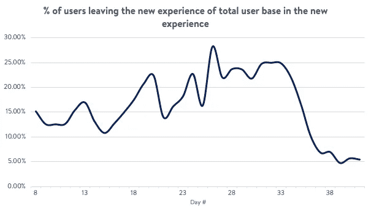
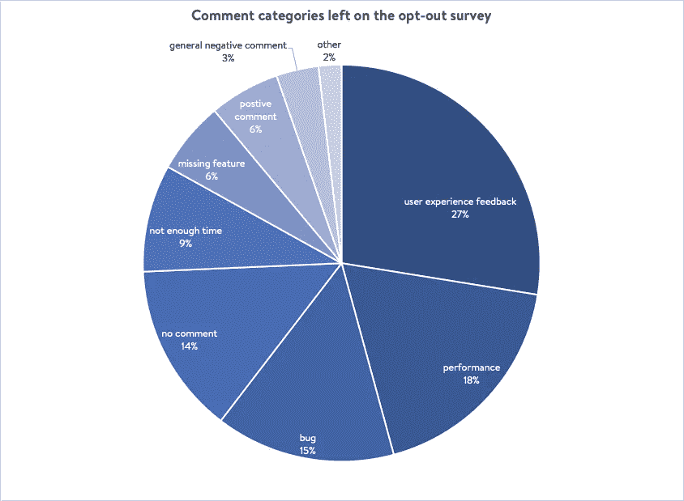
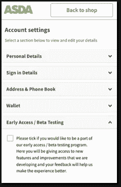

# 在线杂货测试版

> 原文：<https://medium.com/walmartglobaltech/online-grocery-in-beta-c50dbfd2fce1?source=collection_archive---------0----------------------->

在沃尔玛国际，我们已经经历了 18 个月的旅程来更新和改善我们的英国在线杂货购物平台 ASDA 杂货家居购物的客户体验。我们从重建[收银台](/walmartlabs/learnings-from-rebuilding-our-checkout-experience-1d1ddebed00)的客户体验开始这项计划。此后，我们改进了注册和登录流程。这两个项目都为我们的用户和平台提供了相当大的好处。在我们继续对新的登录和结账流程进行进一步改进的同时，我们也在努力为我们的用户开发新的购物体验。这是我们的用户在网站上花费大部分时间将他们的杂货项目添加到购物车的地方，它包括搜索、主页、收藏夹、分类、购物清单和我们新开发的食谱部分等体验。

我们在收银台所做工作的一个关键经验是，在体验达到用户可接受的质量水平之前，我们就开始了实验。在测试的早期阶段，我们经历了许多错误的开始，我们需要关闭实验，为我们的客户解决有问题的问题，并重新开始体验。尽管我们最终获得了 KPI 和客户反馈，显示了积极的结果，但我们损失了大量的时间和资源，并让一些客户感到不必要的失望。我们需要重新思考我们的方法…

由于该计划涉及新技术堆栈的创建、分类和新设计系统的大量经验变化，我们需要一种方法从实验室环境之外的用户那里获得真实世界的反馈，这有时会带来偏见，同时尽可能降低风险。我们还希望在开发过程中尽早获得用户的反馈，以便我们有更多的时间在必要时进行调整。

## 我们的方法

类似于收银台重新设计项目，我们从一个私人测试版开始，向我们的同事开放。在这里，新的应用程序在很大程度上处于*阿尔法*阶段*。主要功能仍在开发中，我们还有大量的 bug 要处理。一旦我们开发了核心功能集，解决了大部分主要问题，我们就将新体验作为公测版向部分用户开放。*

对于公众测试版，我们瞄准了我们最忠实的客户，即在过去 6 个月中与我们一起完成 15 次以上购物的用户。我们使用我们的实验平台随机选择了 1%最忠实的用户。最初，我们希望将新体验的使用率保持在相当低的水平，以保持低风险，但随着我们对获得的反馈越来越有信心，我们上调了这个百分比。

我们使用我们最忠诚的客户有两个原因。首先，他们是最直言不讳的，因此我们收到反馈的机会更高。第二，网上杂货店在很大程度上是一个保持领先的业务，客户每周都使用这项服务。这比大多数电子商务企业的频率高得多，因此，让我们最忠诚的客户尽早表达他们的反馈对我们来说非常重要，这样我们才能确保有时间进行调整。

根据设备的宽度，参与实验的人会在标题中看到一个按钮或滑出导航。邀请他们尝试我们的“新造型”。我们一开始就向用户明确表示，我们对获得他们的反馈感兴趣，网站仍在开发中。我们也让我们的用户知道，如果他们需要在标题/导航中使用相同的按钮，他们可以回到原来的网站。在新的体验中，我们在任何页面上都有一个清晰的反馈按钮，方便用户让我们知道他们的想法(选择加入调查)。此外，如果用户在该操作完成后选择返回到现有网站，并且用户返回到旧网站，我们会询问他们的反馈，以了解他们为什么选择离开(选择退出调查)。我们使用的反馈表非常简单，通常只有两个问题来鼓励完成。

最后，我们添加了一些基本的分析跟踪，以便我们可以比较定性(客户的书面反馈)和定量(用户采取的行动)。我们运行了 6 周的*测试版*,每天与我们的团队一起分析使用情况和反馈。

Demo of a user moving from the old site to the new one and then back again

## 我们所学的不会

首先，新体验的用户给出反馈的可能性比我们通常在旧体验中看到的高出 100 多倍。这是因为我们选择了一个直言不讳的用户群，通过一个简单的 2 个问题的反馈表让反馈变得非常容易，事实上这是对体验本身的一个很大的改变。

我们能够使用决定退出新体验回到旧网站的用户百分比作为新体验足够强大时我们可以开始 AB 测试的指标。AB 测试不会有用户返回旧网站的选项，所以在开始这个阶段之前，我们需要对体验的质量有信心。从下面的图表中你可以看到，我们刚开始的时候，大约有 15%的用户决定离开新网站，随着我们遇到性能问题，这个比例上升到了 25%。在一轮关键的性能和体验改进之后，我们看到了大约 5%的显著下降，这为我们开始项目的实验阶段开了绿灯

当用户返回旧网站时，向他们显示的调查(选择退出调查)证明是一个非常有价值的数据源，有助于了解改进的机会在哪里。有趣的是，6%离开新体验的用户给出了积极的反馈，还有 9%的用户离开是因为他们没有足够的时间探索新体验，并打算以后再回来。

> *“今天时间不多，等时间不那么紧的时候再看吧。”*

我们的假设是，我们尚未开发的 bug 和功能将构成用户选择离开的主要原因。然而，用户提出的两个关键领域是应用程序性能和对体验变化的反馈。这个数据点允许我们改变我们的方法，从关注特性开发到修复性能问题。用户体验反馈意见主要集中在喜欢旧网站的用户或难以导航新分类的用户。

> *“旧网站更容易浏览。”*

然而，当我们对照我们的分析数据对此进行检查时，我们看到了不同的趋势。与旧体验相比，新体验显示来自分类部分的购物车增加显著。我们所了解到的是，在那些成为我们客户时间最长的用户中，用户挣扎得最厉害，因此他们非常习惯在旧网站购物，需要更长的时间来适应新的变化。然而，如果我们能够帮助我们的用户更容易地过渡，那么客户使用新体验是有价值的。这向我们展示了不要孤立地看待定性和定量的重要性。使用这两个来源，我们能够对体验进行更改，使我们最忠实的用户更平稳地过渡，而不会失去新网站提供的价值。

最后，公众*测试版*带来了两个重要的内部好处。有一条退出路线对我们的用户和我们计划的进展都非常有益。它使我们能够保持测试运行，并收集有价值的数据/反馈，同时我们还能抵御用户被阻止和销售受影响的风险。这也给了我们的利益相关者对计划的信心，因为我们能够在项目生命周期的更早阶段表明我们所做的改变是有价值的，并且我们能够更快地适应用户给我们的反馈。在完成大型客户体验变更时，来自业务利益相关方的支持是必不可少的，因为开发和试验阶段通常会比内部团队修复问题和响应客户反馈以及用户习惯新布局和设计所需的时间长得多。

## 走向未来

在实验阶段之前引入公共测试版极大地帮助了我们实现项目目标。我们发现它是一个有用的工具，允许我们为了用户的利益来塑造平台。我们能够更快地获得反馈，并且能够对我们的新产品更有信心地进入实验阶段。我们看到这种方法在我们更多的努力中非常有用，所以我们正在考虑建立一个早期访问/测试社区。在这里，我们平台上的用户将能够选择加入该计划。然后，我们可以使用我们的实验平台来瞄准这些用户，让他们提前接触到处于开发后期的新功能，以便更早地获得反馈，做出更明智的决策，并最终为我们的用户提供更丰富的体验。

Example approach for user to opt-in to the beta program