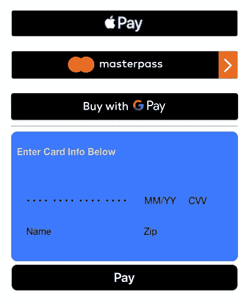

# 使用 React 的在线支付表单

> 原文：<https://medium.com/square-corner-blog/online-payments-form-react-9ecf164880bf?source=collection_archive---------1----------------------->

## 使用 React 和 Square 创建自定义支付表单

接受在线支付的方式有很多。实现一个可以同时接受任意多种支付方式的表单不是很好吗？让我们看看如何使用 [Square](https://squareup.com/developers) 和 [React](https://reactjs.org/) 实现一个定制的支付表单。这种形式将使我们能够在网上使用信用卡，*和*使我们能够在单一支付形式中支持 Apple Pay、Google Pay 和 Masterpass。

## 理解这篇文章需要的东西:

*   [反应](https://reactjs.org/) ( *简化为* `[create-react-app](https://github.com/facebook/create-react-app)`)
*   [广场的付款形式](https://docs.connect.squareup.com/payments/sqpaymentform/intro)

## 我们的最终(付款)表格:

# React 和 Square 的付款形式

如果你熟悉 React，那么你习惯于传递`props`并通过它的`state`控制你的组件。让我们来关注如何设置和运行由 React 组件控制的 Square 支付表单。我们还将演示如何动态加载 [Square 支付表单脚本](https://docs.connect.squareup.com/payments/sqpaymentform/setup#step-2-add-script-references-to-your-payment-page-head)，以防您想简单地在页面上插入支付表单组件。动态加载脚本只有在您不希望脚本只加载到结账页面(或任何您想接受付款的地方)时才有意义。

如果你不熟悉 Square 的支付形式，请前往[查看文档](https://docs.connect.squareup.com/payments/sqpaymentform/intro)并熟悉一下。有一些模板、解释和指南可以帮助你使用基本的 HTML、CSS 和 JavaScript 来设置表单。

在基本层面上，支付表单使用`<iframe>`直接在 Square 的服务器上捕获您客户的卡详细信息。支付表单促进了这些`<iframe>`元素的生成，并提供了一个 API 来创建一个 [nonce](https://docs.connect.squareup.com/payments/sqpaymentform/overview) (一次性令牌)以在以后引用这些细节(所有这些都不需要您知道任何敏感信息！).

用这些`<iframe>`元素替换 [DOM](https://developer.mozilla.org/en-US/docs/Web/API/Document_Object_Model/Introduction) 中的其他元素所遇到的主要问题是，React 通常喜欢负责管理所有的 DOM 交互。这需要在我们的组件上做一些额外的设置，以确保我们以正确的顺序正确地呈现所有内容，并正确地处理由 Square 支付表单脚本生成的不同事件。

# 动态加载 Square 付款表单脚本

我们的基础组件是我们实际管理将``动态加载到 DOM 的`<head>`中并触发我们的子组件进行渲染的地方。子组件实际上将负责组装、格式化和管理我们的支付表单。这样做是为了确保脚本已经加载，我们可以将`[SqPaymentForm](https://docs.connect.squareup.com/api/paymentform#paymentform-overview)`对象传递给我们的子组件。

你可以看到，我们只是在生命周期方法`componentWillMount()`中使用一些普通的 JavaScript 来创建一个`<script>`元素并设置一些属性，然后确保一旦脚本实际加载到页面上，我们就将 React 组件的状态更新为`loaded`。这将触发 React 重新渲染，并在我们的`render()`方法中为`this.state.loaded`返回`true`，并允许我们的子组件进行渲染。

我们代码的另一个值得注意的部分是我们如何通过`paymentForm`属性传递`SqPaymentForm`。我们传入附加到窗口的 SqPaymentForm 对象，因此呈现支付表单和触发提交更容易管理。

Full code example can also be found at [https://github.com/mootrichard/square-react-online-payments](https://github.com/mootrichard/square-react-online-payments)

# 反应付款表单组件

为了简单起见，我们正在修改在 [Square 的 GitHub](https://github.com/square/connect-api-examples/tree/master/templates/web-ui/payment-form/basic-digital-wallet) 上找到的现有模板。有关定制或设置 Square 支付表单的更多信息，请查看我们的[指南](https://docs.connect.squareup.com/payments/sqpaymentform/intro)。我们将更多地关注这些模板和 React 组件之间的区别。

## 我们的 render()方法

This is the `render()` method of our payment form component.

我们拥有的元素中需要注意的关键部分是 divs 元素，它们的 id 是:`sq-apple-pay`、`sq-masterpass`、`sq-google-pay`、`sq-card-number`、`sq-cvv`、`sq-expiration-date`和`sq-postal-code`。我们将示例转换为对所有内容使用 div，而不是表单组件，因为这些都是 Square 的支付表单脚本要替换为`<iframe>`元素的目标字段。此外，由于我们使用 React，我们将拥有自己的函数来控制提交和触发支付表单的 nonce 请求。

## 支持数字钱包支付和方式

要调整您想要支持的数字钱包选项(*有时称为移动钱包选项*)，只需在您的`SqPaymentForm`配置对象中提供不同的键-值对([参见此处的更多内容](https://docs.connect.squareup.com/payments/sqpaymentform/digitalwallet/intro))。您应该能够在`render()`方法中看到，我们正在使用组件的`state`来控制移动支付选项的显示。

我们在 Square 支付表单提供给我们的`methodsSupported()`回调中设置状态。由于每个移动钱包选项都特定于客户访问的浏览器，因此您需要有条件地呈现按钮，以匹配基于客户的浏览器或移动设备的可用内容。我们还必须创建这些单独的条件，因为支付表单为您选择支持的每个方法调用一次`methodsSupport()`函数。我们的示例试图支持 Masterpass、Apple Pay 和 Google Pay，因此将进行三个调用。我们对`setState()`的调用有点咄咄逼人，但是只有三个调用，所以不用担心——如果您在其他地方调用`setState()`,请记住这一点，因为每个调用都会触发组件的重新呈现。

## 链接和控制组件

主要的收获是在提供的回调中使用`state`。在组件中使用`state`允许我们对 Square 的支付表单脚本发出的不同事件做出反应。你可以在文档中了解更多关于这些事件的信息。在我们的例子中，这个连接的一个关键地方是`inputEventReceived()`回调，因为它在每个输入事件中都被调用。在我们的示例组件中，一旦支付表单识别了卡，我们就更新卡的品牌(在右上角)。

# 想法和结论

这只是 React 中实现 Square 支付表单的一种方法。最初，尝试将 config 对象作为道具传入似乎是个好主意，但这对于配置回调函数来说并不太好，除非你愿意在创建`paymentForm`对象之前覆盖它们(这只是*觉得*不对)。

我见过开发人员犯错的主要地方通常是不禁用`[autoBuild](https://docs.connect.squareup.com/api/paymentform#paymentform-configurationfields)`。`paymentform`脚本将在构建时立即寻找具有所提供的元素 id 的元素，但是问题出现了，因为 React 可能还没有将元素呈现给 DOM。最好通过调用`.build()`来触发构建过程，从而控制构建过程。

React 中表单的实现相当简单(如果你了解 React 的话)，只需要理解与`paymentform`生命周期相关的 React 生命周期。

你可以在:[https://github.com/mootrichard/square-react-online-payments](https://github.com/mootrichard/square-react-online-payments)找到这种形式的完整例子。

如果你喜欢 React + Square 上的这篇文章，但希望看到使用 [React 的 Hooks API](https://reactjs.org/docs/hooks-intro.html) 、 [tweet at me](https://twitter.com/@wootmoot) ，在 Medium 上回复，或者在[我们的 Slack 社区](https://squ.re/slack)中给我发 bug，我会跟进一篇关于如何使用 React Hooks API 重构这个例子的文章。

*想要更多？* [*注册*](https://www.workwithsquare.com/developer-newsletter.html?channel=Online%20Social&sqmethod=Blog) *订阅我们的每月开发者简讯或来和我们一起在 Square Dev*[*Slack channel*](https://squ.re/slack)*！也可以在 Twitter 上关注我们，地址:*[*@ square dev*](https://twitter.com/@SquareDev)*。*