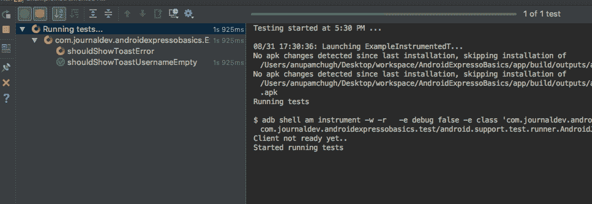

# 运行 espresso 测试案例时出现 OOM(内存不足)错误

> 原文：<https://medium.com/globant/oom-out-of-memory-error-while-running-espresso-test-cases-power-of-android-test-orchestrator-721ac7012f86?source=collection_archive---------3----------------------->



Gif from: [https://www.journaldev.com/23067/android-espresso](https://www.journaldev.com/23067/android-espresso)

当我们有超过 150–200 个为我们的应用程序编写的自动化测试用例，需要大约 1 到 1.5 小时才能完全运行时。在运行测试用例时，我们可能会面临 OOM(内存不足)错误的问题。

基本上，当一个接一个地运行多个测试用例时，设备的堆大小不断增加，在某个点之后，可能会导致 OOM 错误。

您可以尝试多种解决方案，例如:

1.  增加 RAM 的内存
2.  按模块划分测试用例

**Android Test Orchestrator 可以帮助我们解决这个问题**

在我们的项目中从头开始应用 Android Test Orchestrator 增加了我们自动化测试套件的可靠性。

Android Test orchestrator 提供了一个标志，在每个测试用例完成后清除所有的包数据。

```
*testInstrumentationRunnerArguments clearPackageData: 'true'*
```

当您使用上述标志添加 test orchestrator 时，它会在每次测试后从设备的 CPU 和内存中删除所有共享状态。

如果应用程序中出现应用程序崩溃，所有测试套件都会停止，而不会出现任何测试断言失败报告。当我们一起运行多个测试用例时，这种崩溃有时是令人头痛的。

因为 Android Test Orchestrator 创建了一个独立的工具实例。因此，如果有一个应用程序崩溃，那么这只会对当前的仪器崩溃，其他测试不会受到影响。

# 准备好实现 Android Test Orchestrator 了吗？

我们将从 Gradle 启用 android test orchestrator。

将以下几行添加到 Gradle 文件中

```
*android {  
 defaultConfig {*
 *...*
       *testInstrumentationRunner "android.support.test.runner.AndroidJUnitRunner"*
       *testInstrumentationRunnerArguments clearPackageData: 'true'*
*}
testOptions {*
 *execution 'ANDROID_TEST_ORCHESTRATOR'*
 *}*
*}* *dependencies {*
*androidTestImplementation 'com.android.support.test:runner:1.0.2'*
*androidTestUtil 'com.android.support.test:orchestrator:1.0.2'* 
*}*
```

**注意:检查并使用上述依赖项的最新版本。**如果你参考了 android 官方文档，你会注意到存在 android 依赖项。如果要添加 androidx 依赖项，请确保所有应用程序依赖项都应为 androidx 类型。

通过从命令行执行以下命令来运行 Android Test Orchestrator:

```
*./gradlew connectedCheck*
```

**注意:**如果您使用的是最新版本，请更新您的项目等级，如下所示:

```
*dependencies {   * 
 *classpath 'com.android.tools.build:gradle:*4.0.0*'* 
*}*
```

并运行上面的命令。如果您在低于 3.0 的任何版本中使用 Gradle build tools，您还必须更新项目的依赖设置。如果您的 Gradle 版本是旧的，您可能会发现错误“没有测试发现”。请更新你的简历。