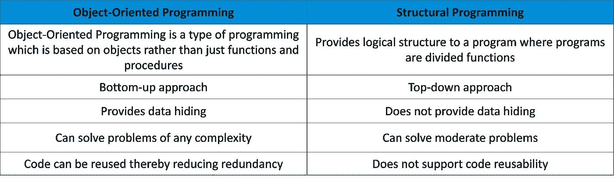
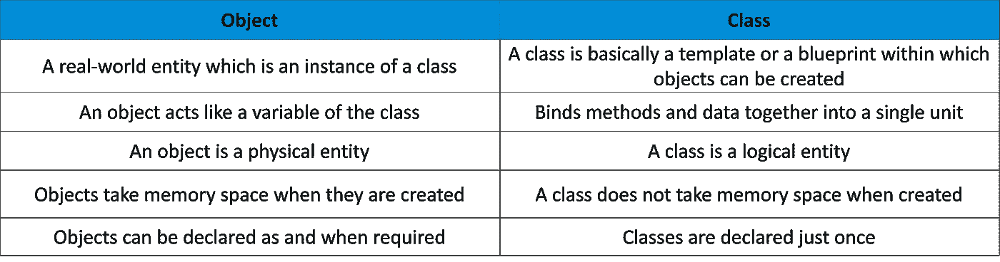
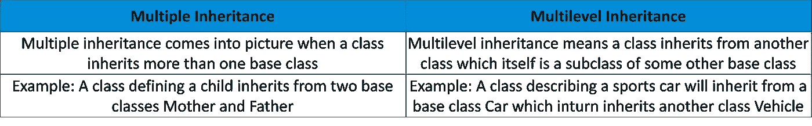
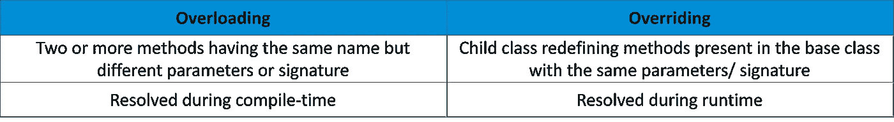
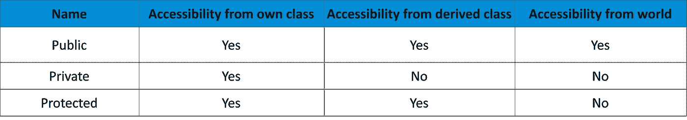
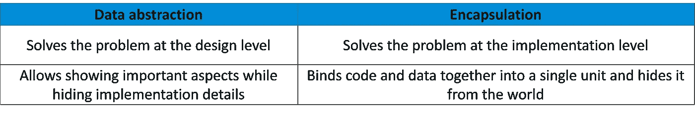
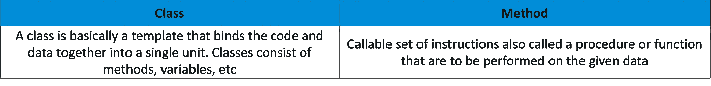
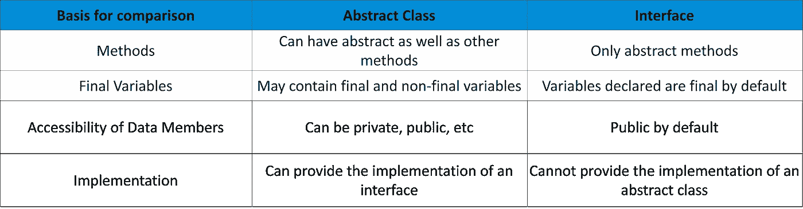
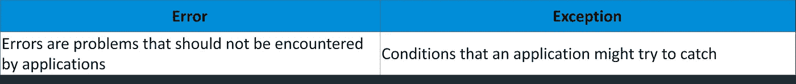

# 50 个重要的面试问题和答案

> 原文：<https://medium.com/edureka/oops-interview-questions-621fc922cdf4?source=collection_archive---------0----------------------->

OOPS Interview Questions — Edureka

OOPs 是编程世界中的主要概念之一，因此，你参加的每个面试都需要 OOPs 知识。本文整理了大一新生最常被问到的糟糕面试问题。所以去吧，做好准备。

让我们快速浏览一下所有的讨论主题:

*   基本的面试问题
*   哎呀面试问题类别和对象
*   关于 OOPs 功能的面试问题

1.  遗产
2.  多态性
3.  包装
4.  数据抽象

*   方法和功能面试问题
*   例外处理面试问题
*   哎呀的局限性

# 基本的糟糕面试问题:

## 1.OOP 和 SOP 有什么区别？

## 2.什么是哎呀？

OOPs(面向对象编程)是一种基于对象而不仅仅是函数和过程的编程。单个对象被分组到类中。OOPs 在编程中实现了真实世界的实体，如继承、多态、隐藏等。它还允许将数据和代码绑定在一起。

## 3.为什么用哎呀？

*   OOPs 允许编程清晰，从而允许简单地解决复杂的问题
*   代码可以通过继承重用，从而减少冗余
*   数据和代码通过封装绑定在一起
*   OOPs 允许数据隐藏，因此，私人数据是保密的
*   问题可以分成不同的部分，这样解决起来就简单了
*   多态的概念通过允许实体有多种形式，为程序提供了灵活性

## 4.OOPs 的主要特点是什么？

*   遗产
*   包装
*   多态性
*   数据抽象

# 类别和对象 OOPs 面试问题:

## 5.什么是对象？

对象是真实世界的实体，是 OOPs 的基本单位，例如椅子、猫、狗等。不同的对象有不同的状态或属性以及行为。

## 6.什么是课？

类是由不同状态和不同行为的对象组成的原型。它有许多方法是该类中存在的对象所共有的。

## 7.类和结构的区别是什么？

**类:**用户定义的蓝图，从中创建对象。它由要在对象上执行的方法或指令集组成。

**结构:**结构基本上是用户定义的不同数据类型的变量的集合。

## 8.不创建实例能调用基类方法吗？

是的，在以下情况下，您可以调用基类而无需实例化它:

*   这是一个静态方法
*   基类被其他一些子类继承

## 9.类和对象的区别是什么？

# 关于 OOPs 功能的面试问题

# 继承:

## 10.什么是继承？

继承是 OOPs 的一个特性，它允许类从其他类继承公共属性。例如，如果有一个类，如“vehicle”，其他类如“car”、“bike”等可以从 vehicle 类继承公共属性。该属性帮助您去除冗余代码，从而减少代码的整体大小。

## 11.有哪些不同类型的继承？

*   单一遗传
*   多重继承
*   多级遗传
*   分层继承
*   混合遗传

## 12.多重传承和多级传承有什么区别？

## 13.什么是混合遗传？

混合继承是多重继承和多层次继承的结合。

## 14.什么是层次继承？

层次继承是指一个基类有多个子类的继承。例如，vehicle 类可以包含“car”、“bike”等子类。

## 15.继承的局限性是什么？

*   增加了执行程序所需的时间和精力，因为它需要在不同的类之间来回跳转
*   父类和子类紧密耦合在一起
*   对程序的任何修改都需要修改父类和子类
*   需要小心实施，否则会导致不正确的结果

## 16.什么是超类？

超类或基类是作为其他类的父类的类。例如，Vehicle 类是 Car 类的超类。

## 17.什么是子类？

从另一个类继承的类称为子类。例如，类 Car 是 Vehicle 类的子类或派生类。

# 多态性

## 18。什么是多态性？

多态性是指以多种形式存在的能力。一个接口可以有多个定义。例如，如果您有一个名为 Vehicle 的类，它可以有一个名为 speed 的方法，但是您不能定义它，因为不同的车辆有不同的速度。该方法将在子类中定义，不同的车辆有不同的定义。

## 19.什么是静态多态性？

静态多态性(静态绑定)是一种发生在编译时的多态性。编译时多态性的一个例子是方法重载。

## 20.什么是动态多态？

运行时多态性或动态多态性(动态绑定)是一种在运行时解决的多态性。运行时多态性的一个例子是方法重写。

## 21.什么是方法重载？

方法重载是 OOPs 的一个特性，如果传递的参数不同，它可以为一个类中的多个方法提供相同的名称。

## 22.什么是方法重写？

方法覆盖是 OOPs 的一个特性，通过它子类或子类可以重定义基类或父类中的方法。这里，被重写的方法具有相同的名称以及表示传递的参数和返回类型的签名。

## 23.什么是运算符重载？

运算符重载是指使用用户定义的类型，根据传递的参数来实现运算符。

## 24.区分重载和重写。

# 包装

## 25.什么是封装？

封装是指将数据和处理数据的代码绑定在一个单元中。例如，一个类。封装还允许数据隐藏，因为一个类中指定的数据对其他类是隐藏的。

## 26.什么是“访问说明符”？

访问说明符或访问修饰符是确定 OOPs 中方法、类等的可访问性的关键字。这些访问说明符允许实现封装。最常见的访问说明符是 public、private 和 protected。然而，还有一些是特定于编程语言的。

## 27.公共、私有和受保护的访问修饰符之间有什么区别？

# 数据抽象

## 28.什么是数据抽象？

数据抽象是 OOPs 的一个非常重要的特性，它允许只显示重要的信息，隐藏实现细节。举个例子，在骑自行车的时候，你知道如果你踩油门，速度会增加，但是你不知道这实际上是怎么发生的。这是数据抽象，因为实现细节对骑手是隐藏的。

## 29.如何实现数据抽象？

数据抽象可以通过以下方式实现:

*   抽象类
*   抽象方法

## 30.什么是抽象类？

抽象类是由抽象方法组成的类。这些方法基本上都是声明了但没有定义的。如果这些方法要在某个子类中使用，它们需要在该子类中专门定义。

## 31.你能创建一个抽象类的实例吗？

不能。不能创建抽象类的实例，因为它没有完整的实现。但是，可以创建继承抽象类的子类的实例。

## 32.什么是接口？

这是 OOPs 的一个概念，它允许您在没有定义方法的情况下声明方法。与类不同，接口不是蓝图，因为它们不包含要执行的详细指令或动作。任何实现接口的类都会定义接口的方法。

## 33.区分数据抽象和封装。

# **方法和功能 OOPs 面试问题**

## 34.什么是虚函数？

虚函数是存在于父类中并被子类覆盖的函数。这些函数用于实现运行时多态性。

## 35.什么是纯虚函数？

纯虚函数或抽象函数是只在基类中声明的函数。这意味着它们在基类中不包含任何定义，需要在子类中重新定义。

## 36.什么是构造函数？

构造函数是一种特殊类型的方法，与类同名，用于初始化该类的对象。

## 37.什么是析构函数？

析构函数是一种在对象被销毁时自动调用的方法。析构函数还回收分配给被销毁对象的堆空间，关闭对象的文件和数据库连接，等等。

## 38.构造函数的类型

构造函数的类型因语言而异。但是，所有可能的构造函数都是:

*   默认构造函数
*   参数化构造函数
*   复制构造函数
*   静态构造函数
*   私有构造函数

## 39.什么是复制构造函数？

复制构造函数通过从同一个类的另一个对象中复制变量来创建对象。复制构造函数的主要目的是从现有对象创建一个新对象。

## 40.‘定案’有什么用？

Finalize 作为一个对象方法，用于在垃圾回收(GC)之前释放非托管资源并进行清理。它执行内存管理任务。

## 41.什么是垃圾收集(GC)？

GC 是自动内存管理的一种实现。垃圾收集器释放不再存在的对象所占用的空间。

## 42.区分类和方法。

## 43.区分抽象类和接口。

## 44.什么是最终变量？

值不变的变量。它总是通过非横截性来指代同一个对象。

# 异常处理

## 45.什么是例外？

异常是一种中断程序正常执行的通知。异常为错误提供了一种模式，并将错误传递给异常处理程序来解决它。一旦出现异常，程序的状态就会被保存。

## 46.什么是异常处理？

面向对象编程中的异常处理是一个非常重要的概念，用于管理错误。异常处理程序允许抛出和捕获错误，并实现一个集中的机制来解决它们。

## 47.错误和异常的区别是什么？

## 48.什么是 try/ catch 块？

try/ catch 块用于处理异常。try 块定义了一组可能导致错误的语句。catch 块主要捕获异常。

## 49.什么是 finally 块？

finally 块由用于执行重要代码(如关闭连接等)的代码组成。try 块退出时，该块执行。最后，它还确保即使在遇到意外异常的情况下，块也会执行。

# 哎呀的局限性

## 50.哎呀有什么局限性？

*   通常不适合小问题
*   需要密集测试
*   需要更多的时间来解决问题
*   需要适当的规划
*   程序员应该考虑用对象来解决问题

希望你清楚本教程中与你分享的所有内容。这就把我们带到了关于糟糕面试问题的文章的结尾。确保你尽可能多地练习，恢复你的经验。

如果你想查看更多关于人工智能、DevOps、道德黑客等市场最热门技术的文章，你可以参考 Edureka 的官方网站。

请留意本系列中的其他文章，它们将解释 Python 和数据科学的各个方面。

> 1.[Python 中的机器学习分类器](/edureka/machine-learning-classifier-c02fbd8400c9)
> 
> 2.[Python Scikit-Learn Cheat Sheet](/edureka/python-scikit-learn-cheat-sheet-9786382be9f5)
> 
> 3.[机器学习工具](/edureka/python-libraries-for-data-science-and-machine-learning-1c502744f277)
> 
> 4.[用于数据科学和机器学习的 Python 库](/edureka/python-libraries-for-data-science-and-machine-learning-1c502744f277)
> 
> 5.[Python 中的聊天机器人](/edureka/how-to-make-a-chatbot-in-python-b68fd390b219)
> 
> 6. [Python 集合](/edureka/collections-in-python-d0bc0ed8d938)
> 
> 7. [Python 模块](/edureka/python-modules-abb0145a5963)
> 
> 8. [Python 开发者技能](/edureka/python-developer-skills-371583a69be1)
> 
> 9.[用 Python 进行网页抓取](/edureka/web-scraping-with-python-d9e6506007bf)
> 
> 10.一个 Python 开发者的简历
> 
> 11.[Python 中的探索性数据分析](/edureka/exploratory-data-analysis-in-python-3ee69362a46e)
> 
> 12.[带 Python 的乌龟模块的贪吃蛇游戏](/edureka/python-turtle-module-361816449390)
> 
> 13. [Python 开发者工资](/edureka/python-developer-salary-ba2eff6a502e)
> 
> 14.[主成分分析](/edureka/principal-component-analysis-69d7a4babc96)
> 
> 15. [Python vs C++](/edureka/python-vs-cpp-c3ffbea01eec)
> 
> 16.[刺儿头教程](/edureka/scrapy-tutorial-5584517658fb)
> 
> 17. [Python SciPy](/edureka/scipy-tutorial-38723361ba4b)
> 
> 18.[最小二乘回归法](/edureka/least-square-regression-40b59cca8ea7)
> 
> 19. [Jupyter 笔记本小抄](/edureka/jupyter-notebook-cheat-sheet-88f60d1aca7)
> 
> 20. [Python 基础知识](/edureka/python-basics-f371d7fc0054)
> 
> 21. [Python 模式程序](/edureka/python-pattern-programs-75e1e764a42f)
> 
> 22.[Python 中的发电机](/edureka/generators-in-python-258f21e3d3ff)
> 
> 23. [Python 装饰师](/edureka/python-decorator-tutorial-bf7b21278564)
> 
> 24. [Python Spyder IDE](/edureka/spyder-ide-2a91caac4e46)
> 
> 25.[在 Python 中使用 Kivy 的移动应用](/edureka/kivy-tutorial-9a0f02fe53f5)
> 
> 26.[十大最佳学习书籍&练习 Python](/edureka/best-books-for-python-11137561beb7)
> 
> 27.[使用 Python 的机器人框架](/edureka/robot-framework-tutorial-f8a75ab23cfd)
> 
> 28.[使用 PyGame 的 Python 中的贪吃蛇游戏](/edureka/snake-game-with-pygame-497f1683eeaa)
> 
> 29. [Django 面试问答](/edureka/django-interview-questions-a4df7bfeb7e8)
> 
> 30.[十大 Python 应用](/edureka/python-applications-18b780d64f3b)
> 
> 31.[Python 中的哈希表和哈希表](/edureka/hash-tables-and-hashmaps-in-python-3bd7fc1b00b4)
> 
> 32. [Python 3.8](/edureka/whats-new-python-3-8-7d52cda747b)
> 
> 33.[支持向量机](/edureka/support-vector-machine-in-python-539dca55c26a)
> 
> 34. [Python 教程](/edureka/python-tutorial-be1b3d015745)

*原载于*[*https://www.edureka.co*](https://www.edureka.co/blog/interview-questions/oops-interview-questions/)*。*