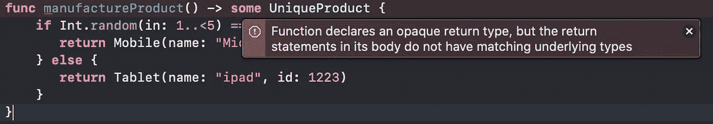

# 不透明返回类型

> 原文：<https://medium.com/globant/opaque-return-type-in-swift5-x-79cba49ccc39?source=collection_archive---------9----------------------->

Opaque return type is reverse generic behaviour. What?

## 那么，泛型是如何表现的呢？🤔

泛型函数、类、结构、枚举或 associatedtype 是以这样一种抽象和通用的方式设计的，即它们的调用方决定应该绑定什么类型，因为泛型类型的占位符和泛型代码的类型将适用于所有类型。例如:

在这里，当调用 **printArray** 函数时，无论传递什么类型，比如这个代码片段中的 **Int** 和 **String** 都会被传递，它们成为调用者的决定类型。由于其通用行为，printArray 方法适用于所有类型。有关 generic 的更多详情，请查看 Swift 中的 [Generic type。](/@nitesh.kumar.pal.dev/generic-type-in-swift-c37c993080e3)

## 反向类属

让我们颠倒一下用于解释上述一般情况的陈述。**反向泛型**是指当返回类型或参数类型在其托管代码内部决定时(如类、结构、枚举或函数本身内部)。

# 不透明返回类型(ORT)

ORT 意味着调用方不需要指定底层的返回类型或参数类型，而调用方必须确定获得具体的类型。

让我们看看不同类型的用例，通过这些用例，我们可以在不透明返回类型的帮助下解决问题:

> ***用例 1:自身或关联类型需求👇***

Though Mobile confirms the protocol UniqueProduct, you cannot set UniqueProduct as return type because of its generic behaviour, It requires special treatment. Let’s see how we can resolve the issue 👇

**解决方案 1:**

我们可以直接返回具体类型**移动**，因为**逆向泛型**概念说调用者必须获得具体类型。

Check the type by **option + click** on **product**, we can see **manufactureProduct**() is returning **Mobile** so as due to type inference **product** type is set as Mobile.

但是这里我们有一个问题，如果我们将 Mobile 设置为返回类型，它会将返回类型暴露给调用者，这意味着不完全符合。让我们看看如何在解决方案 2 中解决这个问题。

**解决方案 2:**

不透明的返回类型有助于避免向调用者公开返回类型。

(**some** is the keyword to indicate ORT)

Check the type by **option + click** on **product**, we can see **manufactureProduct**() is now showing **some UnqueProduct** as return type.

这里**一些 UniqueProduct** 暗示 manufactureProduct()将返回一个具体类型，该类型必须确认 **UniqueProduct** 协议。这正是反向类属概念。

呼叫者不知道产品的类型是**手机**还是**平板电脑**。这里我们利用了 ORT 的优势，它通过使用 **some** 关键字将返回类型定义为 ORT。

Phew! now you must have digested Reverse Generic with ORT, let's check UseCase 2 next

> ***用例 2:使用 ORT 隐藏复杂返回类型👇***

Please check this code sample before further reading.

在上面的代码片段中，相同的代码写在两个函数**getshortletdstudentlist**和**getshortletdstudents 中。**

函数**getshortlestedstudentlist**中编写的代码实际上是返回类型**lazy map sequence<lazy filter sequence<lazy sequence<【学生】>。元素>，字符串>** 因此由于类型推断*shortabledbysixtycutoff*常量的类型将是相同的。在 ORT 的帮助下，我们可以隐藏这些不必要的类型细节。

调用者更感兴趣的只是得到结果类型，根据要求，这里只是简单的**集合**类型。因此，只需将**某个集合**设置为**getshortletedstudents**的返回类型，就可以解决将所有类型细节暴露给*shortletbebyventycutoff*常量的问题。

我们可以看到 SwiftUI 中的**视图**协议使用了相同的方法

Option + click on **stack**

It’s returning the complex type as **VStack<TupleView<(Text, Text)>>** but the type of body would be always **some View** which implies that it would always carry a concrete type with the abstraction of ORT

> ***用例 3:你不能欺骗 ORT 的具体类型。***

使用 ORT 作为返回类型，如果编译器不允许，就不能编写可能返回多种类型的代码😈。

让我们看看这意味着什么:

Either return type can be Mobile

or return type can be Tablet

But function cannot return multiple types if the return type is OTR.

# 摘要

*   不透明返回类型的使用非常具体，您可以在**用例 1** (协议中的自身或关联类型需求)和**用例 2** (通过使用 ORT 隐藏复杂的返回类型)中看到。

**结构** VStack <内容>:查看**其中**内容:查看

在 SwiftUI 中，观察诸如 HStack、ZStack、Group、List 等类型，它们确认**视图**，也期望它们的泛型类型(**内容**)无论是什么都必须确认**视图。**

*   SwiftUI 中有许多这样的通用类型，它们可以包含创建复杂类型结构的其他视图。ORT 对只会知道这个结构是**某个视图**的客户(呼叫者)很有帮助。
*   ORT 使您的代码在运行时更具性能。因为协议迫使编译器在运行时检查其底层的具体类型，这增加了性能开销。但是 ORT 为编译器提供了具体类型的保证，即使是在编译时。
*   一般来说，在应用程序开发中，由于我们不怎么处理协议中的泛型和 Self 或 associatedtype，我个人认为使用 ORT 的理由很少，但另一方面，如果您正在构建一个框架或库，其中您将广泛使用 ORT **用例** (1、2 和 3)，并且您希望使您的代码灵活、高度可重用，并对调用者抽象复杂的泛型类型，那么您应该使用 ORT。
*   作为开发人员，我们有时需要灵活性，根据某个参数值(比如不同的枚举情况)从函数中返回多个具体类型，在这种情况下，我们不能使用 ORT。

**您可以在以下链接查看不透明类型的更多详情:**
[Swift-Book:不透明类型](https://docs.swift.org/swift-book/LanguageGuide/OpaqueTypes.html)
[不透明返回类型建议:SE-0244](https://github.com/apple/swift-evolution/blob/master/proposals/0244-opaque-result-types.md)

感谢您阅读博客，如果您发现更多的用例，请告诉我，我们也可以将它们添加到这里。分享一下你的想法。