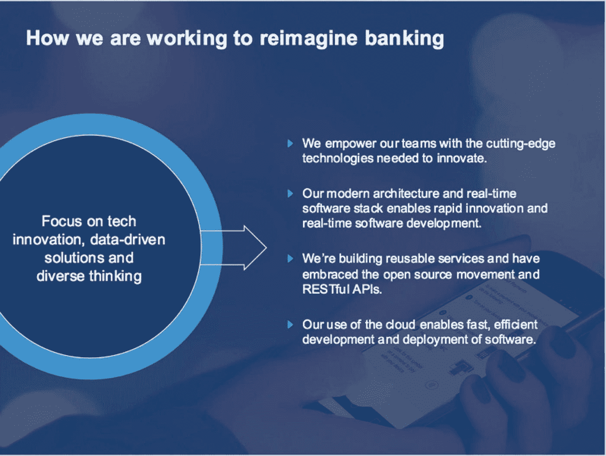
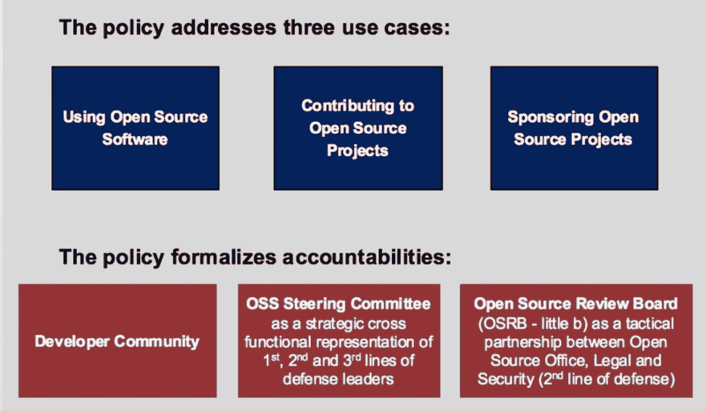
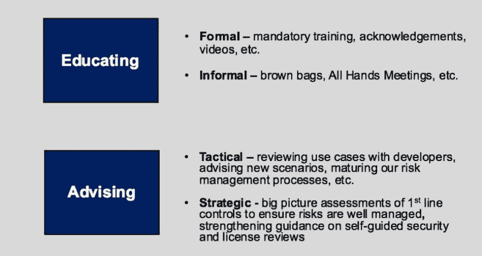

# 受监管环境中的开源

> 原文：<https://medium.com/capital-one-tech/open-source-in-a-regulated-environment-dc4b4d9af3f8?source=collection_archive---------0----------------------->

## 我们在 Capital One 的开源之旅中学到的经验

大多数人都知道 Capital One 是美国最大的信用卡公司之一。有些人还知道我们是美国最大的银行之一，按资产计算在美国排名第八。但 Capital One 也是一家专注于技术的数字银行，它很自豪能够通过我们对尖端技术和创新数字产品的承诺来颠覆金融服务行业。像所有美国银行一样，Capital One 在高度监管的环境中运营，优先保护我们的消费者及其财务数据。这使我们有别于许多公司，他们没有在相同的监督和责任水平下运营。

我们重塑银行业的目标是吸引优秀的工程师，他们希望成为重塑金融科技行业运动的一部分。在采访中，他们经常惊讶地发现我们希望他们使用开源项目，并为开源社区做出贡献。我们赞助由我们的工程师构建的开源项目，这让更多人大吃一惊。

> ***人们期待那种行为发生在初创企业，而不是顶级银行。Capital One 和我们的技术方法没有任何传统可言。***

当我们看到机会时，尤其是在技术领域，我们会刻意去追求。我们管理技术的方法，以一般的行业法规和公司特定的政策为指导，为使用、贡献和启动开源软件项目提供了护栏。开源办公室采用了一种全面的风险管理方法，在这种方法中，我们明确了何时使用、贡献和启动开源项目的风险归属。

我们管理开源风险和实施这一战略方法的旅程遵循了以下轨迹:

*   工程师们希望使用开源项目并为之做出贡献。
*   风险被识别、分析，并与开源办公室、法律和安全团队一起规划出管理风险的途径。
*   关注教育，外部合作伙伴提供指导(Linux、TODO 等)。).
*   随着我们与工程、法律、安全和审计团队的内部合作关系日趋成熟，我们的发展势头越来越强劲。
*   向领导者解释和展示我们的风险管理方法，获得赞助和资源。

# 组成一个办公室

在领导层的大力支持下，2015 年，我们通过创建 Capital One 开源办公室(OSO)实现了监管和治理的正规化。凭借在法律和安全方面的强大合作伙伴关系，在 OSO 内部建立了负责建议和监督开源活动的资源。
通过这些合作关系，OSO 团队管理公司的开源贡献，包括以下三大支柱:

*   **管理方向** —政策、指导和教育。
*   **管理关系** —内部和外部，以及与法律、安全和其他利益相关方的合作关系。
*   **管理技术** —支持开源流程和社区需求。

作为一个横向功能，OSO 管理的方向和基于风险的方法资本一个与开源。我们合作定义了开源软件的公司级政策，并开发了教育材料和视频，以指导团队和个人开发人员如何管理定义的风险。每天，OSO 团队成员与我们的法律和安全合作伙伴一起，与工程师和数据科学家合作，了解使用案例，并就如何正确管理风险提供指导。
此外，OSO 还负责管理与 Capital One 各个团队的内部关系(工程、法律、商标、安全、品牌、企业沟通、风险管理、审计等)。)，我们积极管理与外部社区的关系，如 [Linux](https://www.linuxfoundation.org/) 和 [Apache](https://www.apache.org/) 基金会。我们也是[开放 API 计划](https://www.openapis.org/)、[云计算本地计算基金会](https://www.cncf.io/) (CNCF)和 [TODO 小组](http://todogroup.org/)的活跃成员。我们还积极地与我们自己的开源项目社区的成员互动(例如 [Hygieia](https://developer.capitalone.com/opensource-projects/hygieia/) 和[云托管](https://developer.capitalone.com/opensource-projects/cloud-custodian/))。

# 通过公司政策和标准使护栏正规化

2016 年，OSO 基于 Linux 基金会的一个例子，定义了企业级开源软件政策和开源软件标准。该策略针对三种使用情形，并在以下情况下提出管理风险的要求:

1.  使用开源软件项目。
2.  为开源项目做贡献。
3.  [赞助开源项目。](https://developer.capitalone.com/open-source/)

该政策还正式规定了 Capital One 的三个主要开源利益相关方的责任，包括:

1.  开发者/工程社区。
2.  在不同团体之间建立新的战略伙伴关系，称为开源指导委员会。
3.  定义了开源评审委员会中 OSO、法律和安全部门之间的战术合作关系。

随着我们制定这一政策并正式确定责任，我们在 OSO、法律和安全部门之间建立了战术合作伙伴关系，就像 OSRB 一样。这个战术团队致力于指导开发社区的开源活动。我们还建立了一个战略领导委员会，名为 OSS 指导委员会，这是一个由十几个领导人组成的小组，他们为开发社区提供战略指导。

# 更上一层楼

展望我们的开源之旅，我们计划将重点放在:

*   继续教育我们不断发展的技术组织。
*   在管理风险和最小化开发瓶颈之间取得平衡。
*   进一步自动化许可证和安全扫描，并将其集成到我们的构建流程中。
*   建立和发展强大的治理职能。

具体来说，2018 年我们将重点关注教育，加强开发社区的意识，并确立我们作为顾问的角色。

多个利益相关者之间的合作是我们开启开源之旅的关键。Capital One 是一家技术驱动的公司，我们在整个组织内团结一致，在 2018 年将我们的开源活动提升到一个新的水平。

归根结底，我们坚信参与开源项目的好处。通过政策、标准和跨部门协作管理相关风险，OSO 允许 Capital One 充分利用我们在该社区的参与。

*声明:这些观点是作者的观点。除非本帖中另有说明，否则 Capital One 不属于所提及的任何公司，也不被其认可。使用或展示的所有商标和其他知识产权都是其各自所有者的所有权。本文为 2018 首都一。*