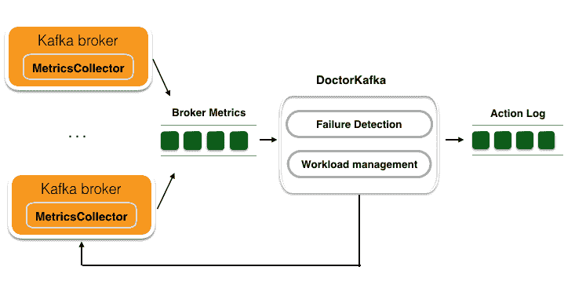
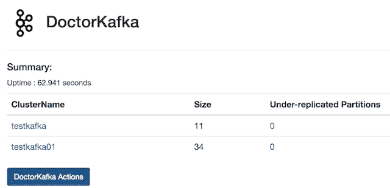
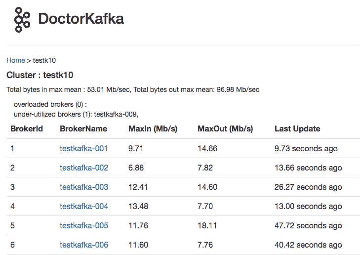
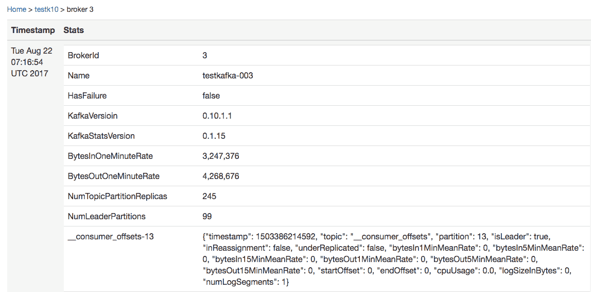

# 开源 DoctorKafka: Kafka 集群修复和工作负载平衡

> 原文：<https://medium.com/pinterest-engineering/open-sourcing-doctorkafka-kafka-cluster-healing-and-workload-balancing-e51ad25b6b17?source=collection_archive---------3----------------------->

杨宇| Pinterest 工程师，数据工程

在 Pinterest，我们使用 [Kafka](https://kafka.apache.org/) 作为数据接收、流处理等的中央消息传输器。随着+1.75 亿用户群的不断增长，以及+1000 亿 pin 图的不断扩展，我们目前在云中运行> 1，000 个 Kafka 经纪人。

在这种规模下，我们每周都会遇到 Kafka broker 失败，有时一天内会遇到多次失败。当一个代理出现故障时，随叫随到的工程师需要及时替换死去的代理，以最大限度地降低由于其他节点故障而导致数据丢失的风险。我们经常需要在代理之间转移工作负载，以平衡工作负载。替换代理和重新平衡工作负载需要仔细创建和编辑分区重新分配文件，并手动执行 Kafka 脚本命令。这些操作给团队增加了大量开销。

为了扩大 Kafka 服务的规模，我们构建了 DoctorKafka，这是一种 Kafka 集群自动修复和工作负载平衡服务。DoctorKafka 可以检测代理故障，并自动将工作负载从故障代理重新分配给健康代理。它还可以根据设置执行工作负载平衡。今天我们在 [GitHub](https://github.com/pinterest/doctorkafka) 上发布 DoctorKafka 开源项目。在本帖中，我们将介绍它的架构以及它如何对你有用。

## **高层概述**

Figure 1\. High-level overview of DoctorKafka

图 1 显示了 DoctorKafka 的高级概述。它由三部分组成:

*   部署在每个代理上的**指标收集器**。它定期收集 Kafka 进程和主机指标，并将它们发送到 Kafka 主题。我们使用 Kafka 作为代理统计数据存储，以简化 DoctorKafka 的设置并减少其对其他系统的依赖。
*   一个**中央 DoctorKafka** 服务，管理多个集群，分析代理统计指标以检测代理故障，并执行集群修复或工作负载平衡的操作命令。DoctorKafka 在另一个“动作日志”主题中记录执行的命令。
*   用于浏览 Kafka 集群状态和查看执行历史的 web UI**。图 2 显示了管理两个测试集群的 UI。图 3 是一个集群的详细视图。**

Figure 2\. DoctorKafka front page

注意，DoctorKafka 只采取自信的行动。如果不确定要采取哪些措施，它会发出警报。

Figure 3\. DoctorKafka cluster view

## **行动中的卡夫卡医生**

指标收集器在每个代理上运行，收集 Kafka 代理关于入站和出站网络流量的指标以及每个副本的统计信息。图 4 显示了指标收集器收集的部分代理统计信息。主题分区重新分配通常会导致额外的网络流量并扭曲指标，即使有复制配额设置(在 Kafka 0.10.1 中可用)。因此，在收集指标时，指标收集器会明确报告主题分区是否参与了重新分配。

Figure 4\. Broker stats collected by metrics collector

当中央 DoctorKafka 服务启动时，它首先读取过去 24-48 小时的代理统计数据。通过这个 DoctorKafka 可以推断出每个副本工作负载的资源需求。由于 Kafka 的工作负载主要受网络限制，DoctorKafka 只关注副本网络带宽的使用。

启动后，DoctorKafka 会定期检查每个集群的状态。当检测到代理故障时，它会将故障代理的工作负载重新分配给具有可用带宽的其他代理。如果集群中没有足够的资源来重新分配工作负载，它将发送警报。类似地，当 DoctorKafka 进行工作负载平衡时，它会识别网络流量超过设置的代理，将工作负载转移到流量较少的其他代理，或者执行首选领导者选举来转移流量。我们忽略在分区重新分配和网络流量冷却期间收集的代理统计信息，以获得更精确的工作负载信息。

DoctorKafka 已经在 Pinterest 上制作了几个月，帮助我们管理了 1000 多个 Kafka 经纪人。我们很乐意向社区发布它，你可以在 [GitHub](https://github.com/pinterest/doctorkafka/) 上找到它的源代码和设计文档。非常欢迎您的反馈和意见！

开源是 Pinterest 工程师的一大要务。像 YouTube、[、谷歌](https://www.appsight.io/sdk/pinremoteimage)、Tinder、 [Snap](https://www.appsight.io/sdk/pin-cache) 等公司使用我们的开源技术来支持应用持久化、图像下载等等。对于我们所有的开源项目，请查看我们的 [GitHub](https://github.com/pinterest/) 。

如果您对开源或大规模解决此类基础设施挑战感兴趣，[加入我们的](https://careers.pinterest.com/)！

*致谢:感谢 Jon Parise 在开源过程中对我的帮助。*