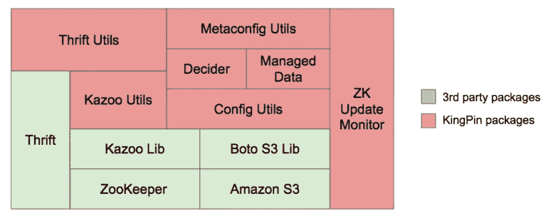
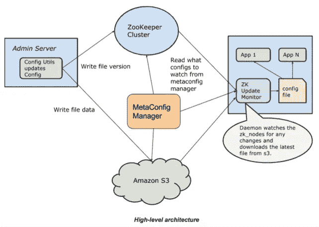
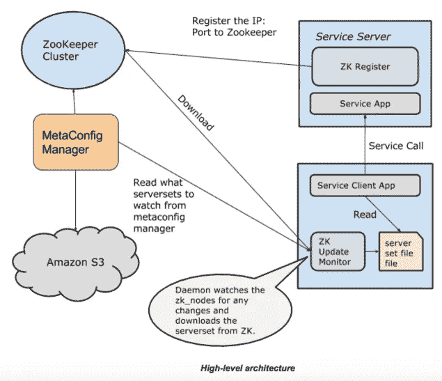

# 开源中心，扩展 Pinterest 的基石

> 原文：<https://medium.com/pinterest-engineering/open-sourcing-kingpin-building-blocks-for-scaling-pinterest-8febe81f2c1c?source=collection_archive---------3----------------------->

张数| Pinterest 基础设施工程师

当我们第一次开始构建 Pinterest 时，我们使用 Python 作为我们的开发语言，这有助于我们快速可靠地构建。多年来，我们围绕 Python 构建了许多工具，包括 [Pinball](https://github.com/pinterest/pinball) 、 [MySQL_utils](https://github.com/pinterest/mysql_utils) 和 [pymemcache](https://github.com/pinterest/pymemcache) ，以及一组日常用于服务通信和配置管理的库。今天我们发布这个工具集， [KingPin](https://github.com/pinterest/kingpin) ，作为我们最新的开源包。

KingPin 包含了我们在扩展 Pinterest 时学到的一些最佳实践，包括:

*   一个本地守护进程来处理 [ZooKeeper 的](https://zookeeper.apache.org/)单点故障(SPOF)问题。该守护程序运行在大约 20K 台主机上，在不到 10 秒的时间内提供配置数据。
*   用于增强功能的 Python 节俭客户端包装器。我们通过这个 Python 客户端在 Pinterest 上每秒发送几十万个请求。
*   配置管理框架。我们有超过 400 种配置通过这个框架进行更新和使用。

## 中枢使用案例

在以下任何情况下，您都可以尝试使用 KingPin:

*   您的栈也是面向 Python 的，运行在 AWS 上。
*   你想让你的 ZooKeeper 集群更健壮，更有弹性。
*   您正在构建一个配置系统，并希望您的配置支持一组丰富的数据结构，如列表、映射、集合和 JSON。
*   您希望使用 S3 来存储一些最重要的元数据。
*   您正在使用 Thrift 并寻找一个更可靠的客户端库。

## 中枢建筑

KingPin 具有以下协同工作的组件:

*   **Kazoo Utils:**Kazoo[的包装器，它实现了我们用于 RPC 框架、服务发现和本地 Kazoo APIs 的一些增强的 Utils。](https://kazoo.readthedocs.org/en/latest/)
*   **Thrift Utils:** 一个 [greenlet-safe 包装器](https://engineering.pinterest.com/blog/how-we-use-gevent-go-fast)，用于 Python Thrift 客户端，内置了错误处理、重试处理、负载平衡和连接池管理。
*   **配置实用程序:**一个在 [S3](https://aws.amazon.com/s3/) 上存储配置的系统，使用 ZooKeeper 作为通知系统向订阅者广播更新。(参见我们之前的[博文](https://engineering.pinterest.com/blog/serving-configuration-data-scale-high-availability)了解更多细节。)
*   ZK 更新监视器:一个本地守护进程和服务器，将订阅的配置和服务器集从 ZooKeeper 和 S3 同步到本地磁盘。这是我们如何使用 ZooKeeper 容错的关键部分。(关于这个设计的更多信息，请看[这篇博文](https://engineering.pinterest.com/blog/zookeeper-resilience-pinterest)。)
*   **Decider:** 我们用来控制在线逻辑流程的实用程序，一个典型的用例是实验控制。设置了决策器，因此每个 A/B 测试实验都可以实时打开或关闭，而无需部署任何代码。决策器是建立在配置工具之上的。
*   **托管数据结构:**Python 中一个方便的映射/列表数据结构抽象，构建在配置工具之上。
*   **元配置管理器:**管理所有配置/服务器集和依赖关系(订阅)的系统，构建在配置实用程序之上。

## 实时配置管理和部署

KingPin 的另一个用例是实时管理配置。例如，工程师可以通过[元配置管理器](https://github.com/pinterest/kingpin/blob/master/kingpin/metaconfig/metaconfig_utils.py)创建一个新的配置，并将其添加到我们称之为“依赖”的订阅中

配置内容作为基本事实存储在 S3 中，并使用 ZooKeeper 来跟踪和传播更新。为了正确下载订阅的配置， [ZK 更新监视器](https://github.com/pinterest/kingpin/blob/master/kingpin/zk_update_monitor/zk_update_monitor.py)必须在订阅者机器上运行。

应用程序可以读取文件并解码成 Python 对象，以便使用各种 API 进行 CRUD 操作。

## 服务发现

我们依靠 KingPin 在 Pinterest 内部走向 SOA(面向服务的架构)。SOA 的一个基本构件是服务发现。服务客户机需要知道服务端点的地址，以便连接并向它们发送请求。KingPin 提供了一个[脚本](https://github.com/pinterest/kingpin/blob/master/kingpin/zk_register/zk_register.py)供服务端点向 ZooKeeper 注册，这样服务客户机就可以使用端点列表(“serverset”)。

类似地，ZK 更新监视器从 ZooKeeper 下载服务器集，并将其放入本地文件。当服务器节点加入或离开时，服务器集会动态变化。

使用 Thrift Utils 中提供的 [Mixin](https://github.com/pinterest/kingpin/blob/master/kingpin/thrift_utils/thrift_client_mixin.py#L380) ，Thrift 客户机读取本地服务器集文件，并使用任何 [HostSelector](https://github.com/pinterest/kingpin/blob/master/kingpin/kazoo_utils/hosts.py#L155) 算法与端点对话。Mixin 还管理连接池，并允许用户根据特定的用例设置各种超时和重试策略。

## 入门指南

我们在基础设施的各个部分使用 KingPin。例如，ZK 更新监视器运行在 Pinterest 的每个盒子上，实时部署最新的配置和服务器集。托管数据结构用于提供写入罕见读取频繁的配置数据，例如我们用来过滤垃圾邮件的域黑名单。每一个节俭的客户都使用 Python 服务框架。这里有数百个决策者控制在线逻辑，开启和关闭各种实验。

您现在可以访问[源代码](https://github.com/pinterest/kingpin)、[操作指南](https://github.com/pinterest/kingpin/blob/master/README.md)和[示例](https://github.com/pinterest/kingpin/tree/master/examples)供自己使用。如果您有任何问题或意见，请拨打[kingpin-dev@googlegroups.com](mailto:kingpin-dev@googlegroups.com)联系我们。

*鸣谢:KingPin 是 Pinterest engineering 的共同努力，多年来已经有了显著的发展。供稿者包括陈晓芳、Tracy Chou、Dannie Chu、Pavan Chitumalla、Steve Cohen、Jayme Cox、Michael Fu、洪家成、、Yash Nelapati、Aren Sandersen、Aleksandar Veselinovic、Chris Walters、和。感谢 Jon Parise 在开源过程中给予的支持。*