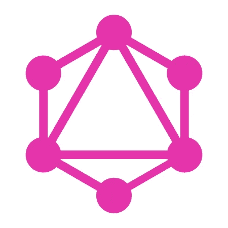

# 开放源码 Lacinia，我们针对 Clojure 的 GraphQL 库

> 原文：<https://medium.com/walmartglobaltech/open-sourcing-lacinia-our-graphql-library-for-clojure-96a4ce5fc7b8?source=collection_archive---------2----------------------->

GraphQL Logo Copyright © 2016 Facebook Inc. under BSD-3-Clause

我们很高兴为 Clojure 发布我们的 GraphQL 库 [Lacinia](https://github.com/walmartlabs/lacinia) ！一年多来，我们一直在生产中为多种服务使用 GraphQL。

作为发布的一部分，我们想讨论我们团队采用 GraphQL 的基本原理，我们面临的问题，GraphQL 是如何解决这些问题的，以及我们今后的发展方向。

这是一个非技术性的解释，说明为什么我们认为 GraphQL 是解决问题的好方法。有关 Lacinia 的文档，请参考 [Github 存储库](https://github.com/walmartlabs/lacinia)。

## 我们的问题

我们团队的主要职责之一是为沃尔玛和山姆会员店的客户提供直接从其 iOS/Android 智能手机或网络浏览器获取店内收据的完整历史的即时途径。我们对五千多家商店的每次购买和退货进行实时处理，每秒钟收到 500 张收据，在黑色星期五和整个假期期间，这个数字将翻两番。

最终，我们有了一个相当大的卡桑德拉数据库，里面有客户、收据以及联系他们的协会。我们的整个服务器端堆栈都是用 Clojure 编写的，旨在高效、可靠地为传入的数据提供服务。有关所有这些工作原理的一些幕后故事，请参阅 Anthony Marcar 在 Clojure/West 2015 上的演讲，[clo jure At Scale At Walmart labs](https://www.youtube.com/watch?v=av9Xi6CNqq4)。

为了尽我们所能为沃尔玛和山姆会员店的客户提供最好的服务，我们向公司内的许多团体提供大量数据。每个组织都有自己的需求和关注点，例如:

*   移动应用程序团队只想要填充简洁视图所需的字段。他们关心的是收据的总购买价格、物品数量、日期和地点等。他们还需要通过后续电话获得更详细信息的能力。移动工程师需要优化的有效载荷和在设计过程中快速迭代的能力，而不需要等待后端的改变。任何发送到客户端的额外数据都是浪费带宽。
*   开发网站的团队针对桌面网络浏览器提供了更丰富的购物体验。他们通常在更大的视野下工作，比移动应用团队更想获得更详细的信息。
*   其他团队通常有一两个他们需要回答的核心问题，并且希望能够查询我们的系统来找到这些特定的参数。例子包括储蓄捕捉器，如果客户在竞争对手的商店里有更低的价格，它会将购买的商品记入他们的贷方；以及客户保护系统，如果购买的商品以后被召回，它会通知客户。

这些团队中的每一个对于需要访问的事务数据子集都有着非常不同的需求。让我们的数据易于消费，尤其是因为我们是一个工程师小组，这是一个传统 REST API 结构无法解决的核心挑战。

随着时间的推移，我们发现自己处于维护、扩展和记录 API 集合的尴尬境地，每个 API 最初都是为特定的用例构建的。这些 API 中的每一个都使用了不同的 HTTP 堆栈，配置也不同，并且在 URL 方案、查询参数等方面都有自己的特定约定，这是受它们创建时的实践的启发。较新的服务使用了[基座](https://github.com/pedestal/pedestal)和[组件](https://github.com/stuartsierra/component)；旧的服务使用环处理程序和分散的可变状态。

与此同时，我们有更多的团队对在我们的基础上构建服务感兴趣——这是一个好问题。发展这些现有的 API 是一个困难的问题。向 JSON 响应中添加一个新字段是有风险的，因为对于一些依赖于绑定到一组确切的已知键的响应的客户机来说，这可能会产生无法预料的后果。因为我们的服务利用了共享的内部库，所以对这些库中的一个进行更改可能会无意中改变另一个不相关的服务的行为。

我们希望能够自由地发展和改进我们的 API，而不需要复杂的版本控制方案和复杂的迁移计划。我们需要能够自信地对支持代码进行更改，而不必担心在广泛的服务中未发现的副作用。作为后端团队，我们决定不再为产品团队做产品决策。相反，我们授权每个团队以最好地支持他们正在构建的特定产品的方式来查询我们的系统。

## 解决方案

在脸书发表了关于 GraphQL 及其基本原理的会议演讲和文章后，我们相信这项技术将成为改进我们服务的一种优雅的方式。不过，有一个问题:我们是一个 Clojure 团队。当时 GraphQL 对 Clojure 还没有一个好的故事。幸运的是，GraphQL 有一个健壮的规范，所以我们开始构建自己完全实现的实现— [Lacinia](https://github.com/walmartlabs/lacinia) 。

GraphQL 规范对我们来说非常重要。我们的理念是，我们的库需要将 GraphQL 作为一种通用语言来使用和理解，并且已经建立了执行语义，但是我们正在努力寻找一种在 Clojure 生态系统中工作得最好的惯用解决方案。这种哲学的一个例子是尽可能数据驱动:声明 GraphQL 服务器功能的模式定义是用 EDN 编写的，并使用 Clojure 数据结构。用 Clojure 代码操作这种数据结构不仅受到支持，而且受到鼓励。

同时，使用 Clojure 执行 GraphQL 查询非常自然。从本质上讲，GraphQL 是一种非常功能化的方法:一个过滤和转换过程，从所有可能的数据开始，缩小到客户机请求的结果。Clojure 对纯函数和持久数据结构的使用确保了这些操作的安全和高效。

在开发了 Lacinia 的内部版本后，我们能够抛弃几乎所有现有的 API，并将当前和未来的客户端装载到我们的 GraphQL 服务上。当你在手机上打开你的沃尔玛商店收据，或访问[samsclub.com](http://www.samsclub.com)并在网上查看你的收据时，你正在接受 Lacinia 的服务。如果你使用[沃尔玛超市](http://grocery.walmart.com/)，你使用的是 Lacinia。

我们围绕我们的数据模型设计我们的模式，客户可以简单地询问他们需要什么。当然，我们不可能知道*所有*可能的用例，但是当客户告诉我们他们不能查询他们想要的东西时，我们通常可以添加缺失的字段或关系，并在几分钟内部署它。通常，我们的内部数据模型已经包含了这些信息，只需要更新模式来公开新的字段。因为客户端控制他们看到的数据，所以向现有模式添加新的字段和类型总是安全的，并且总是向后兼容的。

不仅如此，模式中的一切都可以通过自省完全发现和记录。我们服务于一个实例的[图 *i* QL](https://github.com/graphql/graphiql) (带有一个 *i* ！)基于 web 的 IDE:这允许其他团队的开发人员交互式地构建和执行查询。Lacinia 自动实现 GraphQL 规范的自省部分；我们所要做的就是包含关于字段和类型的面向用户的文档。

以前，在协助其他团队时，我们会抛出一些特别的 curl 命令，重现我们客户的问题总是一个挑战。今天，我们传递一个图 *i* QL 链接，它可以包含整个查询——即时再现。

大多数情况下，让一个新客户加入我们的服务只是给他们一个 QL 图的 URL，他们可以快速地、交互式地勾画出他们的查询，并通过界面了解所有的字段和类型。如果他们有问题或疑问，他们可以将他们的疑问发送给我们。一个令人惊讶的分支是，作为该服务的开发者，我已经开始依赖 Graph *i* QL 来完成我自己的日常工作流程:构建 GraphQL 查询比直接访问底层 Cassandra 数据库更快更容易。GraphQL 之上的 Graph *i* QL 构成了一个异常强大的工具。

我们认为 clojure.spec 是健壮的 clojure 系统的未来。Lacinia 支持 clojure.spec，并努力在整个过程中利用它。例如，自定义标量是使用 conformers 定义的。为了在 Clojure 1.9 迭代各种 alpha 版本时保持 Clojure 1.8 的稳定，我们引入了 [clojure-future-spec](https://github.com/tonsky/clojure-future-spec) ，这是 Clojure 1.9 可用的各种 clojure.spec 特性的反向移植。

## 今后

从技术和文化的角度来看，GraphQL 代表了我们系统的一个关键部分。沃尔玛是一个很大的地方，当我们让公司其他部门的人参与 GraphQL 时，他们有兴趣更多地了解我们在用它做什么，以及他们如何从我们的工作和经验中受益。我们很高兴能在开放的环境中继续开发 Lacinia。Lacinia 还没有完全符合发布的[规范](https://facebook.github.io/graphql/)，但是我们希望很快就能达到。我们渴望与社区合作，我们将愉快地接受和讨论任何问题或请求。

更多信息和技术文档，请访问 [Github 库](https://github.com/walmartlabs/lacinia)。