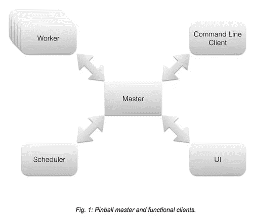

# 开源弹球

> 原文：<https://medium.com/pinterest-engineering/open-sourcing-pinball-47b0dad81326?source=collection_archive---------3----------------------->

刘长书叶茂 pawel Garbacki & joo seong Kim | Pinterest 工程师

随着我们继续在快速和动态的环境中构建，我们需要一个灵活的工作流管理器来满足我们的数据处理需求。在尝试了几个选项之后，我们决定自己建造一个。今天，我们正在开源 [Pinball](https://github.com/pinterest/pinball) ，它旨在满足广泛的数据处理管道的需求，这些管道由从简单的 shell 脚本到复杂的 Hadoop 工作负载的作业组成。弹球加入了我们的其他开源项目，如 [Secor](https://engineering.pinterest.com/post/84276775924/introducing-pinterest-secor) 和 [Bender，](https://github.com/pinterest/bender)在我们的 [Github](https://github.com/pinterest?page=1) 上可用。

## 构建高度可定制的工作流管理器

新产品功能的开发通常受到支持它们的数据可用性的限制。原始数据通常来自日志，在达到适合下游应用程序摄取的形状之前，会在多个维度上进行切片、切块、合并和过滤。数据转换的过程通常被建模为工作流，抽象地说，工作流是表示处理步骤的节点和描述运行后依赖关系的边的有向图。

工作流可能非常复杂。在现实环境中，遇到由数百个节点组成的工作流并不罕见。构建、运行和维护如此复杂的工作流需要专门的工具。Bash 脚本不行。

在对一些开源工作流管理器进行试验后，我们发现它们都不够灵活，无法适应我们[数据处理解决方案](https://engineering.pinterest.com/post/92742371919/powering-big-data-at-pinterest)不断变化的环境。特别是，当前可用的解决方案要么支持特定类型的作业(例如 [Apache Oozie](http://oozie.apache.org/) 针对 Hadoop 计算进行了优化)，要么抽象地宽泛且难以扩展(例如单片 [Azkaban](http://data.linkedin.com/opensource/azkaban) )。考虑到这一点，我们接受了实施高度可定制的工作流管理器版本的挑战，以适应数据处理用例的发展，从执行基本的 shell 命令到在 Hadoop、Hive 和 Spark 上进行复杂的 ETL 风格的计算。

我们所有的工程团队都使用 Pinball，它处理数百个工作流和数千个作业，这些作业在我们的 Hadoop 集群中每天处理近 3pb 的数据。最大的工作流有 500 多个作业。工作流生成分析报告，建立搜索索引，训练 ML 模型，并执行大量其他任务。

## 平台与最终产品

Pinball 提供完整的端到端解决方案，开箱即用。同时，它的组件式设计允许容易的改变。Pinball 的[工作流管理层建立在实现原子状态更新的通用抽象之上。](https://engineering.pinterest.com/post/74429563460/pinball-building-workflow-management)

从概念上讲，Pinball 的体系结构遵循主-工作器(或主-客户机，以避免与我们下面介绍的特殊类型的客户机混淆)范式，其中有状态的中央主充当无状态客户机的当前系统状态的真实来源。客户端有不同的风格，从负责作业执行的工作人员，到控制工作流何时运行的调度程序和允许用户与系统交互的 UI，再到命令行工具。所有客户端都使用由主客户端公开的相同语言(协议),它们不直接通信。因此，客户端是独立的，可以很容易地被替换为其他实现。由于 Pinball 设计的灵活性，它是一个构建定制工作流管理解决方案的平台。

虽然定制是可能的，但值得强调的是，Pinball 附带了默认的客户端实现，允许用户定义、运行和监控工作流。

## 工作流生命周期

工作流是通过配置文件或 UI 工作流生成器定义的，甚至是从另一个工作流管理系统导入的。Pinball 提供了一个可插入的*解析器*概念，允许用户以对他们最有意义的格式表达他们的工作流。解析器将一个不透明的工作流定义转换成一组代表工作流作业的*符号*，其格式可以被弹球理解。([阅读更多关于弹球的功能。](https://engineering.pinterest.com/post/74429563460/pinball-building-workflow-management))

工作流通过命令行工具或 UI 组件进行部署。部署调用解析器从工作流配置中提取*调度令牌*，并将其存储在主服务器中。调度令牌包含元数据，例如工作流配置的位置、工作流应该运行的时间、执行的重复和一个*溢出策略*。该策略描述了如果工作流的上一次运行在新的执行到期时尚未完成，系统应该如何操作。示例策略允许中止当前正在运行的工作流，启动与正在运行的工作流实例并行的另一个工作流实例，或者将工作流启动延迟到上一次运行完成。

到时候，*调度器*使用存储在调度令牌中的信息来定位工作流配置，解析它并生成代表该工作流中各个作业的*作业令牌*。作业令牌在唯一的*工作流实例* ID 下被发送到主服务器。工作流实例彼此独立控制，使用户能够灵活地并行运行同一工作流的多个实例。

作业令牌由空闲的*工作者*来声明和执行。作业由工作人员在子流程中运行的命令行来描述。子流程的输出被捕获并显示在 UI 中。Pinball 将特殊格式的日志行解释为要在 UI 中公开或传递给下游作业的值。这允许我们在弹球 UI 中直接嵌入到 Hadoop job tracker 页面的链接，或者将参数从上游作业传播到其下游依赖项。

如果作业失败时需要任何后处理(例如，可能需要删除部分输出)，Pinball 提供了将任意清理命令附加到作业配置的能力。即使要求该作业的工人在执行过程中死亡，清理也能保证运行。

失败的作业可以自动或手动重试。用户可以通过与工作流程图交互来选择要重试的任何作业子集。在处理较大的作业层次结构时，操作的批量化显著提高了可用性。

当工作流实例完成时(失败或成功)，可选的电子邮件通知将发送给工作流所有者。

## 工作流配置和作业模板

对于最终用户来说，workflow manager 通常是一个黑盒子，使用精灵魔法来调度和执行他们的工作，但是工作流本身需要以某种方式定义。在设计 Pinball 时，我们有意识地选择不将配置语法作为系统核心的一部分，以便给开发人员很大的灵活性，以在给定设置中最有意义的方式定义工作流配置。与此同时，我们希望提供一个低门槛的全套服务。因此，我们决定在开源版本中包含一个简化版本的解析器和作业模板。

开箱即用，我们支持基于 Python 的工作流配置语法。我们还提供了许多作业模板，用于在 Hadoop 平台上配置简单的 shell 脚本以及更复杂的计算。我们为 EMR 和 Qubole 平台提供了本地支持，并提供了一些强大的功能，例如在弹球 UI 中嵌入作业链接，以及在作业失败后清理资源。我们还提出了一个条件的概念，允许用户对作业之间的数据依赖关系进行建模(想象一个作业被延迟，直到它需要的数据变得可用)。

试试我们的[项目](https://github.com/pinterest?page=1)，让我们知道你的想法！如果你有兴趣从内部参与这样的项目，[加入我们的团队](https://about.pinterest.com/en/careers/engineering-product)。

*Pawel Garbacki 是货币化团队的软件工程师。叶茂、刘长书和 Jooseong Kim 是数据团队的软件工程师。*

*鸣谢:感谢 Krishna Gade、Mohammad Shahangian、Tongbo Huang、Julia Oh 和 Roger Wang 对弹球项目做出的宝贵贡献。*

*获取 Pinterest 工程新闻和更新，关注我们的工程*[*Pinterest*](https://www.pinterest.com/malorie/pinterest-engineering-news/)*，* [*脸书*](https://www.facebook.com/pinterestengineering) *和* [*推特*](https://twitter.com/PinterestEng) *。有兴趣加入团队吗？查看我们的* [*招聘网站*](https://about.pinterest.com/en/careers/engineering-product) *。*