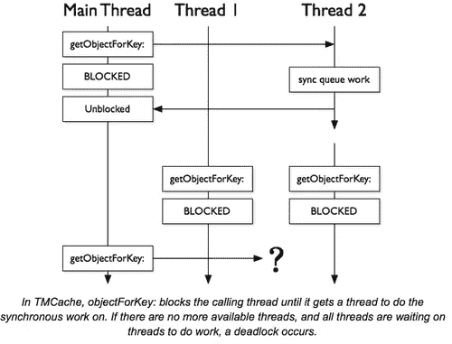
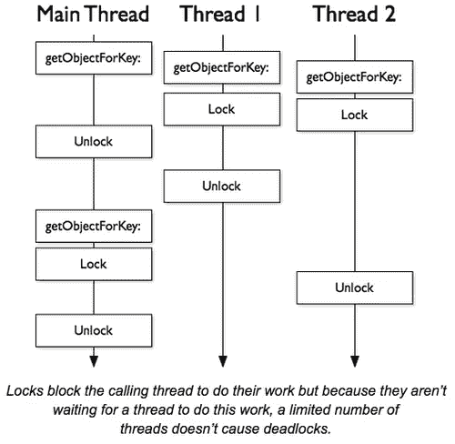

# 开源 PINCache

> 原文：<https://medium.com/pinterest-engineering/open-sourcing-pincache-787c99925445?source=collection_archive---------2----------------------->

Garrett Moon | Pinterest iOS 工程师，核心体验

由于 Pinterest iOS 应用程序下载并处理大量数据，我们使用缓存系统来缓存模型和图像，以避免蚕食我们 Pinners(用户)的数据计划。很长一段时间，我们使用 TMCache 将 gif、JPEGs 和模型保存到内存和磁盘，但在生产中使用后，Pinners 报告应用程序挂起。在将问题归咎于 TMCache 之后，我们重新设计了一个重要的部分并分叉了这个项目，这导致了我们新的开源缓存库， [PINCache](https://github.com/pinterest/PINCache) ，一个用于 iOS 和 OSX 的非死锁对象缓存。这是我们如何从僵局到分叉。

## 使异步方法同步

首先，我们确定了问题。TMCache 具有本机异步方法，并使用一种通用模式来提供这些方法的同步版本:

```
dispatch_semaphore_t semaphore = dispatch_semaphore_create(0);
[doWorkAsyncrounouslyAndCallback:^{
	dispatch_semaphore_signal(semaphore);
}];
dispatch_semaphore_wait(semaphore, DISPATCH_TIME_FOREVER);
```

不幸的是，这种模式有一个致命的缺陷，因为它阻塞了调用线程并等待来自调度队列的信号。但是当你打了一堆这样的电话会发生什么呢？线程饥饿。如果每个线程都在等待另一个操作完成，并且没有更多的线程可以执行，那么就会陷入死锁状态。



## 使同步方法异步

显而易见的解决方案是使我们的“本地”方法同步，并为我们的异步版本包装 dispatch_async。事实证明，这是解决 TMCache 问题的第一步。但是还有更多。TMCache 使用一个串行队列来保护 ivars 并保证线程安全，根据[苹果公司关于从线程迁移到 GCD 的文档](https://developer.apple.com/library/mac/documentation/General/Conceptual/ConcurrencyProgrammingGuide/ThreadMigration/ThreadMigration.html)，这是一个好主意。然而，这些文档中隐藏了一个小细节:“……只要您异步地将任务提交到一个串行队列，该队列就永远不会死锁。”言外之意，如果你想避免死锁，你不能同步访问一个用作资源锁的串行队列。这也是我们通过编写一个每次都会死锁 TMCache 的单元测试所观察到的:

```
- (void)testDeadlocks
{
    NSString *key = @"key";
    NSUInteger objectCount = 1000;
    [self.cache setObject:[self image] forKey:key];
    dispatch_queue_t testQueue = dispatch_queue_create("test queue", DISPATCH_QUEUE_CONCURRENT);

    NSLock *enumCountLock = [[NSLock alloc] init];
    __block NSUInteger enumCount = 0;
    dispatch_group_t group = dispatch_group_create();
    for (NSUInteger idx = 0; idx < objectCount; idx++) {
        dispatch_group_async(group, testQueue, ^{
            [self.cache objectForKey:key];
            [enumCountLock lock];
            enumCount++;
            [enumCountLock unlock];
        });
    }

    dispatch_group_wait(group, [self timeout]);
    STAssertTrue(objectCount == enumCount, @"was not able to fetch 1000 objects, possibly due to deadlock.");
}
```

## 回到信号量

如果我们想让同步方法在缓存中可用，我们必须保护我们的 ivars，并用另一种机制保证线程安全。我们需要的是一把锁。标准锁会降低我们的性能，但是使用 dispatch_semaphore 有一个小小的[优势](https://developer.apple.com/library/prerelease/ios/documentation/Performance/Reference/GCD_libdispatch_Ref/index.html):

*[*只有在需要阻塞调用线程时，才会将信号量调用下发给内核。如果调用信号量不需要阻塞，就不会进行内核调用。*](https://developer.apple.com/library/prerelease/ios/documentation/Performance/Reference/GCD_libdispatch_Ref/index.html)*

**那么如何使用 dispatch_semaphore 作为锁呢？简单:**

```
**dispatch_semaphore_t lockSemaphore = dispatch_semaphore_create(1);
//lock the lock:
dispatch_semaphore_wait(lockSemaphore, DISPATCH_TIME_FOREVER);
//do work inside lock

  ...

//unlock the lock:
dispatch_semaphore_signal(lockSemaphore);**
```

****

**以这种方式使用信号量作为锁与我们在本文开头提到的常见模式的区别在于，我们不需要单独的线程来释放锁。**

## **介绍 PINCache**

**在通过电子邮件与 github 的维护者进行了长时间的交谈后，他们决定放弃 TMCache，因为他们不愿意在短时间内进行重大的架构变更。为了允许 TMCache 的现有用户退出我们所做的重大更改，我们决定分叉这个项目。以下是 TMCache 和 PINCache 的主要区别:**

*   **PINCache 类似于 TMCache，因为它同时拥有内存缓存和磁盘缓存的实例。它将调用传播到每一个，首先依靠快速内存缓存，然后回到磁盘缓存。**
*   **PINMemoryCache 有同步的本地方法，异步版本包装它们。它使用 dispatch_semaphore 作为锁来保证线程安全。**
*   **PINDiskCache 也有同步的本地方法，异步版本也简单地包装它们。**
*   **PINDiskCache 没有使用共享队列，而是提供了两种方法(一种异步方法和一种同步方法)来安全地操作文件:**
*   **`lockFileAccessWhileExecutingBlock:(PINDiskCacheBlock)block synchronouslyLockFileAccessWhileExecutingBlock:(PINDiskCacheBlock)block;`**
*   **另一个主要区别是 PINDiskCache 的多个实例独立运行。这可以提高性能，但是拥有两个同名的 PINDiskCache 实例不再安全。**

## **用 PINCache 替换 TMCache**

**如果你在生产中有一个使用 TMCache 的应用程序，而你想切换到 PINCache，那就有点麻烦了。首先，由于 sharedQueue 在 PINDiskCache 上不再可用，您将需要使用 lockFileAccessWhileExecutingBlock:。其次，您需要将所有用户的磁盘缓存迁移到 PINCache 或清理它们。在初始化任何 PINDiskCache 或 PINCache 实例之前，只需在某处运行此代码片段:**

```
**//migrate TMCache to PINCache
- (void)migrateDiskCachesWithNames:(NSArray *)cacheNames
{
    //migrate TMCache to PINCache
    NSString *rootPath = [NSSearchPathForDirectoriesInDomains(NSCachesDirectory, NSUserDomainMask, YES) firstObject];
    for (NSString *cacheName in cacheNames) {
        NSString *oldPathExtension = [NSString stringWithFormat:@"com.tumblr.TMDiskCache.%@", cacheName];
        NSURL *oldCachePath = [NSURL fileURLWithPathComponents:@[rootPath, oldPathExtension]];
        NSString *newPathExtension = [oldPathExtension stringByReplacingOccurrencesOfString:@"tumblr" withString:@"pinterest"];
        newPathExtension = [newPathExtension stringByReplacingOccurrencesOfString:@"TMDiskCache" withString:@"PINDiskCache"];
        NSURL *newCachePath = [NSURL fileURLWithPathComponents:@[rootPath, newPathExtension]];
        if (oldCachePath && [[NSFileManager defaultManager] fileExistsAtPath:[oldCachePath path]]) {
            NSError *error;
            [[NSFileManager defaultManager] moveItemAtURL:oldCachePath toURL:newCachePath error:&error];
            if (error) {
                [[NSFileManager defaultManager] removeItemAtURL:oldCachePath error:nil];
            }
        }
    }
}**
```

## **促成 PINCache**

**我们大量使用 PINCache，希望它成为平台上最好的缓存库。记住这一点，我们欢迎拉请求和错误报告！我们承诺尽快解决这些问题。我们迫不及待地想看到你用它制作的令人敬畏的、高性能的、非死锁的应用程序！**

***Garrett Moon 是移动团队的 iOS 工程师。***

***获取 Pinterest 工程新闻和更新，关注我们的工程*[*Pinterest*](https://www.pinterest.com/malorie/pinterest-engineering-news/)*，* [*脸书*](https://www.facebook.com/pinterestengineering) *和*[*Twitter*](https://twitter.com/PinterestEng)*。有兴趣加入团队吗？查看我们的* [*招聘网站*](https://about.pinterest.com/en/careers/engineering-product) *。***