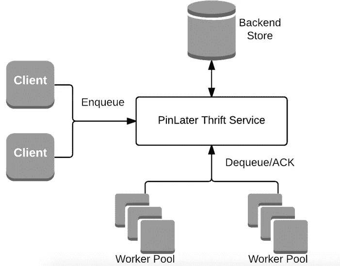

# 开源的 PinLater:一个异步作业执行系统

> 原文：<https://medium.com/pinterest-engineering/open-sourcing-pinlater-an-asynchronous-job-execution-system-d8ec4e39859a?source=collection_archive---------2----------------------->

张志远|发现网站 Pinterest 工程师

PinLater 是我们构建的一个异步作业执行系统，作为我们基于 T2 柴堆的原始解决方案的替代品。我们在生产中使用 PinLater 已经两年多了，它是我们最关键的系统之一。PinLater 的使用范围从核心操作(如锁定、图像缩略图生成以及 pinner 跟踪其他 pinner、公告板或主题)到较大的批量操作(如电子邮件发送、推送通知和可视化发现工作流)。我们现在在[亚马逊 EC2](https://aws.amazon.com/ec2/) 上运营着 10 多个不同的集群。总共有 500 多个作业队列，每分钟处理超过 600 万个作业。今天我们很兴奋地宣布 PinLater 是我们最新的[开源版本](https://github.com/pinterest/pinlater)。

在构建 PinLater 之前，我们评估了许多现有的开源选项，但没有一个满足我们的所有要求，包括:

*   至少有一次保证的容错可靠执行。
*   简单的服务/API，从客户端抽象出存储细节，并支持以任何编程语言编写的可插拔存储后端和客户端/作业。
*   将作业执行从调度/排队中分离出来，这样两者可以独立扩展，并且系统可以支持不同类型的作业。
*   完全可水平扩展，构建在可靠且易于操作的开源组件(如 MySQL)之上。
*   可以在入队时为每个作业指定优先级、延迟执行和灵活的重试策略。
*   作业处理的细粒度可见性，以及查询作业状态或跟踪单个作业上的操作的能力。
*   一个基本简单的设计，使系统易于推理和调试。

## 在后台

PinLater 有三个组件:

1.  管理作业提交和调度的无状态节约服务
2.  存储作业和状态的存储后端
3.  用于执行作业的工作池

thrift 服务提供了三个核心操作:入队、出队和确认。当作业排队时，它会被发送到存储后端进行跟踪。工作池不断地将作业出队并执行它们，根据执行是成功还是失败用肯定或否定的 ACK 进行回复。服务层负责作业调度的所有方面，包括优先级、重试和将来的执行。关于这一切的更多细节，请阅读我们之前的博客文章。

## 最近的改进

在过去的一年里，我们对系统进行了多项改进。我们进行了调整，以在 MySQL 后端实现更高的 5X 吞吐量，这使我们可以使用单个 i2.2xl MySQL EC2 实例每秒进行超过 2，000 次排队。由于 MySQL 通过可靠的复制提供了更高的持久性，这一变化允许我们将所有的工作负载转移到 MySQL，而不再使用 Redis 后端。我们还构建了一个检查点功能来支持长时间运行的作业和复杂的工作流。我们添加了一个新的仪表板，这是一个一站式商店，可以查看作业状态，调试作业失败，通过 ID 或正文查找任何作业，以及许多其他让我们的用户高兴的功能。

这个开源版本包括服务本身以及一个参考 Java worker 框架实现。我们希望 PinLater 能对其他有类似需求的人有所帮助，迫不及待地想看看社区能给系统带来哪些贡献和改进。将来，我们将继续发布我们整个 PinLater 堆栈的其他部分。试一试，如果有任何问题，请联系 pinlater-users@googlegroups.com。