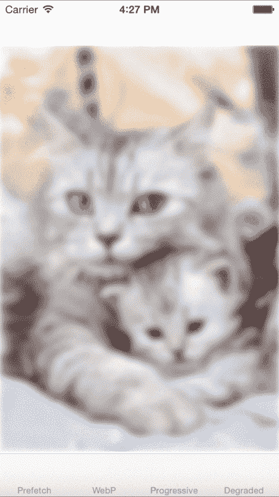

# 开源 PINRemoteImage

> 原文：<https://medium.com/pinterest-engineering/open-sourcing-pinremoteimage-ae83ee0f3e8a?source=collection_archive---------0----------------------->

Garrett Moon | Pinterest 工程师，iOS

本周[我们宣布](http://www.oscon.com/open-source-2015/public/schedule/detail/41854?cmp=tw-prog-confsched-info-os15_sessions)开源 [PINRemoteImage](https://github.com/pinterest/PINRemoteImage) ，这是一个我们用来每天下载超过 30 亿张图片到 Pinterest iOS 应用程序并快速呈现给数千万 Pinners 的库。因此，如果你有一个图像密集型应用程序，这项技术允许你下载、缓存(在磁盘和内存上)和预取图像，以可靠地向用户显示图像，而不是编写新的代码。与其他类似技术不同，PINRemoteImage 在避免死锁的同时保持了以下特性，甚至可以改善慢速连接的体验。

PINRemoteImage 功能包括:

*   下载和处理优先级
*   主线程外的图像解压缩
*   吸引人的模糊渐进 JPEGs
*   图像后处理
*   根据最近的网络状况自动选择和下载不同的图像
*   可选支持[FLAnimatedImage](https://github.com/Flipboard/FLAnimatedImage)(Flipboard 的 GIF 库)
*   对 WebP 的可选支持
*   从不阻塞主线程

## 动机

显示远程图像是 Pinterest 功能的核心部分，因此图像的下载和显示需要简单高效。有许多现有的库提供这种类型的功能，但我们发现它们通常有局限性，例如当同时请求大量图像时会出现死锁，或者只有当所有下载的图像大小相同时才能提高效率。PINRemoteImage 诞生于对高效、线程安全的图像下载库的需求。

## 它是如何工作的

要下载一个图像并在 UIImageView 上设置它，最简单的方法是使用内置的 category 方法 setImageFromURL:。调用这个函数可以处理从下载图像到缓存图像并在 UIImageView 上设置图像的所有事情。PINRemoteImage 已经包含了几个类别，但是通过实现一个定义好的协议 PINRemoteImageCategory，编写一个新的类别变得很容易。实现这个协议进一步简化:几乎所有实例方法都调用 PINRemoteImageCategory 上的匹配类方法。

如果您更愿意直接使用图像，您可以在 PINRemoteImageManager 的共享实例上调用方法，它是 PINRemoteImage 的主要类。它将合并下载、缓存提取和图像处理操作，因此无论您请求多少次下载图像，下载和磁盘缓存提取都只会发生一次。如果您需要修改可能不会在 UIView 类别中显示的选项，也可以使用它。

所有到磁盘和内存的缓存都由我们的开源对象缓存库 PINCache 处理。

## 处理图像

PINRemoteImage 还支持处理图像并将结果图像存储在图像缓存中。例如，下面的代码将下载一个图像，调整其大小并应用圆角半径:

```
[imageView setImageFromURL:heroURL processorKey:@"rounded-hero" processor:^UIImage *(PIRemoteImageManagerResult *result, NSUInteger *cost)
{
    UIImage *image = result.image;
    CGFloat radius = 7.0f;
    CGSize targetSize = CGSizeMake(100, 100);
    CGRect imageRect = CGRectMake(0, 0, targetSize.width, targetSize.height);
    UIGraphicsBeginImageContext(imageRect.size);
    [[UIBezierPath bezierPathWithRoundedRect:imageRect cornerRadius:radius] addClip];

    CGFloat widthMultiplier = targetSize.width / image.size.width;
    CGFloat heightMultiplier = targetSize.height / image.size.height;
    CGFloat sizeMultiplier = MAX(widthMultiplier, heightMultiplier);

    CGRect drawRect = CGRectMake(0, 0, image.size.width * sizeMultiplier, image.size.height * sizeMultiplier);
    if (CGRectGetMaxX(drawRect) > CGRectGetMaxX(imageRect)) {
        drawRect.origin.x -= (CGRectGetMaxX(drawRect) - CGRectGetMaxX(imageRect)) / 2.0;
    }
    if (CGRectGetMaxY(drawRect) > CGRectGetMaxY(imageRect)) {
        drawRect.origin.y -= (CGRectGetMaxY(drawRect) - CGRectGetMaxY(imageRect)) / 2.0;
    }

    [image drawInRect:drawRect];
    UIImage *processedImage = UIGraphicsGetImageFromCurrentImageContext();
    UIGraphicsEndImageContext();
    return processedImage;
}];
```

这个方法可以被调用多次，而图像只被处理一次。

## 对抗慢速连接

PINRemoteImage 有几种方法可以改善在慢速连接上下载图像的体验，包括支持 Google 的 WebP 格式。如果 webp 可用(例如，通过包含 WebP cocoa pod ), PINRemoteImage 将检测 WebP 下载，并使用 WebP 库对其进行适当解码:

```
[imageView setImageFromURL:[NSURL URLWithString:@”webPImage.webp”]];
```

或者，如果你正在下载渐进 JPEGs，PINRemoteImage 支持显示应用了吸引人的模糊的图像的渐进扫描(当不通过 GIF 过滤时更吸引人，因为该功能仅在 iOS 8 和更高版本上可用)。若要支持渐进式扫描，请通过调用 setUpdateWithProgress:YES 在 UIImageView 上启用更新，或者在 PINRemoteImageManager 上使用渐进式方法之一:

```
[imageView setUpdateWithProgress:YES];
[imageView setImageFromURL[NSURLURLWithString:@”progressiveJPEG.jpg”]];
```



支持慢速连接的最后一种方法是为库提供几个不同质量的 URL。

```
[imageView setImageFromURLs:@[[NSURL URLWithString:@"lowQualityURL"],
                                  [NSURL URLWithString:@"mediumQualityURL"],
                                  [NSURL URLWithString:@"highQualityURL"]]];
```

PINRemoteImage 将根据最近观察到的网络状况下载其中一个图像。因此，如果最后几个图像下载缓慢，它会选择一个较低质量的图像下载。如果您想将这些图像升级到更高质量的版本，您可以告诉图像管理器应该升级低质量的图像，并再次在图像视图上设置图像 URL:

```
[[PINRemoteImageManager sharedManager] setShouldUpgradeLowQualityImages:YES completion:nil];
[imageView setImageFromURLs:@[[NSURL URLWithString:@"lowQualityURL"],
                                  [NSURL URLWithString:@"mediumQualityURL"],
                                  [NSURL URLWithString:@"highQualityURL"]]];
```

## 支持 FLAnimatedImage

PINRemoteImage 还提供了对 FLAnimatedImage 的本地支持，这是一个内存高效的 GIF 解码器和播放器。如果您有 FLAnimatedImageView 的实例，下载和设置 GIF 就像在 UIImageView 上一样简单:

```
[flaAnimatedImageView setImageFromURL:[NSURLURLWithString:@”gifURL.gif”];
```

## 贡献给 PINRemoteImage

正如我们的其他开源贡献一样，我们相信社区可以将 PINRemoteImage 做得更好。无论是通过拉请求还是错误报告，我们都很高兴能让 PINRemoteImage 变得更好。首先，请查看我们的 GitHub 资源库，在这里您可以看到如何安装和使用 PINRemoteImage，以及使用一个示例应用程序(它充满了小猫)。

***盖瑞特·穆恩*** *是 iOS 团队的一名软件工程师。*

*获取 Pinterest 工程新闻和更新，关注我们的工程*[*Pinterest*](https://www.pinterest.com/malorie/pinterest-engineering-news/)*，* [*脸书*](https://www.facebook.com/pinterestengineering) *和*[*Twitter*](https://twitter.com/PinterestEng)*。有兴趣加入团队吗？查看我们的* [*招聘网站*](https://about.pinterest.com/en/careers/engineering-product) *。*