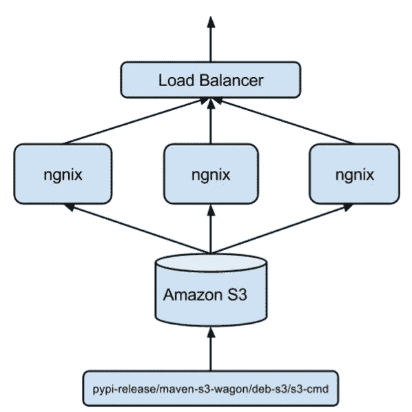

# 开源 Pinrepo，Pinterest 工件库

> 原文：<https://medium.com/pinterest-engineering/open-sourcing-pinrepo-the-pinterest-artifact-repository-6ebfe5917bcb?source=collection_archive---------2----------------------->

宋宝刚| Pinterest 工程主管，云工程

在 Pinterest，我们虔诚地实践持续集成。我们在主线中构建每一个代码提交，这反过来每天产生大量构建工件。我们不仅需要可靠地存储这些工件，还需要以一致的性能高效地服务它们，以扩展工程团队并确保开发人员的生产力。今天，随着 [Pinrepo](https://github.com/pinterest/pinrepo) 的发布，我们正在开源我们的工作，这是一个高度可扩展的解决方案，用于存储和服务构建工件(由构建过程产生的二进制文件和元数据)，如 debian 包、maven jars 和 pypi 包。

Pinrepo 功能:

*   简单:在 AWS S3 中发布和存储构建工件，并使用 Nginx 反向代理服务
*   可扩展:轻松添加其他格式支持，如 RPM
*   可靠:高可用性 nginx 集群和 AWS S3 服务
*   可扩展:nginx 层可以水平扩展，因为 AWS S3 后端是高度可扩展的
*   开发操作系统友好型:已投入生产运行 8 个月，几乎无需维护

## 克服扩展挑战

Pinrepo 帮助我们解决的最大挑战是可扩展性，并允许我们随着时间的推移高效地处理大量数据。例如，当一天 50 次构建一个主要的 36M(1.8G/天，162G/ 3 个月)Python 包时，伸缩就成了一个问题。我们以前使用过不同的解决方案，但是随着对象数量的增加，它们的性能通常会下降。

除了扩展，还有服务可用性和数据持久性问题。我们以前使用的解决方案基于单个主机和磁盘，速度慢且经常崩溃。虽然有备份过程，但它们经常在没有通知的情况下中断。维护这些服务是一场噩梦。我们需要基于持久、高可伸缩对象存储的可靠服务。

我们考虑过直接使用亚马逊 S3，但是我们发现我们不能使用它来存储和提供构建工件，因为如果存储桶没有被配置为公共可访问的，存储库客户端就不能与 S3 对话。这些类型的 AWS S3 请求需要首先“签名”,包括根据请求的某些元素计算和附加 HMAC 的流程。

这个问题可以通过简单地在 AWS S3 前添加一个 nginx 服务器集群来解决。理论上，我们可以“修复”所有的存储库客户端，以便它们可以直接与 S3 对话，但是这需要大量的工作，并且很难维护和扩展到其他工件格式。另一方面，nginx 层不仅可以签署请求并将其转发给 AWS，还可以为工件提供本地缓存，从而显著提高性能。nginx 层是无状态的，可以很容易地横向扩展，所以它也解决了可用性问题。此外，不需要额外的备份过程。

我们的答案是:Pinrepo，我们内部的工件库。

## 介绍 Pinrepo

我们在负载平衡器后面创建了一个 nginx 服务器集群，将所有请求代理到后端 AWS S3 服务，并使用 nginx 模块 [ngx_set_misc](http://wiki.nginx.org/NginxHttpSetMiscModule) 来创建 AWS 服务请求签名。

## 将文物直接发布到 S3

在亚马逊 S3 上传和维护工件元数据和布局的方式有很多，包括使用 [deb-s3](https://github.com/krobertson/deb-s3) 上传和维护 debian 包，使用 maven 插件 [maven-s3-wagon](https://github.com/jcaddel/maven-s3-wagon) 进行 maven 包。我们找不到任何现有的工具来上传 Python 包到 S3，所以我们编写了自己的 [pypi-release](https://github.pinadmin.com/internal-tools/pinrepo/blob/master/pypi/pypi-release.py) 来上传和维护 pypi 包。

## 简单更好

通过将构建工件直接发布和存储到亚马逊 S3，并在前端使用 nginx 集群，我们简化了技术堆栈，同时实现了可伸缩性和持久性。我们已经在生产环境中运行 Pinrepo 八个多月了，性能稳定，几乎无需维护。

## 未来的改进

带有搜索支持的简单 UI 可能是一个需要添加的特性，尽管可以使用各种 S3 工具来找出存储库中可用的内容。添加额外功能时要小心，不要让它们成为关键路径的一部分，以免危及现有简单解决方案的可靠性和可伸缩性。暂存存储库和包升级也很好，但如果您有暂存部署和生产前测试环境，则不是必需的。Pinrepo 还可以被扩展以轻松支持更多的包格式，比如 RPM。

在 Github 上查看 [Pinrepo，让我们知道你的想法！](https://github.com/pinterest/pinrepo)

***宋宝刚*** *是 Pinterest 云工程团队内部开发工具团队的工程主管。*

*鸣谢:感谢 Raj Patel，他帮助评估了各种现有的解决方案并使流程正式化；Jayme Cox 负责审查设计并就实施细节提出建议；以及 Pinterest 云工程团队的所有成员，他们推动了网站的可靠性、速度和安全性，并为云基础设施和开发人员构建了技术构件。*

*获取 Pinterest 工程新闻和更新，关注我们的工程*[*Pinterest*](https://www.pinterest.com/malorie/pinterest-engineering-news/)*，* [*脸书*](https://www.facebook.com/pinterestengineering) *和* [*推特*](https://twitter.com/PinterestEng) *。有兴趣加入团队吗？访问我们的* [*招聘网站*](https://about.pinterest.com/en/careers/engineering-product) *。*