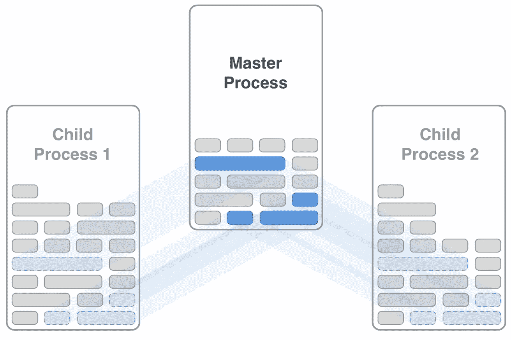
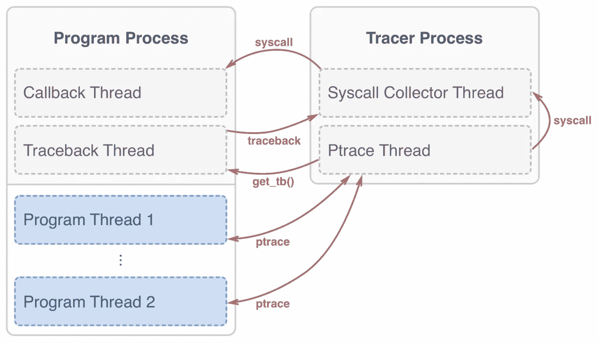

# 开源 ptracer，一个用于 Python 的系统调用跟踪库

> 原文：<https://medium.com/pinterest-engineering/open-sourcing-ptracer-a-syscall-tracing-library-for-python-b0fe0d91105d?source=collection_archive---------0----------------------->

Elvis Pranskevichus，Pinterest 工程师，核心体验

让 Pinterest 变得更快、更可靠是我们工程团队的一贯目标，更有效地利用硬件资源是这一努力的主要部分。提高效率和可靠性需要良好的诊断工具。这就是为什么今天我们要发布我们最新的跟踪工具， [ptracer，](https://github.com/pinterest/ptracer)它在 Python 程序中提供细粒度的系统调用跟踪。在本帖中，我们将介绍 Pinterest 代码库的背景，为什么我们需要一个更好的追踪器，以及 ptracer 如何帮助解决某些工程问题。

## 背景

Pinterest 由一个大型 Python 代码库提供支持。传统上，从 CPU 利用率的角度来看，运行 Python 服务器最有效的方法是生成多个工作进程(工作进程的数量通常接近 CPU 核心的总数)。多进程无共享架构安全高效，没有 GIL 或其他与多线程编程相关的问题。这就是为什么多进程配置是 Pinterest 的首选运行方式。

然而，使用多个进程是有代价的——增加内存使用。在大型代码库中，仅分配给 Python 代码对象和字符串的内存就可以达到数百兆字节，应用程序数据也需要类似的数量。几十个工作人员的总内存使用量可能会很快失控。

值得注意的是，工人之间的大部分数据是相同的，比如 Python 代码对象和其他静态位。减少内存使用的解决方案是让工作进程共享这些数据。谢天谢地，有一种方法可以做到这一点。

在 POSIX 系统中，通过调用 [fork()](https://en.wikipedia.org/wiki/Fork_(system_call)) 系统调用来创建新的进程，这将创建一个与调用进程几乎相同的副本。最重要的是，进程的内存不会立即被物理复制。相反，父进程和子进程之间共享的所有内存页面都标记有特殊的写入时复制位，该位仅在内存页面被其中一个进程修改时才触发复制。

Figure 1\. Memory sharing in forked processes

工作进程以近乎完美的内存共享开始，但会逐渐偏离。

Python 程序中内存差异的主要来源是引用计数。在 CPython 中，每个 Python 对象都由一个结构表示，该结构包含一个引用计数器，每当引用该对象时，该计数器就会递增。因此，在 Python 中，仅仅*访问*一个对象就足以触发内存页面复制。

类似地，CPython 垃圾收集器在每个被跟踪的 Python 对象中维护一个特殊的记录，并在收集运行时修改该记录。后一个问题有补救措施，Python 3.7 将以 [gc.freeze()](https://docs.python.org/3.7/library/gc.html#gc.freeze) 调用的形式提供标准解决方案。

尽管有这些限制，大部分内存可以保持共享，从而带来显著的总体节省。

## 从超级服务器到叉式服务器

像 supervisord 这样的外部进程管理器对它所运行的程序知之甚少，它产生了几乎不共享内存的独立进程。为了利用 fork()的优势，Python 程序本身必须在最合适的时候调用它——就在服务器开始接受连接之前和所有共享代码和数据加载之后。

除了内存，fork()创建的子进程还与其父进程和兄弟进程共享所有打开的文件描述符。文件描述符包括文件中的当前偏移量，在进程间共享它会导致交叉读写(大多数程序不会预料到这一点并会失败)。

这个问题通常的解决方案是在 fork()在子进程中返回后，立即关闭所有文件描述符(除了 stdin、stdout 和 stderr)。在我们的例子中，这是行不通的，因为打开该文件的代码可能依赖于它继续被打开。相反，当我们调用 fork()来产生 workers 时，我们必须确保没有文件或套接字处于打开状态。

手动查找所有打开文件而不关闭它们的位置是一项令人生畏的任务。在像我们这样的大型代码库中，这是完全不可能的，尤其是考虑到我们所依赖的众多第三方模块。此外，解决这个问题一次是不够的。我们需要确保新代码不会引入回归。

这个问题唯一可行的解决方案是自动化检查，并将它们合并到回归测试套件中。为此，我们需要一种机制来跟踪程序并拦截所有创建新文件描述符的系统调用。

包括 Linux 在内的许多系统都有 [ptrace()](https://en.wikipedia.org/wiki/Ptrace) 系统调用，它允许跟踪和中断其他进程的执行。像 gdb 这样的调试器使用它以及古老的 strace 工具。但是我们不能简单地使用 strace。虽然它确实报告了某个文件被打开或关闭的事实，但它没有显示出*在程序中的什么地方*发生了这种情况，这使得寻找该位置变得不必要的困难。

这就是为什么我们开发了自己的追踪器来解决这个问题。

## ptracer

ptracer 是一个使 Python 程序中跟踪系统调用变得简单的模块。

在幕后，ptracer 使用线程和子进程的组合来实现上述功能。

Figure 2\. ptracer architecture

当进入 ptracer 上下文时，ptracer 会生成一个新线程，在该线程中将执行 syscall 回调，此外还有另一个线程用于从给定线程中提取 Python 回溯。它还产生了一个执行实际跟踪的子进程。

每当跟踪子进程检测到正在进行系统调用时，它会根据指定的过滤器(如果有)检查 syscall。如果系统调用与过滤器匹配，则调用回溯线程来提取调用堆栈，调用堆栈附加到 syscall 记录并放入队列中。为 syscall 队列中的每个项目调用回调。

## 解决打开文件预分叉问题()

使用 ptracer，我们现在能够可靠地找到留下未关闭文件的代码位置。

## 未来的工作

ptracer 不限于跟踪与文件相关的系统调用。在 Pinterest，我们使用非阻塞 I/O 模型，让可靠地识别阻塞调用及其延迟成为可能是我们的下一个目标。

我们欢迎任何问题、反馈和请求。对于我们所有的开源项目，请查看我们的 GitHub。

*鸣谢:我要感谢尤里·塞利万诺夫、乔恩·帕里斯、萨姆·梅德和乔·戈登对这个项目的帮助和反馈。*