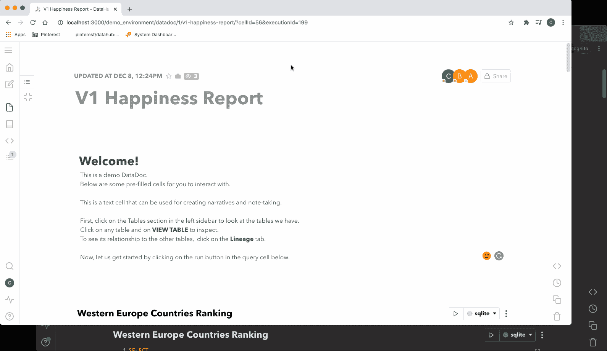
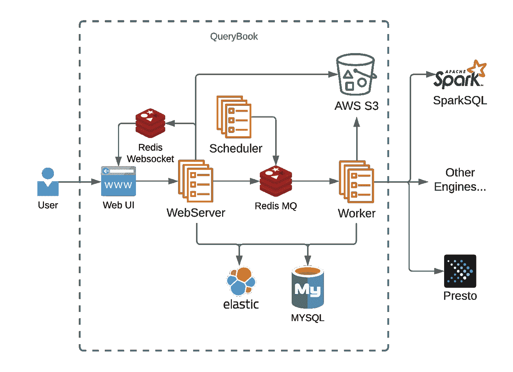
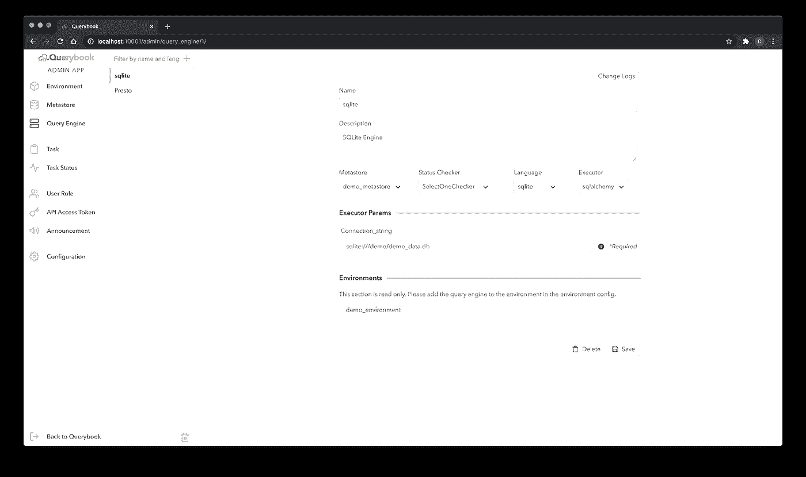

# 开源 Querybook，Pinterest 的协作大数据中心

> 原文：<https://medium.com/pinterest-engineering/open-sourcing-querybook-pinterests-collaborative-big-data-hub-ba2605558883?source=collection_archive---------0----------------------->

*为日益远程化的工作环境提供高效的大数据解决方案。*

Charlie Gu |分析平台技术主管，Lena Ryoo |分析平台软件工程师，Justin Mejorada-Pier |分析平台工程经理

Pinterest 拥有超过 3000 亿个 pin，为不断增长的独特数据集提供支持，该数据集映射了兴趣、想法和意图。作为一家数据驱动的公司，Pinterest 使用数据洞察和分析来做出产品决策和评估，以改善超过 4.5 亿月用户的 Pinner 体验。为了不断地进行这些改进，尤其是在日益远程化的环境中，团队能够编写查询、创建分析并相互协作变得比以往任何时候都更加重要。今天，我们将采用 [Querybook](http://querybook.org) ，这是我们更高效、更协作的大数据访问解决方案，并为社区开源。

Pinterest 上任何分析的共同起点是在 SparkSQL、Hive、Presto 集群或任何 Sqlalchemy 兼容引擎上执行的即席查询。我们构建了 Querybook 来为这种分析提供一个响应迅速且简单的 web UI，以便数据科学家、产品经理和工程师可以发现正确的数据、编写他们的查询并分享他们的发现。在这篇文章中，我们将讨论构建 Querybook 的动机、它的特性、架构以及我们为开源这个项目所做的工作。

# 旅程

构建 Querybook 的提议始于 2017 年，当时是一个实习生项目。在此期间，我们使用供应商提供的 web 应用程序作为查询 UI。经常有用户抱怨这个工具的用户界面，速度和稳定性，缺乏可视化，以及难以共享。不久，我们意识到有一个很好的机会来构建一个更好的查询界面。

我们开始采访数据科学家和工程师，询问他们的工作流程，同时确定技术细节。很快，我们意识到大多数人在官方工具之外组织他们的查询，许多人使用像 Evernote 这样的应用程序。尽管 Jupyter 有笔记本用户体验，但它使用 Python/R 的要求和缺乏表元数据集成让许多用户望而却步。基于这一发现，我们的团队决定 Querybook 的查询界面将是一个文档，用户可以在一个地方编写查询和编写分析，并具有搭配元数据的功能和笔记应用程序的简单性。

2018 年 3 月在内部发布，Querybook 成为 Pinterest 查询大数据的官方解决方案。如今，Querybook 平均每天有 500 个 dau 和 7k 次查询运行。它的内部用户评分为 8.1/10，是 Pinterest 评分最高的内部工具之一。

# 特色亮点

Figure 1\. Querybook’s Doc UI

当用户第一次访问时，他们会很快注意到它独特的 DataDoc 界面。这是用户查询和分析的主要地方。每个 DataDoc 由一系列单元格组成，这些单元格可以是以下三种类型之一:文本、查询或图表。

*   文本单元格带有内置的富文本支持，用户可以记下他们的想法或见解。
*   查询单元用于编写和执行查询。
*   图表单元格用于根据执行结果创建可视化效果。与 Google Docs 类似，当用户被授予访问 DataDoc 的权限时，他们可以实时地相互协作。

借助直观的图表用户界面，用户可以轻松地将数据文档转换成说明性的仪表板。您可以从不同的可视化选项中进行选择，如时间序列、饼图、散点图等。然后，您可以将可视化连接到 DataDoc 上任何查询的结果，并根据需要对它们进行排序和聚合的后处理。要自动更新这些图表，您可以使用计划选项并选择您想要的节奏。调度程序可以通知用户成功或失败。结合由 [Jinja](https://jinja.palletsprojects.com/en/2.11.x/) 提供的模板选项，创建一个实时更新的 DataDoc 非常快。

调度和可视化功能并不打算取代诸如 Airflow 或 Superset 之类的工具。相反，这些特性为用户提供了一种简单快捷的方式来试验他们的查询并对其进行迭代。通常，Pinterest 工程师在创建生产级工作流和仪表板之前，会将 Querybook 作为编写查询的第一步。

最后但同样重要的是，Querybook 附带了一个自动查询分析系统。对执行的每个查询进行分析，以提取元数据，比如被引用的表和查询运行器。Querybook 使用这些信息自动更新其数据模式和搜索排名，并显示表中的常用用户和查询示例。查询越多，表格的文档就越多。

# 体系结构

Figure 2\. Overview of Querybook’s architecture

为了理解 Querybook 是如何工作的，我们将浏览一下编写和执行查询的过程。

1.  第一步是创建一个 DataDoc 并将查询写入一个单元格。当用户输入时，用户的查询通过 Socket.IO 传输到服务器。
2.  然后，服务器将增量推送给所有通过 Redis 读取该 DataDoc 的用户。同时，服务器会将更新的 DataDoc 保存在数据库中，并为工作人员创建一个异步作业来更新 ElasticSearch 中的 DataDoc 内容。这允许以后搜索数据文档。
3.  一旦编写了查询，用户就可以通过单击 run 按钮来执行查询。然后，服务器将在数据库中创建一个记录，并将一个查询作业插入 Redis 任务队列。工作者接收任务并将查询发送到查询引擎(Presto、Hive、SparkSQL 或任何 Sqlalchemy 兼容的引擎)。当查询运行时，工作人员通过 Socket.IO 将实时更新推送到 UI。
4.  当执行完成时，工作者加载查询结果，并将其批量上传到可配置的存储服务(例如 S3)。最后，浏览器得到查询完成的通知，并请求服务器加载查询结果并显示给用户。

为了简洁起见，本节只关注 Querybook 的一个用户流。然而，所有使用的基础设施都包括在内。Querybook 允许对其中一些进行定制。例如，您可以选择将执行结果上传到 S3、谷歌云存储或本地文件。此外，MySQL 还可以与任何兼容 Sqlalchemy 的数据库(如 Postgres)交换。

# 开源之路

在注意到 Querybook 在内部取得的成功后，我们决定对它进行开源。我们遇到的一个挑战是如何使它通用，同时保留一些 Pinterest 特有的集成。为此，我们决定通过一个插件系统有一个两层的组织，并添加一个管理用户界面。

Admin UI 允许公司从一个友好的界面配置 Querybook 的查询引擎、表元数据接收和访问权限。以前，这些配置是在配置文件中完成的，需要进行代码更改和部署才能反映出来。有了这个新的用户界面，管理员可以在不查看代码或配置文件的情况下对 Querybook 进行实时修改。

图 3。管理用户界面

插件系统通过利用 Python 的 importlib 将 Querybook 与 Pinterest 的内部系统集成在一起。有了插件系统，开发者可以配置 auth，定制查询引擎，实现内部站点的导出器。插件系统提供的定制行为允许 Querybook 针对 Pinterest 的用户工作流进行优化，同时确保开源对公众是通用的。

你可以在[Querybook.org](http://querybook.org/)查看更多 Querybook 的功能和文档，也可以在[querybook@pinterest.com](mailto:querybook@pinterest.com)联系我们。

*鸣谢:我们要感谢以下为 Querybook 做出贡献的工程师:劳伦·米切尔、兰斯顿·泽科、莫哈克·纳赫塔和弗兰克林·肖(Franklin Shiao)。感谢王春燕、戴夫·伯吉斯和大卫·柴肯的重要建议和支持。*