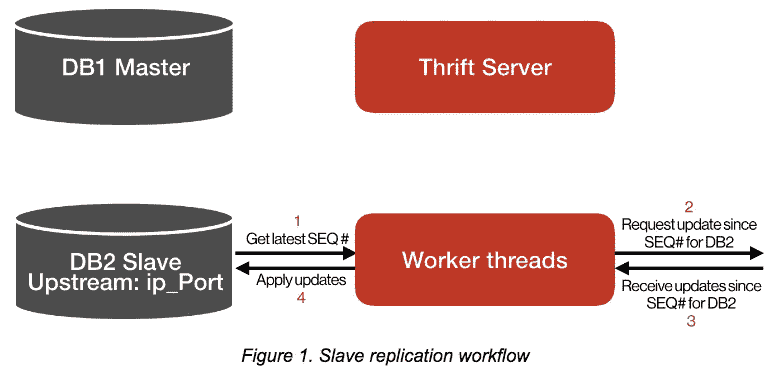
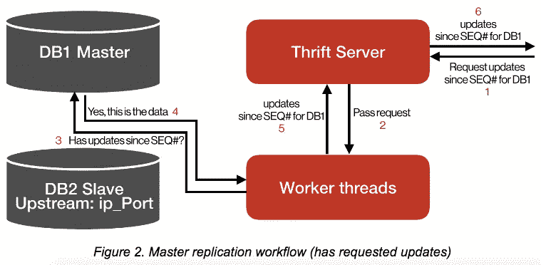
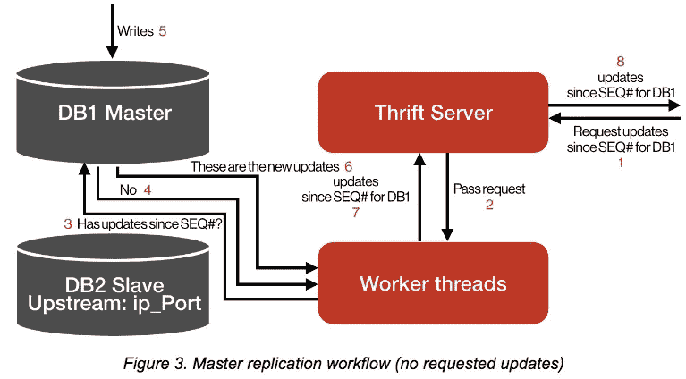
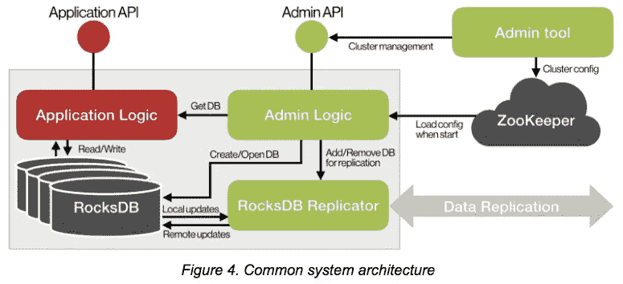

# 开源 Rocksplicator，一个实时 RocksDB 数据复制器

> 原文：<https://medium.com/pinterest-engineering/open-sourcing-rocksplicator-a-real-time-rocksdb-data-replicator-558cd3847a9d?source=collection_archive---------1----------------------->

刘波| Pinterest 基础设施工程师

Pinterest 的状态在线系统每天处理数十 Pb 的数据。随着我们制造产品并将数十亿个 pin 扩展到 1.5 亿人，我们需要新的应用程序，使计算与数据共存。这就是我们采用 RocksDB 的原因。它适应性强，支持高性能的基本和高级数据库操作，并满足构建大规模、生产强度的分布式有状态服务的大部分需求。然而，我们缺少两个关键部分:实时数据复制和基于 RocksDB 的有状态服务的集群管理。为了填补这一空白，我们构建了一个 RocksDB Replicator——Rocksplicator——一个集群管理库，以及用于基于 rocks db 的有状态服务的工具。今天，我们在 GitHub 上为所有 RocksDB 用户开源这个项目。

在我们深入讨论 Rocksplicator 之前，让我们先来看看这项技术帮助 Pinterest 工程团队的三个例子。

**1。用机器学习驱动排名系统**

个性化的机器学习模型对 Pin 候选进行排名，以便 Pinners 发现与他们的兴趣和品味相关的想法。我们从几 KB 的数据中提取特征来计算人和 Pin 之间的相关性。对于每个 Pin 推荐，我们的评分系统会计算一组候选 Pin 和一个 Pinner 之间的数万个相关性分数。以前，我们使用一个无状态的排名系统，通过网络获取所需的数据。但随着我们的成长，网络带宽消耗急剧增加，高服务延迟成为核心 Pinterest 系统的一个痛点。为了解决这些问题，我们构建了一个有状态的排序系统，将计算与数据放在一起，并极大地改善了网络带宽消耗和服务延迟。

**2。在线事件跟踪系统**

因此，Pinners 不会看到重复的 Pin，我们会考虑某人看到的每个 Pin 以及他们看到它的次数(以防我们想要执行软重复数据删除)。为了实时维护印象事件并支持数月数据的在线查询，使用具有读取-修改-写入模型的传统独立数据库是低效的。相反，我们将计算与数据放在一起，因此当数据节点端合并时，会发生读取-修改-写入类型的应用程序逻辑。

**3。分析系统**

我们的分析系统具有广泛的用例，如 ads 报告和 A/B 测试结果报告，并支持时间序列计数器和 HyperLogLog 等时间序列应用程序特定的数据结构。系统中存储的每个数据点都有多个客户端可选指定的标签，用于任意聚合和分解。为了响应单个客户端请求，分析系统通常会扫描数百 MB 的数据，最终返回给客户端的响应通常非常小。这使得在不将计算与数据放在一起的情况下构建大规模、高效的分析系统变得非常困难(如果不是不可能的话)。

## 采用 RocksDB

在将 RocksDB 引入我们的技术堆栈之前，我们将 MySQL、HBase 和 Redis 作为存储系统运行。对于这组新的应用程序，我们决定不使用这些系统，原因如下。对于 MySQL，很难将计算和数据放在一起。对于 HBase，我们面临着通过其协处理器框架开发复杂逻辑的挑战，并且它具有长尾服务延迟。对于 Redis 来说，它的复制功能在规模上并不具备最佳的可靠性。

RocksDB 为我们提供了一个用于快速存储的可嵌入的持久性键值存储。如前所述，RocksDB 适应性强，支持高性能的基本和高级数据库操作。虽然我们发现大部分生产需求都得到了满足，但我们还是为基于 RocksDB 的有状态服务构建了 RocksDB replicator、集群管理库和工具。

## 摇滚歌手

**设计决策**

Rocksplicator 是用现代 C++实现的，我们在设计它时做了以下技术决策。

**仅异步主从复制**

除了主从复制之外，进行数据复制的另一种方法是采用一致算法。基于一致性算法的解决方案可实现更好的写入可靠性和更强的数据一致性保证，但通常具有较低的写入吞吐量。我们的应用程序完全符合异步主从复制提供的数据一致性模型。我们还认识到在有限的时间和资源内实现百分之百正确的高性能一致性算法的挑战，因此我们的 RocksDB replicator 仅支持异步主从复制。

**在一个进程中复制多个 RocksDB 实例**

典型的有状态服务流程托管多个碎片，这使得扩展集群容量或重新分配不均衡的工作负载变得更加容易。RocksDB 允许将多个 RocksDB 实例嵌入到一个进程中，其中存储的数据在实例之间是隔离的。我们方便地使用一个物理 RocksDB 实例来建模一个逻辑 DB shard，因此库应该并行复制多个 RocksDB 实例。

**RocksDB 实例级别的主/从角色**

我们为 RocksDB 实例分配主/从角色，而不是服务流程。这允许我们在集群的每个主机上混合使用主碎片和从碎片，这样硬件资源就可以被整个集群充分利用。

**被动工作**

Rocksplicator 库需要健壮和高性能，所以我们限制了它的责任范围。它提供了两个 API，一个用于添加要复制的数据库，另一个用于从库中删除数据库以停止复制。该库只进行数据复制，并不负责其他任务，如确定复制图的拓扑结构或每个碎片的复制角色。这些任务由集群管理库和工具分别处理，我们将在后面介绍。

**针对低复制延迟进行优化**

我们最大限度地减少了更新应用于其主节点和相同更新应用于所有从节点之间的延迟。这减少了系统崩溃时潜在数据丢失的时间窗口。

## 履行

为了交换 RocksDB 更新，复制器需要通过网络相互通信。我们采用异步 [fbthrift](https://github.com/facebook/fbthrift/) 服务器和客户端来完成这项任务。

通常，应用于主服务器的所有更新的持久日志是在一组副本服务器之间复制更新所必需的。日志中的每个更新都应该标记有一个全局唯一的升序序列号，以便主/从知道下一个要发送/请求的更新。这是一项重要的任务，尤其是当将主机角色从一个主机转移到另一个主机时。在验证了 RocksDB WAL 序列号的一组属性后，我们决定使用 RocksDB WAL 作为持久日志，RocksDB 序列号作为全局复制序列号。我们核实的内容包括:

*   对于新创建的数据库，RocksDB WAL 序列号始终从 0 开始
*   每应用一次更新，它就增加 1
*   它会在数据库关闭/打开或数据库备份/恢复期间保留

RocksDB 提供了两个方便的 API，GetLatestSequenceNumber()和 GetUpdatesSince()。这些 API 允许我们使用它的 WAL 序列号进行数据复制。通过重用 RocksDB WAL，我们最大限度地降低了额外的持久层可能带来的性能损失。实际上，写吞吐量受 RocksDB 写吞吐量的限制。

**基于拉和推的混合复制**

概括地说，有两种数据复制模型，基于拉的模型和基于推的模型。
对于基于拉取的模型，每个从机定期检查其最新的本地序列号，并向其主机请求此后的新更新。对于基于推的模型，主模块跟踪所有从模块的最新序列号，并在有更新时主动向它们发送数据。基于拉的模型实现起来更简单，而基于推的模型具有更低的复制延迟。我们采用混合方法来实现简单性和更低的延迟。在我们的实现中，主设备不跟踪从设备的最新序列号。相反，它服务于来自从设备的复制请求。如果从机请求中指定的序列号之后没有新的更新，则主机在向从机发回空响应之前，会将请求保持一段可配置的时间。每当主机接收到新的写操作时，它会立即满足当前保持的请求。注意，从端复制请求超时值必须大于主端使用的等待超时值。这两个超时值都是在复制器库中定义的，因此很容易实施。

## 数据复制工作流

图 1、2 和 3 展示了不同场景下的 replicator 内部工作流。Rocksplicator 运行内部 fbthrift 服务器来处理来自远程从属服务器的复制请求。它还有一个小的工作线程池来完成 CPU 密集型工作，并阻塞对 RocksDB 的调用。这些阻塞调用包括从本地从设备获取最新的序列号，对其应用新的更新，以及从本地主设备获取特定序列号之后的更新。

图 1 显示了将数据复制到从属服务器的工作流。对于每个本地从属线程，工作线程池重复执行步骤 1 到 4。第 2 步和第 3 步之间的延迟可能很大(远程主机此时可能没有请求的数据)，因此使用 async fbthrift client。

图 2 显示了处理当前可用数据的复制请求的工作流。

图 3 显示了处理当前不可用数据的复制请求的工作流。当工作线程在步骤 4 中得知所请求的数据不可用时，它将在相应数据库的新更新可用时注册通知。一旦向 DB1 应用新的写入，工作线程(可以是工作线程池中的任何线程)将立即激活，以从 DB1 获取新的更新，并将其传递给 fbthrift 服务器，以便发送回远程从机。

## 通用系统架构

我们在几个生产系统中使用 Rocksplicator。每个共享相同的架构，如图 4 所示。灰色框是一个服务进程，它有几个嵌入的 RocksDB 实例、一个 RocksDB 复制器、管理逻辑和应用程序逻辑。所有绿色组件都是 Pinterest 内部构建的库或工具。黑色组件是第三方开源库或系统。红框是特定于应用的逻辑。如果我们需要构建一个新的基于 RocksDB 的有状态服务，我们实现红色应用程序部分，不需要处理构建分布式有状态服务的最复杂的工作，如数据复制和集群管理(如扩展/收缩集群、移动分片、故障转移主机等)。).

管理库管理所有本地 RocksDB 实例的生命周期。当进程第一次启动时，它从 ZooKeeper 加载集群配置，其中存储了集群分片映射。它还从管理工具接收管理命令，以打开/关闭/备份/恢复本地 RocksDB 实例，或者更改本地 RocksDB 实例的角色或上游网络地址。每次应用程序逻辑需要访问 RocksDB 时，它都会先从 admin 库中获取一个 DB 处理程序，然后使用该处理程序来读/写相应的 DB。

## 开源 Rocksplicator

我们在 [GitHub](https://github.com/pinterest/rocksplicator) 上开源 Rocksplicator，并包括图 4 中的所有绿色组件。它有一套工具和库，包括:

*   RocksDB replicator(用于 RocksDB 实时数据复制的库)
*   用于基于 RocksDB replicator 的有状态服务的集群管理库和工具
*   演示如何使用 RocksDB replicator 和集群管理库的示例计数器服务
*   一组其他库，如 async fbthrift 客户端池、fbthrift 请求路由器、并发速率限制器、用于维护和报告服务器统计数据的 stat 库等等。

我们希望您和我们一样发现 Rocksplicator 非常有用。我们迫不及待地想看到来自社区的新想法。我们可以一起让 RocksDB 数据复制对每个人都更好。

*鸣谢:本项目的捐助者包括张数、房建和刘波。*