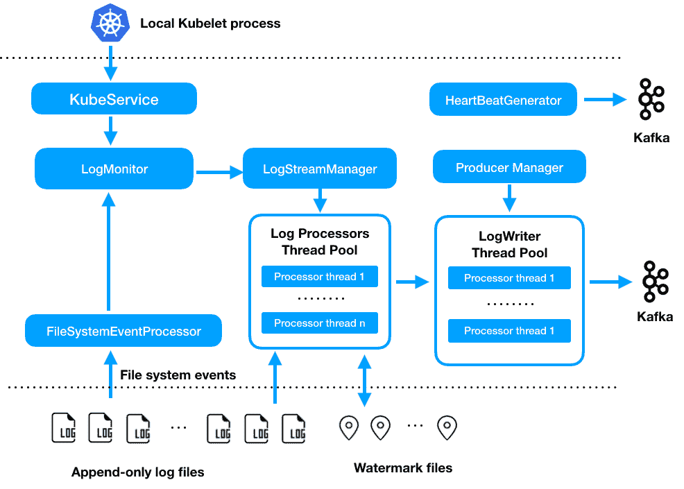

# 开源歌手，Pinterest 的高性能和可靠的日志代理

> 原文：<https://medium.com/pinterest-engineering/open-sourcing-singer-pinterests-performant-and-reliable-logging-agent-610fecf35566?source=collection_archive---------3----------------------->

杨宇|软件工程师，数据工程

在 Pinterest，我们使用数据来指导产品决策，并最终改善 Pinner 体验。在之前的一篇文章中，我们分享了 Pinterest 数据摄取框架的设计。数据接收和数据驱动的决策制定的第一步是数据收集。

乍一看，数据收集似乎很简单:只是将数据从主机上传到中央存储库。然而，为了从成千上万的主机上收集各种格式的数据，以低延迟的方式可靠、高效地大规模上传数据成为一个具有挑战性的问题。2014 年，我们评估了可用的开源日志代理，没有找到符合我们需求的代理。作为一个解决方案，我们构建了一个名为“*歌手*的日志代理，它已经在 Pinterest 上生产了多年。Singer 是我们数据基础设施的重要组成部分，现在每天传输超过 1 万亿条消息。今天，我们与开源社区分享 Singer。你可以在 [GitHub](http://github.com/pinterest/singer) 上找到它的源代码和设计文档。

Singer 支持以下功能:

*   *文本日志格式和节约日志格式现成的* : [节约](https://github.com/pinterest/singer/blob/master/thrift-logger/src/main/thrift/singer_if.thrift#L9)日志格式提供了更好的吞吐量和效率。我们在 [Python](https://github.com/pinterest/singer/tree/master/thrift-logger-python) 和[Java](https://github.com/pinterest/singer/tree/master/thrift-logger)Singer repository 中包含了 thrift log 客户端库。
*   *至少一次消息传递* : Singer 上传一批消息失败后会重试。对于每个日志流，Singer 使用一个水印文件来跟踪其进度。当 Singer 重新启动时，它从水印位置开始处理消息。
*   *支持在 Kubernetes 中作为边车服务登录:*在 Kubernetes 中作为 daemonset 登录，Singer 可以从多个 Kubernetes pods 的日志目录中监视和上传负载。
*   *高吞吐量写入* : Singer 使用分阶段事件驱动架构，能够以高吞吐量传输数千个日志流(节约日志为> 100MB/s，文本日志为> 40MB/s)
*   *低延迟日志* : Singer 支持可配置的处理延迟和批量大小，可以实现< 5ms 的日志上传延迟。
*   *灵活的消息划分* : Singer 提供多个划分器，支持可插拔划分器。我们还支持位置感知分区器，这可以避免跨可用性区域的生产者流量，并[降低数据传输成本](/@Pinterest_Engineering/optimizing-kafka-for-the-cloud-4e936643fde0)。
*   *监控* : Singer 可以根据配置发送心跳消息到一个集中的消息队列。这允许用户大规模设置 Singer 实例的集中监控。
*   *可扩展设计* : Singer 可以轻松扩展，支持数据上传到自定义目的地。

*图一。歌手内幕*

具体来说，服务将日志写入仅附加日志流。Singer 根据配置监听文件系统事件。一旦检测到日志文件更改，Singer 会处理日志流，并将数据发送到写入线程池进行上传。成功上传一批记录后，它会将 logstream 水印文件存储在磁盘上。当重新启动时，它还将处理来自水印位置的日志流。

Singer 可以自动检测新添加的配置并处理相关的日志流。在 Kubernetes 环境中作为 daemonset 运行，Singer 可以查询 kubelet API 来检测每个节点上的活动 pod，并根据配置处理每个 pod 上的日志流。关于如何运行 Singer，请看[教程](https://github.com/pinterest/singer/tree/master/tutorial)。

开源不仅对 Pinterest 的工程师很重要，对 YouTube、Google、Tinder、Snap 等公司也很重要，这些公司使用我们的开源技术来支持应用持久化、图像下载等。参见[opensource.pinterest.com](https://opensource.pinterest.com/)和 [GitHub](https://github.com/pinterest) 了解我们的开源项目。Pinterest engineering 有许多有趣的问题需要解决，查看[我们开放的工程角色并加入我们](https://careers.pinterest.com/careers)！