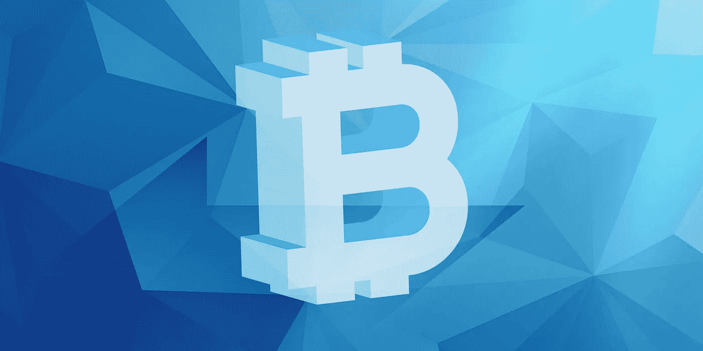
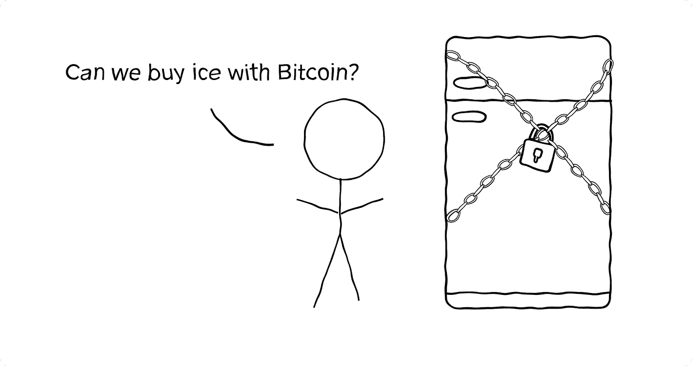
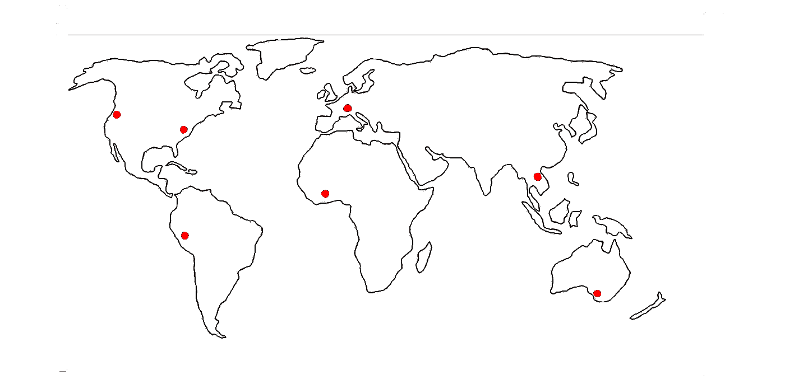
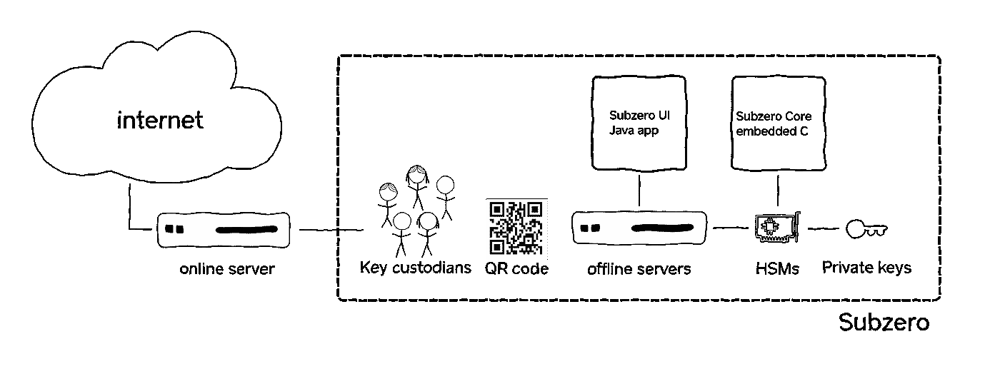

# 开源 Subzero

> 原文：<https://medium.com/square-corner-blog/open-sourcing-subzero-ee9e3e071827?source=collection_archive---------0----------------------->

## **Square 的比特币冷藏解决方案**

> 注意，我们已经行动了！如果您想继续了解 Square 的最新技术内容，请访问我们在 https://developer.squareup.com/blog[的新家](https://developer.squareup.com/blog)

去年年底，Square 开始提供用现金应用程序买卖比特币的能力[。作为此次发布的一部分，我们投入巨资建设加密货币基础设施，以帮助保护我们客户的资金，并使 Square 免受内部和外部威胁。](https://cash.app/help/US/en-us/1110-bitcoin#)

比特币等加密货币需要私钥来访问和转移资金。保护这些私钥非常重要，因为传输是不可撤销的。获得私钥的未授权人员可以转移资金，并且由于加密货币的性质，实际上不可能识别该人员或追回资金。

自从推出比特币支持以来，Square 开发了一种稳健的比特币冷存储方法，我们认识到与社区分享我们的工作的重要性。因此，今天我们[开源“Subzero”](https://github.com/square/subzero)的文档、代码和工具，这是我们 HSM 支持的保护 Square 比特币资产的解决方案。

**背景**

现金 App 客户有能力购买、出售和提取比特币。他们可以查看自己账户的余额，但实际的比特币由 Square 保存在冷热钱包中。冷存储是一个用来指离线比特币钱包的术语，这意味着钱包的私钥以一种任何网络都无法访问的方式存储。将比特币储存在冰冷的钱包中，降低了远程攻击的风险。在没有远程访问的情况下，攻击者更难获得私钥来访问存储在冷藏钱包中的比特币。从冷库转移资金需要物理访问私钥或存储私钥的设备。另一方面，在线或热门钱包能够随时发送资金。将少量资金放在网上钱包，将大部分资金放在冷钱包，这是一个两全其美的好方法。

实现冷藏的方法有很多种。你可以将密钥材料打印在一张纸上(所谓的“[纸钱包](https://en.bitcoin.it/wiki/Paper_wallet)”)，刻在石头上，保存在与网络保持断开的计算机上，或者使用专门的硬件钱包设备，如 [Trezor](https://trezor.io/) 或 [Ledger](https://www.ledger.com/) 。

硬件安全模块(HSM)是专门的硬件设备，通常在支付行业中用于存储敏感的加密密钥材料并使用这些密钥执行操作。HSM 为敏感密钥材料的安全性提供了保证，例如强大的访问控制，以及防止物理篡改的主动保护。HSM 通常还允许复制密钥(用于备份或灾难恢复目的),而不会暴露明文密钥材料。这些功能使 HSMs 成为冷存储解决方案的天然选择，因为我们主要关心的是安全地存储钱包的私钥，同时仍然能够在需要时使用它们来转移比特币。

**什么是 Subzero？**

Subzero 是一款企业线下比特币钱包。对于那些不想使用现成硬件钱包的人来说，这很有用，因为他们需要创建独特的定制或实施与业务相关的规则。我们决定使用我们用于所有其他支付相关需求的同一个 HSM 供应商，因为我们已经熟悉了硬件和软件。HSM 是可编程的，允许我们今天支持比特币钱包，同时让我们在未来灵活地实现其他协议。

我们实现的一个特定定制是强制冷钱包只能向 Square 拥有的热钱包发送资金。这种分层提供了[深度防御](https://en.wikipedia.org/wiki/Defense_in_depth_(computing))；迫使攻击者破坏多个系统以提取资金。还可以构建额外的层，其中每一层都可以用存储的资金量来权衡便利性([洋葱模型](https://simple.wikipedia.org/wiki/Defense_in_depth_(computing)#Onion_model))。

我们的多方签名仪式利用了比特币的多重签名功能。将资金移出冷库需要*的*m*n*人参加签字仪式。参与者使用智能卡和密码的组合来验证冷藏系统。QR 码用于在离线和在线世界之间交换最少量的数据。物理上受到保护的冷钱包在其整个生命周期内保持脱机状态。这为其完整性提供了保证；虽然供应链需要得到保护，但主动系统的未经授权的修改是不可能的。

地理上分布的设置使得妥协更加困难( *m* 个不同的站点需要妥协)并且提供冗余(我们可以失去任何 *n-m-1* 个站点)。我们的签名仪式的一个很好的特性是，我们降低了由于数据损坏(无论是在传输中还是在内存中)而处理不正确交易的风险。在 *m* 台不同的服务器上，完全相同的位需要以不引人注意的方式被破坏。

**低温细节**

签字仪式从在线服务器生成二维码开始。QR 码包含签署交易所需的最少量信息。使用 Protobufs 可以有效地对 QR 码进行编码。这些二维码可以打印和存档，这对取证很有用。QR 码还限制了可能交换的数据量。

执行签名仪式的人与服务器交互。服务器位于秘密的安全地点。服务器从 Linux Live DVD 启动。DVD 提供了两个理想的特性:

1.  除非攻击者能够修改驱动器的固件，否则介质是不可变的。不可变的磁盘使潜在的恶意软件更难泄露信息或清除自身。
2.  当需要软件升级时，可以交换 DVD，而不必使服务器联机。

我们的长期目标是有一个可重复的构建过程，类似于 [Tails](https://tails.boum.org/blueprint/reproducible_builds/) 。

服务器运行用 Java 编写的定制应用程序(Subzero UI)。应用程序提示输入要扫描的二维码。参与者能够在解锁私钥之前检查正在签名的交易。

应用程序与 HSM 通信。HSM 运行 Subzero Core，这是一个定制的比特币钱包实现。代码用 C 语言编写，实现了[层次确定性钱包](https://github.com/bitcoin/bips/blob/master/bip-0032.mediawiki)以及[安全钱包](https://github.com/bitcoin/bips/blob/master/bip-0141.mediawiki)。我们尽可能地利用 Trezor 的开源项目(如 [trezor-crypto](https://github.com/trezor/trezor-crypto) )。

业务逻辑规则是在 Subzero 核心内部实施的，私钥永远不会暴露在 HSM + Subzero 核心边界之外。

**计数器**

最后，我们编写了一个工具 [Beancounter](https://github.com/square/beancounter/) ，来审计我们的钱包余额。该工具是用 Go 编写的，解决了现有钱包软件无法满足的需求，例如计算过去任何给定日期的余额的能力，以及处理大量交易的钱包的能力。Beancounter 还有一些其他有用的特性，比如将日期映射到块号。

我们的 repo 包含文档、构建 DVD 的代码、GUI、在 HSM 上运行的钱包以及一些其他实用程序。我们的一些代码与我们的特定硬件紧密相关，但是我们对支持其他供应商的贡献持开放态度。

我们希望通过分享我们的工作，我们可以让其他人更容易满足他们的安全需求，从而在加密货币领域实现更多创新，并为所有参与者提供更好的保护。从长远来看，由于我们必须解决其他公司可能面临的问题，我们对标准化我们的一些工作感兴趣。

我们期待着听到您的反馈和建议，因为我们将继续改善 Subzero，代码可在[https://github.com/square/subzero](https://github.com/square/subzero)获得。