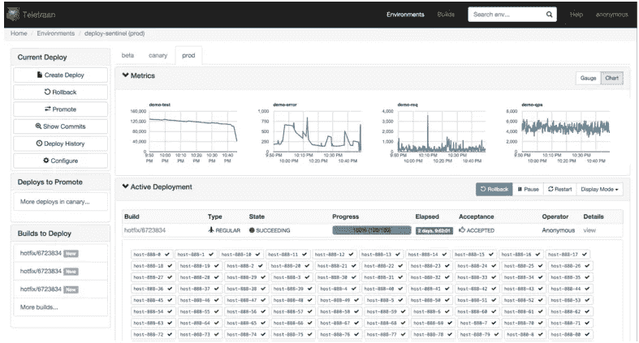

# 开源的 Teletraan，一个代码部署系统

> 原文：<https://medium.com/pinterest-engineering/open-sourcing-teletraan-a-code-deployment-system-198372cb6dd6?source=collection_archive---------0----------------------->

基础设施 Pinterest 工程师宋宝刚

[Teletraan](https://engineering.pinterest.com/blog/under-hood-teletraan-deploy-system) 是一个代码部署系统，我们构建它来部署我们的数百个内部服务。它支持数万台主机，并且已经在生产环境中运行了一年多。Teletraan 使工程师能够快速、安全、可靠地将代码大规模交付给 Pinners。正如在以前的博客文章中分享的，详细介绍了 [Teletraan 的功能](https://engineering.pinterest.com/blog/under-hood-teletraan-deploy-system)，我们很自豪地宣布 Teletraan 是我们最新的开源项目。查看 [GitHub](https://github.com/pinterest/teletraan) 的所有代码和文档。

## 使用 Teletraan 的好处

Teletraan 被设计来做一件事——部署代码。它不仅支持关键功能，如零停机部署、回滚、暂存和连续部署，还具有方便的功能，如显示提交详细信息、比较不同的部署、通过电子邮件或聊天室通知部署状态变化、显示 OpenTSDB 指标等。Teletraan 还不支持基于容器的部署，但它在我们未来支持的路线图中。

## 如何与 Teletraan 集成

Teletraan 被设计成一个灵活的构建模块。它是高度可配置的，并且不固执于你的应用程序使用的编程语言。如果满足以下要求，您可以将 Teletraan 插入现有的发行工作流程:

*   通过设置过程在每台主机上运行部署代理
*   将部署脚本添加到应用程序中
*   在每个构建结束时将构建工件发布到 Teletraan

如需更多信息，请查看我们详细的[文档](https://github.com/pinterest/teletraan/wiki/Integrate-with-Teletraan)。

## 下一步是什么

我们大量使用 Teletraan。目前，我们每天大约有 500 次部署，包括自动部署。Teletraan 一直在积极开发中，以使它变得更好。今年，在其他特性中，例如更精细的部署速度控制、共享公共部署脚本，我们将添加对基于容器的部署的支持。敬请关注未来发展。

*鸣谢:Teletraan 由云管理平台团队的 Jinru He、Nick Dechant、Linda Lo 和 Baogang Song 构建，云管理平台团队是基础设施团队的一个子团队，致力于提高 Pinterest 及其基础设施的可靠性、速度、效率和安全性。*