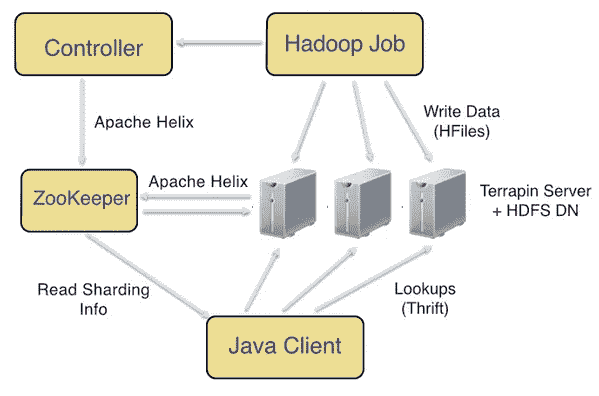

# 开源 Terrapin:一个批量生成数据的服务系统

> 原文：<https://medium.com/pinterest-engineering/open-sourcing-terrapin-a-serving-system-for-batch-generated-data-7aa2f38c4472?source=collection_archive---------0----------------------->

Varun Sharma | Pinterest 基础设施工程师

我们广泛采用 Hadoop 批处理作业，从构建建议到机器学习的计算功能和模型，以及围绕 Pinners、pin 和 Boards 连接各种数据。这些数据集由批量 ETL 作业生成，并作为推荐、机器学习和几个支持 Pinterest 上内容发现的产品的基础。

今天在脸书 [@scale](https://www.atscaleconference.com/schedule#session/terrapin-a-serving-system-for-batch-generated-data-sets) 大会上，我们宣布了 [Terrapin](https://github.com/pinterest/terrapin) 的开源，这是一个用于处理 Hadoop 作业生成的大型数据集的服务系统。Terrapin 提供了对这种大型数据集的低延迟随机键值访问，这些数据集是不可变的，并且是整体(重新)生成的。Terrapin 可以从 HDFS S3 或直接从 MapReduce 作业中获取数据，并且具有足够的弹性、容错性和性能，可用于 Pinterest 上的各种在线应用，如[定位](https://engineering.pinterest.com/blog/pinnability-machine-learning-home-feed)和[发现数据](https://engineering.pinterest.com/blog/creating-serving-storing-data-discovery)。

## 现状

以前，我们使用 Apache HBase 来提供批量生成的数据。我们发现，直接写入 HBase 既昂贵又缓慢，而且只适用于较小的数据集(几十个 GB)。我们还尝试使用批量上传功能将 HFiles 从我们的计算 Hadoop 集群直接上传到我们的服务 HBase 集群。虽然数据传输速度大大加快，但系统没有数据局部性(即 HBase 区域的数据分布在整个集群中，而不是集中在区域服务器上)。如果没有数据局部性，延迟就会受到影响，特别是在第 90 和第 99 百分位。我们必须运行压缩来恢复数据局部性，并对以前上传的数据进行垃圾收集。压缩给集群增加了不小的负载，也影响了延迟。

为了解决这些问题，我们构建了一个系统，该系统将从 S3 提取由 MapReduce 作业生成的 HFiles，并将它们分发到一个服务器池中。它有一些很好的特性，比如实时交换和从一个数据集版本到另一个数据集版本改变 MapReduce 碎片数量的便利性。该系统速度很快，因为数据总是在本地访问，但我们失去了 HBase 和 HDFS 带来的灵活性、容错性和易操作性。很难扩展这个系统。

根据以前的经验，我们意识到，如果我们能够以某种方式将数据局部性与 HDFS 结合起来，我们就可以实现对弹性、容错和性能的所有要求。最重要的是，Hadoop ETL 作业可以相当快地将数据加载到 HDFS，从而控制 Hadoop 管道的运行时间。

## 体系结构

与 HBase 不同，h base 只是将 HDFS 视为分布式文件系统，Terrapin 考虑了 HDFS 数据块的分布，并在物理存储 HDFS 数据块的相同节点上提供相应的服务碎片。这是可能的，因为 Terrapin 提供不可变的数据集，这些数据集只能通过批处理作业定期重新生成。

上图说明了 Terrapin 的各种组件。一个 Hadoop 作业以 HFiles 的形式将数据写入一个 Terrapin 集群，由 HDFS 提供支持。Terrapin 集群由以下部分组成:

*   一个 **ZooKeeper 仲裁**存储集群状态，将它传播到客户端，并帮助驱动集群协调。
*   一个 **Terrapin 服务器**进程在每个 HDFS 数据节点上运行。Terrapin 服务器负责提供针对 HFiles 的键值查找服务。Terrapin 服务器与 ZooKeeper 进行交互，以接收关于需要服务哪些 HFiles 的通知。Terrapin 控制器定期查询每个 HFile 的当前 HDFS 块位置，计算要发送到 Terrapin 服务器的适当通知，并将它们写入 ZooKeeper。在群集中添加/删除节点或 HDFS 重新平衡数据时，控制器可确保数据的局部性。控制器还负责执行实时交换和旧版本的垃圾收集。*注意:我们写的 HFile 的块大小更大，为 4G，所以每个 HFile 只跨越 1 个 HDFS 块。我们没有发现使用更大块大小的任何问题。*
*   **Java 客户端库**从 ZooKeeper 读取分片信息，并适当地路由键值查找。分片信息告诉应该向哪个 Terrapin 服务器查询存储在特定 HFile 分片中的密钥。因为一个 HFile shard 可以有多个副本，所以 Java 客户端还会在另一个副本上重试失败的读取。

在该设计中，Terrapin 控制器将系统推向 100%的数据局部性，Terrapin 实现了低延迟，同时充分利用了 HDFS 和 Hadoop 的易操作性、可扩展性和弹性。

## 设计选择

我们的设计选择使我们能够通过提供正确的构建模块和节省宝贵的工程周期来满足我们的要求。

*   我们选择 **HDFS** 作为底层存储，是因为它的弹性、容错性、易操作性以及与 MapReduce 的紧密集成。
*   我们选择了**HFiles**作为文件格式，因为我们已经在 HBase 在线服务方面取得了相当大的成功。通过 Hadoop 作业很容易消费和生成 HFiles。
*   我们使用 **Apache Helix** 进行基于 ZooKeeper 的集群协调。许多公司使用 Apache Helix 来管理有状态服务。

Terrapin 提供以下功能:

*   文件集:Terrapin 集群上的数据被命名为“文件集”新数据被加载/重新加载到文件集中。
*   动态交换和多版本:通过动态交换将新数据加载到现有文件集中，不会出现服务中断。Terrapin 支持为关键文件集保留多个版本，这使得在数据加载不良的情况下能够快速回滚。
*   S3/HDFS/Hadoop/Hive:一个 Hadoop 作业可以直接向 Terrapin 写数据。否则，Hadoop 作业可以将数据写入 HDFS/S3，并且可以在后续步骤中被 Terrapin 接收。Terrapin 还可以摄取 Hive 上的表，并基于某一列(标记为 key)提供随机访问。
*   易于更改输出碎片的数量:对于相同的文件集，跨不同的数据负载更改输出碎片的数量是很容易的。这使得开发人员可以通过调整 reducers 的数量来灵活地调整 MapReduce 作业。
*   可扩展的服务/存储格式:可以插入其他(更有效的)服务格式，比如 rocksdb。sst 等。
*   监控:Terrapin 通过 HTTP 接口导出延迟和值大小分位数以及集群健康状态。
*   推测性执行:terrapin 附带了一个客户端抽象，可以针对服务于相同文件集的两个 Terrapin 集群发出请求，并选择较早满足的一个。该功能对于提高可用性和减少延迟非常有效。

## 带着水龟去兜风吧！

Terrapin 已经在 Pinterest 上运行了一年多。包括我们的 web/移动前端、流处理系统和中间件服务在内的几个系统查询我们的 Terrapin 集群。我们的 MapReduce 管道每天将数 TB 的数据转储到 Terrapin。我们一直在 EC2 上的数百个节点上运行 Terrapin，服务累计 150 万 QPS，服务器端 p99 延迟的< 5ms. Today, our Terrapin deployment stores ~180T of data. The data is split across ~ 100 filesets and over 50 thousand files.

You can now access the [源代码](https://github.com/pinterest/terrapin)、[设置](https://github.com/pinterest/terrapin/blob/master/docs/SETUP.md)和[使用](https://github.com/pinterest/terrapin/blob/master/docs/USAGE.md)指令供自己使用。如果您有任何问题或意见，请通过[terrapin-users@googlegroups.com](mailto:terrapin-users@googlegroups.com)联系我们

鸣谢:这项工作是由房建、瓦伦·夏尔马和两名软件工程实习生康奈尔·多纳吉和杰森·钟共同完成的。我们还要感谢 Discovery 团队，他们是这项技术的早期采用者，并帮助在生产中强化这项技术。