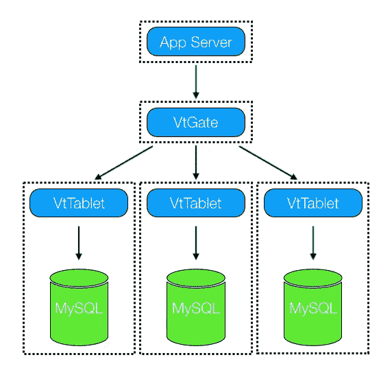
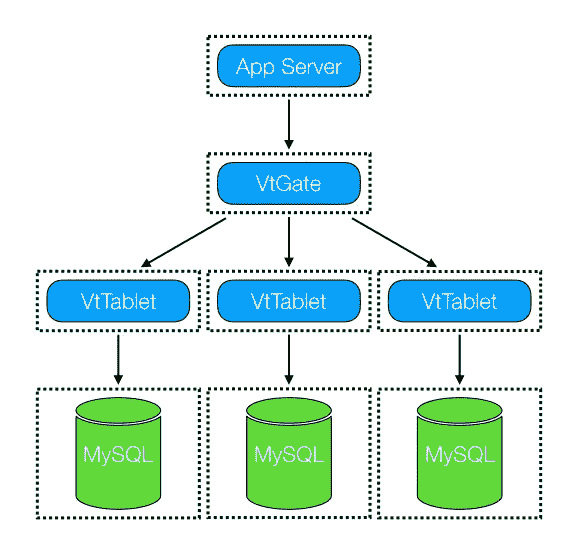
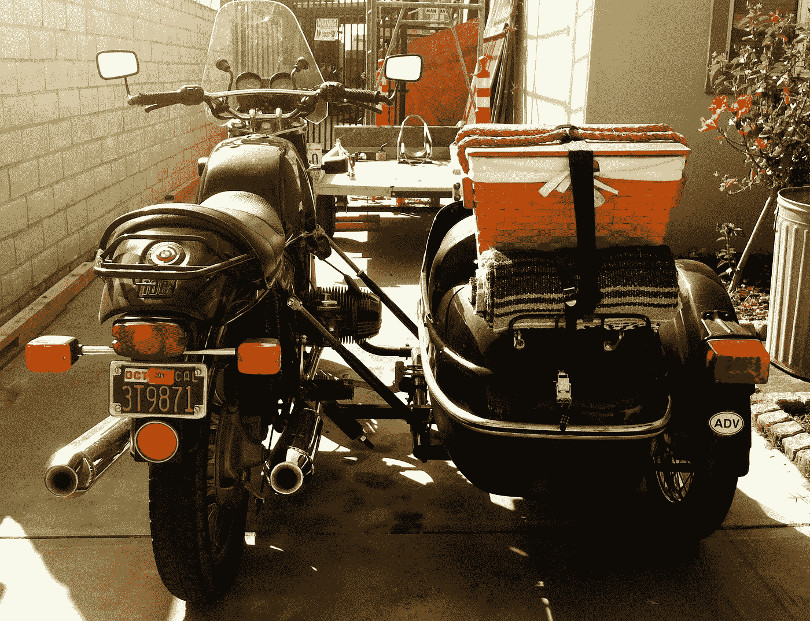
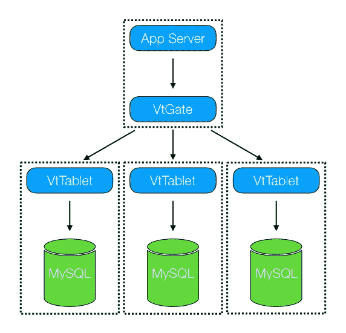

# 操作 Vitess

> 原文：<https://medium.com/square-corner-blog/operating-vitess-d90eb01e5b4d?source=collection_archive---------2----------------------->

## 把维特思拆开，再把它拼起来。

> 注意，我们已经行动了！如果您想继续了解 Square 的最新技术内容，请访问我们的新家[https://developer.squareup.com/blog](https://developer.squareup.com/blog)

随着时间的推移，在我们现有的 MySQL 数据库上上线 Vitess，然后对其进行分片和更大规模的操作，这是一个相当大的挑战。个人喜欢使用 Cash 应用程序，虽然这是一件好事，但对高峰负载毫无准备会给新用户和现有用户带来糟糕的体验。当我们开始分片时，每当我了解到我们的增量增长时，一句[标志性的台词](https://www.youtube.com/watch?v=l1dnqKGuezo)*【The Wire】*参议员 Clay Davis 就会浮现在我的脑海中。我们已经优化了公共代码路径，并尽可能消除了所有低效的代码。我们运行在昂贵的硬件和借来的时间上。我们迫切需要一个可扩展的解决方案。

有两个 Vitess 组件，VtTablet 和 VtGate，几乎每个 Vitess 持久性请求都涉及到它们。VtTablet 是一个运行在每个 MySQL 前面的代理，它允许 Vitess 以多种方式共享连接和保护数据库，比如规定最大查询时间和大小。VtTablet 意味着与 MySQL 数据库是 1:1 的关系。它是管理的，通常与 MySQL 托管在同一个主机上。它使用本地或 TCP 套接字连接到 MySQL 数据库。VtGate 是查询路由器。它监视 Vitess 集群的当前状态，计算出哪些查询应该发送到哪些数据库，根据需要重写查询和聚合数据。VtGate 是该应用程序进入 Vitess 的入口。通常情况下，您的应用程序使用 MySQL 协议或 Vitess 驱动程序连接到任何一个 VtGates 车队。

当我们第一次开始使用 Vitess 时，我们非常关心 VtTablet 可能会使用哪些资源。VtTablet 可能会耗尽 MySQL 进程所需的资源。增加额外的负载可能会占用数据库的资源，这似乎是非常不明智的。我们试图通过分片来减少负载。我们需要将这些问题/组件分开，因此我们将 VtTablet 放在了单独的主机上。这非常有效，让我们度过了最初的几次分裂，我们在快速获得更小的碎片和小心翼翼地运用这种新的(对我们来说)碎片分裂技术之间取得了平衡。

Everything on its own

有一些缺点:VtTablet 主机使用大量网络容量，因为它位于额外的一跳之后。此外，我们被迫对 VtTablet 和 MySQL 之间的数据进行加密，这增加了整体 CPU 使用率。另一个缺点是管理 VtTablet 对 MySQL 的 1:1 特性。我们最终使用我们的 Vitess lockserver 的一部分来锁定哪个 VtTablet 在哪个 MySQL 前面运行。当您有 4 个集群时，管理和跟踪什么去了哪里是相当容易的。然而，随着每一次分裂，这个数字都会翻倍，因此一切都变得越来越难以追踪。

Generated using [fontmeme.com](https://fontmeme.com/keep-calm/)

快进几个月，我们一直在分裂。最后，我们的数据库缩减到了一个更合理的大小，而且数量也更多了。app、VtGate、VtTablet、MySQL 进程都在自己的主机上。Vitess 进程的运行只占主机容量的一小部分，因此它们可以在其他应用程序旁边运行。我们不断要求我们的硬件团队提供更多的主机。被问得越来越频繁的问题是，我们如何节省 CPU 和/或更充分地利用硬件。我们甚至达到了运行 VtGate 主机多于应用主机的地步。

既然我们已经看到了那些 Vitess 进程是如何在我们的负载下运行的，我们开始重新考虑将所有这些事情分开的决定。分析证实，大部分请求时间都花在了数据的移动上，要么是处理 TLS，要么是编组/解组数据包。我们遇到的另一个问题是，当 VtGate 不可访问时，例如在 VtGate 部署期间，我们的驱动程序有一些适应问题。

“[Sidecar](https://www.flickr.com/photos/23291498@N04/5539212408/)” by [cireremarc](https://www.flickr.com/photos/23291498@N04/) is licensed under [CC BY 2.0](https://creativecommons.org/licenses/by/2.0/)

鉴于这些问题和硬件限制，我们开始将这些组件重新组合在一起。我们开始在一台 sidecar 进程配置的机器上将这些组件作为单独的进程运行。我们通过不再花费 CPU 加密来节省 TLS。通过使用本地套接字或文件描述符进行通信，我们节省了 CPU 数据包处理。我们首先关心的是所有那些 VtGates。VtGates 比实际的应用程序机器还多，这似乎很荒谬。通过在应用和 VtGate 之间使用一个仅用于主机的本地端口传输流量，这一点很快就实现了，因此不再需要 TLS。

是时候重访孤立的 VtTablet 了。如果我们要在 MySQL 的同一台机器上托管 VtTablet，我们将需要更多的 MySQL 主机，但是，我们可以返回当前作为单独的 vt table t 运行的所有主机。此迁移正在进行中。随着虚拟平板电脑的列表越来越长，我们遇到了几个挑战，如何保持虚拟平板电脑与 MySQLs 的一对一映射。将 VtTablet 和 MySQL 一起运行的一个很大的副作用是，对于 VtTablet 来说，它与哪个 MySQL 配对是显而易见的。所有的锁服务器代码都被扔进垃圾桶了，好哇！所以最终有了这个解决方案真是太棒了。

Friends forever

回想起来，整个练习似乎有点绕圈。然而，在首次部署和使用 Vitess 时，将 Vitess 分开有助于我们降低风险。推行 sidecar 使 Vitess 更易于管理，并降低了我们的硬件成本。这可能会冒犯我干燥的(不要重复你自己)有原则的大脑，但通过在前进之前后退一步，我们已经能够随着时间的推移继续向更多的客户提供体验。软件的一个伟大之处在于，如果你把某个东西拆开了，以后再把它拼起来通常并不困难。

这篇文章是 Square[Vitess 系列](/square-corner-blog/sharding-cash-10280fa3ef3b)的一部分。

*这是因为在开始时，获得几个宿主的部分比获得一小组完整的宿主更容易。*