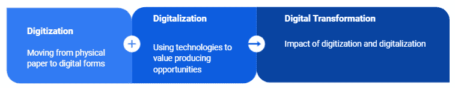
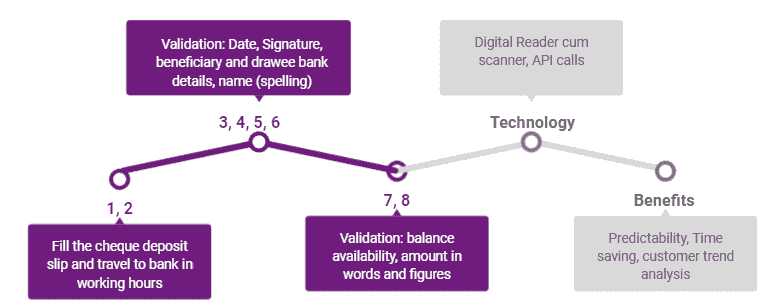
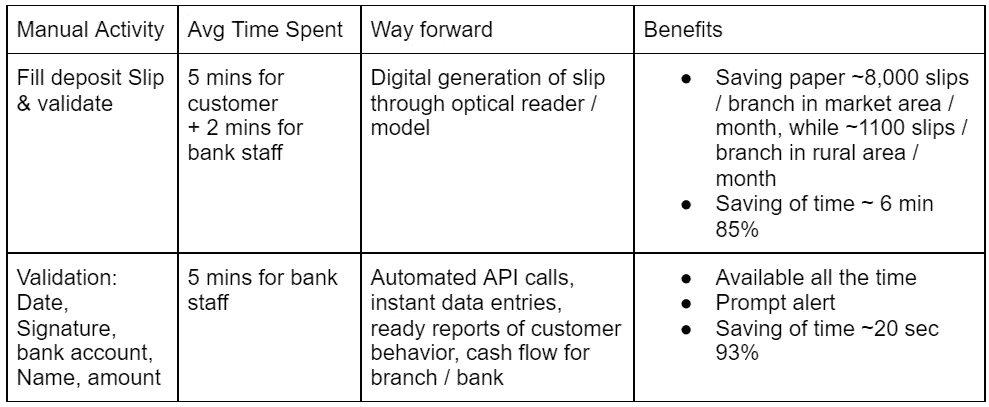
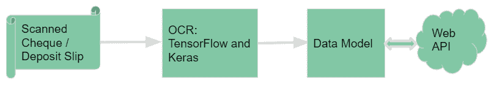

# 运营效率和数据洞察力

> 原文：<https://medium.com/globant/operational-efficiency-and-data-insights-c2e277b4ab68?source=collection_archive---------0----------------------->

数字化和数字化使一些商业运作变得更加容易。文章解释了银行如何转变现有的手动[支票清算](https://en.wikipedia.org/wiki/Cheque_clearing#:~:text=Cheque%20clearing%20(or%20check%20clearing,the%20traditional%20physical%20paper%20form)流程，以利用数据洞察并为利益相关方增加价值。

根据 CEIC 的报告，2020 年 7 月至 2021 年 6 月，印度纸质支票结算的平均交易量约为 5960 万张。近乎实时的数据收集是乏味的。这通常会导致客户和员工对信用延迟、受益人详细信息等的不可见性。

支票清算的现有流程:

1.  **存款单**:要求银行客户手工填写明细
2.  **前往最近的地点**:员工在营业时间内前往出示支票并接受回执
3.  **日期确认**:签发支票的日期应在处理时监管机构允许的最长时间内
4.  **签名验证**:银行工作人员核对签名
5.  **银行账户和分行的验证**:银行账号和银行分行必须有效
6.  **受益人姓名**:受益人拼写必须与银行记录一致
7.  **余额可用性**:签发的支票应有必要的可用于借记的金额
8.  **大写金额**:大写金额和数字应一致

Illustration of Manual activity and way forward

通过各种开源的[光学字符识别工具](https://www.hitechnectar.com/blogs/open-source-ocr-tools/)，可以实现数据采集的自动化。或者，可以使用易于使用的开源库，如 [TensorFlow](https://en.wikipedia.org/wiki/TensorFlow) 和 [Keras](https://en.wikipedia.org/wiki/Keras) 来训练模型，准确率超过 95%。Web 服务还可以用来验证存款单或支票上的大多数手写票据。下面是流程的高级表示。

提高效率并为未来做好准备总是明智的。自动化数据收集为可持续发展提供了优势，并节省了宝贵的时间。对于审计和合规性的严格要求，改变人工支票清算的方式将增强和简化关键验证。上述建议方法的主要优点是:

*   支票清算的状态
*   现金流的近乎实时的可见性
*   一天内处理的支票数量
*   总清算时间
*   持有支票的原因
*   即时付款人和受益人详细信息
*   处理延迟的警告消息(假期、硬件/软件故障)
*   验证失败的自动警报
*   快速查看已使用的支票页
*   跟踪退回的支票

接受变革需要心态和范式的转变。从[数字化转型](https://www.forbes.com/sites/ronshevlin/2021/04/05/digital-transformation-in-banking-banks-have-a-long-long-way-to-go/?sh=17f900325524)和早期趋势的优势来看，快速决策是成功的关键。