# 将 Node.js 用于服务器端渲染

> 原文：<https://medium.com/airbnb-engineering/operationalizing-node-js-for-server-side-rendering-c5ba718acfc9?source=collection_archive---------0----------------------->

## 随着 Airbnb 围绕服务器端渲染构建更多的前端，我们看了看如何优化我们的服务器配置来支持它。


在 Airbnb，我们已经花了数年时间稳步地将所有前端代码迁移到一个一致的[架构](/airbnb-engineering/rearchitecting-airbnbs-frontend-5e213efc24d2)，在这个架构中，整个网页被编写为一个 React 组件的层次结构，其中包含来自我们 API 的数据。Ruby on Rails 在让 web 进入浏览器方面所扮演的角色每天都在减少。事实上，我们很快就会过渡到一项新的服务，该服务将完全以 Node.js 的形式提供完整的服务器渲染网页。该服务将为 Airbnb 的所有产品渲染大部分 HTML。这个渲染引擎不同于我们运行的大多数后端服务，因为它不是用 Ruby 或 Java 编写的。但是它也不同于那种常见的 I/O 密集型 Node.js 服务，我们的心智模型和通用工具就是围绕这种服务构建的。

当您想到 Node.js 时，您会想到您的高度异步的应用程序高效且有效地同时服务数百或数千个连接。您的服务从整个城市中提取数据，并应用最简单的处理，使其适合许多许多的客户。也许您正在处理一大堆长期存在的 WebSocket 连接。您对自己的轻量级并发模型感到满意和自信，它非常适合这个任务。

服务器端渲染(SSR)打破了导致这一愿景的假设。它是计算密集型。Node.js 中的用户代码在单线程中运行，因此对于计算操作(与 I/O 相反)，您可以并发执行它们，但不能并行执行。Node.js 能够并行处理大量的异步 I/O，但是在计算上遇到了限制。随着请求的计算部分相对于 I/O 的增加，由于对 CPU 的争用，并发请求将对延迟产生越来越大的影响。

考虑`Promise.all([fn1, fn2])`。如果`fn1`或`fn2`是通过 I/O 解决的承诺，那么您可以像这样实现并行性:


如果`fn1`和`fn2`被计算，它们将改为这样执行:

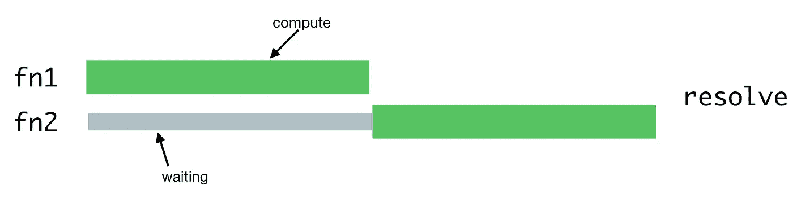

一个操作必须等待另一个操作结束才能运行，因为只有一个执行线程。

对于服务器端呈现，当服务器进程处理多个并发请求时，就会出现这种情况。并发请求将被正在处理的其他请求延迟:

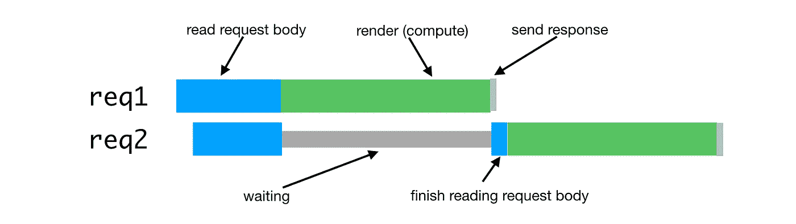

实际上，请求通常由许多不同的异步阶段组成，即使大部分仍然是计算。这可能导致更差的交错。如果我们的请求由一个类似于`renderPromise().then(out => formatResponsePromise(out)).then(body => res.send(body))`的链组成，我们可以像这样进行请求交错

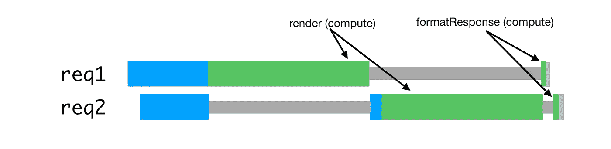

在这种情况下，两个请求都要花费两倍的时间。随着并发性的增加，这个问题变得更加严重。

另外，SSR 的一个共同目标是能够在客户端和服务器端使用相同或相似的代码。这些环境之间的一个很大的区别是客户端上下文本质上是单租户的，而服务器上下文是多租户的。在客户端容易工作的技术，如单例或其他全局状态，将导致服务器上并发请求负载下的错误、数据泄漏和一般混乱。

这两个问题只会成为并发性的问题。在较低的负载水平下，或者在您的开发环境的舒适的单租户环境中，一切通常都会很好。

这导致了一种与节点应用程序的典型示例完全不同的情况。我们使用 JavaScript 运行时是因为它的库支持和浏览器特性，而不是因为它的并发模型。在这个应用程序中，异步并发模型带来了所有的成本，却没有带来任何好处或好处很少。

# Hypernova 的教训

我们新的渲染服务 Hyperloop 将成为 Airbnb 网站用户互动的主要服务。因此，它的可靠性和性能对于用户体验来说绝对至关重要。随着我们在新的上运行生产，我们正在整合我们从我们早期的 SSR 服务 [Hypernova](http://github.com/airbnb/hypernova) 中学到的经验。Hypernova 的工作方式与我们的新服务不同。它是一个纯粹的渲染器。它是从我们的 Rails monolithic Monorail 调用的，只返回特定渲染组件的 HTML 片段。在许多情况下,“片段”是页面的绝大部分，Rails 只提供了外部布局。在遗留情况下，页面上的片段可以使用 ERB 缝合在一起。然而，在这两种情况下，Hypernova 本身不处理数据提取。数据由 Rails 提供。

也就是说，Hyperloop 和 Hypernova 在计算方面有着相似的操作特征，作为一种在生产中运行的服务，Hypernova 为理解其替代品在生产中的行为提供了一个很好的测试平台。

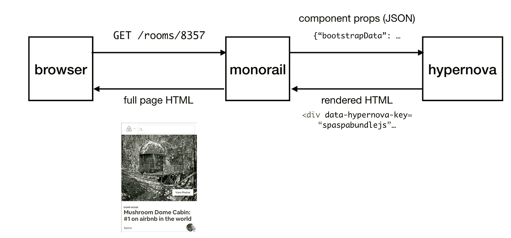

用户向我们的主要 Rails 应用 Monorail 发出请求，Monorail 将它希望在任何给定页面上呈现的 React 组件的道具组合在一起，并向 Hypernova 发出带有这些道具和组件名称的请求。Hypernova 使用道具渲染组件，以生成 HTML 返回到 Monorail，Monorail 随后将其嵌入到页面模板中，并将整个内容发送回客户端。

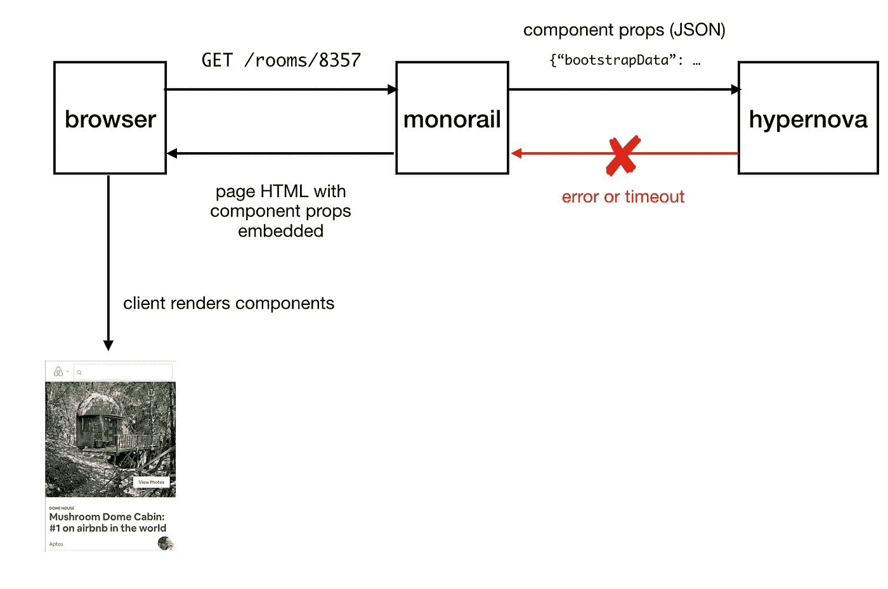

在 hypernova 渲染失败(由于错误或超时)的情况下，备用方案是在没有渲染 HTML 的页面上嵌入组件及其属性，允许它们(希望)被客户端成功渲染。这使我们认为 hypernova 是一个可选的依赖项，我们能够容忍一些超时和失败。在调整值时，我们将调用的超时设置为大约观察到的服务的 p95。不出所料，我们的超时基线略低于 5%。

在每日流量高峰期间部署时，我们会看到多达 40%的 Hypernova 请求在单轨中超时。在 Hypernova 上，我们会看到部署时出现较低数量级的错误率峰值`BadRequestError: Request aborted`。这些错误也以基线比率存在，非常有效地隐藏了所有其他应用程序/编码错误。

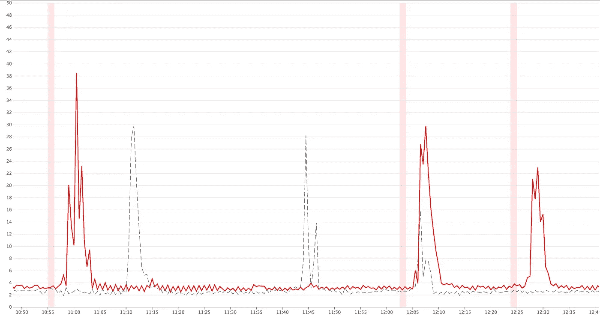

Examples of spikes in timeouts on deploys (red lines)

作为一个可选的依赖项，这种行为并不是一个高优先级的行为，而且被认为是一种烦恼。我们相当满意地解释了超时和错误是缓慢启动行为的结果，如启动时更昂贵的初始 GC、缺乏 JIT、填充缓存、样条网状化等。React 或 Node 的新版本有望提供足够的性能改进来缓解启动缓慢的问题。

我怀疑这可能是部署期间不良负载平衡或容量问题的结果，我们看到延迟增加，因为我们在同一进程上同时运行多个基本上 100%的计算请求。我添加了一个中间件来记录任何给定流程同时处理的请求数量，以及记录我们一次运行多个请求的情况。

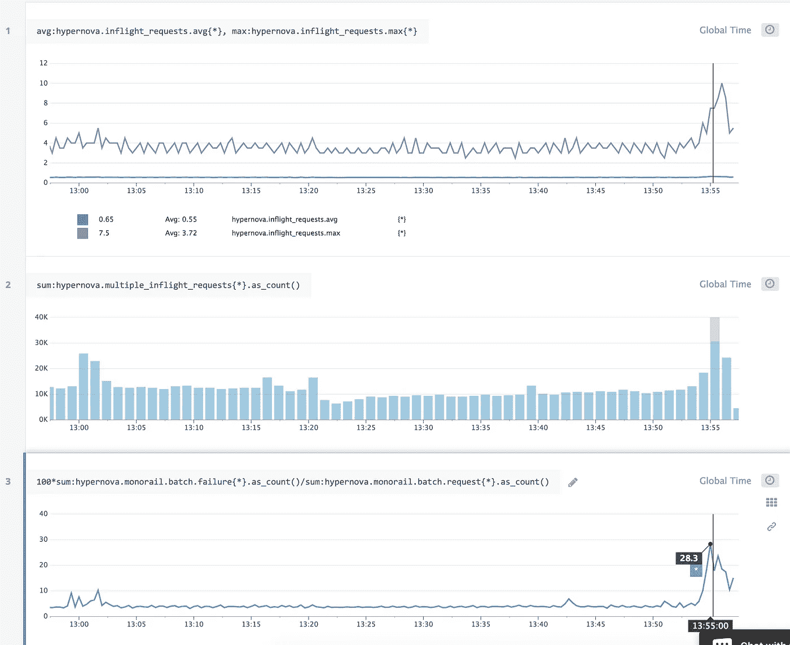

我们将延迟归咎于启动延迟，这实际上是由并发请求相互等待使用 CPU 造成的。从我们的性能指标来看，由于其他正在运行的请求而等待执行所花费的时间与执行请求所花费的时间是无法区分的。这也意味着并发性增加的延迟看起来与新代码路径或特性增加的延迟是一样的——这实际上增加了任何单个请求的成本。

同样变得越来越明显的是,`BadRequestError: Request aborted`错误不能用一般的慢启动性能来解释。该错误来自主体解析器，特别是在服务器能够完全读取请求主体之前，客户端已中止请求的情况下。客户机放弃并关闭连接，带走了我们继续处理请求所需的宝贵数据。发生这种情况的可能性更大，因为我们开始处理一个请求，然后我们的事件循环被另一个请求的呈现阻塞，然后从被中断的地方返回完成，却发现客户端已经离开了。Hypernova 的请求有效负载也相当大，平均只有几百千字节，没有什么好的。


我们决定通过使用两个现成的组件来解决这个问题，我们已经有了大量的现有操作经验:一个反向代理( [nginx](https://www.nginx.com/) )和一个负载平衡器( [haproxy](http://www.haproxy.org/) )。

# 反向代理和负载平衡

为了利用 hypernova 实例上的多个 CPU 内核，我们通过内置的 Node.js [cluster](https://nodejs.org/api/cluster.html) 模块运行 hypernova 的多个进程。由于这些是独立的进程，我们能够并行处理并发请求。


这里的问题是，每个节点进程在整个请求期间都被有效地占用，包括从客户端读取请求体(monorail)。虽然我们可以在单个进程中并行读取多个请求，但这导致了在进行渲染时计算操作的交错。节点进程的利用率与客户端和网络的速度密切相关。

解决方案是使用缓冲反向代理来处理与客户端的通信。为此，我们使用 nginx。Nginx 将来自客户机的请求读入一个缓冲区，并在完全读取后将完整的请求传递给节点服务器。这种传输通过回环或 unix 域套接字在本地机器上进行，这比机器之间的通信更快、更可靠。


通过 nginx 处理读取请求，我们能够实现更高的节点进程利用率。


我们还使用 nginx 来处理一些请求，而无需进入 Node.js 进程。我们的服务发现和路由层使用对`/ping`的低成本请求来检查主机之间的连通性。完全在 nginx 中处理这一点消除了 Node.js 进程的一个重要的(尽管是廉价的)吞吐量来源。

下一部分是负载平衡。我们需要明智地决定哪个 Node.js 进程应该接收哪个请求。集群模块通过循环分配请求，每个进程依次获得一个 request⁴。当请求延迟差异较低时，循环调度非常有用，例如:


当有不同类型的请求需要完全不同的时间来处理时，它就不那么重要了。一个进程中的后续请求必须等待所有之前的请求完成，即使有另一个进程有能力处理它们。

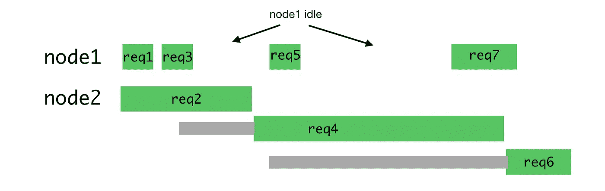

这些请求的更好分布如下:

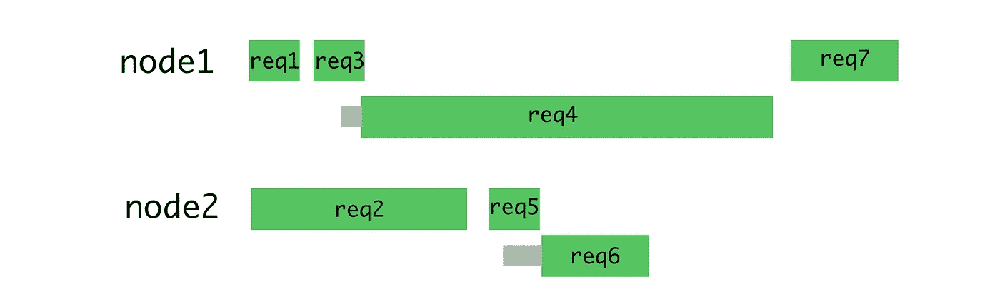

因为这最大限度地减少了等待并允许更快地返回响应。

这可以通过将请求保存在队列中，并且只有当进程不再被另一个请求占用时才将其分配给该进程来实现。我们用 haproxy 来做这个。

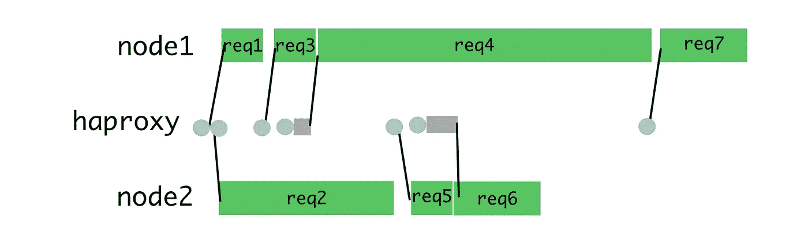

当我们为 Hypernova 设置此功能时，我们完全消除了部署时的超时峰值和`BadRequestError`秒。并发请求也是正常操作期间高百分比延迟的主要驱动因素，因此这也减少了延迟。这样做的后果之一是，在相同的超时配置下，我们从 5%的基线超时率变为 2%的超时率。从部署期间 40%的失败率降到 2%感觉像是一个胜利。如今，用户很少看到空白的加载屏幕。明天，部署过程中的稳定性将对我们的新渲染器至关重要，它没有 Hypernova 的错误回退功能。

# 详细信息和配置

要设置它，需要配置 nginx、haproxy 和我们的节点应用程序。我准备了[一个带有 nginx 和 haproxy 配置的样本节点应用](https://github.com/schleyfox/example-node-ops)，可以用来理解这个设置。这些配置基于我们在生产环境中运行的内容，但是经过了简化和修改，可以作为非特权用户在前台运行。在生产中，一切都应该由您选择的流程主管进行配置(我们使用 runit，或者越来越多地使用 kubernetes)。

nginx 配置是非常标准的，一个监听端口 9000 的服务器被配置为将请求代理给监听端口 9001 的 haproxy(在我们的设置中，我们使用 Unix 域套接字)。它还拦截`/ping`端点以直接提供连通性检查。与我们的内部标准 nginx 配置不同的是，我们将`worker_processes`减少到 1，因为单个 nginx 进程足以使我们的单个 haproxy 进程和节点应用程序饱和。我们还使用了大的请求和响应缓冲区，因为 hypernova 组件的 props 可能非常大(数百千字节)。您应该根据自己的请求/响应大小来确定缓冲区的大小。

节点的`cluster`模块处理负载平衡和进程生成。为了切换到 HAProxy 进行负载平衡，我们必须为`cluster`的进程管理部分创建一个替代品。这就形成了 [pool-hall](https://github.com/airbnb/pool-hall) ，它比`cluster`更坚持维护一个工作进程池，但是完全脱离了负载平衡游戏。[示例应用程序](https://github.com/schleyfox/example-node-ops/blob/master/index.js#L18)演示了如何使用`pool-hall`启动四个工作进程，每个进程监听不同的端口。

[ha proxy config](https://github.com/schleyfox/example-node-ops/blob/master/haproxy_example.cfg)配置一个监听端口 9001 的代理，它将流量路由到监听端口 9002 到 9005 的四个工作线程。最重要的设置是每个工人身上的`maxconn 1`。这限制了每个工作者一次只能处理一个请求。这可以在 HAProxy 统计页面中看到(该页面被配置为在端口 8999 上运行)

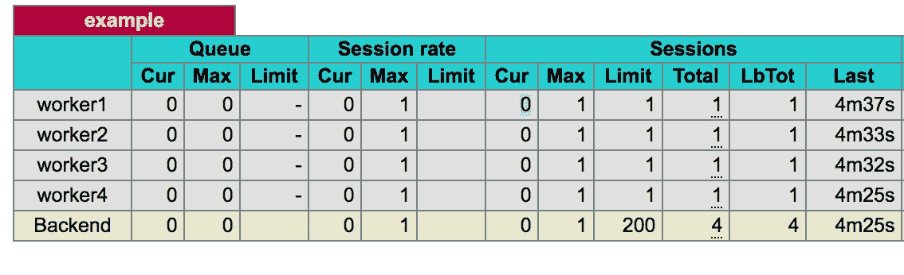

HAProxy 跟踪它和每个工作者之间当前打开了多少连接。它有一个通过`maxconn`配置的限值。Routing 被设置为`static-rr` (静态循环)，所以通常每个工作者被依次给予一个请求。设置了限制后，路由继续进行循环调度，但跳过当前处于请求限制的任何工作线程。如果没有工作线程低于它们的连接限制，请求将被排队，并将被分派给最先可用的工作线程。这是我们想要的行为。

这种配置可能非常接近您想要使用的配置。还有其他有趣的设置(以及必要的复制面食)在那里。作为准备此配置的一部分，我们在正常和异常条件下进行了大量测试，并从中得出了配置值。这是多余的，使用这种设置并不一定要理解，但是在下一节中会介绍。

# HAProxy 深潜

HAProxy 配置在很大程度上满足了我们的需求。如果它不能像我们预期的那样处理并发请求限制或排队，那就没什么好处了。了解如何处理(或不处理)各种类型的故障也很重要。我们需要树立信心，相信这是现有`cluster`系统的合适替代品。为了验证这一点，我们进行了一系列测试。

测试的一般形式是使用`ab` (Apache 基准测试)在不同的并发级别运行 10，000 个请求，比如

```
ab -l -c <CONCURRENCY> -n 10000 http://<HOSTNAME>:9000/render
```

我们的配置使用了 15 个工作人员，而不是示例应用中的 4 个，我们在运行应用的实例之外的单独实例上运行`ab`,以避免基准测试和被测系统之间的干扰。我们在低负载(并发=5)、高负载(并发=13)和排队负载(并发=20)下运行测试。排队负载确保 haproxy 始终运行一个队列。

第一组测试只是正常操作，没有什么好笑的。下一组测试是在所有进程正常重启的情况下进行的，这在部署期间会发生。最后一组测试中，我随机杀死了进程的一个子集，因为如果未捕获的异常导致进程崩溃，就会发生这种情况。

另外，应用程序代码中的无限循环一直是个问题，所以我对一个具有无限循环的端点运行单个请求。

这些测试有助于塑造我们的配置以及我们对其工作原理的理解。

在正常操作中，`maxconn 1`完全按照预期工作，限制每个进程一次处理一个请求。我们不在后端配置 HTTP 或 TCP 健康检查，因为我们发现这样会造成更多的混乱，不值得。健康检查似乎不尊重`maxconn`，尽管我没有在代码中验证这一点。我们的预期行为是，一个进程要么是健康的，能够提供服务，要么是没有监听，将立即给出一个连接错误(这有一个主要的例外)。我们发现这些健康检查对于我们的案例来说没有足够的可控制性，并选择避免重复健康检查制度的不可预测性。

连接错误是我们可以处理的。我们设置了`option redispatch`和`retries 3`，这允许收到连接错误的请求被反弹到一个不同的后端，这个后端有望更快到达。连接立即被拒绝，让我们可以继续我们的业务。

这只适用于因为我们碰巧没有在听而被拒绝的连接。当我们处理本地网络时，连接超时不是特别有用。我们最初希望能够设置一个较低的连接超时，以防止工作线程陷入无限循环。我们设置了 100 毫秒的超时，当我们的请求在 10 秒后超时时，我们感到很惊讶，这是当时设置的客户机/服务器超时，尽管控制从未返回到事件循环来接受连接。这是因为在服务器调用`accept`之前，内核从客户端的角度处理连接的建立。

有趣的是，即使设置了 backlog 也不会导致连接无法建立，因为 backlog 长度是在服务器响应`SYN-ACK`之后计算的([实际上是由服务器从客户端](http://veithen.github.io/2014/01/01/how-tcp-backlog-works-in-linux.html)丢弃 `[ACK](http://veithen.github.io/2014/01/01/how-tcp-backlog-works-in-linux.html)` [响应*)。这样做的一个重要后果是，已经建立了连接的请求不能被重新调度/重试，因为我们无法判断后端是否处理了请求。*](http://veithen.github.io/2014/01/01/how-tcp-backlog-works-in-linux.html)

我们对陷入无限计算循环的进程进行测试的另一个有趣结果是，客户机/服务器超时允许一些意外的行为。当一个请求被发送到一个进程，导致它进入一个无限循环，后端的连接计数被设置为 1。有了`maxconn`，这就做了我们想要的，并防止任何其他请求落入焦油坑。在客户机/服务器超时之后，连接计数递减回 0，这使得我们的“一进一出”保证被违反，也注定了可怜的下一个请求失败。当一个客户端由于超时或反复无常而关闭连接时，连接计数不受影响，我们的路由仍然继续工作。设置`abortonclose`会导致客户端一关闭，连接计数就减少。鉴于此，最好的做法是为这些超时设置一个较高的值，并关闭`abortonclose`。可以在客户端或 nginx 端设置更严格的超时。

我们还发现了一个相当难看的吸引子，它适用于高负载的情况。如果一个工作进程崩溃(这种情况很少发生),而服务器有一个稳定的队列，请求将在后端被尝试，但是由于没有进程监听，连接将会失败。然后，HAProxy 将重新调度到下一个具有开放连接插槽的后端，这将只是之前发生故障的后端(因为所有其他后端实际上都在忙于工作)。这将很快耗尽重试时间并导致请求失败，因为连接错误比呈现 HTML 要快得多。这个过程将对其余的请求重复，直到队列被完全清空。这是不好的，但是由于很少出现进程崩溃、很少运行持续队列(如果您一直在排队，那么您就是供应不足的)，并且在我们的特定情况下，这个失败吸引子还会吸引我们的服务发现健康检查，从而很快将整个实例标记为不健康并且不适合新请求，所以这种情况得到了缓解。这并不伟大，但它最大限度地减少了危险。未来的工作可以通过更深层次的 HAProxy 集成来处理这个问题，其中管理进程观察进程的退出，并通过 haproxy stats 套接字将其标记为`MAINT`。

另一个值得注意的变化是，node 中的`server.close`等待现有请求完成，但是 HAProxy 队列中的任何内容都将失败，因为服务器不知道等待它尚未收到的请求。在大多数情况下，确保在实例停止接收请求和启动服务器重启过程之间有足够的耗尽时间应该可以解决这个问题。

我们还发现，与`balance static-rr`相比，在合成和生产负载下，将大多数流量按顺序导向第一个可用工作人员的设置`balance first`(基本上使`worker1`饱和)将我们应用的延迟降低了 15%。这种效应持续了很长时间，超出了升温所能轻易解释的范围。这在部署后持续了几个小时。长时间(12 小时)性能下降，可能是因为热进程内存泄漏。由于低温过程极其寒冷，这种方法对交通高峰的适应能力也较差。对此我们仍然没有一个很好的解释。

最后，Node 的`server.maxConnections`设置看起来会有所帮助(对我来说确实如此)，但是我们发现它并没有提供太多的实用性，有时还会导致错误。该设置通过在发现超过限制后关闭任何新句柄来防止服务器接受超过`maxConnections`的句柄。这个检查是在 JavaScript 中应用的，所以它不能防止无限循环的情况(一旦我们返回到事件循环，我们将正确地中止请求…等待)。我们还看到在正常操作下由它引起的连接错误，尽管我们没有看到运行多个请求的其他证据。我们怀疑这是一个轻微的时间问题或 haproxy 和 Node 之间关于连接何时开始和结束的意见分歧。希望有一个互斥的应用程序端保证是一个很好的愿望，因为这允许开发人员安全地使用单例或其他全局状态。这可以通过将[每进程队列实现为快速中间件](https://github.com/schleyfox/example-node-ops/blob/master/RequestQueue.js)来处理。

# 结论

服务器端渲染代表了一种不同于标准工作负载的工作负载，主要是节点擅长的 I/O 工作负载。了解了异常行为的原因后，我们就可以使用现成的组件来解决问题，我们已经有了相关的运行经验。

*我们正在 Airbnb 投入巨资打造世界级的前端体验。如果你喜欢阅读这篇文章，并认为这是一个有趣的挑战，我们一直在寻找有才华、有好奇心的人加入团队。我们希望收到您的来信！*

*感谢布莱恩·沃尔夫、* [*乔·伦乔尼*](https://medium.com/u/e52389684329?source=post_page-----c5ba718acfc9--------------------------------) *和* [*亚当·尼瑞*](https://medium.com/u/a0d352b51c4d?source=post_page-----c5ba718acfc9--------------------------------) *对这篇文章的评论和重复。*

## 脚注

1.  对于异步呈现，资源争用仍然存在。异步呈现解决了进程或浏览器的响应问题，但没有解决并行性或延迟问题。这篇博文将重点介绍一个简单的纯计算工作负载模型。对于 IO 和计算的混合工作负载，请求并发将增加延迟，但好处是允许更高的吞吐量。
2.  灵感来自我们用来服务 Rails 应用程序的 unicorn web 服务器。独角兽背后的[哲学很好地解释了为什么。](https://bogomips.org/unicorn/PHILOSOPHY.html)
3.  大多数情况下，会尝试绕过无响应的流程
4.  分发连接，而不是请求，所以当使用持久连接时，这表现得不同，甚至更糟。来自客户端的任何持久连接都被绑定到一个特定的工作进程，这使得高效地分配工作变得更加困难。