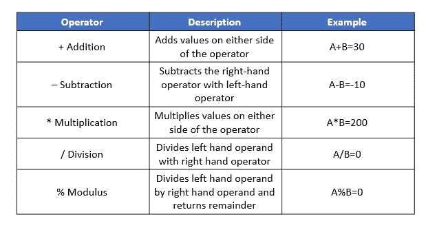
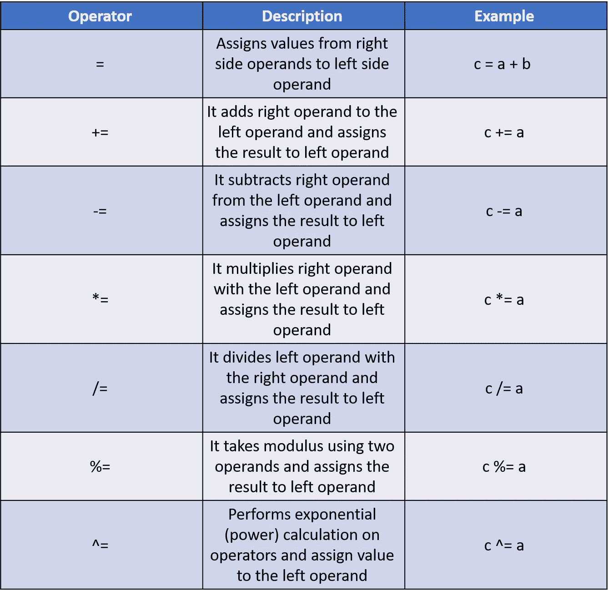
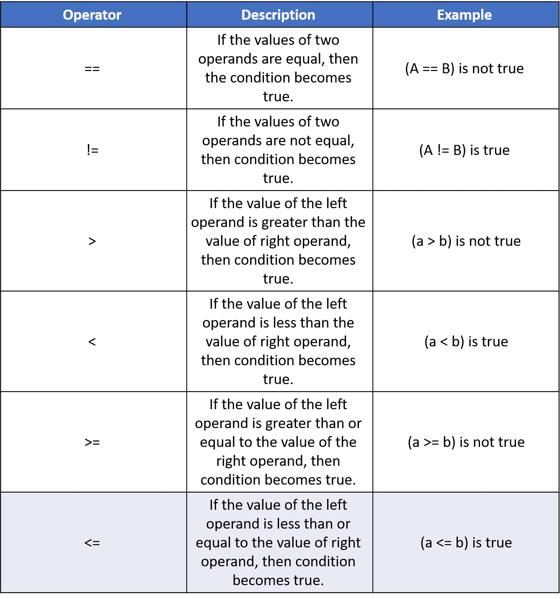
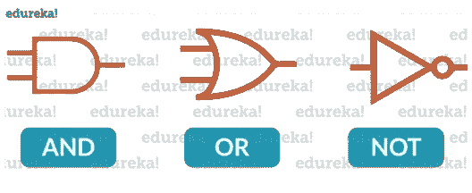
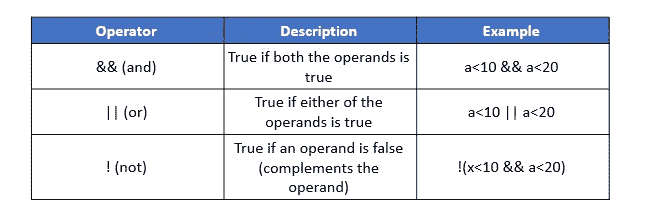
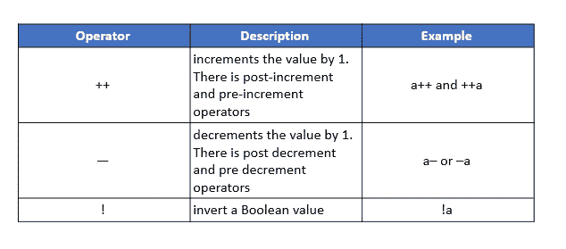
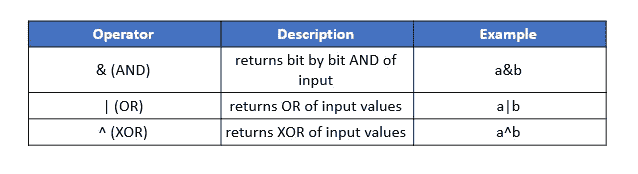

# Java 中的运算符及其类型

> 原文：<https://medium.com/edureka/operators-in-java-fd05a7445c0a?source=collection_archive---------0----------------------->


运算符是可以操作操作数值的构造。考虑表达式 2 + 3 = 5，这里 2 和 3 是操作数，+称为运算符。在这篇关于操作符的文章中，目标是让您获得入门和使用 Java 操作符所需的专业知识。

Java 支持以下类型的运算符:

*   算术运算符
*   赋值运算符
*   逻辑运算符
*   关系运算符
*   一元运算符
*   按位运算符
*   三元运算符
*   移位运算符

让我们逐一关注这些操作符。

# Java 中的算术运算符

算术运算符用于执行像加、减等数学运算。假设下表中 A = 10，B = 20。



考虑下面的例子:

```
**package** Edureka;
**public** **class** ArithmeticOperators {
**public** **static** **void** main(String[] args) {
**int** A = 10;
**int** B = 20;
System.out.println(A + B);
System.out.println(A - B);
System.out.println(A * B);
System.out.println(A / B);
System.out.println(A % B);
}
}
```

**输出:**

30
-10
200
0
10

# Java 中的赋值运算符

一个*赋值操作符*是一个*操作符*，用于*给*一个变量赋值。假设下表中 A = 10，B = 20。



考虑下面的例子:

```
**package** Edureka;**public** **class** JavaOperators {
       **public** **static** **void** main(String[] args) {
              **int** a = 10;
              **int** b=20;
              **int** c;
              System.out.println(c = a); // Output =10
              System.out.println(b += a);// Output=30
              System.out.println(b -= a);// Output=20
              System.out.println(b *= a);// Output=200
              System.out.println(b /= a);// Output=2
              System.out.println(b %= a);// Output=0
              System.out.println(b ^= a);// Output=0
       }
}
```

继续学习 Java 操作符教程，让我们看看什么是比较操作符。

# Java 中的关系运算符

这些运算符比较它们两边的值，并确定它们之间的关系。假设 A = 10，B = 20。



考虑下面的例子:

```
**package** Edureka;**public** **class** JavaOperators {
        **public** **static** **void** main(String[] args) {
               **int** a = 10;
               **int** b=20;
               System.out.println(a == b); // returns false because 10 is not equal to 20
               System.out.println(a != b); // returns true because 10 is not equal to 20
                System.out.println(a > b); // returns false
                System.out.println(a < b); // returns true
                System.out.println(a >= b); // returns false
                System.out.println(a <= b); // returns true }}
```

接下来，让我们关注 Java 中的逻辑运算符。

# Java 中的逻辑运算符

以下是 Java 中的逻辑运算符:



考虑下面的例子:

```
**package** Edureka;**public** **class** JavaOperators {
       **public** **static** **void** main(String[] args) {
              **int** a = 10;
       System.out.println(a<10 & a<20);  //returns false
       System.out.println(a<10 || a<20); //returns true
       System.out.println(!(a<10 &  a<20)); //returns true
      }
}
```

现在让我们看看 Java 中的一元运算符。

# Java 中的一元运算符

一元运算符是需要单个操作数的运算符，用于递增值、递减值或求反值。



考虑下面的例子:

```
**package** Edureka;**public** **class** JavaOperators {
       **public** **static** **void** main(String[] args) {
              **int** a = 10;
              **boolean** b=**true**;
       System.out.println(a++);  //returns 11
       System.out.println(++a);
       System.out.println(a--);
       System.out.println(--a);
       System.out.println(!b); // returns false }}
```

接下来，让我们来理解 Java 中的按位运算符

# Java 中的按位运算符

位运算直接操作**位**。在所有的计算机中，数字都是用比特，一系列的 0 和 1 来表示的。事实上，计算机中几乎所有的东西都是用比特来表示的。假设下表中 A = 10，B = 20。



考虑下面的例子:

```
**package** Edureka;**public** **class** JavaOperators {
        **public** **static** **void** main(String[] args) {
               **int** a = 58; //111010
               **int** b=13; //1101
        System.out.println(a&b);  //returns 8 = 1000
        System.out.println(a|b);  //63=111111
        System.out.println(a^b);  //55=11011
        System.out.println(~a);  //-59
     }
}
```

接下来，让我们关注 Java 中的三元运算符

# Java 中的三元运算符

三元运算符是一个条件运算符，它在执行比较和条件运算时减少了代码长度。此方法是使用 if-else 和嵌套 if-else 语句的替代方法。该运算符的执行顺序是从左到右。

**语法:**

```
(Condition) ? (Statement1) : (Statement2);
```

*   **条件:**要计算的表达式返回一个布尔值。
*   **语句 1:** 条件为真时执行的语句。
*   **语句 2:** 如果条件导致错误状态，则执行该语句。

考虑下面的例子:

```
**package** Edureka;**public** **class** JavaOperators {
       **public** **static** **void** main(String[] args) {
              **int** a = 20, b = 10, c = 30, res;
         res = ((a > b) ? (a > c)? a: c: (b > c)? b: c);
         System.out.println("Max of three numbers = "+ res);
         }
}
```

**输出** —三个数字的最大值= 30

前进到最后一个 java 操作符，让我们理解 Java 中的移位操作符。

# Java 中的移位运算符

移位运算符用于左移或右移一个数的位，从而对该数进行乘法或除法运算。有三种不同类型的移位运算符，即左移运算符()<>)和无符号右移运算符(> > >)。

**语法:**

```
number**shift_op** number_of_places_to_shift;
```

考虑下面的例子:

```
**package** Edureka;**public** **class** JavaOperators {
       **public** **static** **void** main(String[] args) {
              **int** a=58;
           System.out.println(a<<2); //232=11101000
           System.out.println(a>>2);  //returns 14=1110
           System.out.println(a>>>2); //returns 14
         }
}
```

至此，我们结束了这篇关于不同 Java 操作符的文章。我希望这篇文章对你有所帮助。

如果你想查看更多关于人工智能、DevOps、道德黑客等市场最热门技术的文章，那么你可以参考 [Edureka 的官方网站。](https://www.edureka.co/blog/?utm_source=medium&utm_medium=content-link&utm_campaign=operators-in-java)

请留意本系列中的其他文章，它们将解释 Java 的各个方面。

> *1。* [*面向对象编程*](/edureka/object-oriented-programming-b29cfd50eca0)
> 
> *2。*[*Java 中的继承*](/edureka/inheritance-in-java-f638d3ed559e)
> 
> *3。*[*Java 中的多态性*](/edureka/polymorphism-in-java-9559e3641b9b)
> 
> *4。*[*Java 中的抽象*](/edureka/java-abstraction-d2d790c09037)
> 
> *5。* [*Java 字符串*](/edureka/java-string-68e5d0ca331f)
> 
> *6。* [*Java 数组*](/edureka/java-array-tutorial-50299ef85e5)
> 
> *7。* [*Java 收藏*](/edureka/java-collections-6d50b013aef8)
> 
> *8。* [*Java 线程*](/edureka/java-thread-bfb08e4eb691)
> 
> *9。*[*Java servlet 简介*](/edureka/java-servlets-62f583d69c7e)
> 
> *10。* [*Servlet 和 JSP 教程*](/edureka/servlet-and-jsp-tutorial-ef2e2ab9ee2a)
> 
> *11。*[*Java 中的异常处理*](/edureka/java-exception-handling-7bd07435508c)
> 
> *12。* [*高级 Java 教程*](/edureka/advanced-java-tutorial-f6ebac5175ec)
> 
> *13。* [*Java 面试题*](/edureka/java-interview-questions-1d59b9c53973)
> 
> *14。*[Java 程序 ](/edureka/java-programs-1e3220df2e76)
> 
> 15。[*kot Lin vs Java*](/edureka/kotlin-vs-java-4f8653f38c04)
> 
> *16。* [*依赖注入使用 Spring Boot*](/edureka/what-is-dependency-injection-5006b53af782)
> 
> *17。* [*Java 教程*](/edureka/java-tutorial-bbdd28a2acd7)
> 
> 18。 [*十大 Java 框架*](/edureka/java-frameworks-5d52f3211f39)
> 
> 19。 [*Java 反射 API*](/edureka/java-reflection-api-d38f3f5513fc)
> 
> 20。[*Java 中的 30 大模式*](/edureka/pattern-programs-in-java-f33186c711c8)
> 
> *21。* [*核心 Java 备忘单*](/edureka/java-cheat-sheet-3ad4d174012c)
> 
> *22。*[*Java 中的套接字编程*](/edureka/socket-programming-in-java-f09b82facd0)
> 
> *23。* [*Java OOP 备忘单*](/edureka/java-oop-cheat-sheet-9c6ebb5e1175)
> 
> *24。*[*Java 中的注释*](/edureka/annotations-in-java-9847d531d2bb)
> 
> *25。*[*Java 中的库管理系统项目*](/edureka/library-management-system-project-in-java-b003acba7f17)
> 
> *26。*[*Java 中的树木*](/edureka/java-binary-tree-caede8dfada5)
> 
> *27。*[*Java 中的机器学习*](/edureka/machine-learning-in-java-db872998f368)
> 
> *28。* [*顶级数据结构&Java 中的算法*](/edureka/data-structures-algorithms-in-java-d27e915db1c5)
> 
> *29。* [*Java 开发者技能*](/edureka/java-developer-skills-83983e3d3b92)
> 
> *30。* [*前 55 名 Servlet 面试问题*](/edureka/servlet-interview-questions-266b8fbb4b2d)
> 
> *31。*[](/edureka/java-exception-handling-7bd07435508c)*[*顶级 Java 项目*](/edureka/java-projects-db51097281e3)*
> 
> *32。 [*Java 字符串备忘单*](/edureka/java-string-cheat-sheet-9a91a6b46540)*
> 
> *33。[*Java 中的嵌套类*](/edureka/nested-classes-java-f1987805e7e3)*
> 
> *34。 [*Java 集合面试问答*](/edureka/java-collections-interview-questions-162c5d7ef078)*
> 
> **35。*[*Java 中如何处理死锁？*](/edureka/deadlock-in-java-5d1e4f0338d5)*
> 
> *36。 [*你需要知道的 50 个 Java 合集面试问题*](/edureka/java-collections-interview-questions-6d20f552773e)*
> 
> **37。*[*Java 中的字符串池是什么概念？*](/edureka/java-string-pool-5b5b3b327bdf)*
> 
> *38。[*C、C++和 Java 有什么区别？*](/edureka/difference-between-c-cpp-and-java-625c4e91fb95)*
> 
> **39。*[*Java 中的回文——如何检查一个数字或字符串？*](/edureka/palindrome-in-java-5d116eb8755a)*
> 
> *40。 [*你需要知道的顶级 MVC 面试问答*](/edureka/mvc-interview-questions-cd568f6d7c2e)*
> 
> *41。[*Java 编程语言的十大应用*](/edureka/applications-of-java-11e64f9588b0)*
> 
> **42。*[*Java 中的死锁*](/edureka/deadlock-in-java-5d1e4f0338d5)*
> 
> **43。*[*Java 中的平方和平方根*](/edureka/java-sqrt-method-59354a700571)*
> 
> **44。*[*Java 中的类型转换*](/edureka/type-casting-in-java-ac4cd7e0bbe1)*
> 
> **45。*[*Java 中的运算符及其类型*](/edureka/operators-in-java-fd05a7445c0a)*
> 
> **46。*[*Java 中的析构函数*](/edureka/destructor-in-java-21cc46ed48fc)*
> 
> **47。*[*Java 中的二分搜索法*](/edureka/binary-search-in-java-cf40e927a8d3)*
> 
> **48。*[*Java 中的 MVC 架构*](/edureka/mvc-architecture-in-java-a85952ae2684)*
> 
> **49。* [*冬眠面试问答*](/edureka/hibernate-interview-questions-78b45ec5cce8)*

**原载于 2019 年 7 月 18 日*[*https://www.edureka.co*](https://www.edureka.co/blog/operators-in-java/)*。**