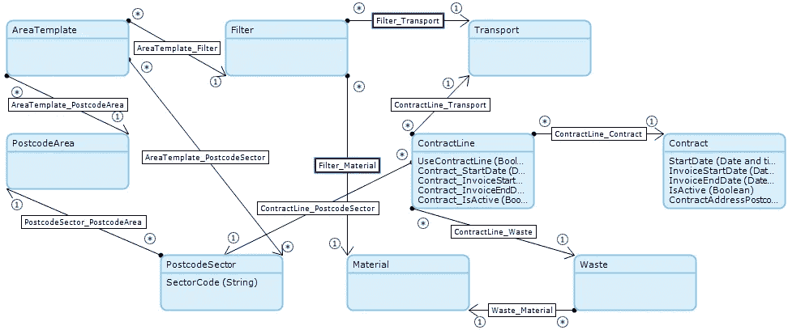

# 处理大量数据时优化 Mendix

> 原文：<https://medium.com/mendix/optimising-mendix-when-handling-large-volumes-of-data-5e4eb1a690d7?source=collection_archive---------0----------------------->

通常在 Mendix 开发过程中，开发人员会遇到一个对数据库的查询，这个查询优化得很差。这通常是由复杂的业务需求和时间限制造成的。下面将讨论一个优化不好的查询的例子，以及如何解决这些问题以确保执行时间是最优的。

一个项目的业务需求是创建一个自定义搜索，该搜索将返回满足给定标准的合同对象列表。这种定制搜索的第一次实现非常简单，并且完成了工作，但是当使用真实数量的数据对搜索进行彻底测试时，查询时间太长了——长达 100 秒！如果让这个查询在后台运行，它不会有问题，但是由于这是用户单击按钮的结果，挂起时间会对用户体验产生负面影响。搜索按钮必须重构。

下面我们来看看在运行大量数据时，搜索时间是如何从 100 秒缩短到平均 2-5 秒的。

这是正在使用的领域模型的简化版本:

该搜索有三个过滤器:

*   运输
*   材料
*   区域模板

运输和材料是搜索的直接下拉列表，因为它们与数据库中已经存在的数据相关。区域模板筛选器面临挑战；用户必须能够添加一个特定的邮政编码区与该地区内选定的部门(基于英国的邮政编码区，区，和部门系统)。不止一个地区可以添加到搜索中，因为一个地区有 10-100 个邮政编码区，几个地区模板将导致搜索的总区数迅速增加。

**初始 Mendix 实施**

**1。**检索所有选中的区域模板。
2**。每个区域模板将检索他们的邮政编码区域。
**3。然后，每个邮政编码区检索其所有扇区。
**4。**在每个扇区上迭代，将应用以下 XPath 约束:****

**5。**迭代完每个区段后，返回合同行列表。

上面的 XPath 约束有八个约束，它们都是返回正确的合同行对象列表所必需的。前四个约束的问题是，它们都必须检查 ContractLine_Contract 与 Contract 对象上的属性的关联。此外，当有多个区域模板选择了 10 个扇区时，必须在每个区域模板和扇区上循环花费相当多的时间。

应用以下变化来优化微流:

*   将合同数据反规范化为合同行。反规范化是通过添加数据的冗余副本或对数据进行分组，以损失一些写入性能为代价，尝试提高数据库读取性能的过程。在这种情况下，将合同数据向下移动到合同行。
*   AreaTemplate _ PostcodeSector 关联已添加。这将用于避免每次都必须进行初始邮政编码区域检索。
*   移除其中一个环。如 Mendix 最佳实践中所述，应避免嵌套循环，此处删除了服务区区域循环。现在可以使用上面添加的新关联来检索邮政编码部门。
*   添加了 ContractLine _ PostcodeSector 关联。这将删除作为 XPath 一部分的 contains(ServiceAddressPostcode，$ post desector/sector code)查询。

**非规范化数据和应用关联**

下面是经过上述更改的更新后的域模型:

基于这些变化，一个全新的微流程诞生了:

**1。**添加了一些日志，用于调试目的。**2
。**现在，使用在区域模板和邮政编码部门之间添加的新关联，从一开始就可以检索邮政编码部门。

**3。**运输和物料在微流程开始时检索一次，并在数据库检索中引用，而不是每次都必须进行检索。

使用反规格化数据检索更新的数据库:

通过对数据进行反规范化并将包含内容移动到一个新的关联中，查询时间减少到了大约 15-18 秒。考虑到最初 100 秒的等待时间，这是一个巨大的改进，但是从用户体验的角度来看，15 秒的等待时间仍然是相当长的时间。花费如此长时间的原因是因为邮政编码区的循环——每个地区 10-100 个区意味着这只会变得更糟；当前的解决方案不可扩展。

**进一步反规范化和 Java 动作内存过滤**很明显，邮政编码扇区的数量是影响查询长度的因素，因此解决方案的最后一部分是消除邮政编码扇区上的循环。为了补救这一点，实现一些在邮政编码扇区上使用内存过滤的 Java 代码似乎是一个可行的选择；在此之前，还需要对域模型进行一些修改。

在邮政编码区域和合同行之间添加了一个新的关联，并且邮政编码部门 ID 被非规范化为合同行。这个新的 ID 使合同行能够根据内存中的邮政编码部门列表进行过滤，在 Java 操作中使用以下代码:

Java 操作需要传入一个邮政编码部门和合同行的列表，然后根据邮政编码部门列表中的对象 ID 过滤合同行 ID，最后，它将返回一个符合所有先前选择的搜索标准的合同行列表。

这是微流的最终迭代，确保丢失邮政编码扇区循环。它也已经移回到原始微流的原始区域模板循环中。从业务使用的角度来看，需要选择一到五个区域，所以五次迭代在查询时间上不会太差。循环中仍有一些必要的检索，但这些都是合同行数据库检索和内存过滤 java 操作中所需要的:

最终的微流将查询时间减少到每个查询大约两秒钟。在产品负责人看来，这是一个巨大的成功，他们对优化的结果很满意。

首先想到的是减少数据库调用的次数。这是成功的，但是由于要处理的数据量太大，必须向解决方案中添加另一部分。通常在创建应用程序时，最好避免使用非规范化的数据。如图所示，必须聚合大量数据会影响这种情况，作为可行解决方案的一部分，必须对数据进行反规范化。此外，由于 Mendix 中的检索是根据关联进行优化的，因此很好地使用实体之间的关联可以大大降低检索的过程强度。尽管如此，即使在非规范化之后，在用户体验方面仍然存在问题。这一部分的进一步优化是通过使用两个列表应用内存过滤来完成的，以消除对其中一个列表对象进行迭代的需要。